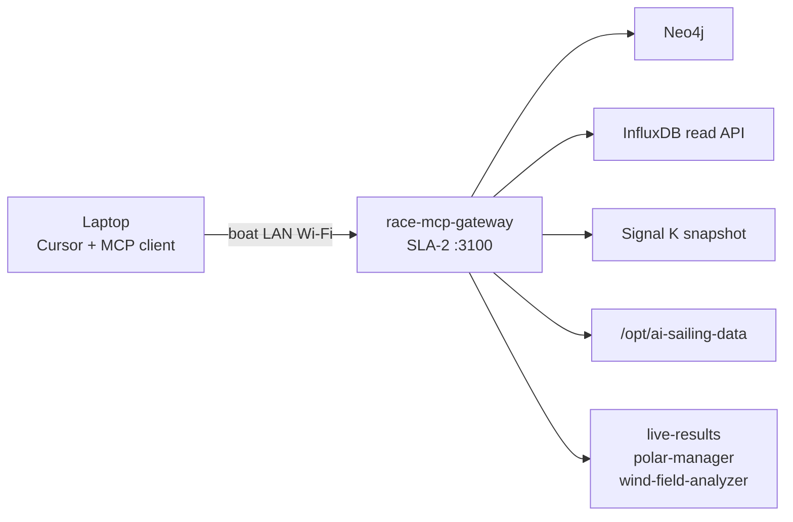

# ADR-0012: Race-side MCP for laptop Cursor and ad hoc analysis

**Status:** Accepted  
**Date:** 2026-07-05  
**Deciders:** cognite-fholm  
**Related:** [spec.md §7.18](../spec.md#718-race-side-mcp--laptop-cursor), [ADR-0002](./0002-three-tier-sla-architecture.md), [ADR-0009](./0009-dual-repository-race-data.md), [docs/ARCHITECTURE.md](../docs/ARCHITECTURE.md)

---

## Context

Onshore race preparation already uses **Cursor** against **[AI-sailing-data](https://github.com/cognite-fholm/AI-sailing-data)** on GitHub. At the regatta, the user may bring a **laptop** aboard (or in the harbor tent) and want the same agent-assisted workflow against **live** data:

- Current fleet standings and leg progress
- Wind zones, GRIB context, instrument snapshots
- Neo4j graph queries (“who is ahead on corrected time on leg 2?”)
- Influx history (“VMG trend last 30 minutes”)
- Ad hoc comparison of tactical choices without pre-building Grafana panels

**Model Context Protocol (MCP)** is the standard way Cursor connects agents to tools and data sources. The boat stack already exposes structured APIs (Signal K, Influx, Neo4j, FastAPI services) but not in a Cursor-native shape.

---

## Decision

Deploy a **`race-mcp-gateway`** service on **SLA-2** that exposes **read-first MCP tools** over the **boat LAN**. A laptop running Cursor joins the same Wi‑Fi as the Pis (Teltonika AP or marina net) and configures MCP servers pointing at `race.local`.

### Topology

### MCP server bundles (v1)

| MCP server | Endpoint | Tools (examples) | Data source |
|------------|----------|------------------|-------------|
| **race-neo4j** | `/mcp/neo4j` | `cypher_query`, `get_live_standings`, `get_course_selection`, `get_fleet_positions` | Neo4j (read-only role) |
| **race-influx** | `/mcp/influx` | `flux_query`, `get_latest_instruments`, `get_wind_history`, `list_buckets` | InfluxDB via SLA-1 read token |
| **race-boat** | `/mcp` | All Neo4j + Influx tools | Combined |
| **race-context** | *(planned)* | `read_yaml`, `read_wiki`, `list_race_assets`, `get_okf_concept` | `AI-sailing-data` mount + OKF |
| **race-tactical** | *(planned)* | `get_wind_zones`, `get_polar_target`, `get_start_line_state` | SLA-2 REST services |
| **signalk-snapshot** | `/mcp/signalk` | `get_vessel_state`, `get_ais_targets`, `get_active_alarms`, `list_available_paths`, `get_path_value` | Signal K REST on SLA-1 ([ADR-0029](./0029-signalk-mcp-ecosystem-vpn-remote-access.md)) |

Optional v2: **race-notes** write tool → append to `wiki/race-day.md` on data repo (harbor sync only, explicit enable).

### Cursor on laptop — typical use

1. Join boat Wi‑Fi (`boat-race` SSID via Teltonika).
2. Cursor workspace: clone or sparse-checkout **AI-sailing-data** for active regatta (or open local copy synced before departure).
3. User MCP config (`~/.cursor/mcp.json` or project `.cursor/mcp.json`) points at `http://race.local:3100/mcp` with boat API key.
4. Prompt examples:
   - *“Query live standings and explain rank changes since mark 1.”*
   - *“Plot AWA vs target for the last beat from Influx.”*
   - *“Who in our class is overstanding port based on AIS and polars?”*

### Security and guardrails

| Rule | Implementation |
|------|----------------|
| **Boat LAN only** | Bind `race-mcp-gateway` to boat VLAN; no port forward on LTE |
| **Read-first** | Default MCP role `analyst` — SELECT/Cypher read, Flux read |
| **Auth** | Per-race API key in `deploy/env/race.env`; rotate at race freeze |
| **No SLA-1 write** | MCP never writes Signal K or Influx |
| **No autopilot** | No rudder/autopilot MCP tools |
| **RACE_MODE** | Gateway **enabled** during race (unlike Watchtower) — analysis is non-destructive |
| **Rate limits** | Cap expensive Cypher/Flux queries to protect Pi CPU |

### Deployment

| Item | Value |
|------|-------|
| Container | `race-mcp-gateway` (Python, official MCP SDK) |
| Host | SLA-2 `race.local` |
| Port | `3100` (MCP over HTTP/SSE) |
| Compose | `docker-compose.sla-2.yml` |
| Config | `config/mcp-gateway.yaml` — enabled servers, auth, query limits |

Laptop **does not** need PiCAN-M or Docker — only network access and Cursor.

---

## Rationale

### Why MCP (not only Grafana)?

Grafana panels are fixed at harbor setup. MCP lets the agent **compose queries** from natural language during the race — same workflow as shore prep in Cursor.

### Why SLA-2 gateway (not direct Neo4j from laptop)?

- Single auth point and query policy
- Hides credentials; exposes curated tools
- Can fuse multiple backends in one tool (e.g. standings + handicap explanation)
- SLA-1 stays isolated — Influx access via read token only

### Why not cloud MCP?

Offline requirement during races; boat LAN latency is lower; no data leaves the vessel unless user opts in.

---

## Consequences

### Positive

- Shore-style Cursor analysis continues at the regatta.
- Crew/navigator laptop becomes a tactical analysis station without custom scripts.
- Agents cite live standings + YAML facts + OKF in one thread.

### Negative

- Extra service on SLA-2; must not starve `live-results`.
- Laptop Wi‑Fi on crowded regatta networks needs reliable AP placement.
- Query abuse risk — mitigated by rate limits and read-only default.

### Risks

| Risk | Mitigation |
|------|------------|
| MCP exposes too much | Tool allowlist; no raw admin Cypher |
| Laptop lost/compromised | Short-lived race API keys; LAN isolation |
| Gateway down | Grafana + H5000 still work; MCP is additive |

---

## Alternatives considered

### A. SSH + manual scripts on Pi

**Rejected.** Poor Cursor integration; high friction for ad hoc questions.

### B. Direct Neo4j Browser / Grafana on laptop

**Rejected.** No agent orchestration; does not reuse Cursor prep workflow.

### C. Cloud relay MCP over LTE

**Deferred.** Violates offline-first; optional future for shore spectators only.

---

## Revision history

| Version | Date | Change |
|---------|------|--------|
| 1.1 | 2026-07-05 | Dedicated `/mcp/neo4j` and `/mcp/influx` endpoints; `race-mcp-gateway` implementation |
| 1.0 | 2026-07-05 | Initial accepted decision |
