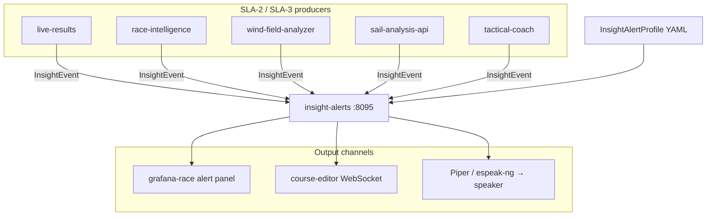

# ADR-0015: Tactical insight alerts and voice annunciation

**Status:** Accepted  
**Date:** 2026-07-05  
**Deciders:** cognite-fholm  
**Related:** [spec §7.21](../spec.md#721-tactical-insight-alerts--annunciation), [ADR-0011](./0011-bg-h5000-reference-model.md) (safety alarms), [ADR-0010](./0010-iregatta-reference-model.md), [ADR-0004](./0004-grib-polars-ais-wind-analysis.md)

## Context

The platform already computes rich tactical context — fleet rank and corrected-time delta (`live-results`), course/XTE and laylines (`race-intelligence`), wind-on-course and fleet pressure (`wind-field-analyzer`), sail trim vs best-known (`sail-analysis-api`), and LLM narratives (`tactical-coach`). Today these appear as **passive** Grafana panels or on-demand coach queries.

During a race the helm cannot continuously watch dashboards. Important situations need **proactive notification**:

| Situation | Example |
|-----------|---------|
| Falling behind | Corrected rank drops 3+ places in 15 min |
| Wrong course | XTE exceeds limit or sailing away from favored tack |
| Sail trim | Vision/geometry shows persistent under-trim vs polar target |
| Wind / fleet | Persistent header on wrong side of course; competitor gaining VMG |
| Start line | Burn time critical; bias end shift |

This is **distinct from safety alarms** in [§7.17.8](../spec.md#7178-alarms) (depth low, BSP high, AIS collision) mirrored from H5000. Tactical alerts are **performance and decision support** — they must not be confused with safety-critical alarm semantics or H5000 network alarm groups.

The user also wants alerts on **UX** (tablet/helm display) and optionally **read aloud** through a connected speaker when hands and eyes are busy.

## Decision

1. Add **`insight-alerts`** service on **SLA-2** as a central **alert broker** — ingest events, evaluate rules, deduplicate, route to channels.
2. Introduce **`InsightAlertProfile`** YAML (per race in `planning/`, optional boat override) — rules, severities, channel toggles, TTS policy.
3. **Producers** publish structured `InsightEvent` payloads (REST or internal bus); broker does not re-implement domain math.
4. **UI channel:** Grafana alert feed panel + `course-editor` alert strip/history via WebSocket.
5. **Voice channel (optional):** `insight-alerts` TTS submodule using **Piper** (offline, arm64) with **espeak-ng** fallback; output to USB/Bluetooth speaker via ALSA (`speaker_device` in profile).
6. **Acknowledge / mute:** Helm can ack an alert (UI button or double-tap); broker suppresses repeat annunciation for configurable cooldown.
7. **History:** Active and recent alerts stored in **Neo4j** (`InsightAlert` nodes) and **Influx** (annotation stream for Grafana).

### Topology

### Alert taxonomy (v1)

| Category | `category` | Typical source | Default severity |
|----------|------------|----------------|------------------|
| Fleet position | `fleet_position` | `live-results` | warning |
| Course / XTE | `course` | `race-intelligence` | warning |
| Sail trim | `sail_trim` | `sail-analysis-api` | info |
| Wind / pressure | `wind_tactics` | `wind-field-analyzer` | info |
| Start line | `start_line` | `race-intelligence` | warning |
| Coach insight | `coach` | `tactical-coach` | info |

Severities: `info`, `warning`, `urgent` (tactical urgency — **not** safety `critical`).

### Voice policy (defaults)

| Setting | Default |
|---------|---------|
| TTS enabled | `false` (opt-in per race profile) |
| Min severity for voice | `warning` |
| Max announcements | 6 per 10 min |
| Repeat same alert | After ack: silent for 30 min |
| Locale | `nb-NO` or `en-GB` from profile |

Messages are short imperative phrases: *"Three places lost — check VMG"*, *"Off course to starboard"*, *"Under-trim on main — ease sheet"*.

### Safety boundary

- Tactical alerts **never** replace depth, collision, or instrument limit alarms.
- Voice annunciation **yields** to safety alarms (H5000 / Grafana critical rules interrupt TTS queue).
- `category: safety` events are **rejected** by `insight-alerts` — safety stays on Signal K + Grafana path.

## Rationale

- **Central broker** avoids each service implementing its own Grafana rules and TTS — consistent dedup, ack, and voice rate limits.
- **Event-based** keeps domain logic in existing services (`live-results` already knows rank delta).
- **Piper** gives understandable offline speech on Pi without cloud TTS latency or connectivity.
- **course-editor + Grafana** cover visual UX; speaker is optional for double-handed / shorthanded crews.
- **YAML profile** lets each regatta tune sensitivity (distance race vs buoy racing).

## Consequences

### Positive

- Actionable notifications without staring at dashboards
- Hands-free option for helm during maneuvers
- Clear separation from H5000 safety alarms
- Alert history supports post-race debrief and MCP queries

### Negative

- Alert fatigue if rules too sensitive — requires tuning per boat/race
- TTS adds CPU and audio plumbing on SLA-2 Pi
- Piper voice models add ~50–100 MB to harbor image bundle

### Risks

| Risk | Mitigation |
|------|------------|
| Voice spam during busy legs | Rate limit + ack cooldown + min severity |
| Missed alert when muted | UI still shows unacked alerts; visual pulse |
| Confusion with safety alarms | Separate service, taxonomy, and Grafana row |
| SLA-3 offline → no trim alerts | Degrade gracefully; fleet/course alerts continue |

## Alternatives considered

| Alternative | Rejected because |
|-------------|------------------|
| Grafana-only alerting | No unified ack/TTS; fragmented rule authoring |
| Push all logic into `tactical-coach` LLM | Too slow and non-deterministic for time-critical cues |
| Cloud TTS (Google/AWS) | LTE latency; offline requirement at sea |
| Extend `AlarmProfile` for tactics | Conflates safety and performance semantics |
| H5000 network alarm module | Not available on all boats; wrong abstraction for AI insights |

## Follow-up

- [ ] `insight-alerts` container + FastAPI + WebSocket
- [ ] Grafana `grafana-race` alert feed panel
- [ ] `course-editor` alert drawer component
- [ ] Piper model in harbor bundle; ALSA device discovery script
- [ ] MCP tool `get_active_alerts` on `race-mcp-gateway`
- [ ] `InsightAlertProfile` schema in AI-sailing-data
