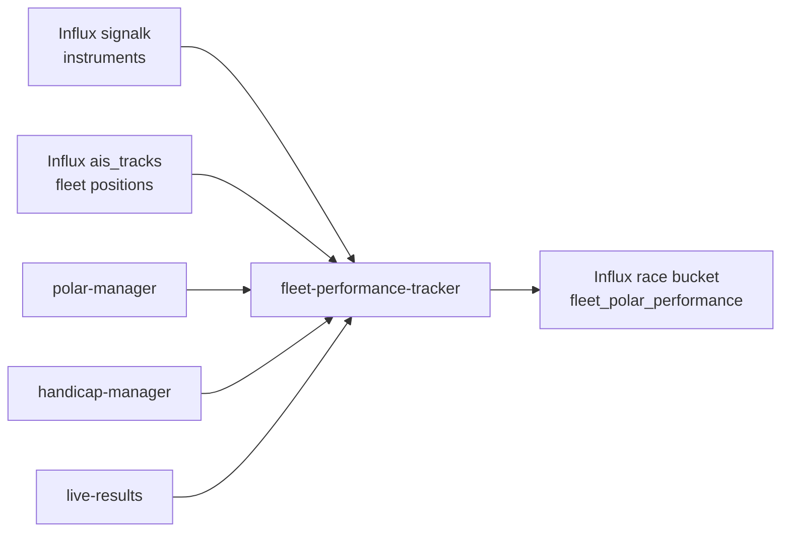

# ADR-0016: Fleet polar performance timeline in InfluxDB

**Status:** Accepted  
**Date:** 2026-07-05  
**Deciders:** cognite-fholm  
**Related:** [ADR-0004](./0004-grib-polars-ais-wind-analysis.md), [ADR-0005](./0005-course-parsing-handicaps-live-results.md), [spec §7.22](../spec.md#722-fleet-polar-performance-timeline), [spec §7.14](../spec.md#714-handicap-numbers--scoring)

## Context

The platform already computes **instantaneous** polar performance % for the own boat (iRegatta parity, H5000 `performanceIndex`) and uses fleet SOG minus polar-expected SOG as a **wind-pressure proxy** in `wind-field-analyzer` ([ADR-0004](./0004-grib-polars-ais-wind-analysis.md)). What is missing is a **persistent, fleet-wide time series** that answers:

- How well is **each boat** sailing relative to **its certificate polar** right now and over the race?
- Which boat is over-performing or under-performing at a given **time and location**?
- How does performance correlate with **active race handicap** (APH ToT, WRS triple-number, course-specific scoring)?

Standings (`live-results`) rank by **corrected time** — not polar %. Tactical analysis needs both: *"Boat X is fast on handicap but only at 78% polar"* vs *"Boat Y is at 102% polar but losing on corrected time due to course choice"*.

Users want **timeline** views (Grafana, MCP Flux) and **geo** views (map trails coloured by performance %) across the full fleet.

## Decision

1. Add **`fleet-performance-tracker`** service on **SLA-2** — samples the fleet every **30 s** during an active `race_id`.
2. Write normalized points to InfluxDB bucket **`race`**, measurement **`fleet_polar_performance`** (and leg rollup **`fleet_polar_leg_summary`**).
3. For each vessel, resolve:
   - **Polar targets** from `polar-manager` (SLK for own boat; derived for competitors)
   - **Actual speed** — own boat from SLA-1 instruments (BSP/SOG); competitors from AIS SOG
   - **VMG** — own boat instrument/computed; competitors projected along leg bearing from `live-results`
   - **Active handicap** from `handicap-manager` for the current race (`scoring.yaml` / `HandicapRating` selection)
4. Tag every point with **location** (`lat`, `lon` fields), **leg** (`leg_seq`, `route_id`), and **handicap context** (`handicap_type`, `handicap_value`).
5. Expose Grafana panels: fleet performance time series, geo map trail, and leaderboard-by-polar-% table.
6. SLA-2 services receive a **scoped Influx write token** for `race` bucket only (does not write to `signalk` raw telemetry).

### Data flow



### Core formulas

```
bsp_target   = polar.interpolate(tws, twa).bsp
vmg_target   = polar.interpolate(tws, twa).vmg
performance_pct = (sog or bsp) / bsp_target × 100
vmg_pct      = vmg_actual / vmg_target × 100
```

Competitors without instrument wind: estimate `twa` from `|cog − twd|` (TWD from own instruments or GRIB at position).

Points with `polar.confidence < 0.7` (derived competitor polars) are written but tagged `polar_quality=low` for Grafana filtering.

### Handicap linkage

Each point carries the **active scoring factor** from the race (not all certificate numbers — only the one `handicap-manager` selected for this regatta):

| Example race | `handicap_type` tag | Source |
|--------------|---------------------|--------|
| Færder distance §23 | `scoring_aph` | `scoring.yaml` |
| WRS medium wind | `scoring_triple_medium` | WRS table + TWS band |
| Default ToT | `aph_tot` | certificate `ratings.yaml` |

`handicap_value` field stores the numeric factor (e.g. `1.2082`) for post-race correlation queries.

## Rationale

- **Dedicated service** keeps polar interpolation + fleet loop out of `live-results` (standings) and `wind-field-analyzer` (spatial zones).
- **InfluxDB** is the right store for high-cardinality time × fleet × location queries; Neo4j holds current snapshot only.
- **30 s cadence** matches AIS class A refresh and `live-results` refresh — sufficient for tactical timeline without overloading Pi.
- **Race bucket on SLA-1** keeps one Influx instance; scoped write token preserves SLA-1 isolation (no SLA-2 writes to raw `signalk`).
- **Handicap tags** enable Flux queries like *"who sailed above 95% polar while losing on corrected time?"*

## Consequences

### Positive

- Fleet-wide polar comparison over time and on map
- Debrief and MCP ad hoc analysis without reprocessing raw AIS
- Feeds `insight-alerts` (under-performance rules) and `wind-field-analyzer` validation
- Aligns with iRegatta performance % and H5000 performance index semantics

### Negative

- Competitor TWA is estimated — performance % less accurate than own-boat instruments
- Derived competitor polars add uncertainty (`polar_quality` flag required)
- Additional Influx storage (~fleet_size × 2 points/min × race hours)

### Risks

| Risk | Mitigation |
|------|------------|
| Missing competitor polar | Skip vessel; log gap; show in Grafana "no polar" list |
| AIS gap | Hold-last-value ≤ 60 s; mark `data_quality=stale` |
| Write load on SLA-1 Influx | Batch line protocol; 30 s interval; downsample after 7 days |
| Wrong handicap for leg | `handicap-manager` re-evaluates on WRS wind band change |

## Alternatives considered

| Alternative | Rejected because |
|-------------|------------------|
| Neo4j only | Poor time-range and geo aggregation at fleet scale |
| Store in `signalk` bucket | Pollutes raw telemetry; wrong retention semantics |
| Compute on query in Grafana | Too heavy for 30+ boats × full race on Pi |
| Single own-boat performance series | User explicitly needs **all boats** across time/location |
| Real-time only (no persistence) | No debrief timeline or MCP historical analysis |

## Follow-up

- [ ] `fleet-performance-tracker` container + batch writer
- [ ] Grafana `grafana-race` — Fleet Performance dashboard
- [ ] MCP `flux_query` examples in `docs/mcp-neo4j-influx.md`
- [ ] Downsample task: 30 s → 5 min after 7 days
- [ ] `insight-alerts` rule: `performance_pct` below threshold for N minutes
