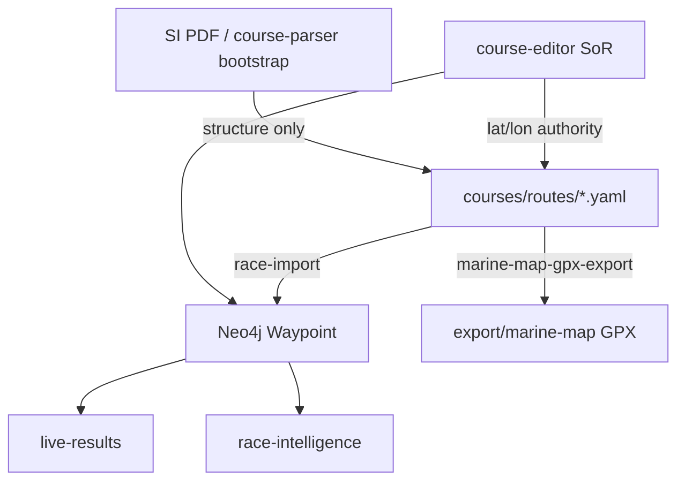

# ADR-0020: course-editor as coordinate system of record

**Status:** Accepted  
**Date:** 2026-07-05  
**Deciders:** cognite-fholm  
**Related:** [ADR-0005](./0005-course-parsing-handicaps-live-results.md), [ADR-0017](./0017-marine-map-gpx-export.md), [spec §7.13.4](../spec.md#7134-manual-waypoint-entry--reacttypescript-ux), [spec §7.23](../spec.md#723-marine-map-gpx-export)

---

## Context

Race courses flow through several artifacts:

| Stage | Artifact | Contains coordinates? |
|-------|----------|----------------------|
| SI PDF | Source document | Sometimes DMS text |
| `course-parser` / `course-from-si` | `WaypointList` YAML bootstrap | Often `lat: null` |
| Hand-edited YAML in git | Tempting shortcut | Risk of drift vs boat |
| `course-editor` | React/TS UI on SLA-2 | Crew places pins |
| `marine-map-gpx-export` | `export/marine-map/*.gpx` | Interpolated polyline |
| `race-import` | Neo4j `Waypoint` nodes | Runtime graph |
| `live-results` / `race-intelligence` | Leg geometry, XTE, VMG | Consumes graph |

Without a single authority for **WGS-84 mark positions**, coordinates diverge between chartplotter GPX, Neo4j, and Grafana overlays.

---

## Decision

**`course-editor` is the system of record for waypoint `lat` / `lon`.**

All other consumers **read** coordinates from the canonical `WaypointList` YAML that `course-editor` writes — they do not invent or independently edit positions.

### Write path (only)

```
course-editor  →  PUT /courses/{route_id}/waypoints
               →  courses/routes/{route}.yaml  (AI-sailing-data mount / git sync)
               →  Neo4j Waypoint MERGE  (runtime, same values)
```

### Bootstrap only (no final coordinates)

| Producer | May write | Must not |
|----------|-----------|----------|
| `course-parser` | Route structure, `si_coord` text, `sequence`, rounding rules | Final `lat`/`lon` except high-confidence SI parse |
| `course-from-si` skill | Same — seed YAML | Replace editor-saved coordinates |
| Human git edit | `CourseCatalog`, scoring, notes | `waypoints[].lat/lon` (use editor) |

When SI parse yields coordinates, treat as **provisional** until confirmed in `course-editor` (UI shows amber “unconfirmed” state).

### Read path (producers)

| Consumer | Source | Trigger |
|----------|--------|---------|
| `race-import` | `courses/routes/*.yaml` from data repo | `race-data-sync` / harbor import |
| `marine-map-gpx-export` | Same YAML | After editor save or explicit export API |
| `live-results` | Neo4j `Waypoint` (imported from YAML) | Runtime |
| `race-intelligence` | Neo4j + active `CourseSelection` | Runtime |
| `race-ui` | REST `/courses/{route_id}` | Runtime |
| Grafana geo panels | GeoJSON from course API | Runtime |



### Export rules

1. **Phase 5b (marine map)** runs only when `course-editor` has saved ≥ 2 resolved waypoints per route (or user confirms provisional SI coords in editor).
2. `manifest.yaml` `unresolved_waypoints` lists marks still `null` in YAML — fix in **editor**, not by hand-editing GPX.
3. `course-editor` **Export marine map** button calls the same generator as the shore skill (shared `export_marine_map.py` logic or SLA-2 API).

### Sync

- Harbor: commit `courses/routes/*.yaml` after editor session (`git push` from data repo).
- Boat: `race-data-sync` pulls YAML; `race-import` applies to Neo4j without clobbering runtime-only nodes ([ADR-0009](./0009-dual-repository-race-data.md)).

---

## Rationale

- One place to fix Færder mark gaps (currently many `lat: null` in `11.1-tristein.yaml`).
- GPX, Neo4j, and VMG geometry stay aligned by construction.
- SI parser remains useful for structure without fighting manual YAML edits.
- Matches how crew already think: “set marks on the chart in the editor.”

---

## Consequences

### Positive

- Clear completion criterion for prep phase 5: all routes green in `course-editor`
- FR-179 becomes enforceable architecture, not aspiration
- Debrief can trust GPX export matches live-results geometry

### Negative

- Requires `course-editor` (or API) before GPX export — cannot skip straight from SI to chartplotter
- Shore-only prep needs editor reachable at harbor (boat LAN or VPN)

### Follow-up

- [ ] `course-editor` — persist to data-repo path + Neo4j on save
- [ ] `export_marine_map.py` — refuse export if SoR file newer than last export (stale check)
- [ ] `prep-status.yaml` phase 5 — `complete` when all routes pass editor validation
- [ ] Provisional SI coords — confirm UX in editor

---

## Alternatives considered

| Alternative | Rejected because |
|-------------|------------------|
| YAML in git as SoR (hand edit) | No map UX; diverges from Neo4j |
| Neo4j as SoR | Not in git; poor harbor prep workflow |
| GPX as SoR | Wrong direction; GPX is export format |
| SI parser as SoR | Incomplete coords; no visual validation |
