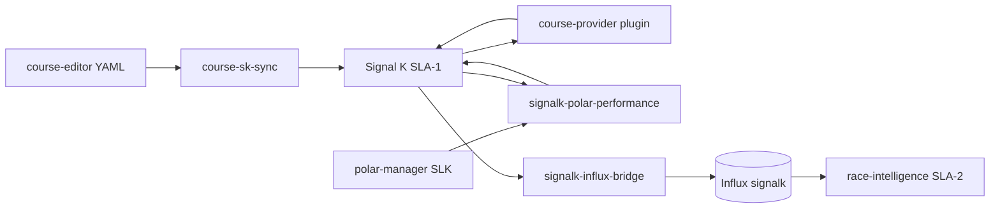

# ADR-0021: SLA-1 Signal K plugin strategy

**Status:** Accepted  
**Date:** 2026-07-06  
**Deciders:** cognite-fholm  
**Related:** [ADR-0002](./0002-three-tier-sla-architecture.md), [ADR-0010](./0010-iregatta-reference-model.md), [ADR-0011](./0011-bg-h5000-reference-model.md), [ADR-0018](./0018-helm-ux-three-pi-dual-speaker.md), [ADR-0020](./0020-course-editor-coordinate-system-of-record.md), [spec §7.1](../spec.md#71-signal-k-server-hub--sla-1-only), [spec §7.4.1](../spec.md#741-race-helm-ui-grafana--signalk-plugins)

---

## Context

Competitive sailing needs **derived** values from raw NMEA telemetry — VMG, XTE, DTM, polar performance %, target angles — without compromising SLA-1 availability.

Options considered:

| Approach | Pros | Cons |
|----------|------|------|
| **Node-RED** on SLA-1 | Visual flows | Extra process on safety-critical tier; overlaps SK |
| **SLA-2-only Python** | Full race context (Neo4j, polars) | Higher latency; SLA-1 displays stall if SLA-2 down |
| **Signal K plugins + sidecars** | Native SK paths; instrument ecosystem | Course/polar must sync from SoR |

Course coordinates are authored in **`course-editor`** ([ADR-0020](./0020-course-editor-coordinate-system-of-record.md)). Polars are canonical in **`polar-manager`** + AI-sailing-data SLK ([spec §7.12](../spec.md#712-grib-polars-ais--wind-on-course-analysis)). Fleet VMG, start line, and handicaps remain **SLA-2**.

---

## Decision

### SLA-1 — adopt, build, optional

| Component | Type | Role |
|-----------|------|------|
| **`@signalk/course-provider`** | Adopt (npm plugin in `signalk-server` image) | Great-circle / rhumbline **geometry**: VMG, XTE, DTM, BTM, TTG, ETA |
| **`course-sk-sync`** | Build (Python sidecar) | Push active route waypoints from data-repo YAML → SK `navigation.course` + resources |
| **`signalk-polar-performance`** | Build (Python sidecar) | Publish `performance.polarSpeed`, `performance.polarSpeedRatio`, `performance.targetAngle` — polar from **`polar-manager`** |
| **`@signalk/calibration`** | Optional | Sensor correction when H5000 does not own a path |
| **`signalk-bandg-performance-plugin`** | Optional | Forward SK performance paths to B&G MFD (N2K) |
| **`signalk-influx-bridge`** | Extend | Persist `navigation.course.calcValues.*` and `performance.*` to Influx |
| **Node-RED** | **Rejected** | Not deployed on any tier |

### SLA-2 — authority (not SK plugins)

| Service | Role |
|---------|------|
| **`polar-manager`** | Polar SoR; serves ORC grid + `/target` API to SLA-1 |
| **`race-intelligence`** | Lift, damping, start line, steering vs polar |
| **`live-results`** | Leg VMG, fleet rank, handicaps |
| **`course-editor`** | Waypoint `lat`/`lon` SoR |

### Data flow

---

## Rationale

1. **SLA-1 survival** — `course-sk-sync` reads **mounted data-repo YAML** (not Neo4j) so course geometry sync works when SLA-2 is offline after harbor import.
2. **Single polar SoR** — `signalk-polar-performance` never stores a second polar CSV in SK admin; it calls `polar-manager` (degrades if SLA-2 unreachable).
3. **Standard SK paths** — `race-ui`, Grafana, and optional B&G plugins consume familiar `navigation.course.calcValues` and `performance.*` paths.
4. **No duplicate race engine** — geometric VMG on SLA-1; polar-relative and fleet logic on SLA-2.

---

## Consequences

**Positive**

- Low-latency instrument-style derivations on the telemetry bus
- Aligns with iRegatta/H5000 parity targets (ADR-0010, ADR-0011)
- Community plugins (`course-provider`) maintained upstream

**Negative**

- Custom sidecars (`course-sk-sync`, `signalk-polar-performance`) to operate and version
- `signalk-polar-performance` degraded without `polar-manager` on SLA-2
- Full multi-leg route activation in SK resources evolves with `course-editor`

**Risks**

| Risk | Mitigation |
|------|------------|
| SK API changes | Pin `signalk-server` image; integration tests in BDD Phase 1 |
| Polar-manager down | Sidecar logs warning; H5000 native performance still available |
| Course YAML incomplete | `course-sk-sync` skips null lat/lon; logs unresolved count |

---

## Alternatives considered

- **htool `signalk-polar-performance-plugin` as-is** — rejected as SoR; fork logic only, feed from `polar-manager`
- **SignalK org `polars-plugin`** — rejected; unmaintained vs community fork
- **All math in `race-intelligence`** — rejected for display latency and SLA-2 coupling on VMG/XTE

---

## Implementation checklist

- [x] ADR-0021
- [x] `signalk-server/Dockerfile` with `@signalk/course-provider`
- [x] `course-sk-sync/` sidecar
- [x] `signalk-polar-performance/` sidecar
- [x] `polar-manager/` minimal API stub (SLA-2)
- [x] `docker-compose.sla-1.yml` + `sla-2.yml` wiring
- [x] Bridge path map extended
- [ ] `@signalk/calibration` — enable per boat in harbor if needed
- [ ] `signalk-bandg-performance-plugin` — optional per installation
- [ ] Full SK resources route activation from `course-editor` save events
