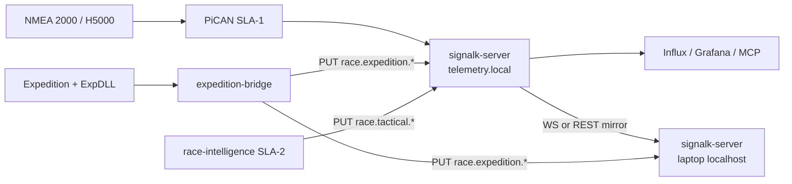

# ADR-0034: Expedition laptop bridge and Signal K federation

**Status:** Accepted  
**Date:** 2026-07-13  
**Deciders:** cognite-fholm  
**Related:** [ADR-0021](./0021-sla1-signalk-plugin-strategy.md), [ADR-0029](./0029-signalk-mcp-ecosystem-vpn-remote-access.md), [docs/SIGNALK_RACE_EXTENSION.md](../docs/SIGNALK_RACE_EXTENSION.md), [spec §7.29](../spec.md#729-expedition-laptop-bridge)

---

## Context

[Expedition](https://www.expeditionmarine.com/) on a **Windows nav laptop** provides pro-grade start line, laylines, ensemble weather routing, and handicap tools that are not yet implemented in `race-intelligence`. [Expedition-Python](https://pypi.org/project/Expedition-Python/) exposes read/write access to Expedition via `ExpDLL.dll` while Expedition is running.

The onboard stack already treats **SLA-1 Signal K** as the canonical marine data hub ([ADR-0021](./0021-sla1-signalk-plugin-strategy.md)): N2K ingest, H5000-corrected wind, `performance.*` from `signalk-polar-performance`, and course geometry from `course-sk-sync`.

Open questions:

| Question | Risk if unanswered |
|----------|-------------------|
| Where does Expedition fit without duplicating N2K ingest? | Two truth sources for wind/BSP |
| How do Pi services consume Expedition TTL/bias/routing? | Rebuild Expedition math in `race-intelligence` |
| How do we test without Windows at sea? | Brittle ctypes-only integration |
| What paths does Grafana / MCP / `race-ui` read? | Ad hoc JSON |

---

## Decision

### 1. Nav laptop role

| Component | Host | Role |
|-----------|------|------|
| **Expedition** | Windows laptop | Human nav UI + routing engine |
| **`expedition-bridge`** | Same laptop | Pydantic wrapper; poll ExpDLL → publish `race.expedition.*` |
| **Signal K (laptop)** | Same laptop | Local hub for Expedition + bridge; optional instrument mirror |
| **SLA-1 Signal K (Pi)** | `telemetry.local` | **Canonical** N2K / H5000 ingest; fleet telemetry SoR |

The laptop is a **tactical compute satellite**, not a second N2K gateway.

### 2. Signal K federation (not dual N2K)

**Rules:**

1. **Instruments** (`navigation.*`, `environment.wind.*`, `performance.*` from polar sidecar) are owned by **SLA-1** only. The laptop may **subscribe** to Pi SK for display; it must not republish instrument paths unless Pi SK is unreachable (degraded mode — banner required).
2. **Expedition-derived** values publish under **`race.expedition.*`** with source label `expedition-bridge`.
3. **AI-sailing-derived** values publish under **`race.tactical.*`** from SLA-2 (`race-intelligence`, `live-results`, coach) — same extension spec.
4. **Federation default:** `dual_publish` — bridge writes to laptop SK (local Expedition plugins) **and** upstream Pi SK (Grafana, MCP, Influx bridge on Pi).
5. **No second PiCAN** on the laptop. Optional Wi‑Fi N2K gateway on laptop is **discouraged** for v1 (split-brain wind).

### 3. Pydantic-first `expedition-bridge` service

New container / Windows service: `expedition-bridge/`

| Layer | Models |
|-------|--------|
| Expedition | `ExpeditionSnapshot`, `ExpeditionStartLine`, … — grouped reads from `Var` |
| Signal K | `RaceExtensionDelta`, `SignalKPathUpdate` — validated delta payloads |
| Config | `BridgeSettings` (`pydantic-settings`) |
| Testing | `MockExpeditionClient` — no DLL; fixture snapshots |

`WindowsExpeditionClient` wraps Expedition-Python behind `ExpeditionClient` protocol.

### 4. NMEA 2000 extension (phase 2)

Signal K path spec is **normative for v1** ([docs/SIGNALK_RACE_EXTENSION.md](../docs/SIGNALK_RACE_EXTENSION.md)).

Optional N2K re-emission of selected `race.expedition.*` / `race.tactical.*` paths from **SLA-1** via `signalk-to-nmea2000` / emitter plugin is **phase 2** — only after H5000 PGN compatibility is verified. Expedition laptop does **not** emit N2K directly.

### 5. Degraded modes

| Mode | Condition | Behaviour |
|------|-----------|-----------|
| **Normal** | Pi SK reachable | Instruments from Pi; Expedition paths from bridge → both SKs |
| **Pi offline** | No `telemetry.local` | Laptop SK shows Expedition + last cached instruments; no dual-publish upstream |
| **Expedition offline** | No ExpDLL | Bridge idle; Pi stack unchanged |
| **Bridge offline** | — | Expedition UI only; no `race.expedition.*` on bus |

---

## Consequences

**Positive**

- Reuse Expedition routing/start math without reimplementing in Python on Pi.
- Testable integration via mock client + Pydantic round-trips.
- Single extension namespace for Grafana, MCP, and future `race-ui`.
- Pi remains SLA-1 isolated per [ADR-0002](./0002-three-tier-sla-architecture.md).

**Negative**

- Windows laptop is a new operational dependency (power, mounting, VPN).
- Expedition-Python is Windows + running Expedition only.
- Dual SK requires network reliability between laptop and Pi.

**Follow-up**

- `spec.md` §7.29 + FR block for expedition bridge.
- Harbor compose profile optional (not on Pi image).
- `race-mcp-gateway` read `race.expedition.*` from Pi SK.

---

## Alternatives considered

| Alternative | Rejected because |
|-------------|------------------|
| Expedition only, no SK federation | Pi Grafana/MCP cannot see TTL/bias |
| Pi runs Expedition via Wine | Unsupported; ExpDLL Windows-only |
| Laptop as sole Signal K server | Loses SLA-1 isolation when Pi or laptop fails |
| Reimplement Expedition in `race-intelligence` | Multi-year scope; Expedition already licensed |
