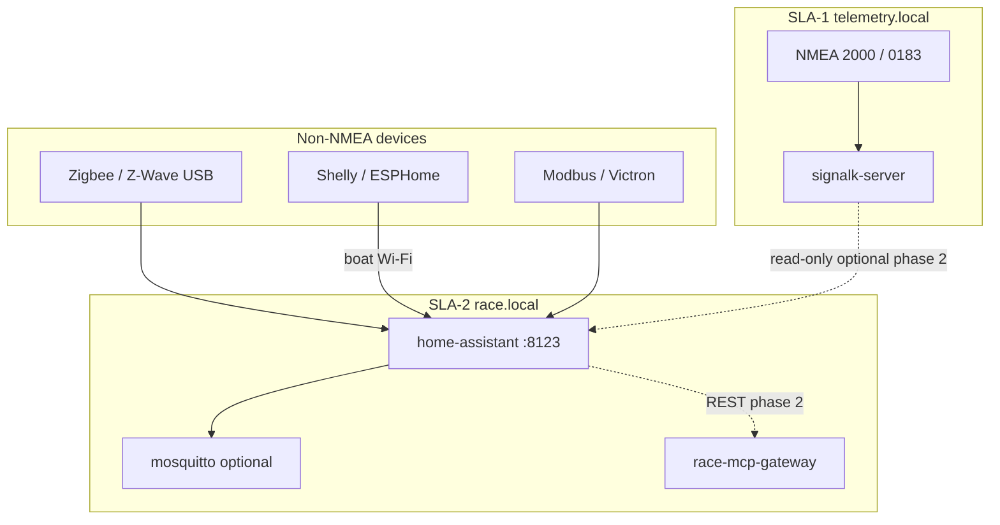

# ADR-0035: Home Assistant for non-NMEA boat systems

**Status:** Accepted  
**Date:** 2026-07-16  
**Deciders:** cognite-fholm  
**Related:** [ADR-0002](./0002-three-tier-sla-architecture.md), [ADR-0018](./0018-helm-ux-three-pi-dual-speaker.md), [ADR-0021](./0021-sla1-signalk-plugin-strategy.md), [ADR-0029](./0029-signalk-mcp-ecosystem-vpn-remote-access.md), [ADR-0034](./0034-expedition-laptop-signalk-federation.md), [spec §7.30](../spec.md#730-home-assistant-non-nmea-domotics), [docs/EQUIPMENT_LIST.md](../docs/EQUIPMENT_LIST.md)

---

## Context

The AI Sailing System stack is optimized for **marine telemetry** — NMEA 2000 / 0183 ingest on SLA-1 Signal K, race intelligence on SLA-2, and vision on SLA-3 ([ADR-0002](./0002-three-tier-sla-architecture.md)). That scope does **not** cover ordinary boat systems that are not on the N2K backbone:

| Domain | Examples | Typical protocol |
|--------|----------|------------------|
| **Lighting** | Cabin, chart light, courtesy LEDs, relay-driven nav/anchor lights | Zigbee, Wi‑Fi (Shelly/ESPHome), 12 V relay |
| **Climate** | Diesel heater, fan, dehumidifier | Modbus, Wi‑Fi, relay |
| **House power** | Shore inlet, inverter, house bank monitor (non-N2K path) | Modbus (Victron), BLE, shunt + ESP |
| **Bilge / pumps** | Float switches, manual pump circuits | GPIO, ESP, relay feedback |
| **Security / presence** | Hatch sensors, motion, anchor alarm (non-race) | Zigbee, Wi‑Fi |
| **Comfort** | Fridge temp, USB outlets, stereo zones (non-tactical) | Wi‑Fi, Zigbee |

Signal K and PiCAN-M are the wrong integration layer for most of this — they are built for **navigation and performance data**, not general domotics. Bolting relays and Zigbee coordinators onto SLA-1 would violate the telemetry isolation rule and increase restart risk on the marine hub.

[Home Assistant](https://www.home-assistant.io/) is a mature open-source platform for exactly this class of device: multi-protocol hubs, automations, dashboards, and mobile apps — without touching NMEA decode paths.

---

## Decision

### 1. Home Assistant owns **non-NMEA** systems only

| Layer | Owner | Examples |
|-------|-------|----------|
| **Marine / navigation** | SLA-1 Signal K + PiCAN-M | Wind, BSP, GPS, depth, AIS, autopilot read-only, course geometry |
| **Race / tactics** | SLA-2 services + `race.expedition.*` / `race.tactical.*` | Fleet, polars, coach, Expedition bridge |
| **Non-NMEA boat systems** | **Home Assistant on SLA-2** | Lights, relays, climate, house power, bilge monitors, hatch sensors |

**Hard rules:**

1. Home Assistant **MUST NOT** run on SLA-1 or share the PiCAN-M host network namespace with `signalk-server`.
2. Home Assistant **MUST NOT** write to NMEA buses, H5000, or autopilot outputs.
3. Home Assistant **MUST NOT** install Signal K plugins on SLA-1 or republish marine instrument paths.
4. **Safety annunciation** stays on **H5000** ([ADR-0018](./0018-helm-ux-three-pi-dual-speaker.md)) — HA does not replace depth/collision alarms.
5. **Tactical voice** stays on SLA-2 Piper (`insight-alerts`) — HA does not use the tactical speaker.

### 2. Deployment — Docker on SLA-2

| Item | Choice |
|------|--------|
| **Host** | SLA-2 Pi (`race.local`) |
| **Image** | Official `ghcr.io/home-assistant/home-assistant:stable` (or pinned digest in harbor) |
| **Compose** | `docker-compose.sla-2.yml` profile `domotics` (optional enable) |
| **DNS** | `homeassistant.local` → SLA-2 (Teltonika static DNS, same pattern as `race.local`) |
| **USB** | Zigbee / Z-Wave coordinator passed through to HA container on SLA-2 |
| **Persistence** | Named volume `ha_config` on SLA-2 NVMe |

Home Assistant is **best-effort** — same SLA tier as Neo4j and MCP ([ADR-0002](./0002-three-tier-sla-architecture.md)). If HA stops, **SLA-1 telemetry and race services continue**.

### 3. Protocols and device classes (v1)

| Protocol | Use on boat | HA integration |
|----------|-------------|----------------|
| **Zigbee 3.0** | Lights, switches, sensors | ZHA or Zigbee2MQTT → MQTT |
| **Wi‑Fi (Shelly / ESPHome)** | Relays, dimmers, temp | Native integrations |
| **MQTT** | ESP nodes, Zigbee2MQTT | Built-in or Mosquitto sidecar |
| **Modbus TCP/RTU** | Victron, heaters (non-N2K path) | Victron, Modbus integrations |
| **Teltonika** | Router LTE stats, WAN up/down | REST / SNMP (read-only) |

**Discouraged on v1:** Bluetooth scanning on SLA-2 (conflicts with GoPro BLE on SLA-3; use Wi‑Fi/Zigbee devices instead).

### 4. Signal K boundary (no marine federation in v1)

| Direction | v1 | Phase 2 (optional) |
|-----------|----|--------------------|
| HA → Signal K | **Forbidden** | Selected read-only mirror (e.g. house battery SOC) under `electrical.batteries.*` via dedicated sidecar — never domotics control paths |
| Signal K → HA | **Forbidden** | Read wind/TWS for “close hatches” comfort automation — **display/logic only**, not safety |
| HA → MCP | **Forbidden** | `homeassistant_*` tools on `race-mcp-gateway` for cabin state queries |

Marine data for racing remains on **`telemetry.local:3000`**. Cabin dashboards use **`homeassistant.local:8123`**.

### 5. Race mode behaviour

When `RACE_MODE=true` ([ADR-0026](./0026-race-lifecycle-scheduled-harbor-automation.md)):

| Behaviour | Action |
|-----------|--------|
| Comfort automations (lights, heater, stereo) | **Paused** via HA `input_boolean.race_mode` synced from `race-lifecycle` webhook or MQTT |
| Monitoring automations (bilge, house voltage, hatch) | **Continue** — log + notify only |
| HA container | **Keeps running** — no restart tied to race start |
| Watchtower / upgrades | HA may upgrade in harbor only; same policy as other SLA-2 services |

### 6. Security and network

| Topic | Rule |
|-------|------|
| **Exposure** | HA UI on boat LAN + Tailscale only ([ADR-0029](./0029-signalk-mcp-ecosystem-vpn-remote-access.md)) — not public LTE port-forward |
| **Auth** | HA local accounts + long-lived tokens for automations; secrets in `deploy/secrets/` per [ADR-0030](./0030-simple-hybrid-secrets-model.md) |
| **Guest Wi‑Fi** | IoT devices on boat LAN VLAN or isolated SSID if Teltonika supports it — HA and Pis on trusted LAN |

---

## Consequences

**Positive**

- Clear separation: marine SoR on SLA-1, domotics on HA — no plugin sprawl on Signal K.
- Rich device ecosystem (Zigbee, Shelly, Victron Modbus) without custom Python per device.
- Mobile app and dashboards for cabin crew without building `race-ui` for non-race tasks.
- SLA-1 golden rule preserved — HA failure does not affect NMEA ingest.

**Negative**

- Another operational surface (HA backups, add-on updates, USB dongle reliability).
- SLA-2 RAM pressure — budget ~512 MB–1 GB for HA; monitor with existing tier watchdog.
- Two UIs at the helm (HA vs `race-ui` / H5000) — crew training required.

**Follow-up**

- `docker-compose.sla-2.yml` `domotics` profile + `deploy/env` variables.
- [docs/EQUIPMENT_LIST.md](../docs/EQUIPMENT_LIST.md) — Zigbee coordinator, Shelly nodes.
- [spec §7.30](../spec.md#730-home-assistant-non-nmea-domotics) + FR-265–267.
- Optional MCP homeassistant tools (phase 2).

---

## Alternatives considered

| Alternative | Rejected because |
|-------------|------------------|
| Home Assistant on SLA-1 | Couples domotics restarts to NMEA hub; violates ADR-0002 isolation |
| Dedicated fourth Pi for HA | Extra hardware, power, and enclosure for workload that fits SLA-2 |
| Signal K plugins for lights/relays | Wrong abstraction; mixes marine path with GPIO; harder to test |
| Node-RED only | Weaker device catalog and mobile UX than HA for whole-boat domotics |
| OpenHAB / Domoticz | Smaller community and integration breadth vs Home Assistant for mixed Zigbee/Wi‑Fi/Modbus |
| Control non-NMEA via Expedition / laptop | Expedition is tactical nav, not domotics; laptop may be off below deck |
