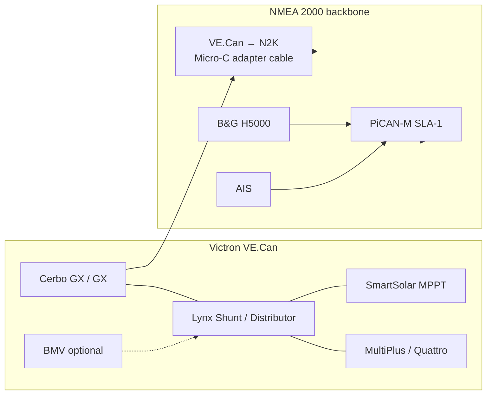
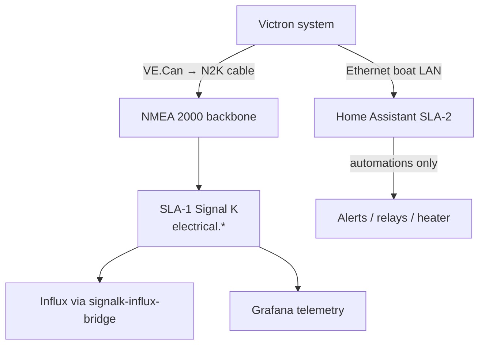

# ADR-0036: Victron VE.Can power system on NMEA 2000

**Status:** Accepted  
**Date:** 2026-07-16  
**Deciders:** cognite-fholm  
**Related:** [ADR-0002](./0002-three-tier-sla-architecture.md), [ADR-0021](./0021-sla1-signalk-plugin-strategy.md), [ADR-0035](./0035-home-assistant-non-nmea-domotics.md), [spec §7.31](../spec.md#731-victron-power-on-nmea-2000), [Victron VE.Can → NMEA 2000 cable](https://www.victronenergy.com/cables/ve-can-to-nmea2000-micro-c-male), [Victron data communication whitepaper](https://www.victronenergy.com/upload/documents/Technical-Information-Data-communication-with-Victron-Energy-products_EN.pdf)

---

## Context

The boat runs a **Victron Energy** power management system (typical stack: Cerbo GX or GX device, Lynx distribution/shunt, MultiPlus/Quattro inverter-charger, MPPT solar, BMV monitor). Victron devices communicate on **VE.Can**, which uses the same **NMEA 2000 / J1939** application protocol as the marine backbone but with an **RJ-45** physical connector instead of Micro-C.

Victron supplies an official bridge cable:

**[VE.Can to NMEA 2000 (Micro-C male)](https://www.victronenergy.com/cables/ve-can-to-nmea2000-micro-c-male)** — connects the VE.Can bus to the boat NMEA 2000 backbone via a single Micro-C drop.

The AI Sailing System already ingests NMEA 2000 on **SLA-1** through PiCAN-M ([ADR-0021](./0021-sla1-signalk-plugin-strategy.md)). [ADR-0035](./0035-home-assistant-non-nmea-domotics.md) assigns **non-NMEA** domotics to Home Assistant — but Victron on N2K is **standard marine power-subset telemetry**, not domotics. It belongs on the same bus as H5000 and AIS, decoded once by Signal K.

Open questions:

| Question | Risk if unanswered |
|----------|-------------------|
| VE.Can vs N2K — one bus or two? | Duplicate wiring, conflicting SOC sources |
| Who owns house battery SoR? | HA Modbus vs N2K vs BMV disagree |
| Control vs monitor? | Accidental inverter commands from race stack |
| SOC PGN disabled by default? | Grafana shows voltage but no SoC |

---

## Decision

### 1. Single NMEA 2000 backbone — Victron as a power-subset node

| Rule | Detail |
|------|--------|
| **Physical** | One N2K backbone; Victron joins via official **VE.Can → NMEA 2000 Micro-C male** cable — no second CAN bus to PiCAN |
| **VE.Can internal** | Victron devices remain on VE.Can (RJ-45); only the Cerbo/GX VE.Can port bridges outward |
| **Load** | Count Victron N2K LEN per device datasheet; verify backbone capacity with H5000 + AIS + autopilot |
| **Terminators** | Two terminators on N2K backbone ends — VE.Can side has its own termination rules per Victron manual |

### 2. SLA-1 Signal K — read-only ingest of NMEA 2000 power PGNs

| Layer | Owner | Role |
|-------|-------|------|
| **N2K power telemetry** | SLA-1 `signalk-server` | Decode standard PGNs → `electrical.*` paths |
| **Marine navigation** | SLA-1 (unchanged) | Wind, BSP, GPS, depth, AIS |
| **Victron control & rich UI** | Victron GX + optional HA Modbus ([ADR-0035](./0035-home-assistant-non-nmea-domotics.md)) | Relay, inverter mode, generator — **not** from race stack |
| **Race / tactics** | SLA-2 | Unaffected by house power except optional Grafana panels |

**Hard rules:**

1. AI-sailing-system services **MUST NOT** send N2K commands to Victron (no charger on/off, no inverter control via Pi).
2. `signalk-server` on SLA-1 ingests Victron PGNs **read-only** — same as H5000 and AIS.
3. Victron proprietary PGNs are **ignored in v1** unless a dedicated decoder is added; rely on standard power subset first.
4. House battery **monitoring SoR on the race bus** is **Lynx Shunt / BMV N2K instance** when present — not Multi/Quattro calculated SOC (see §3).

### 3. PGN mapping and operational checklist

Standard Victron N2K power-subset messages (per [Victron data communication whitepaper](https://www.victronenergy.com/upload/documents/Technical-Information-Data-communication-with-Victron-Energy-products_EN.pdf)):

| PGN | Name | Signal K area (typical) | Notes |
|-----|------|-------------------------|-------|
| **127508** | Battery Status | `electrical.batteries.*.voltage`, `.current` | Instances 0 = house, 1 = starter/fused — verify on install |
| **127506** | DC Detailed Status | `electrical.batteries.*.capacity.stateOfCharge` | **Disabled by default** on many devices — enable via N2K PGN **126208** (Request group function) |
| **127513** | Battery Configuration Status | `electrical.batteries.*` metadata | Capacity, chemistry |
| **127507** | Charger Status | `electrical.chargers.*` | MPPT / charger state |
| **127509** | Inverter Status | `electrical.inverters.*` | Quattro/Multi status fields |

**SOC source priority on this boat:**

| Priority | Source | Why |
|----------|--------|-----|
| 1 | **Lynx Shunt VE.Can** (or BMV N2K) | Coulomb-counted SOC — valid with DC loads and solar |
| 2 | **BMV** main battery instance 0 | Same, if no Lynx |
| 3 | Multi/Quattro PGN 127506 SOC | **Low trust** on boats — disabled by default; Victron documents unreliable with multiple DC paths |

**Install checklist** (harbor, before regatta):

- [ ] VE.Can → N2K cable on Cerbo/GX VE.Can port; single Micro-C drop on backbone  
- [ ] Confirm PGN 127508 voltage/current on `candump can0` or Signal K debug  
- [ ] Enable PGN 127506 for Lynx/BMV if SoC required in Grafana  
- [ ] Label battery instances in Victron VRM / GX menu (house vs starter)  
- [ ] Verify PiCAN still sees H5000 + AIS after Victron join (no address clash)

### 4. Dual path with Home Assistant (complementary, not duplicate)

[ADR-0035](./0035-home-assistant-non-nmea-domotics.md) remains valid for **control and non-PGN data**:

| Path | Protocol | Use |
|------|----------|-----|
| **A — N2K via PiCAN** | VE.Can → N2K → SLA-1 SK | Grafana, MCP `get_vessel_state`, Influx history — voltage, current, SoC, charger status |
| **B — Cerbo GX LAN** | Modbus TCP / Venus OS API → HA on SLA-2 | Automations (shore power connected, low SOC alert), switches, generator, data not on standard PGNs |

**No HA → Signal K republish of Victron data in v1** — Pi SK already has N2K decode. HA uses Cerbo for **actions**; SLA-1 SK for **race-stack visibility**.

### 5. Persistence and UX

| Consumer | Victron data |
|----------|--------------|
| `signalk-influx-bridge` | Persist `electrical.batteries.*`, `electrical.chargers.*` to Influx `signalk` bucket (extend path filter if not already) |
| `grafana-telemetry` | Optional house-bank panel — harbor and passage, not primary helm race view |
| `race-mcp-gateway` | `get_vessel_state` / `list_available_paths` includes `electrical.*` when present |
| `race-ui` | **Out of scope v1** — house power not tactical |

During **`RACE_MODE=true`**, Victron ingest continues on SLA-1 (monitoring). No change to HA comfort automations policy ([ADR-0035](./0035-home-assistant-non-nmea-domotics.md)).

---

## Consequences

**Positive**

- No extra hardware to Pi — Victron uses existing PiCAN-M N2K ingest.
- Standard NMEA 2000 power subset — Signal K plugins decode without Victron-specific code on v1.
- Clear split: **monitor on SLA-1**, **control via GX/HA**, **navigation unchanged**.
- Grafana and MCP can answer “house battery voltage/SOC?” alongside wind and BSP.

**Negative**

- N2K backbone load and troubleshooting complexity (Victron + B&G + AIS).
- PGN 127506 enablement is manual — easy to miss SoC in dashboards.
- Multi/Quattro SOC misleading if Lynx shunt not configured as SoR.
- Victron proprietary PGNs unavailable until phase 2 decoder.

**Follow-up**

- `signalk-influx-bridge` path allowlist includes `electrical.*`.
- [docs/EQUIPMENT_LIST.md](../docs/EQUIPMENT_LIST.md) — VE.Can → N2K cable.
- [docs/validation_plan.md](../docs/validation_plan.md) — Victron PGN bring-up steps.
- [spec §7.31](../spec.md#731-victron-power-on-nmea-2000) + FR-268–270.

---

## Alternatives considered

| Alternative | Rejected because |
|-------------|------------------|
| Victron only via HA Modbus (no N2K cable) | Race stack and Grafana would not see house power without HA → SK bridge; duplicates ADR-0021 single marine hub |
| Victron only on separate CAN to second PiCAN | Extra HAT and isolation complexity; official cable solves bridging |
| Full Victron control from Signal K | Safety and scope — inverter/charger control belongs on GX/HA, not race telemetry tier |
| Ignore Victron in AI-sailing-system | User operates Victron; monitoring is cheap once on N2K backbone |
| Replace Lynx with Multi SOC on dashboards | Victron documents Multi SOC unreliable with DC loads on boats |
