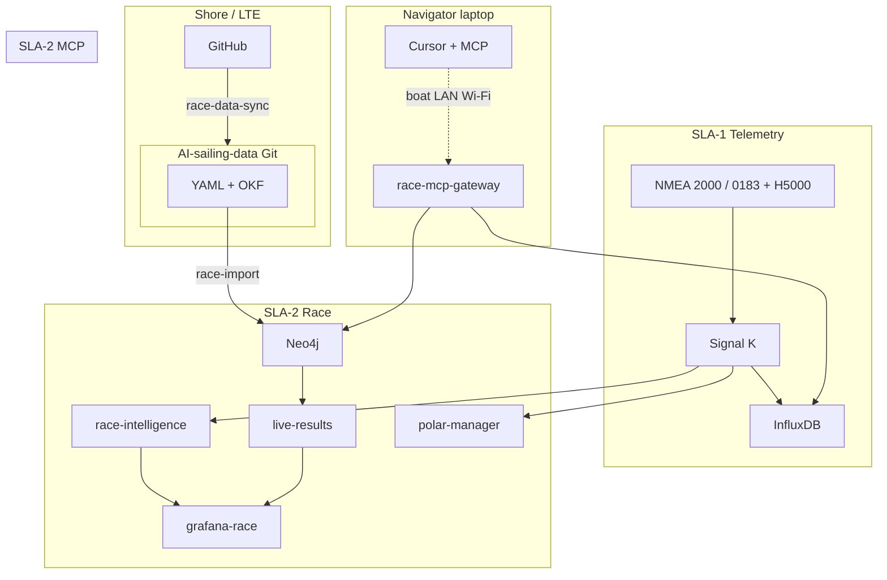
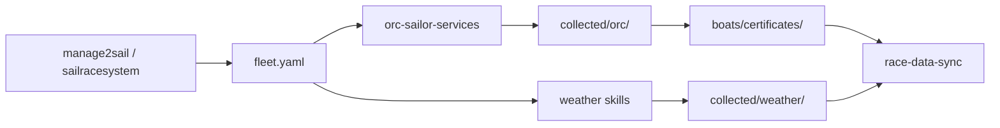

# Architecture overview

Consolidated map of the **AI Sailing System** — how repositories, SLA tiers, data stores, and reference products fit together. Normative detail remains in [spec.md](../spec.md) and [adr/](../adr/).

**Last updated:** 2026-07-05 · **Spec version:** 0.17.0-draft

---

## Repositories

| Repository | Role | Onboard path |
|------------|------|--------------|
| **[AI-sailing-system](https://github.com/cognite-fholm/AI-sailing-system)** (this repo) | Code, Docker images, CI/CD, ADRs, spec | `/opt/ai-sailing-system/` |
| **[AI-sailing-data](https://github.com/cognite-fholm/AI-sailing-data)** | Races, boats, ORC certs, planning YAML, Neo4j templates | `/opt/ai-sailing-data/` |

**Rule:** Prepare regattas in **AI-sailing-data** on shore (Cursor + Git). Freeze **both** git refs and system image digests before a race ([ADR-0009](../adr/0009-dual-repository-race-data.md)).

**User guide:** [Race preparation guide](https://github.com/cognite-fholm/AI-sailing-data/blob/main/docs/RACE_PREPARATION_GUIDE.md) (data repo).

---

## SLA tiers

| Tier | Priority | Hardware | Compose file |
|------|----------|----------|--------------|
| **SLA-1** | Critical | Pi 5 + PiCAN-M | `docker-compose.sla-1.yml` |
| **SLA-2** | Important | Pi 5 (8 GB) | `docker-compose.sla-2.yml` |
| **SLA-3** | Best-effort | Pi 5 + Coral + GoPro | `docker-compose.sla-3.yml` |
| **SLA-S** | Harbor only | Gaming PC (CUDA) | `shore/docker-compose.sla-shore.yml` |

**Golden rule:** SLA-1 telemetry survives SLA-2/SLA-3 failure ([ADR-0002](../adr/0002-three-tier-sla-architecture.md)).

Spec: [§5 Three-tier SLA](../spec.md#5-three-tier-sla-architecture) · [§6 Data flow](../spec.md#6-system-context-and-data-flow)

---

## Data stores

| Store | SLA | Holds |
|-------|-----|-------|
| **Signal K** | 1 | Live marine deltas (canonical) |
| **InfluxDB** | 1 | High-frequency telemetry |
| **Neo4j** | 2 | Races, vessels, courses, runtime standings |
| **Grafana** | 1–3 | Dashboards per tier |
| **Git (data repo)** | Shore → boat | Plans, certificates, static graph templates |
| **OKF bundles** | 2–3 | LLM concept context |

**Not in git:** Live AIS tracks, `LiveStanding`, `CourseSelection`, GRIB binaries (metadata only in YAML).

---

## Reference products (parity targets)

The Pi stack **extends** familiar sailing tools; it does not replace helm instruments in v1.

| Product | ADR | Spec | Our surfaces |
|---------|-----|------|--------------|
| **[iRegatta](https://zifigo.com/)** v2.86 | [0010](../adr/0010-iregatta-reference-model.md) | [§7.16](../spec.md#716-iregatta-reference-model--feature-traceability) | `grafana-race`, `course-editor`, `race-intelligence` |
| **[B&G H5000](https://www.bandg.com/bg/series/h5000/)** | [0011](../adr/0011-bg-h5000-reference-model.md) | [§7.17](../spec.md#717-bg-h5000-reference-model--integration) | Signal K ingest, SailSteer/Start Grafana pages, `InstrumentProfile` YAML |
| **Laptop Cursor + MCP** | [0012](../adr/0012-race-side-mcp-laptop-cursor.md) | [§7.18](../spec.md#718-race-side-mcp--laptop-cursor) | `race-mcp-gateway` on boat LAN |

**Beyond reference products:** AIS fleet, live ORC corrected standings, GRIB wind zones, SI PDF courses, start-boat flags, LLM coach, GoPro trim vision, **race-side MCP**.

Manuals: [docs/references/README.md](./references/README.md)

---

## Architecture Decision Records

| ADR | Topic |
|-----|-------|
| [0001](../adr/0001-system-architecture-and-technology-choices.md) | Core stack (Signal K, Influx, Neo4j, Grafana, LLaMA) |
| [0002](../adr/0002-three-tier-sla-architecture.md) | Three isolated SLA tiers |
| [0003](../adr/0003-gopro-capture-and-shore-training.md) | GoPro HERO13 + TrimTransformer |
| [0004](../adr/0004-grib-polars-ais-wind-analysis.md) | GRIB, polars, AIS, wind-on-course |
| [0005](../adr/0005-course-parsing-handicaps-live-results.md) | SI parse, handicaps, live results |
| [0006](../adr/0006-start-boat-course-flags.md) | Multi-course / start-boat flags |
| [0008](../adr/0008-github-docker-deployment-lifecycle.md) | GitHub Actions, GHCR, race freeze |
| [0009](../adr/0009-dual-repository-race-data.md) | Dual repo + Teltonika sync |
| [0010](../adr/0010-iregatta-reference-model.md) | iRegatta UX benchmark |
| [0011](../adr/0011-bg-h5000-reference-model.md) | H5000 instrument benchmark |
| [0012](../adr/0012-race-side-mcp-laptop-cursor.md) | Race-side MCP for laptop Cursor |
| [0013](../adr/0013-orc-certificate-fleet-collection.md) | Automated ORC certificate fleet collection (shore skill) |
| [0014](../adr/0014-shore-weather-current-collection.md) | Shore weather/current — MET GRIB, Oslofjord plots, SMHI |
| [0015](../adr/0015-tactical-insight-alerts-annunciation.md) | Tactical insight alerts, UX feed, optional voice (Piper TTS) |
| [0016](../adr/0016-fleet-polar-performance-influx.md) | Fleet polar performance timeline in InfluxDB |
| [0017](../adr/0017-marine-map-gpx-export.md) | Marine map GPX export (PredictWind-compatible zip) |

Full index: [adr/README.md](../adr/README.md)

---

## Shore collection pipeline (race prep)

Before a regatta, **AI-sailing-data** is populated on shore via Cursor skills:

| Skill | Output |
|-------|--------|
| **sailracesystem** | Fleet, SI PDFs, `collected/sailracesystem/` |
| **manage2sail** | Fleet, documents, `collected/manage2sail/` |
| **orc-sailor-services** | ORC index, PDFs, `boats/{sail}/certificates/` |
| **metno-oslofjord-weather** | GRIB manifests, `collected/weather/grib/` (binaries gitignored) |
| **oslofjord-current-plots** | Current PNG maps + interpretation reference |
| **smhi-wind-observations** | Skagerrak wind obs JSON for forecast validation |
| **marine-map-gpx-export** | GPX route zip → `export/marine-map/` for chartplotter import |
| **insight-alerts** | Tactical alert broker — Grafana + course-editor + optional speaker TTS |

Detail: [spec §7.19](../spec.md#719-orc-certificate-collection--fleet-enrichment) · [spec §7.20](../spec.md#720-shore-weather--current-collection) · [spec §7.21](../spec.md#721-tactical-insight-alerts--annunciation) · [spec §7.23](../spec.md#723-marine-map-gpx-export) · [data repo prep guide](https://github.com/cognite-fholm/AI-sailing-data/blob/main/docs/RACE_PREPARATION_GUIDE.md)

---

## AI-sailing-data schema (summary)

| Kind | Typical path |
|------|----------------|
| `Boat`, `BoatSeason`, `OrcCertificate`, `PolarSource` | `boats/{sail_number}/` |
| `InstrumentProfile`, `InstrumentCalibration` | `boats/{sail}/instrumentation/` |
| `Race`, `Fleet`, `CourseCatalog`, `WaypointList` | `races/{year}/{race}/` |
| `LaylinePreferences`, `StartLinePreferences`, `GribPlan`, `WeatherCollection`, `InsightAlertProfile`, `MarineMapExport` | `races/.../planning/`, `collected/weather/`, `export/marine-map/` |
| `H5000VariableMap` | `schema/h5000-variable-map.yaml` |

Detail: [data repo schema/README.md](https://github.com/cognite-fholm/AI-sailing-data/blob/main/schema/README.md)

---

## Key services (SLA-2)

| Service | Responsibility |
|---------|----------------|
| `race-data-sync` | `git pull` data repo via LTE/Wi‑Fi |
| `race-import` | MERGE `neo4j/*.yaml` bundles |
| `polar-manager` | SLK polars + H5000 CSV interop |
| `race-intelligence` | Start line, lift, laylines, steering hints |
| `live-results` | VMG, corrected-time fleet rank |
| `fleet-performance-tracker` | Fleet polar % vs certificate — 30 s series in Influx `race` bucket |
| `wind-field-analyzer` | GRIB + AIS + polar fusion |
| `course-parser` / `course-editor` | SI → waypoints; manual edit + start flags |
| `handicap-manager` | ORC multi-number + WRS TCF |
| `ais-collector` | Fleet AIS from Signal K |
| `tactical-coach` | Local LLM advisory |
| `insight-alerts` | Tactical alert broker — UI feed, ack, Piper TTS to speaker |
| `race-mcp-gateway` | MCP tools for laptop Cursor — **Neo4j** (`/mcp/neo4j`) + **Influx** (`/mcp/influx`) ([guide](./race-laptop-mcp.md), [tools](./mcp-neo4j-influx.md)) |

---

## Race laptop (Cursor + MCP)

Bring a **laptop** on boat Wi‑Fi; Cursor connects to `race-mcp-gateway` at `http://race.local:3100` for live standings, Influx queries, Neo4j, and YAML context — ad hoc analysis during the race.

| Doc | Content |
|-----|---------|
| [race-laptop-mcp.md](./race-laptop-mcp.md) | Laptop setup, MCP config, example prompts |
| [ADR-0012](../adr/0012-race-side-mcp-laptop-cursor.md) | Architecture decision |

**Note:** MCP stays **enabled** when `RACE_MODE=true` (read-only; does not auto-update containers).

---

| Doc | Content |
|-----|---------|
| [USER_GUIDE.md](./USER_GUIDE.md) | **Sailor user guide** — links to data-repo prep + onboard |
| [deployment-lifecycle.md](./deployment-lifecycle.md) | Harbor vs race mode, scripts |
| [deploy/README.md](../deploy/README.md) | Env templates, digest locks |
| [spec §9](../spec.md#9-deployment-architecture) | Full deployment architecture |

**Harbor:** `harbor-pull.sh` (images) + `harbor-sync.sh` (models, OKF, data repo).  
**Race:** `RACE_MODE=true` — no Watchtower, no auto-pull.

---

## Implementation status

Phases match [spec §1.1](../spec.md#11-implementation-map) and [spec §14](../spec.md#14-implementation-phases). ADR build order: [adr/README.md](../adr/README.md#implementation-order).

| Phase | Status |
|-------|--------|
| **0 — Foundation** | **Current** — spec v0.17, ADRs 0001–0017, deploy scaffolding |
| **1 — SLA-1 telemetry** | Not started |
| **2A — Shore race prep** | **Partial** — data repo skills, Færder examples; waypoint gaps remain |
| **2B — Graph import** | Not started |
| **2C — GRIB, polars, AIS** | Not started |
| **2D — Courses & results** | Not started |
| **2E — Race UX** | Not started |
| **2F — Analytics & alerts** | Not started |
| **2G — Laptop MCP** | Scaffold only (`race-mcp-gateway/`) |
| **3 — SLA-3 vision** | Not started |
| **4 — CI/CD multi-Pi** | Workflow stubs only |
| **5 — Shore training** | Spec only |

Detail: [spec §14](../spec.md#14-implementation-phases)

---

## Related links

- [spec.md](../spec.md) — full specification
- [README.md](../README.md) — project entry point
- [AI-sailing-data](https://github.com/cognite-fholm/AI-sailing-data) — race/boat content
- [cogsail-python](https://github.com/cognite-fholm/cogsail-python) — prior art
