# Complete system diagram — AI Sailing System

Single-page map of **repositories**, **hardware**, **services**, **data flows**, and **integrations** (including the Expedition nav laptop and Home Assistant domotics). Normative detail: [spec.md](../spec.md) · [ARCHITECTURE.md](./ARCHITECTURE.md) · [EQUIPMENT_LIST.md](./EQUIPMENT_LIST.md) · [adr/README.md](../adr/README.md).

**Last updated:** 2026-07-16

---

## Legend

| Symbol | Meaning |
|--------|---------|
| **Solid line** | Data path in production design |
| **Dashed line** | Optional, remote, or human workflow |
| **Green / implemented** | Service exists in repo + compose today |
| **Amber / partial** | Scaffold or library without full spec behaviour |
| **Grey / planned** | Normative in spec; not built yet |

---

## 1. System context (who talks to whom)

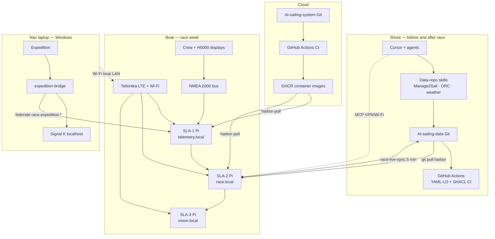

---

## 2. Physical deployment on the boat

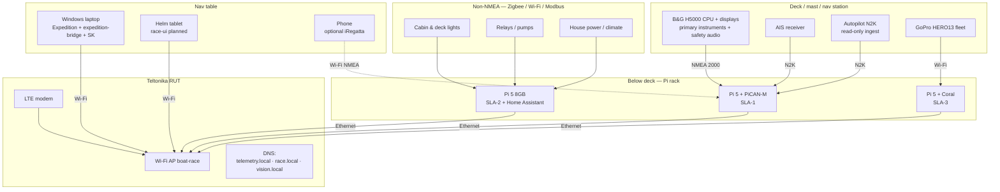

**Golden rule ([ADR-0002](../adr/0002-three-tier-sla-architecture.md)):** SLA-1 telemetry keeps running if SLA-2 or SLA-3 fail.

---

## 3. Services by host

### SLA-1 — `telemetry.local` (implemented)

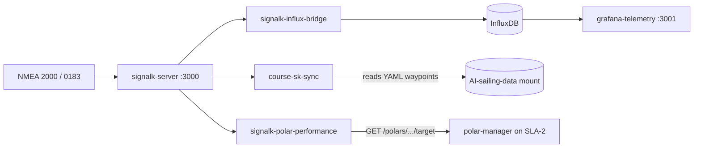

| Service | Status | Role |
|---------|--------|------|
| `signalk-server` | Implemented | Marine hub; `@signalk/course-provider` |
| `signalk-influx-bridge` | Implemented | Telemetry → Influx `signalk` bucket |
| `course-sk-sync` | Implemented | WaypointList YAML → `navigation.course` |
| `signalk-polar-performance` | Implemented | `performance.polarSpeed*` paths |
| `grafana-telemetry` | Implemented | History / instrument panels |

### SLA-2 — `race.local` (mixed)

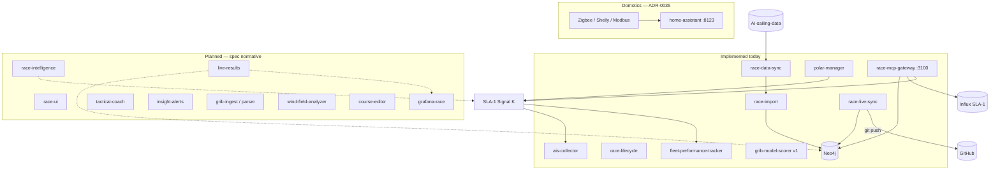

| Service | Status | Role |
|---------|--------|------|
| `race-import` | Implemented | YAML-LD Neo4j bundles → graph |
| `race-data-sync` | Implemented | Git pull data repo |
| `race-lifecycle` | Implemented | Schedule-driven harbor/race mode |
| `race-live-sync` | Implemented | Neo4j + Influx → `race-live/` git |
| `polar-manager` | Partial | ORC target-speeds API (full SLK planned) |
| `ais-collector` | Implemented | AIS → Influx `ais_tracks` |
| `fleet-performance-tracker` | Implemented | Fleet polar % timeline |
| `grib-model-scorer` | Partial | Observed-wind baseline (full GRIB planned) |
| `race-mcp-gateway` | Partial | Neo4j + Influx + Signal K MCP |
| `home-assistant` | Planned | Non-NMEA domotics — lights, climate, house power ([ADR-0035](../adr/0035-home-assistant-non-nmea-domotics.md)) |
| `race-intelligence` | Planned | Start, laylines, lift |
| `live-results` | Planned | Corrected standings |
| `race-ui` | Planned | Primary helm UX |
| `grafana-race` | Planned | Tactical dashboards |
| `tactical-coach` | Planned | Onboard LLM |

### SLA-3 — `vision.local` (planned)

GoPro capture → Coral preprocess → vision LLM → `grafana-sail` ([ADR-0003](../adr/0003-gopro-capture-and-shore-training.md)).

### Nav laptop — Windows (new)

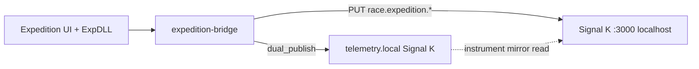

See [ADR-0034](../adr/0034-expedition-laptop-signalk-federation.md) · [SIGNALK_RACE_EXTENSION.md](./SIGNALK_RACE_EXTENSION.md).

### Shore — SLA-S + dev

| Host | Services | Status |
|------|----------|--------|
| **Dev laptop** | `docker-compose.sla-1.yml` + `sla-2.yml` + `dev.yml` | Local emulation |
| **Gaming PC** | TrimTransformer training (`shore/docker-compose.sla-shore.yml`) | Planned Phase 5 |
| **GitHub** | CI, SHACL (data repo), GHCR publish | Active |

---

## 4. Dual-repository data model

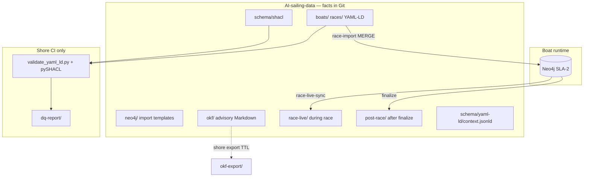

| Layer | Artifact | Runs where |
|-------|----------|------------|
| Facts | `boats/`, `races/` YAML-LD | Git; edited on shore |
| Constraints | SHACL shapes | Shore CI only |
| Runtime graph | Neo4j | SLA-2 Pi |
| Advisory | OKF / Vault-LD | Shore; not Neo4j import |
| Temporal | `race-live/` → `post-race/` | Git via `race-live-sync` |

Detail: [DATA_SCHEMA.md](https://github.com/cognite-fholm/AI-sailing-data/blob/main/docs/DATA_SCHEMA.md) (data repo).

---

## 5. End-to-end data flows

### 5.1 Instruments (race hour)

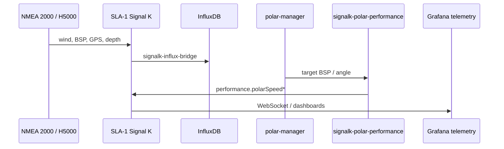

### 5.2 Race prep → harbor → start

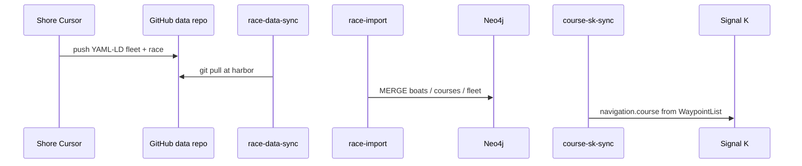

### 5.3 During race — live sync + Expedition

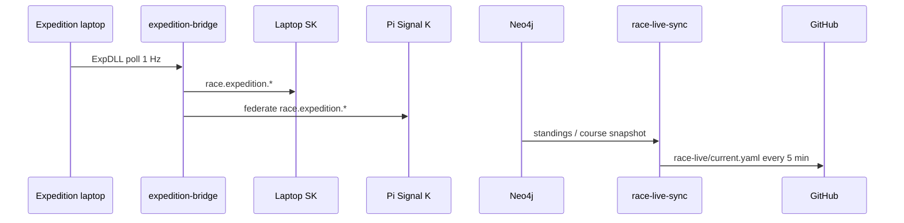

### 5.4 After race

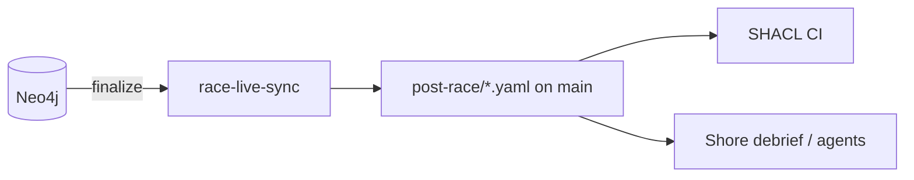

---

## 6. Signal K namespace map

Canonical instruments stay standard Signal K. Extensions:

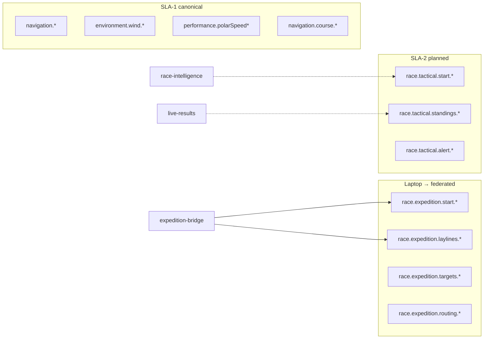

Full path table: [SIGNALK_RACE_EXTENSION.md](./SIGNALK_RACE_EXTENSION.md).

---

## 7. Helm and UX surfaces

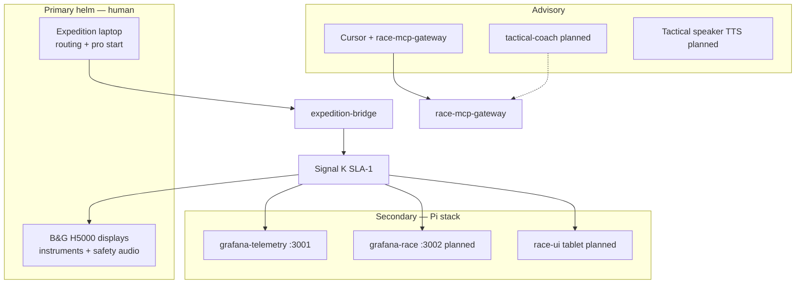

| Surface | Reference product | Status |
|---------|-------------------|--------|
| H5000 | B&G H5000 | Hardware on boat |
| Expedition | Expedition Marine | Nav laptop |
| `race-ui` | iRegatta parity | Planned |
| Grafana race | H5000 / iRegatta pages | Planned |
| Cursor MCP | Beyond reference products | Partial |

---

## 8. Shore preparation pipeline

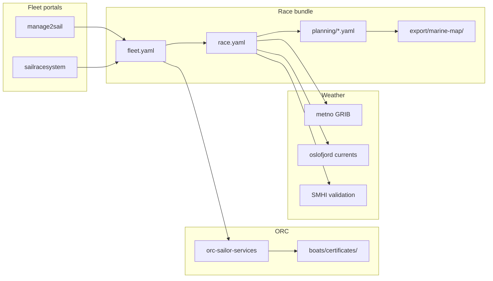

Guide: [RACE_PREPARATION_GUIDE.md](https://github.com/cognite-fholm/AI-sailing-data/blob/main/docs/RACE_PREPARATION_GUIDE.md).

---

## 9. Network and remote access

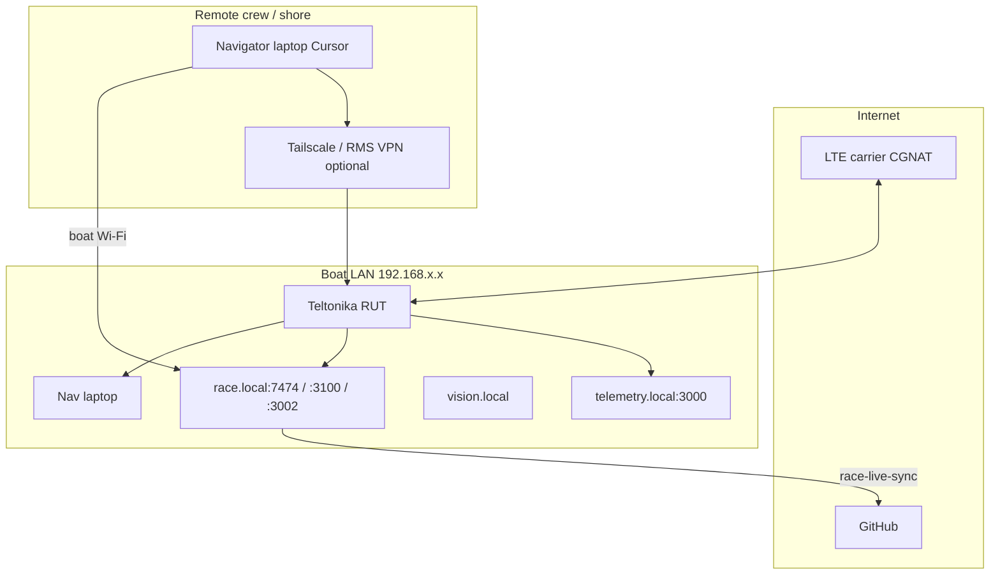

Docs: [vpn-remote-access.md](./vpn-remote-access.md) · [race-laptop-mcp.md](./race-laptop-mcp.md).

---

## 10. Implementation status summary

| Area | Today | Next |
|------|-------|------|
| SLA-1 telemetry pipeline | Signal K, Influx, polar %, course sync | PiCAN / H5000 ingest configured |
| SLA-2 data plane | Neo4j import, sync, lifecycle, live-sync, AIS, fleet polar % | `live-results`, `race-intelligence` |
| SLA-2 tactical UX | — | `race-ui`, `grafana-race` |
| Expedition integration | `expedition-bridge` scaffold + spec | Windows deploy + federation test |
| Shore data | YAML-LD, SHACL, DQ, ORC skills | Onboard GRIB ingest |
| SLA-3 vision | Spec only | GoPro + Coral stack |

Detail table: [ARCHITECTURE.md § Implementation status](./ARCHITECTURE.md).

---

## Related documents

| Document | Topic |
|----------|--------|
| [ARCHITECTURE.md](./ARCHITECTURE.md) | Narrative architecture + ADR index |
| [spec.md](../spec.md) | Normative requirements |
| [USER_GUIDE.md](./USER_GUIDE.md) | Crew-facing overview |
| [SIGNALK_RACE_EXTENSION.md](./SIGNALK_RACE_EXTENSION.md) | `race.expedition.*` / `race.tactical.*` paths |
| [ADR-0034](../adr/0034-expedition-laptop-signalk-federation.md) | Expedition laptop federation |
| [deploy/README.md](../deploy/README.md) | Env files and harbor deploy |
| [DEV-SETUP.md](./DEV-SETUP.md) | Windows/WSL Docker setup |
