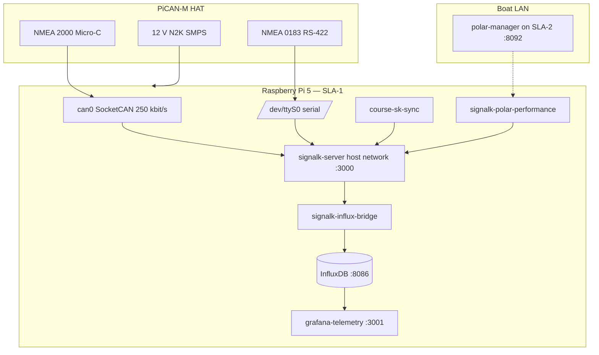

# Validation plan — Raspberry Pi + PiCAN-M (SLA-1 telemetry)

Step-by-step plan to verify **what is implemented today** on the telemetry node: Raspberry Pi 5 with **PiCAN-M HAT**, Docker, and the Phase 1 SLA-1 stack.

**Audience:** integrators bringing up the boat telemetry Pi before harbor week or bench testing with live NMEA.

**Normative references:** [spec.md §4.2](../spec.md#42-pican-m-integration) · [spec §14](../spec.md#14-implementation-phases) · [ADR-0021](../adr/0021-sla1-signalk-plugin-strategy.md) · [ARCHITECTURE.md](./ARCHITECTURE.md) · [deploy/README.md](../deploy/README.md)

---

## 1. Scope and current status

### 1.1 What this plan validates

| Layer | Phase | Status in repo | Validated by this plan |
|-------|-------|----------------|------------------------|
| PiCAN-M hardware (power, CAN, serial) | 1 | Spec + ADRs | **Yes** — host-level checks |
| Signal K + PiCAN ingest (N2K / 0183) | 1 | **Not complete** — `config/signalk/settings.json` has no NMEA providers yet | **Partial** — manual Signal K plugin config required |
| `docker-compose.sla-1.yml` stack | 1 | **Done** (scaffold) | **Yes** |
| `@signalk/course-provider` in custom image | 1 | **Done** | **Yes** (after course geometry is pushed) |
| `course-sk-sync` | 1 | **Done** | **Yes** (needs AI-sailing-data on Pi) |
| `signalk-polar-performance` | 1 | **Done** | **Yes** (needs SLA-2 `polar-manager` reachable) |
| `signalk-influx-bridge` | 1 | **Done** | **Yes** |
| `grafana-telemetry` | 1 | **Done** (provisioning scaffold) | **Yes** |
| SLA-2 (`neo4j`, `race-import`, `polar-manager`, …) | 2B | **Scaffold** | **Optional** — second Pi or same Pi for bench |
| CI/CD harbor scripts | 4 | **Partial** | **Optional** — harbor pull/sync smoke test |

### 1.2 What is explicitly out of scope (not built yet)

- Full `ais-collector`, `grib-ingest`, `live-results`, `race-ui`, SLA-3 vision
- Automated `@wip` live BDD scenarios (require finished PiCAN → Signal K wiring)
- Production systemd units and 3-node race profile guide (Phase 4 backlog)

Track implementation progress in [ARCHITECTURE.md § Implementation status](./ARCHITECTURE.md#implementation-status) and [spec §14](../spec.md#14-implementation-phases).

### 1.3 Target architecture on the telemetry Pi



---

## 2. Prerequisites

Complete before starting validation.

| # | Item | Pass criterion |
|---|------|----------------|
| P1 | **Raspberry Pi 5** (4 GB minimum) with PiCAN-M HAT seated and 40-pin header secure | Pi boots; HAT LED/power normal |
| P2 | **12 V N2K supply** on HAT SMPS (or bench supply per [PiCAN-M user guide](https://copperhilltech.com/content/pican-m_UGB_10.pdf)) | Stable 5 V to Pi under load |
| P3 | **N2K backbone** wired to Micro-C (J1); 120 Ω termination correct at backbone ends | See §3.1 |
| P4 | **NMEA 0183** (if used) on RS-422 screw terminal (J3) | Talker/listener ground reference shared |
| P5 | **Raspberry Pi OS (64-bit)** + Docker Engine + Compose plugin | `docker compose version` succeeds |
| P6 | **Repos on Pi** | `/opt/ai-sailing-system` and `/opt/ai-sailing-data` cloned |
| P7 | **Env file** | `deploy/env/harbor.env` or `race.env` copied from `.example`; secrets changed from defaults |
| P8 | **Boat LAN** (or bench Ethernet) | Tablet/laptop can reach Pi hostname/IP |

**Repo layout on Pi (recommended):**

```bash
sudo mkdir -p /opt
sudo git clone https://github.com/cognite-fholm/AI-sailing-system.git /opt/ai-sailing-system
sudo git clone https://github.com/cognite-fholm/AI-sailing-data.git /opt/ai-sailing-data
cd /opt/ai-sailing-system
cp deploy/env/harbor.env.example deploy/env/harbor.env
# Edit harbor.env: DATA_REPO_HOST_PATH=/opt/ai-sailing-data, passwords, POLAR_MANAGER_URL if SLA-2 separate
```

---

## 3. Layer A — PiCAN-M and host interfaces

Validate **before** starting Docker. Signal K uses host networking on the Pi, so containers see the same `can0` and serial devices as the OS.

### 3.1 Physical and bus checks

| Step | Action | Pass | Fail action |
|------|--------|------|-------------|
| A1 | Confirm **terminator jumper** on PiCAN-M matches backbone layout (one terminator at each physical end of N2K; not three) | Exactly two terminators on backbone | Remove extra terminators; see Copperhill doc |
| A2 | Measure N2K backbone **12 V** at a spare tee (engine off, instruments on) | ~12 V | Check fuse, SMPS wiring |
| A3 | Power Pi from HAT SMPS; verify no undervoltage icon during CPU stress | Stable boot | Use shorter N2K feed or higher-grade supply |

### 3.2 SocketCAN (`can0`) — FR-1

Install tools if missing: `sudo apt install can-utils`.

| Step | Command | Pass criterion |
|------|---------|----------------|
| A4 | `ip link show can0` | Interface exists |
| A5 | `sudo ip link set can0 up type can bitrate 250000` | No error |
| A6 | `candump can0` (with N2K traffic on backbone) | PGN frames appear at regular intervals |
| A7 | Leave `candump` running 60 s | No burst of error frames; bus not silent if instruments powered |

**Bitrate must be 250 kbit/s** for standard NMEA 2000 ([spec §4.2](../spec.md#42-pican-m-integration)).

If `can0` is missing, configure the PiCAN-M overlay per the [PiCAN-M user guide](https://copperhilltech.com/content/pican-m_UGB_10.pdf) (device tree / `config.txt` on Pi 5), then reboot.

### 3.3 NMEA 0183 serial — FR-2

| Step | Command | Pass criterion |
|------|---------|----------------|
| A8 | `ls -l /dev/ttyS0` (or device named in your overlay) | Character device present |
| A9 | `sudo stty -F /dev/ttyS0 <baud>` then `sudo cat /dev/ttyS0` | NMEA sentences (`$GPRMC`, `$IIXDR`, `$P`, etc.) when talker active |
| A10 | Match baud to instrument (4800 / 38400 / 115200) | Correct sentence framing (no diamond replacement chars) |

### 3.4 Optional I²C (Qwiic) — FR-5

| Step | Command | Pass criterion |
|------|---------|----------------|
| A11 | `i2cdetect -y 1` | Expected sensor address visible (if fitted) |

---

## 4. Layer B — Deploy SLA-1 Docker stack

On the telemetry Pi, use **production compose** (host network). Do **not** use `docker-compose.dev.yml` on the Pi — that overlay is for laptop bridge networking only.

### 4.1 Start stack

```bash
cd /opt/ai-sailing-system
docker compose -f docker-compose.sla-1.yml --env-file deploy/env/harbor.env up -d --build
```

Or, with digest-pinned images from a release:

```bash
./scripts/harbor-pull.sh --tier 1
```

### 4.2 Container health

| Step | Command | Pass criterion |
|------|---------|----------------|
| B1 | `docker compose -f docker-compose.sla-1.yml ps` | All SLA-1 services `running` |
| B2 | `docker inspect influxdb --format '{{.State.Health.Status}}'` | `healthy` |
| B3 | `curl -sf http://127.0.0.1:3000/signalk/v1/api/` | HTTP 200 JSON (Signal K API) |
| B4 | `curl -sf http://127.0.0.1:8086/health` | InfluxDB up |
| B5 | `curl -sf -o /dev/null -w '%{http_code}' http://127.0.0.1:3001/login` | `200` (Grafana) |

### 4.3 Logs (no crash loops)

```bash
docker logs signalk-server --tail 50
docker logs signalk-influx-bridge --tail 50
docker logs course-sk-sync --tail 50
docker logs signalk-polar-performance --tail 50
```

**Pass:** no repeated fatal exceptions; bridge connects WebSocket; sidecars reach `http://127.0.0.1:3000`.

---

## 5. Layer C — Signal K marine ingest (PiCAN → deltas)

> **Gap:** Phase 1 checklist item *“Signal K on Pi with PiCAN-M”* is still open in [spec §14](../spec.md#phase-1--sla-1-telemetry-mvp). The shipped `config/signalk/settings.json` does not yet declare N2K or serial providers. Complete this layer manually until ingest is codified in repo config.

### 5.1 Configure NMEA 2000 (canboatjs or N2K plugin)

1. Open Signal K admin UI: `http://<pi-ip>:3000` (or `http://telemetry.local:3000`).
2. **Server → Plugin config** — install/enable **@signalk/canboatjs** (or Signal K N2K plugin).
3. Set CAN interface to **`can0`**, bitrate **250000**.
4. Enable AIS PGNs if fleet AIS is required later (129038, 129039, 129809, 129810 per [spec §4.2](../spec.md#42-pican-m-integration)).

**Validate FR-1 / FR-3:**

| Step | Action | Pass criterion |
|------|--------|----------------|
| C1 | Signal K **Data browser** or REST `GET /signalk/v1/api/vessels/self` | Paths update when bus active |
| C2 | Compare with `candump can0` | SK paths change within **200 ms** of bus activity (FR-3) |
| C3 | On H5000 boats | Prefer H5000-corrected true wind when present ([spec §4.2](../spec.md#42-pican-m-integration)) |

Example REST check:

```bash
curl -s http://127.0.0.1:3000/signalk/v1/api/vessels/self/navigation/speedOverGround | jq .
```

### 5.2 Configure NMEA 0183 serial

1. **Server → Plugin config** — enable serial NMEA 0183 provider.
2. Port: **`/dev/ttyS0`** (or your overlay device).
3. Baud: match talker (often 4800 for GPS, 38400 for instruments).

**Validate FR-2:** sentences appear as normalized Signal K paths (e.g. `navigation.position`, `environment.wind.*`).

### 5.3 Verify `@signalk/course-provider`

The custom image installs the plugin ([`signalk-server/Dockerfile`](../signalk-server/Dockerfile)).

| Step | Action | Pass criterion |
|------|--------|----------------|
| C4 | Admin → Plugins | `@signalk/course-provider` enabled |
| C5 | After course sync (§6) | `navigation.course.calcValues.vmg`, `.xte`, `.dtm` populate in data browser |

---

## 6. Layer D — ADR-0021 sidecars

### 6.1 `course-sk-sync` — data repo → `navigation.course`

**Depends on:** `config/data-repo.yaml` `active` section and `/opt/ai-sailing-data` content.

| Step | Command / action | Pass criterion |
|------|------------------|----------------|
| D1 | Edit `config/data-repo.yaml` — set `active.regatta_id`, `race_path`, `own_boat_path` for your boat | Matches harbor prep |
| D2 | `docker logs course-sk-sync --tail 100` | Poll every `POLL_INTERVAL_S` (default 30 s); no repeated YAML errors |
| D3 | Signal K resources or `navigation.course` | Active route waypoints visible |
| D4 | BDD contract (optional, on dev machine with data repo) | `pytest tests/bdd/steps/test_phase_01_sla1_telemetry.py -m phase_01 -v` — waypoint scenario passes |

### 6.2 `signalk-polar-performance` — `performance.*`

**Depends on:** `polar-manager` on SLA-2 (or same Pi for bench).

| Step | Command | Pass criterion |
|------|---------|----------------|
| D5 | Set `POLAR_MANAGER_URL` in env (e.g. `http://192.168.42.2:8092` for race Pi) | Sidecar log shows successful target fetch |
| D6 | `curl -s http://<sla2>:8092/health` | `{"status":"ok"}` or equivalent |
| D7 | Signal K paths | `performance.polarSpeed`, `performance.polarSpeedRatio`, `performance.targetAngle` update when wind/speed present |
| D8 | Stop SLA-2 / polar-manager | SLA-1 and Signal K **still run**; polar paths may stall (degraded mode) — FR-6 |

### 6.3 `signalk-influx-bridge` — FR-4

| Step | Command | Pass criterion |
|------|---------|----------------|
| D9 | `docker logs signalk-influx-bridge` | Connected to WebSocket; batch writes |
| D10 | Influx query (CLI or UI) | Recent points in bucket `signalk` |

```bash
docker exec influxdb influx query \
  'from(bucket:"signalk") |> range(start:-5m) |> filter(fn:(r) => r._field == "sog") |> last()'
```

**Pass FR-4:** numeric fields land within **500 ms p95** under normal load (measure with concurrent `candump` + query loop during soak test).

**Mapped paths** (contract tested in CI): `navigation.course.calcValues.vmg`, `.xte`, `performance.polarSpeed`, `performance.polarSpeedRatio` — see [`signalk-influx-bridge/bridge.py`](../signalk-influx-bridge/signalk_influx_bridge/bridge.py).

---

## 7. Layer E — Grafana telemetry

| Step | Action | Pass criterion |
|------|--------|----------------|
| E1 | Browse `http://<pi-ip>:3001` | Login with `GRAFANA_ADMIN_*` from env |
| E2 | Open **Telemetry live** dashboard (provisioned) | Dashboard loads without datasource errors |
| E3 | With live NMEA | SOG, COG, TWS, TWD panels update within **1 s** |
| E4 | After course + polar sidecars | VMG, XTE, polar % panels show values when inputs exist |

Datasource is provisioned from `config/grafana/telemetry/provisioning/`.

---

## 8. Layer F — SLA-1 independence (FR-6)

Simulate race-tier outage:

```bash
# On SLA-2 Pi (or stop polar-manager / entire sla-2 compose on bench)
docker compose -f docker-compose.sla-2.yml stop
```

| Step | Action | Pass criterion |
|------|--------|----------------|
| F1 | Keep NMEA traffic flowing | `curl` Signal K API still returns fresh timestamps |
| F2 | `grafana-telemetry` | Instrument panels still update |
| F3 | `signalk-influx-bridge` | Continues writing SOG/wind (course/polar fields may freeze) |

**Pass:** telemetry hub does not depend on Neo4j or SLA-2 availability.

---

## 9. Layer G — SLA-2 (optional second Pi)

If the race node is available, validate Phase 2B scaffold on harbor week path.

### 9.1 Deploy

```bash
cd /opt/ai-sailing-system
docker compose -f docker-compose.sla-2.yml --env-file deploy/env/harbor.env up -d --build
# MCP optional: --profile mcp
```

### 9.2 Checks

| Step | Command | Pass criterion |
|------|---------|----------------|
| G1 | `curl -s http://<sla2>:8080/health` | Healthy |
| G2 | `curl -s -X POST http://<sla2>:8080/import -H 'Content-Type: application/json' -d '{}'` | Import succeeds; check response body |
| G3 | Neo4j browser `http://<sla2>:7474` | Login; vessel/race nodes from data repo |
| G4 | `curl -s http://<sla2>:8092/health` | polar-manager up |
| G5 | Re-run D5–D7 on SLA-1 | Polar performance paths active |

### 9.3 Data repo sync

```bash
cd /opt/ai-sailing-data && git pull
./scripts/harbor-sync.sh   # from ai-sailing-system — syncs config + data to /opt paths
```

Confirm `race-data-sync` logs show pull policy per `config/data-repo.yaml`.

---

## 10. Layer H — Harbor / CI artifacts (optional)

| Step | Action | Pass criterion |
|------|--------|----------------|
| H1 | `deploy/locks/current.env` exists after a release tag | Digest-pinned image variables |
| H2 | `./scripts/harbor-pull.sh --tier 1` with `RACE_MODE=false` | Pull + recreate containers |
| H3 | Set `RACE_MODE=true` in `race.env`, retry pull | Script **refuses** (guardrail GR-1) |
| H4 | GitHub Actions `ci.yml` on `main` | Green — compose validation + non-`@wip` BDD + unit tests |

---

## 11. Automated tests (developer / CI)

Run on a **development machine** (not required on the boat). These validate **contracts** for what is built; live PiCAN scenarios remain `@wip`.

```bash
cd AI-sailing-system
python -m venv .venv && .venv\Scripts\activate   # Windows
pip install -r requirements-dev.txt

# CI-equivalent (scaffold + unit)
pytest tests/bdd/steps tests/unit -m "not wip" -v

# Phase 1 scaffold only
pytest tests/bdd/steps/test_phase_01_sla1_telemetry.py -m phase_01 -v

# Phase 2B scaffold
pytest tests/bdd/steps/test_phase_02b_graph_import.py -m phase_02b -v

# Live Docker scenarios (laptop with stacks running) — future
pytest tests/bdd/steps/ -m wip --run-wip
```

Set `AI_SAILING_DATA_ROOT` to your data repo clone for course/polar scenarios.

Detail: [tests/bdd/README.md](../tests/bdd/README.md).

---

## 12. Soak test and sign-off checklist

Run a **minimum 30-minute soak** with realistic NMEA before declaring harbor-ready.

### 12.1 Soak criteria

| Metric | Target | How to observe |
|--------|--------|----------------|
| `can0` continuity | No prolonged silence | `candump` sample |
| Signal K latency | &lt; 200 ms bus → delta (FR-3) | Data browser timestamps |
| Influx write latency | &lt; 500 ms p95 (FR-4) | Bridge logs + Influx `range(start:-1m)` |
| Container restarts | 0 unplanned | `docker ps` / `docker events` |
| CPU / memory | No OOM | `docker stats` — SLA-1 should stay light on Pi 5 4 GB |

### 12.2 Sign-off checklist

Copy and mark each item when validating a newly built telemetry node:

```
[ ] A  PiCAN-M physical wiring and termination verified
[ ] A  can0 up at 250 kbit/s; candump shows PGN traffic
[ ] A  NMEA 0183 serial sentences on configured port/baud (if used)
[ ] B  docker-compose.sla-1.yml — all services running; Influx healthy
[ ] C  Signal K N2K plugin reading can0
[ ] C  Signal K serial plugin on /dev/ttyS0 (if used)
[ ] C  course-provider plugin enabled
[ ] D  course-sk-sync pushed active route from AI-sailing-data
[ ] D  signalk-polar-performance publishing performance.* (SLA-2 reachable)
[ ] D  signalk-influx-bridge writing signalk bucket
[ ] E  Grafana telemetry dashboard — live wind/speed/course panels
[ ] F  SLA-2 stopped — Signal K + Grafana telemetry still live
[ ] G  (Optional) race-import POST /import — Neo4j populated
[ ] H  (Optional) harbor-pull.sh tier 1 with digest lock
[ ]    30 min soak — no crash loops, data continuous
```

**Signed off by:** _______________ **Date:** _______________ **Vessel / Pi hostname:** _______________

---

## 13. Troubleshooting quick reference

| Symptom | Likely cause | Check |
|---------|--------------|-------|
| `can0` missing | Overlay / driver | PiCAN-M `config.txt`, reboot |
| `candump` silent | Backbone power, wrong segment, extra terminator | N2K voltage, terminator count |
| Signal K empty | Plugins not configured | §5 — admin UI providers |
| Bridge not writing | WebSocket URL / token | `SIGNALK_WS_URL`, Influx token in env |
| No polar % | SLA-2 down or wrong URL | `POLAR_MANAGER_URL`, `curl :8092/health` |
| No course VMG | No waypoints synced | `data-repo.yaml` active paths, `course-sk-sync` logs |
| Grafana “no data” | Datasource token or bucket | `config/grafana/telemetry/provisioning`, env vars |
| Works on laptop, not Pi | Used dev overlay on Pi | Use `docker-compose.sla-1.yml` only (host network) |

More: [USER_GUIDE.md § Quick troubleshooting](./USER_GUIDE.md#quick-troubleshooting-onboard) · [data repo TROUBLESHOOTING](https://github.com/cognite-fholm/AI-sailing-data/blob/main/docs/TROUBLESHOOTING.md)

---

## 14. Related documents

| Document | Use |
|----------|-----|
| [DEV-SETUP.md](./DEV-SETUP.md) | Laptop Docker/WSL — **not** Pi setup |
| [deploy/README.md](../deploy/README.md) | Env files, race freeze, harbor scripts |
| [deployment-lifecycle.md](./deployment-lifecycle.md) | Harbor vs race mode |
| [ADR-0021](../adr/0021-sla1-signalk-plugin-strategy.md) | Sidecar design intent |
| [tests/bdd/features/phase_01_sla1_telemetry_live.feature](../tests/bdd/features/phase_01_sla1_telemetry_live.feature) | Future automated live acceptance (FR-1–6) |

---

*Last aligned with repo implementation status: 2026-07-06 (Phase 1 & 2B scaffold, PiCAN ingest pending).*
