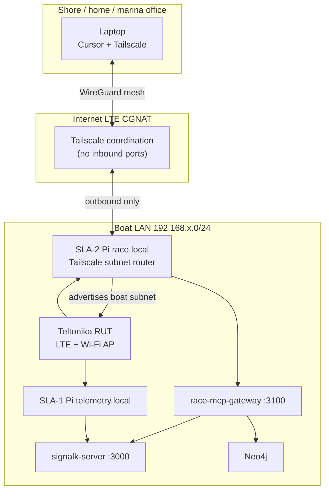

# VPN remote access — Teltonika, MCP, and boat LAN

Reach **MCP**, **Signal K**, **Grafana**, and **Neo4j** from ashore when your laptop is not on boat Wi‑Fi — without port-forwarding on LTE.

**ADR:** [0029 — Signal K MCP ecosystem + VPN](../adr/0029-signalk-mcp-ecosystem-vpn-remote-access.md)  
**Spec:** [§4.4 Teltonika](../spec.md#44-teltonika-rut-lte-router) · [§7.18 MCP](../spec.md#718-race-side-mcp--laptop-cursor)

---

## Problem

The Teltonika **RUT** router connects the boat to the internet over **LTE**, usually behind **CGNAT**. You cannot reliably open inbound ports for:

| Service | Port | Why you want it remotely |
|---------|------|--------------------------|
| `race-mcp-gateway` | 3100 | Cursor MCP (standings, Influx, Signal K) |
| `signalk-server` | 3000 | Live instruments, AIS snapshot |
| `grafana-race` | 3002 | Dashboards |
| Neo4j Browser | 7474 | Ad hoc graph (optional) |

`race-live-sync` already pushes **summaries to GitHub** every 5 minutes — that path stays for async shore visibility. VPN is for **interactive** agent and browser access.

---

## Recommended architecture



**Flow:** Laptop joins Tailscale → routes to boat LAN via subnet router on SLA-2 → `http://race.local:3100/mcp/signalk` with bearer token.

---

## VPN provider comparison

| Provider | Protocol | Teltonika integration | CGNAT | Typical cost | Best for |
|----------|----------|----------------------|-------|--------------|----------|
| **[Tailscale](https://tailscale.com/)** ⭐ | WireGuard | Install on Pi; optional on RutOS | ✅ | **Free** Personal (100 devices); Teams ~$6/user/mo | **Default recommendation** — Pi subnet router, MagicDNS, ACLs |
| **[Teltonika RMS VPN](https://wiki.teltonika-networks.com/view/RMS_VPN_Hubs)** | OpenVPN | Native RMS hubs; push config to RUT | ✅ | RMS subscription (~€2–5/device/mo with fleet RMS) | Fleets already on **RMS** for router management |
| **RutOS WireGuard** | WireGuard | Built into RutOS 7+ | ✅ with hub/VPS | Free software; VPS ~€4/mo if you need a hub | DIY; static endpoint on a VPS |
| **[ZeroTier](https://www.zerotier.com/)** | Custom mesh | Software on Pi | ✅ | Free 25 devices; paid plans above | Alternative mesh if Tailscale policy blocks |
| **[Headscale](https://github.com/juanfont/headscale)** | WireGuard (Tailscale-compatible) | Self-hosted control plane | ✅ | Free (you host) | Org wants **on-prem** control |

### Recommendation

1. **Start with Tailscale** on the **SLA-2** Pi (`race.local`) as a **subnet router** advertising the Teltonika LAN (e.g. `192.168.8.0/24`).
2. Install Tailscale on the **navigator laptop** and any shore coach machines.
3. If the club already pays for **Teltonika RMS** and mandates a single console, use **RMS VPN Hubs** instead — same logical topology, different client.

**Do not** expose MCP or Signal K on the router’s **WAN** / port-forward rules.

---

## Tailscale setup (SLA-2 subnet router)

### 1. Install on Raspberry Pi OS (SLA-2)

```bash
curl -fsSL https://tailscale.com/install.sh | sh
sudo tailscale up --advertise-routes=192.168.8.0/24 --accept-routes
```

Replace `192.168.8.0/24` with your Teltonika LAN subnet (check RUT **LAN** settings).

### 2. Approve routes in Tailscale admin

[Admin console](https://login.tailscale.com/admin/machines) → select the Pi → **Subnet routes** → enable `192.168.8.0/24`.

### 3. Enable DNS (optional)

Use **MagicDNS** so `race.local` / `telemetry.local` resolve if your Teltonika pushes those names via DHCP — or add Tailscale **split DNS** for the boat domain.

### 4. Laptop

Install Tailscale, sign in to the same tailnet. Verify:

```bash
ping race.local
curl -s -o /dev/null -w "%{http_code}" http://race.local:3100/health
```

### 5. Cursor MCP over VPN

Same [`.cursor/mcp.json.example`](../.cursor/mcp.json.example) URLs — `http://race.local:3100/mcp/signalk` etc. **Bearer token still required.**

---

## Teltonika RMS VPN (alternative)

When RMS is already used for fleet monitoring:

1. Create an **RMS VPN Hub** in the RMS portal.
2. Add the **RUT** and shore **PC/laptop** as VPN clients.
3. Configure **LAN forwarding** so VPN clients reach `192.168.x.0/24`.
4. Connect laptop OpenVPN client → access `race.local:3100` as on boat Wi‑Fi.

**Pros:** Single vendor console with router stats, SMS, firmware.  
**Cons:** Extra cost vs Tailscale free tier; OpenVPN client setup per device.

See [RMS VPN Hubs documentation](https://wiki.teltonika-networks.com/view/RMS_VPN_Hubs).

---

## RMS-first quickstart (for existing hubs)

Use this path when you already have an RMS VPN Hub created and want the fastest route to remote MCP access.

### 1. Refresh stale hub/client configs

If RMS shows **inactive for longer than 90 days**, re-download and re-apply VPN client configs before testing sessions.

1. Open the hub in RMS (`RMS VPN` -> `VPN hubs` -> your hub).
2. Use **Download VPN Client** to export a fresh OpenVPN profile.
3. Re-import the profile on your laptop OpenVPN client.
4. Re-download/re-apply any router-side client config if RMS indicates stale configuration.

Store boat-side VPN material in `/opt/ai-sailing-system/secrets/rms_client.ovpn` (mode `600`), not in git.

### 2. Confirm hub routing

1. In hub routes, ensure the boat LAN subnet is advertised (example `192.168.8.0/24`).
2. Ensure your RUT has LAN forwarding/firewall rules allowing VPN client access to boat LAN hosts.
3. Verify DNS strategy:
   - Preferred: `race.local` and `telemetry.local` resolve over VPN.
   - Fallback: add temporary `/etc/hosts` or hosts file entries.
4. Validate local secret files:

```bash
python deploy/secrets/check_secrets.py --secrets-dir /opt/ai-sailing-system/secrets --require-rms
```

### 3. Validate from shore laptop

```bash
ping race.local
curl -s -o /dev/null -w "%{http_code}" http://race.local:3100/health
curl -s -o /dev/null -w "%{http_code}" http://race.local:3100/mcp/signalk
```

Expected:

- `health` returns `200`
- MCP endpoints return `401` without bearer token and valid responses with `Authorization: Bearer ...`

### 4. Cursor MCP over RMS VPN

Keep the same MCP URLs as boat Wi-Fi:

- `http://race.local:3100/mcp`
- `http://race.local:3100/mcp/neo4j`
- `http://race.local:3100/mcp/influx`
- `http://race.local:3100/mcp/signalk`

No WAN port-forward is required.

---

## RutOS WireGuard (DIY)

For RutOS 7+ without Tailscale on the Pi:

1. Configure **WireGuard** on the RUT as client or site-to-site peer.
2. Use a **VPS** or home router with a static IP as the WireGuard hub.
3. Shore laptop connects as another WireGuard peer.

Higher ops burden; use when neither Tailscale nor RMS is acceptable.

---

## Security checklist

| Control | Detail |
|---------|--------|
| **No WAN port-forward** | Never forward 3100, 3000, 7474 on LTE |
| **MCP bearer token** | `RACE_MCP_API_KEY` — rotate per regatta |
| **Tailscale ACLs** | Restrict subnet routes to coach devices only |
| **Read-only MCP** | No autopilot or Signal K write tools |
| **Split horizons** | VPN for interactive access; `race-live-sync` for GitHub timeline |

---

## What runs where (quick reference)

| Host | VPN role | Services reached via VPN |
|------|----------|----------------------------|
| **Teltonika RUT** | LTE gateway, boat Wi‑Fi AP | Optional RMS VPN endpoint |
| **SLA-2 Pi** | **Tailscale subnet router** (recommended) | `race-mcp-gateway`, Neo4j, `live-results`, … |
| **SLA-1 Pi** | Optional Tailscale node | Signal K, Influx, telemetry Grafana |
| **Shore laptop** | Tailscale / RMS / WireGuard client | All boat LAN hostnames |

Full map: [ARCHITECTURE.md § Deployment topology](./ARCHITECTURE.md#deployment-topology--what-runs-where).

---

## Troubleshooting

| Symptom | Check |
|---------|--------|
| `race.local` does not resolve | Tailscale split DNS; or use Pi Tailscale IP + `/etc/hosts` on laptop |
| MCP 401 over VPN | Same `RACE_MCP_API_KEY` as onboard |
| Subnet route not working | Approve route in Tailscale admin; `sysctl net.ipv4.ip_forward=1` on Pi |
| Slow over LTE | Narrow MCP Flux windows; prefer `race-live-sync` GitHub branch for summaries |
| RMS VPN connects but no LAN | Hub LAN access / firewall rules on RUT |

---

## Related docs

- [race-laptop-mcp.md](./race-laptop-mcp.md) — Cursor MCP on boat LAN and VPN
- [mcp-neo4j-influx.md](./mcp-neo4j-influx.md) — Neo4j/Influx tool reference
- [deploy/README.md](../deploy/README.md) — env files and harbor vs race mode
