# AI Sailing System — Specification

**Version:** 0.28.0-draft
**Date:** 2026-07-08  
**Changelog (0.28):** Race decision intelligence playbook — canonical tactical questions, decision answer contract, and FR coverage for race-winning guidance ([ADR-0031](./adr/0031-race-decision-intelligence-playbook.md), §7.28, §11.21).  
**Changelog (0.27):** Enriched live snapshot — fleet performance rollup every 5 min for tactical fleet questions ([ADR-0028](./adr/0028-enriched-live-snapshot-fleet-performance-temporal.md), §7.27, §11.20).  
**Changelog (0.26):** Data-repo runtime policy — single `harbor.env` on Pi, no per-regatta `race.env` switch ([ADR-0027](./adr/0027-data-repo-runtime-policy-zero-pi-config.md), §7.26, §11.19).  
**Changelog (0.25):** Race lifecycle automation — schedule-driven harbor import and race mode from active context ([ADR-0026](./adr/0026-race-lifecycle-scheduled-harbor-automation.md), §7.25, §11.18).  
**Changelog (0.24):** Race live sync — 5-minute Neo4j → GitHub push on LTE ([ADR-0025](./adr/0025-race-live-sync-github-temporal.md), §7.24, §11.17). Amends ADR-0024 finalize workflow.  
**Changelog (0.23):** Post-race export — Neo4j insights → AI-sailing-data YAML-LD ([ADR-0024](./adr/0024-post-race-neo4j-export-to-data-repo.md), §7.24, §11.16).  
**Changelog (0.22):** SHACL constraint validation + Neo4j projection map in CI; no Fuseki on Pi ([ADR-0023](./adr/0023-shacl-neo4j-projection-no-fuseki.md), §7.15.10, §11.15).  
**Changelog (0.21):** SLA-1 Signal K plugin strategy — `@signalk/course-provider`, `course-sk-sync`, `signalk-polar-performance`, `polar-manager` stub ([ADR-0021](./adr/0021-sla1-signalk-plugin-strategy.md)).  
**Changelog (0.20):** course-editor as coordinate system of record; GPX/Neo4j/runtime derived from editor saves ([ADR-0020](./adr/0020-course-editor-coordinate-system-of-record.md)).  
**Changelog (0.19):** Three-Pi race deploy; helm UX (`race-ui` + Grafana scope); dual speaker / H5000-only safety ([ADR-0018](./adr/0018-helm-ux-three-pi-dual-speaker.md)); PredictWind multi-model GRIB + onboard scoring ([ADR-0019](./adr/0019-predictwind-multi-model-grib.md)).  
**Changelog (0.18):** Gherkin acceptance tests per implementation phase (`tests/bdd/features/`).  
**Changelog (0.17):** Implementation map — spec §1.1, §7.0, §14 phases; ADR index reordered by build sequence.  
**Changelog (0.16):** Marine map GPX export bundle for chartplotter import (ADR-0017, §7.23).  
**Changelog (0.15):** Fleet polar performance timeline for all boats in InfluxDB (ADR-0016, §7.22).  
**Changelog (0.14):** Tactical insight alerts with UX feed and optional voice annunciation (ADR-0015, §7.21).  
**Changelog (0.13):** Automated ORC certificate fleet collection (ADR-0013, §7.19); dedicated Neo4j/Influx MCP endpoints; shore weather/current collection (ADR-0014, §7.20).  
**Changelog (0.12):** Race-side MCP gateway for laptop Cursor ad hoc analysis (ADR-0012, §7.18).  
**Author:** cognite-fholm  
**Status:** Draft — architecture & requirements

---

## 1. Executive summary

The **AI Sailing System** is an onboard edge platform for **competitive sailing**. It ingests marine sensor data over NMEA 0183 and NMEA 2000, normalizes it through **Signal K**, stores high-frequency telemetry in **InfluxDB**, models boats, races, courses, and tactics in **Neo4j**, visualizes performance in **Grafana**, and provides **local AI coaching** using **LLaMA** models.

The platform is organized into **three SLA tiers**, each on a **dedicated Raspberry Pi** in the **race profile** ([ADR-0018](./adr/0018-helm-ux-three-pi-dual-speaker.md)). Race and boat **content** lives in the companion **[AI-sailing-data](https://github.com/cognite-fholm/AI-sailing-data)** repository; **code and containers** live here.

**Helm UX:** **H5000** for instruments and **safety audio**; **`race-ui`** (Node.js/TypeScript on boat LAN) for interactive race optimization; **Grafana** for time-series, maps, and debrief only ([§7.4.1](#741-race-helm-ui-grafana--signalk-plugins)).

**Reference UX / instruments:** [iRegatta](https://zifigo.com/) (optional phone app — [§7.16](#716-iregatta-reference-model--feature-traceability)) and [B&G H5000](https://www.bandg.com/bg/series/h5000/) (primary instruments — [§7.17](#717-bg-h5000-reference-model--integration)) define parity targets for calculations surfaced in `race-ui` and Grafana.

**Race laptop:** [§7.18](#718-race-side-mcp--laptop-cursor) — bring a laptop on boat Wi‑Fi; **Cursor** connects via **MCP** to `race-mcp-gateway` for live standings, telemetry, and ad hoc analysis.

**ORC certificates:** [§7.19](#719-orc-certificate-collection--fleet-enrichment) — automate fleet cert metadata and PDF download on shore via **orc-sailor-services** skill in AI-sailing-data ([ADR-0013](./adr/0013-orc-certificate-fleet-collection.md)).

**Weather & current:** [§7.20](#720-shore-weather--current-collection) — **PredictWind** multi-model GRIB (best resolution), MET Norway current/waves, SMHI validation in **AI-sailing-data**; onboard **model scoring** selects best forecast per race leg ([ADR-0019](./adr/0019-predictwind-multi-model-grib.md), [ADR-0014](./adr/0014-shore-weather-current-collection.md)).

**Tactical alerts:** [§7.21](#721-tactical-insight-alerts--annunciation) — race optimization alerts on `race-ui` / Grafana feed; optional voice on **dedicated tactical speaker** (H5000 remains **safety-only**) ([ADR-0015](./adr/0015-tactical-insight-alerts-annunciation.md), [ADR-0018](./adr/0018-helm-ux-three-pi-dual-speaker.md)).

**Fleet polar performance:** [§7.22](#722-fleet-polar-performance-timeline) — time- and location-indexed polar % for every boat, stored in **InfluxDB** ([ADR-0016](./adr/0016-fleet-polar-performance-influx.md)).

**Marine map export:** [§7.23](#723-marine-map-gpx-export) — PredictWind-compatible GPX route zip per race for Navionics/chartplotter import ([ADR-0017](./adr/0017-marine-map-gpx-export.md)).

**Implementing?** Read [§1.1 Implementation map](#11-implementation-map) and [§14 Implementation phases](#14-implementation-phases) first — §7 sections are grouped by *domain*, not build order.

| Tier | Domain | SLA priority |
|------|--------|----------------|
| **SLA-1** | On-boat telemetry | Critical — must never fail during a race |
| **SLA-2** | Race & competitor information | Important — tactical context; GRIB, polars, AIS, wind-on-course |
| **SLA-3** | Sail performance (vision / LLM) | Analytical — best-effort; heaviest compute |

### 1.1 Implementation map

Normative detail stays in §7–§11 and ADRs. This table is the **recommended build sequence**. Shore prep (Phase 2A) can run in parallel with Phase 1 on a laptop.

| Phase | What to build | ADRs | Spec §7 | FR §11 | Key services / artifacts |
|-------|---------------|------|---------|--------|--------------------------|
| **0** | Spec, repos, deploy scaffold | [0001](./adr/0001-system-architecture-and-technology-choices.md), [0002](./adr/0002-three-tier-sla-architecture.md), [0008](./adr/0008-github-docker-deployment-lifecycle.md), [0009](./adr/0009-dual-repository-race-data.md) | [§5](./spec.md#5-three-tier-sla-architecture), [§5.7](./spec.md#57-dual-repository-architecture), [§7.15](./spec.md#715-race--boat-data-repository-ai-sailing-data), [§9](./spec.md#9-deployment-architecture) | [11.6](./spec.md#116-operations) | Compose stubs, `race-data-sync` scaffold |
| **1** | SLA-1 telemetry | [0001](./adr/0001-system-architecture-and-technology-choices.md), [0011](./adr/0011-bg-h5000-reference-model.md) (ingest), [0021](./adr/0021-sla1-signalk-plugin-strategy.md) | [§7.1](./spec.md#71-signal-k-server-hub--sla-1-only), [§7.2](./spec.md#72-time-series--influxdb--sla-1-only), [§7.4](./spec.md#74-visualization--grafana) | [11.1](./spec.md#111-sla-1--telemetry) | `signalk-server` (+ `course-provider`), `course-sk-sync`, `signalk-polar-performance`, `signalk-influx-bridge`, `grafana-telemetry` |
| **2A** | Shore race prep (data repo) | [0009](./adr/0009-dual-repository-race-data.md), [0013](./adr/0013-orc-certificate-fleet-collection.md), [0014](./adr/0014-shore-weather-current-collection.md), [0017](./adr/0017-marine-map-gpx-export.md), [0022](./adr/0022-yaml-ld-interconnected-data.md), [0023](./adr/0023-shacl-neo4j-projection-no-fuseki.md) | [§7.15](./spec.md#715-race--boat-data-repository-ai-sailing-data), [§7.15.8](./spec.md#7158-yaml-ld-linked-data-format), [§7.15.10](./spec.md#71510-ontology-constraints-and-neo4j-projection), [§7.19](./spec.md#719-orc-certificate-collection--fleet-enrichment), [§7.20](./spec.md#720-shore-weather--current-collection), [§7.23](./spec.md#723-marine-map-gpx-export) | [11.9](./spec.md#119-orc-certificate-collection-shore), [11.10](./spec.md#1110-shore-weather--current-collection), [11.13](./spec.md#1113-marine-map-gpx-export), [11.14](./spec.md#1114-yaml-ld-linked-data-ai-sailing-data), [11.15](./spec.md#1115-shacl-constraints-and-neo4j-projection) | [AI-sailing-data](https://github.com/cognite-fholm/AI-sailing-data) skills, YAML-LD, `schema/yaml-ld/`, `schema/shacl/`, `export/marine-map/` |
| **2B** | Graph import & sync | [0009](./adr/0009-dual-repository-race-data.md), [0022](./adr/0022-yaml-ld-interconnected-data.md), [0023](./adr/0023-shacl-neo4j-projection-no-fuseki.md) | [§7.3](./spec.md#73-knowledge-graph--neo4j--sla-2-only), [§7.15](./spec.md#715-race--boat-data-repository-ai-sailing-data), [§7.15.8](./spec.md#7158-yaml-ld-linked-data-format), [§7.15.10](./spec.md#71510-ontology-constraints-and-neo4j-projection) | [11.2](./spec.md#112-sla-2--race-competitors-grib-polars--wind) (import), [11.14](./spec.md#1114-yaml-ld-linked-data-ai-sailing-data), [11.15](./spec.md#1115-shacl-constraints-and-neo4j-projection) | `neo4j`, `race-data-sync`, `race-import`, `race-live-sync` |
| **2C** | GRIB, polars, AIS, wind | [0004](./adr/0004-grib-polars-ais-wind-analysis.md), [0019](./adr/0019-predictwind-multi-model-grib.md) | [§7.12](./spec.md#712-grib-polars-ais--wind-on-course-analysis) | [11.2](./spec.md#112-sla-2--race-competitors-grib-polars--wind) FR-15–26, [11.10](./spec.md#1110-shore-weather--current-collection) | `grib-ingest`, `grib-parser`, `grib-model-scorer`, `polar-manager` (full SLK), `polar-certificate-extractor`, `ais-collector`, `wind-field-analyzer` |
| **2D** | Courses, handicaps, results | [0005](./adr/0005-course-parsing-handicaps-live-results.md), [0006](./adr/0006-start-boat-course-flags.md) | [§7.13](./spec.md#713-race-courses-waypoints--live-results), [§7.14](./spec.md#714-handicap-numbers--scoring) | [11.2](./spec.md#112-sla-2--race-competitors-grib-polars--wind) FR-27–41 | `course-parser`, `course-editor`, `course-flag-detector`, `handicap-manager`, `live-results` |
| **2E** | Race UX (iRegatta + H5000 parity) | [0010](./adr/0010-iregatta-reference-model.md), [0011](./adr/0011-bg-h5000-reference-model.md), [0018](./adr/0018-helm-ux-three-pi-dual-speaker.md) | [§7.4.1](./spec.md#741-race-helm-ui-grafana--signalk-plugins), [§7.6](./spec.md#76-race-intelligence-service--sla-2-only), [§7.16](./spec.md#716-iregatta-reference-model--feature-traceability), [§7.17](./spec.md#717-bg-h5000-reference-model--integration) | [11.2](./spec.md#112-sla-2--race-competitors-grib-polars--wind) FR-42–59, [11.7](./spec.md#117-bg-h5000-integration--display-parity) | `race-ui`, `race-intelligence`, `grafana-race` |
| **2F** | Fleet analytics & alerts | [0016](./adr/0016-fleet-polar-performance-influx.md), [0015](./adr/0015-tactical-insight-alerts-annunciation.md) | [§7.22](./spec.md#722-fleet-polar-performance-timeline), [§7.21](./spec.md#721-tactical-insight-alerts--annunciation), [§7.5](./spec.md#75-ai--llama--coral) (coach) | [11.11](./spec.md#1111-tactical-insight-alerts--annunciation), [11.12](./spec.md#1112-fleet-polar-performance-timeline-influxdb), [11.5](./spec.md#115-ai-coaching-cross-tier) | `fleet-performance-tracker`, `insight-alerts`, `tactical-coach` |
| **2G** | Race laptop MCP | [0012](./adr/0012-race-side-mcp-laptop-cursor.md) | [§7.18](./spec.md#718-race-side-mcp--laptop-cursor) | [11.8](./spec.md#118-race-side-mcp-laptop-cursor) | `race-mcp-gateway` |
| **2H** | Race live sync & archive | [0024](./adr/0024-post-race-neo4j-export-to-data-repo.md), [0025](./adr/0025-race-live-sync-github-temporal.md), [0009](./adr/0009-dual-repository-race-data.md) | [§7.24](./spec.md#724-race-live-sync-and-archive), [§7.15](./spec.md#715-race--boat-data-repository-ai-sailing-data) | [11.16](./spec.md#1116-post-race-analysis-export), [11.17](./spec.md#1117-race-live-sync), [11.14](./spec.md#1114-yaml-ld-linked-data-ai-sailing-data) | `race-live-sync`, `race-live/*.yaml`, `post-race/*.yaml` |
| **3** | SLA-3 sail vision | [0003](./adr/0003-gopro-capture-and-shore-training.md) | [§7.9](./spec.md#79-gopro-hero13-black-fleet)–[§7.11](./spec.md#711-onshore-transformer-training-pipeline), [§7.7](./spec.md#77-sail-vision-service-sla-3) | [11.3](./spec.md#113-sla-3--sail-performance-vision-gopro-hero13), [11.4](./spec.md#114-onshore-training-sla-s) | `gopro-orchestrator`, `sail-geometry`, `sail-analysis-api`, Coral |
| **4** | CI/CD & multi-Pi ops | [0008](./adr/0008-github-docker-deployment-lifecycle.md) | [§9](./spec.md#9-deployment-architecture) | [11.6](./spec.md#116-operations) | GitHub Actions → GHCR, Watchtower, harbor scripts |
| **5** | Shore TrimTransformer (SLA-S) | [0003](./adr/0003-gopro-capture-and-shore-training.md) | [§7.11](./spec.md#711-onshore-transformer-training-pipeline), [§9.6](./spec.md#96-shore-training--gaming-pc-sla-s) | [11.4](./spec.md#114-onshore-training-sla-s) | Gaming PC, `trim-transformer-trainer`, GHCR `trim-predictor` |

**Hardware:** Regatta deployment uses the **three-Pi race profile** ([ADR-0018](./adr/0018-helm-ux-three-pi-dual-speaker.md)).

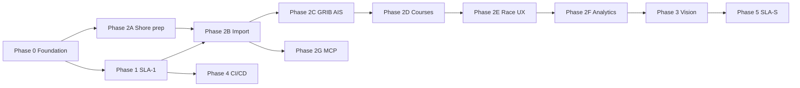

ADR index by build order: [adr/README.md](./adr/README.md#implementation-order). §7 reading order: [§7.0](#70-implementation-order--section-index).

The system is designed to:

- Run **fully offline** during a race (no internet required).
- Operate on one or more **Raspberry Pi** nodes with a **PiCAN-M HAT** on the telemetry node (NMEA buses + 3 A SMPS).
- Use a **Google Coral** accelerator on the vision node for sail-image preprocessing.
- **Isolate tiers** so image analysis and race-graph workloads cannot starve live instrument data.
- Support **remote upgrades** via **GitHub Actions → GHCR → Docker Compose** on Raspberry Pi when connectivity is available.
- Build directly on lessons learned from the existing **CogSail** repositories.

---

## 2. Problem statement

Competitive sailors need more than raw instrument readouts. They need:

1. **Unified data** — wind, speed, heading, depth, engine, autopilot, polar data, and custom sensors in one model.
2. **Race context** — marks, legs, start line, fleet position, course geometry, **GRIB wind fields**, and **polar targets** linked to live telemetry.
3. **Performance insight** — VMG, target angles, polar comparison (own boat + competitors), tack/gybe quality, and leg summaries.
4. **Tactical memory** — what worked on this course, in these conditions, against this fleet — including **runtime wind-advantage zones** derived from GRIB + AIS fleet behavior.
5. **Trustworthy edge operation** — must work at sea with intermittent or zero connectivity.

The prior CogSail stack proved that Signal K → stream buffer → structured storage works, but relied on **Cognite Data Fusion (CDF)** in the cloud. This system keeps the proven ingestion patterns and replaces CDF with **InfluxDB + Neo4j + Grafana**, adding **local LLaMA** for AI assistance.

---

## 3. Goals and non-goals

### 3.1 Goals

| ID | Goal |
|----|------|
| G1 | Win-focused analytics: start timing, laylines, wind shifts, fleet leverage, leg debrief |
| G2 | Signal K as the canonical onboard marine data model |
| G3 | Sub-second local dashboards via Grafana |
| G4 | Graph queries for race/tactic/boat relationships via Neo4j |
| G5 | Local LLM inference without cloud dependency during races |
| G6 | Containerized services with remote upgrade path |
| G7 | NMEA 0183 + NMEA 2000 via PiCAN-M HAT |
| G8 | Reuse and migrate concepts from cognite-fholm CogSail repos |
| G9 | Three isolated SLA tiers in separate containers; tiers may run on separate RPi nodes |
| G10 | SLA-1 telemetry survives failure or overload of SLA-2 / SLA-3 |
| G11 | GRIB files refreshed on a regular schedule when online; usable offline after sync |
| G12 | Polar diagrams for own boat and competitors drive VMG/target analysis |
| G13 | AIS tracks for own boat and fleet enable runtime wind-on-course analysis |
| G14 | Parse race courses from competition program PDFs (e.g. SI chapter 11) |
| G15 | Live corrected-time standings from waypoints, handicaps, and AIS progress |
| G16 | Multiple handicap numbers per boat (ORC certificate + per-race WRS TCF) |
| G17 | Multiple course variants per regatta; active course from start-boat flags |
| G18 | UX shows class flag + course signals; user confirms or overrides vision detection |
| G19 | Advisory agents consume a versioned **Google OKF** knowledge bundle for system context |
| G20 | **GitHub + Docker** end-to-end: Actions CI, GHCR images, Compose on Pi — no cloud orchestration |
| G21 | Shore **TrimTransformer** training on **own gaming PC** (SLA-S), not paid cloud GPU |
| G22 | **AI-sailing-data** repo for temporal race/boat planning onshore |
| G23 | Onboard **race-data-sync** pulls newer data from GitHub via Teltonika LTE when available |
| G24 | **iRegatta-equivalent** race UX for start, laylines, polars, and navigation — see [§7.16](#716-iregatta-reference-model--feature-traceability) and [ADR-0010](./adr/0010-iregatta-reference-model.md) |
| G25 | **B&G H5000-equivalent** instrument semantics, SailSteer/StartLine pages, calibration YAML — see [§7.17](#717-bg-h5000-reference-model--integration) and [ADR-0011](./adr/0011-bg-h5000-reference-model.md) |
| G26 | **Race-side MCP** — laptop on boat LAN runs **Cursor** with live Neo4j, Influx, standings, and YAML context for ad hoc analysis — [§7.18](#718-race-side-mcp--laptop-cursor), [ADR-0012](./adr/0012-race-side-mcp-laptop-cursor.md) |
| G27 | **Automated ORC certificate collection** for race-class fleets — metadata via `activecerts`, PDFs via authenticated download, `boats/` stubs — [§7.19](#719-orc-certificate-collection--fleet-enrichment), [ADR-0013](./adr/0013-orc-certificate-fleet-collection.md) |
| G28 | **Shore weather/current collection** for Oslofjord races — MET GRIB, current plot interpretation, SMHI validation — [§7.20](#720-shore-weather--current-collection), [ADR-0014](./adr/0014-shore-weather-current-collection.md) |
| G29 | **Tactical insight alerts** — raise and display performance alerts (trim, course, fleet rank); optional voice annunciation — [§7.21](#721-tactical-insight-alerts--annunciation), [ADR-0015](./adr/0015-tactical-insight-alerts-annunciation.md) |
| G30 | **Fleet polar performance timeline** — all boats vs certificate polar and active race handicap, stored in InfluxDB for Grafana/MCP — [§7.22](#722-fleet-polar-performance-timeline), [ADR-0016](./adr/0016-fleet-polar-performance-influx.md) |
| G31 | **Marine map GPX export** — chartplotter-ready route zip from race course YAML — [§7.23](#723-marine-map-gpx-export), [ADR-0017](./adr/0017-marine-map-gpx-export.md) |
| G32 | **YAML-LD linked data** — interconnected fact YAML in AI-sailing-data follows [W3C YAML-LD 1.0](https://w3c.github.io/yaml-ld/) for verifiable cross-document references — [§7.15.8](#7158-yaml-ld-linked-data-format), [ADR-0022](./adr/0022-yaml-ld-interconnected-data.md) |
| G33 | **SHACL ontology constraints** — shore CI validates YAML-LD facts against SHACL shapes; Neo4j is runtime projection only — [§7.15.10](#71510-ontology-constraints-and-neo4j-projection), [ADR-0023](./adr/0023-shacl-neo4j-projection-no-fuseki.md) |
| G34 | **Post-race learning loop** — archive Neo4j race insights to YAML-LD in AI-sailing-data for future prep — [§7.24](#724-race-live-sync-and-archive), [ADR-0024](./adr/0024-post-race-neo4j-export-to-data-repo.md) |
| G35 | **Race live sync** — every 5 min on LTE, push `race-live/current.yaml` to GitHub for cloud AI and git playback — [§7.24](#724-race-live-sync-and-archive), [ADR-0025](./adr/0025-race-live-sync-github-temporal.md) |
| G36 | **Scheduled harbor automation** — `race-lifecycle` drives pull/import/race-mode/finalize from `race.yaml` schedule + `index.yaml` active — [§7.25](#725-race-lifecycle-automation), [ADR-0026](./adr/0026-race-lifecycle-scheduled-harbor-automation.md) |
| G37 | **Zero per-race Pi config** — runtime policy from AI-sailing-data; one `harbor.env` + long-lived GitHub secret on boat — [§7.26](#726-data-repo-runtime-policy), [ADR-0027](./adr/0027-data-repo-runtime-policy-zero-pi-config.md) |
| G38 | **Enriched live snapshot** — 5 min git tick answers corrected-time, polar outliers, VMG leaders, wind advantage — [§7.27](#727-enriched-live-snapshot), [ADR-0028](./adr/0028-enriched-live-snapshot-fleet-performance-temporal.md) |

### 3.2 Non-goals (v1)

- Autonomous vessel control or autopilot override.
- Class rule enforcement or protest filing automation.
- Replacing dedicated race tracking services (e.g. YB Tracking) — integration may come later.
- Replacing the **iRegatta** iOS app as a personal phone UI — optional on NMEA Wi‑Fi; primary boat-LAN UX is **`race-ui`** + Grafana; iRegatta may run in parallel.
- Training large models onboard — only **inference** of pre-quantized models.
- Full cloud SaaS replacement — optional sync/export may be added later.

---

## 4. Hardware platform

### 4.1 Reference bill of materials

Hardware is assigned **per SLA tier**. A single-boat deployment may use 1–3 Raspberry Pi nodes.

| Component | SLA tier | Role | Notes |
|-----------|----------|------|-------|
| **Raspberry Pi 5** (4 GB) | SLA-1 | Telemetry node | PiCAN-M HAT; runs Signal K + InfluxDB only |
| **Raspberry Pi 5** (8 GB) | SLA-2 | Race node | Neo4j, race intelligence, tactical LLM |
| **Raspberry Pi 5** (8 GB) | SLA-3 | Vision node | Cameras, Coral dongle, sail vision LLM |
| **PiCAN-M HAT + 3 A SMPS** | SLA-1 only | Marine I/O + power | NMEA 0183 + NMEA 2000; **must** live on telemetry node |
| **Google Coral accelerator** | SLA-3 | Sail image preprocessing | USB/PCIe on vision node; see [§7.5](#75-ai--llama--coral) |
| **GoPro HERO13 Black** (×3–5) | SLA-3 | Sail & boom imaging | Wireless capture via [Open GoPro](https://gopro.github.io/OpenGoPro/); see [§7.9](#79-gopro-hero13-black-fleet) |
| **USB Bluetooth 5.0 dongles** (×2, optional) | SLA-3 | Multi-GoPro BLE | One BLE central per camera; or Wi-Fi station mode on boat LAN |
| **32 GB+ industrial microSD** or **NVMe (Pi 5)** | All nodes | OS + data | Per-node persistent storage |
| **Boat LAN (Ethernet/Wi-Fi)** | All | Inter-node link | Gigabit preferred when tiers are split across Pis |
| **12 V marine supply** | All | Power | N2K SMPS on telemetry node; DC-DC for additional nodes |
| **Wi-Fi / LTE (optional)** | SLA-2 | Remote deploy & sync | Not required for race operation |
| **Teltonika LTE router** | WAN | 4G/5G + boat LAN | See [§4.4](#44-network--teltonika-lte-router) |

**Deployment profiles:**

| Profile | Nodes | When to use |
|---------|-------|-------------|
| **Compact** | 1× Pi 5 (8 GB) | Lab/testing only |
| **Standard** | 2× Pi — SLA-1 + SLA-2/3 combined | Dev; not regatta |
| **Race** | 3× Pi — one per tier | **Chosen deployment** for regattas ([ADR-0018](./adr/0018-helm-ux-three-pi-dual-speaker.md)) |

### 4.2 PiCAN-M integration

```
NMEA 2000 backbone ──► Micro-C (J1) ──► can0 (SocketCAN, 250 kbit/s)
NMEA 0183 talker/listener ──► RS-422 screw terminal (J3) ──► /dev/ttyS0
I²C sensors (wind, env) ──► Qwiic (J4)
12 V N2K power ──► onboard SMPS ──► 5 V for Pi + HAT
```

**Signal K configuration (reference):**

- NMEA 2000: `canboatjs` or Signal K N2K plugin reading `can0` — includes **AIS PGNs** (129038, 129039, 129809, 129810) forwarded to SLA-2.
- NMEA 0183: serial port plugin on `/dev/ttyS0` (4800/38400/115200 as appropriate).
- I²C sensors: optional plugin or custom Python reader publishing Signal K deltas.

**B&G H5000 coexistence:** On boats with H5000, N2K talkers on `can0` include wind, BSP, heel, GPS, and autopilot state. Signal K should **prefer H5000-corrected** true wind when present. See [§7.17](#717-bg-h5000-reference-model--integration) and [`h5000-variable-map.yaml`](https://github.com/cognite-fholm/AI-sailing-data/blob/main/schema/h5000-variable-map.yaml).

### 4.3 Coral accelerator note

The linked [google-coral/coralnpu](https://github.com/google-coral/coralnpu) repository describes Coral's **ML accelerator core** (successor/evolution of Edge TPU). For v1:

- **LLaMA inference** runs on the **ARM CPU** via **llama.cpp** (quantized GGUF models).
- **Coral** accelerates **complementary** workloads: wake/event detection, image classification (crew/camera), custom TFLite models — not full transformer LLM inference.

This split is intentional and matches hardware capabilities.

### 4.4 Network — Teltonika LTE router

**Device class:** Teltonika industrial LTE router (4G/5G) with **RMS** (Remote Management System).

| Capability | Use in AI Sailing System |
|------------|--------------------------|
| **LTE WAN** | Internet when away from marina Wi-Fi — GitHub data sync, GRIB fetch, GHCR pull (harbor rules) |
| **Boat LAN AP** | DHCP/DNS for `telemetry.local`, `race.local`, `vision.local` |
| **RMS cloud** | Remote router health, config backup, firmware, optional VPN to home |
| **Failover** | Marina Wi-Fi as WAN when available; LTE when offshore |

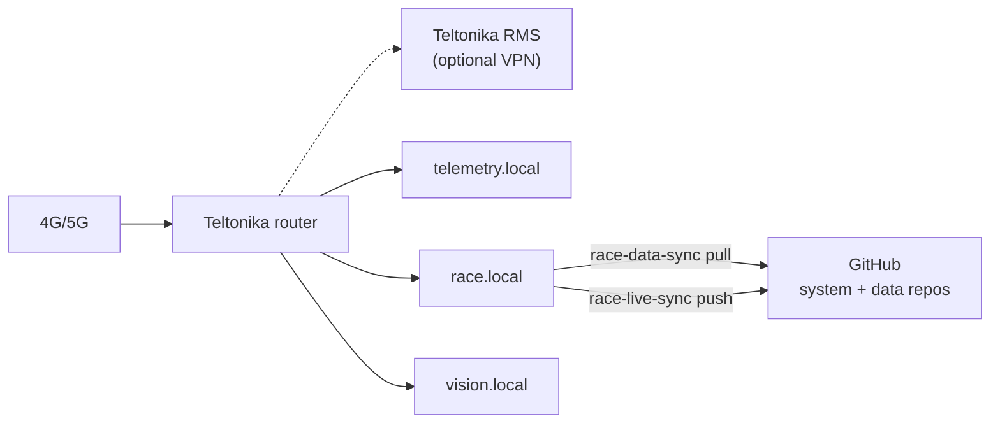

**Integration points:**

| Service | Uses LTE for |
|---------|--------------|
| `race-data-sync` | `git pull` on [AI-sailing-data](https://github.com/cognite-fholm/AI-sailing-data) when remote commit ahead (harbor; disabled during race) |
| `race-live-sync` | `git push` of `race-live/current.yaml` every 5 min on LTE to `race-live/{regatta_id}` ([ADR-0025](./adr/0025-race-live-sync-github-temporal.md)) |
| `grib-ingest` | Scheduled GRIB download when `ONLINE_MODE=true` |
| Watchtower | Container pull — **harbor mode only**, `RACE_MODE=false` |
| `training-export` | **Never** during race; harbor opt-in only |

**Guardrails:** Router credentials and RMS tokens are **not** stored in git. Document AP SSID/VLAN in harbor runbook only.

---

## 5. Three-tier SLA architecture

The system is partitioned into **three independent SLA tiers**. Each tier:

- Runs in its **own Docker Compose stack** (separate `docker-compose.sla-N.yml`).
- Has **dedicated containers** — no tier shares a process with another.
- Communicates over the **boat LAN** via defined APIs only (no shared databases across tiers except read replicas where noted).
- May run on the **same physical Raspberry Pi** (with resource limits) or on **dedicated Raspberry Pi hardware**.

**Golden rule:** SLA-1 must continue operating if SLA-2 or SLA-3 crash, restart, or saturate CPU/RAM.

### 5.1 Tier overview

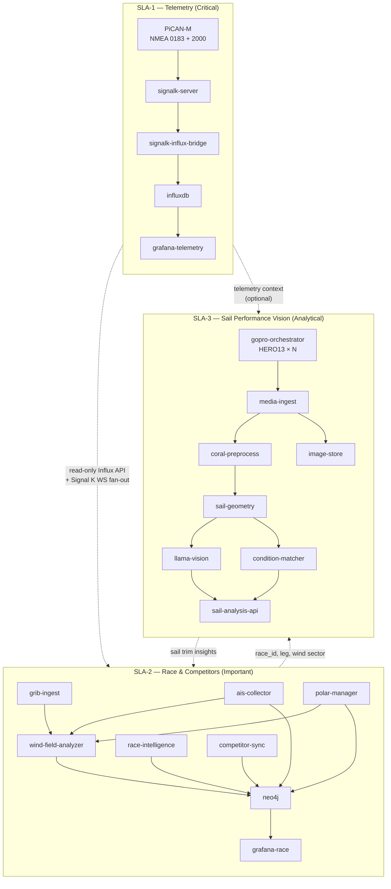

### 5.2 SLA definitions

#### SLA-1 — On-boat telemetry

**Purpose:** Ingest, normalize, persist, and display **live instrument data**. This is the safety-critical and race-critical path.

| Attribute | Target |
|-----------|--------|
| **Availability** | 99.99% during active race session |
| **Write latency** | Signal K delta → InfluxDB &lt; 500 ms (p95) |
| **Dashboard refresh** | &lt; 1 s for SOG, COG, AWA, AWS, depth, heel |
| **Recovery time** | &lt; 30 s after container restart |
| **Internet** | Not required |
| **PiCAN-M** | Required on this node |

**Containers (`docker-compose.sla-1.yml`):**

| Container | Image | Responsibility |
|-----------|-------|----------------|
| `signalk-server` | `ghcr.io/.../signalk` | NMEA ingest, Signal K hub; **host network** for CAN/serial |
| `signalk-influx-bridge` | `ghcr.io/.../influx-bridge` | Delta → Influx line protocol |
| `influxdb` | `influxdb:2` | Time series store (telemetry bucket only) |
| `grafana-telemetry` | `grafana/grafana` | Live instrument panels only |
| `redis` (optional) | `redis:alpine` | Write buffer if burst load |

**Does not include:** Neo4j, LLM, cameras, crawl jobs, or sail analysis.

**Hardware:** Raspberry Pi 5 (4 GB minimum) **with PiCAN-M HAT**. Dedicated node in race profile.

---

#### SLA-2 — Race and competitor information

**Purpose:** Model **races, courses, marks, fleet, and competitors**; ingest **GRIB** weather grids and **polar diagrams**; collect **AIS** for own boat and competitors; run **runtime wind-on-course analysis** to identify where favorable wind exists on the course.

| Attribute | Target |
|-----------|--------|
| **Availability** | 99.9% during race; graceful degradation acceptable |
| **Query latency** | Neo4j tactical query &lt; 3 s (p95) |
| **AIS refresh** | Own + competitor positions ≤ 10 s (from N2K AIS PGNs) |
| **GRIB refresh** | Scheduled every 6 h when online; manual pre-race upload |
| **Wind-field analysis** | Course wind map updated every 30–60 s during active race |
| **Recovery time** | &lt; 2 min; SLA-1 unaffected |
| **Internet** | Required for GRIB auto-fetch; optional for AIS (local N2K) |

**Containers (`docker-compose.sla-2.yml`):**

| Container | Image | Responsibility |
|-----------|-------|----------------|
| `neo4j` | `neo4j:5-community` | Race graph, vessels, marks, polars, wind zones |
| `race-intelligence` | `ghcr.io/.../race-intelligence` | Start line (DTL/TTL/burn-gain), lift, steering hints, leg timing |
| `ais-collector` | `ghcr.io/.../ais-collector` | Own-boat + competitor AIS from SLA-1 Signal K stream |
| `competitor-sync` | `ghcr.io/.../competitor-sync` | MMSI registry, fleet roster, polar linkage |
| `grib-ingest` | `ghcr.io/.../grib-ingest` | PredictWind + MET download, manual upload, GRIB validation |
| `grib-model-scorer` | `ghcr.io/.../grib-model-scorer` | Onboard wind-model accuracy scoring vs instruments |
| `grib-parser` | `ghcr.io/.../grib-parser` | Decode GRIB2 → grid store; spatial query API |
| `polar-manager` | `ghcr.io/.../polar-manager` | Load **SLK** polar for own boat; serve canonical YAML |
| `polar-certificate-extractor` | `ghcr.io/.../polar-certificate-extractor` | Derive competitor polars from ORC certificate **PNG/PDF** |
| `handicap-manager` | `ghcr.io/.../handicap-manager` | ORC certificate handicaps + per-race WRS TCF per vessel |
| `race-data-sync` | `ghcr.io/.../race-data-sync` | Git pull **AI-sailing-data** when GitHub ahead of local |
| `race-import` | `ghcr.io/.../race-import` | Apply data repo `neo4j/*.yaml` → Neo4j MERGE |
| `race-live-sync` | `ghcr.io/.../race-live-sync` | Neo4j → `race-live/*.yaml` → git push every 5 min on LTE; finalize → `post-race/` |
| `course-parser` | `ghcr.io/.../course-parser` | Extract courses/waypoints from SI/NOR PDFs |
| `live-results` | `ghcr.io/.../live-results` | Corrected-time standings + VMG along course legs |
| `fleet-performance-tracker` | `ghcr.io/.../fleet-performance-tracker` | Fleet polar % vs certificate; writes `fleet_polar_performance` to Influx |
| `course-editor` | `ghcr.io/.../course-editor` | React/TS UX — waypoints + **start-line flag selection** |
| `course-flag-detector` | `ghcr.io/.../course-flag-detector` | Optional vision: read start-boat flags from GoPro photo |
| `crawl-agent` | `ghcr.io/.../crawl-agent` | NOR/SI crawl ([crawl_web](https://github.com/cognite-fholm/crawl_web) lineage) |
| `llama-tactical` | `ghcr.io/.../llama-cpp` | Text LLM — debrief, tactical Q&A |
| `tactical-coach` | `ghcr.io/.../tactical-coach` | FastAPI RAG over Neo4j + Influx + wind zones |
| `insight-alerts` | `ghcr.io/.../insight-alerts` | Tactical alert broker — `race-ui` feed, ack, Piper TTS on **tactical speaker** |
| `race-ui` | `ghcr.io/.../race-ui` | Node.js/TS primary helm race optimization UI |
| `grafana-race` | `grafana/grafana` | Fleet map, polars, GRIB overlay, wind-advantage heatmap, **alert feed** |

**Reads from SLA-1:** InfluxDB (telemetry + AIS-derived paths), Signal K WebSocket (`navigation`, `environment.wind`, AIS deltas). **Never writes to SLA-1 storage.**

See [§7.12](#712-grib-polars-ais--wind-on-course-analysis), [§7.13](#713-race-courses-waypoints--live-results), and [§7.14](#714-handicap-numbers--scoring).

**Hardware:** Raspberry Pi 5 (8 GB). May share a Pi with SLA-3 in compact profile; **must not share with SLA-1** in race profile.

---

#### SLA-3 — Sail performance (GoPro vision / LLM)

**Purpose:** Orchestrate a fleet of **GoPro HERO13 Black** cameras to photograph sails and boom rigging, extract **geometry** (angles, camber, twist), compare against **best-known trim in similar conditions**, and publish coaching insights.

| Attribute | Target |
|-----------|--------|
| **Availability** | 95% — best-effort; may be paused during maneuvers |
| **Capture sync** | Multi-GoPro still burst within ±200 ms (PPS via `capture_trigger`) |
| **Analysis latency** | Geometry + condition match &lt; 60 s (p95) on Pi 5 |
| **Capture rate** | 0.2–1 Hz per camera (configurable); burst on leg stable |
| **Recovery time** | &lt; 5 min; no impact on SLA-1 |
| **Internet** | Not required at sea; harbor sync for training export |

**Containers (`docker-compose.sla-3.yml`):**

| Container | Image | Responsibility |
|-----------|-------|----------------|
| `gopro-orchestrator` | `ghcr.io/.../gopro-orchestrator` | Discover, arm, and trigger HERO13 fleet via Open GoPro BLE/Wi-Fi |
| `media-ingest` | `ghcr.io/.../media-ingest` | Download photos from GoPro HTTP API; timestamp alignment |
| `coral-preprocess` | `ghcr.io/.../coral-preprocess` | Sail ROI, luff line, boom line detection (TFLite on Coral) |
| `sail-geometry` | `ghcr.io/.../sail-geometry` | Compute angles & shape metrics from ROIs + camera extrinsics |
| `condition-matcher` | `ghcr.io/.../condition-matcher` | Find best historical trim in similar wind/heel/SOG |
| `llama-vision` | `ghcr.io/.../llama-cpp-vision` | Multimodal LLM — qualitative sail shape narrative |
| `sail-analysis-api` | `ghcr.io/.../sail-analysis` | FastAPI; merge geometry + match + LLM → SLA-2 |
| `image-store` | `ghcr.io/.../image-store` | Ring buffer of frames, geometry JSON, capture metadata |
| `training-export` | `ghcr.io/.../training-export` | Harbor-only bundles for onshore ML (opt-in) |
| `grafana-sail` | `grafana/grafana` | Trim timeline, geometry gauges, best-vs-actual overlays |

**GoPro fleet (reference: 4 cameras):**

| Camera ID | Mount | Primary metrics |
|-----------|-------|-----------------|
| `gopro-mast` | Mast, above spreaders | Mainsail camber, draft %, leech twist, mast bend hint |
| `gopro-boom` | Boom gooseneck / mid-boom | **Boom angle** vs centerline, vang/kicker geometry, foot tension |
| `gopro-bow` | Bow pulpit | Genoa/jib luff, entry angle, sheet lead hint |
| `gopro-deck` (optional) | Cockpit looking up | Mainsail profile, **mast heel** visual, traveler context |

**Vision + geometry scope:**

- **Boom angle** (° off centerline / relative to TWA bucket).
- **Mast heel** (° — fused from SLA-1 `attitude.heel` + visual mast axis from `gopro-mast`).
- **Sail shape:** camber depth, draft position (% chord), leech twist (°), luff break severity.
- **Rig settings (visual proxy):** vang tension indicator, cunningham, outhaul, traveler position (where visible).
- **Condition comparison:** *"In 12–14 kt AWA 25–35° you historically carried 2° more boom angle and 15% further-aft draft with +0.3 kt VMG."*

**Reads from SLA-1:** AWA, AWS, TWS, TWD, SOG, VMG, heel, rudder, sheet/load sensors if available.  
**Reads from SLA-2:** `race_id`, leg, tack, `ConditionBucket` nodes.  
**Writes to SLA-2:** `SailAnalysis`, `SailGeometry`, `TrimDelta` nodes; links to `BestTrimSnapshot`.

**Hardware:** Raspberry Pi 5 (8 GB) + **Coral dongle** + 3–5× **GoPro HERO13 Black** + boat LAN Wi-Fi AP. **Always isolated from SLA-1.**

See [§7.9](#79-gopro-hero13-black-fleet), [§7.10](#710-sail-geometry--condition-similarity), and [§7.11](#711-onshore-transformer-training-pipeline).

---

### 5.3 SLA comparison matrix

| Dimension | SLA-1 Telemetry | SLA-2 Race & Competitors | SLA-3 Sail Vision |
|-----------|-----------------|--------------------------|-------------------|
| Priority | P0 — critical | P1 — important | P2 — analytical |
| Uptime target | 99.99% | 99.9% | 95% |
| PiCAN-M required | Yes | No | No |
| Coral required | No | No | Yes (preprocess) |
| Cameras | — | — | 3–5× GoPro HERO13 Black |
| LLM type | None | Text (llama.cpp) | Vision (llama.cpp multimodal) |
| Primary store | InfluxDB | Neo4j | Image store + metadata |
| Grafana instance | `grafana-telemetry` | `grafana-race` | `grafana-sail` |
| Survives other tier failure | — | Yes (SLA-1 up) | Yes (SLA-1 up) |
| Remote auto-update in race | **Never** | Harbor only | Harbor only |

### 5.4 Multi-node deployment topologies

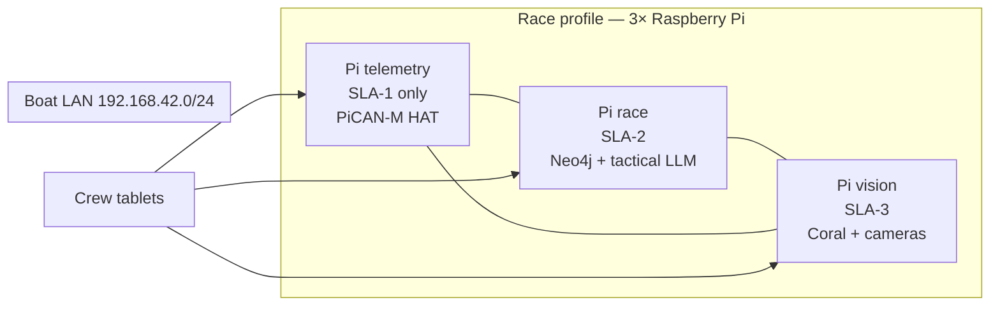

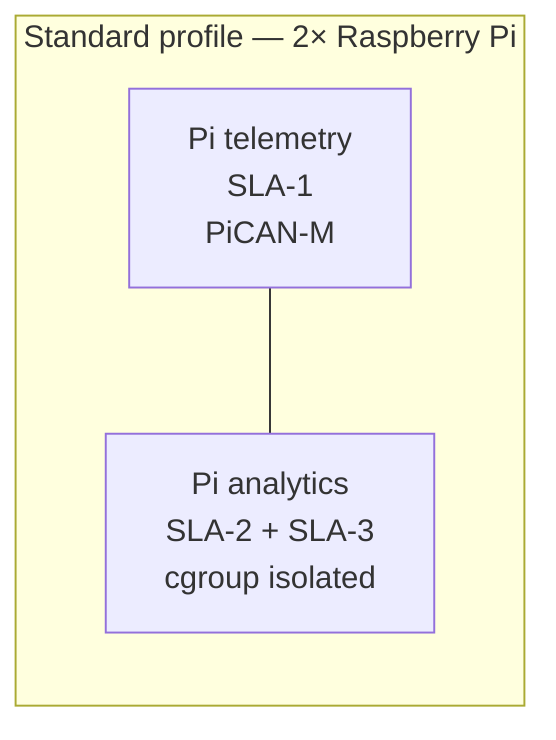

**DNS / hostnames (boat LAN):**

| Host | Tier | Services |
|------|------|----------|
| `telemetry.local` | SLA-1 | Signal K `:3000`, Influx `:8086`, Grafana `:3001` |
| `race.local` | SLA-2 | Neo4j `:7474`, coach `:8090`, Grafana `:3002` |
| `vision.local` | SLA-3 | sail API `:8091`, Grafana `:3003` |

### 5.5 Inter-tier communication contract

| From → To | Protocol | Data | Direction |
|-----------|----------|------|-----------|
| SLA-1 → SLA-2 | Signal K WebSocket | AIS deltas + own-boat navigation | Read-only fan-out |
| SLA-1 → SLA-2 | Influx HTTP API | Telemetry, wind, SOG/COG | Read-only |
| SLA-1 → SLA-3 | Influx HTTP API | AWA/AWS/heel window | Read-only |
| SLA-2 → SLA-3 | REST | `race_id`, active leg, target AWA | Push on leg change |
| SLA-3 → SLA-2 | REST | `SailAnalysis`, trim scores | Push on analysis complete |
| SLA-2 → SLA-1 | **None** | — | **No writes upstream** |
| SLA-3 → SLA-1 | **None** | — | **No writes upstream** |

**Failure isolation:** If `race.local` or `vision.local` is unreachable, SLA-1 continues logging and displaying instruments. Crew sees a degraded-mode banner on tactical/vision dashboards only.

### 5.6 Resource governance (same-Pi multi-tier)

When multiple tiers share one Pi (compact / standard profile), enforce:

```yaml
# Example Docker Compose deploy.resources per tier
sla-1: { cpus: "2.0", memory: 2G }   # guaranteed
sla-2: { cpus: "1.5", memory: 3G }   # burstable
sla-3: { cpus: "2.0", memory: 3G }   # lowest priority — throttled when sla-1 under load
```

A `tier-watchdog` sidecar on shared nodes pauses SLA-3 containers when SLA-1 Influx write latency exceeds 500 ms for 30 s.

### 5.7 Dual-repository architecture

The platform uses **two GitHub repositories** — see [ADR-0009](./adr/0009-dual-repository-race-data.md).

| Repository | Role | Onboard path |
|------------|------|--------------|
| **[AI-sailing-system](https://github.com/cognite-fholm/AI-sailing-system)** | Code, containers, CI/CD | `/opt/ai-sailing-system/` |
| **[AI-sailing-data](https://github.com/cognite-fholm/AI-sailing-data)** | Races, boats, planning, Neo4j YAML, OKF | `/opt/ai-sailing-data/` |

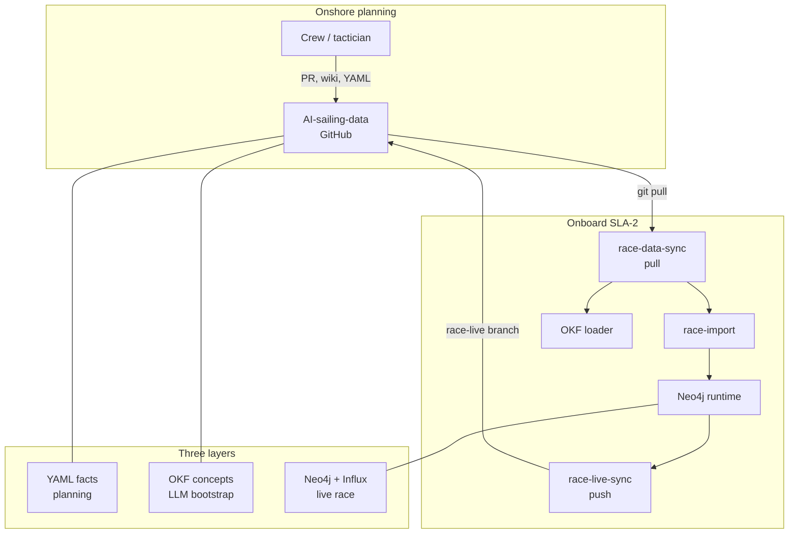

**Data repo layout (summary):**

| Branch | Path pattern | Content |
|--------|--------------|---------|
| Boats | `boats/{sail_number}/{year}/` | Ratings, polar, neo4j, okf, assets |
| Races | `races/{year}/{year}-{month}-{slug}/` | Manifest, planning, courses, fleet, scoring |
| Live (during race) | `races/.../race-live/` on branch `race-live/{regatta_id}` | `RaceLiveSnapshot` — git commit timeline |
| Archive (after race) | `races/.../post-race/` on `main` | Finalize kinds — [§7.24](#724-race-live-sync-and-archive) |

**Knowledge roles:**

| Store | Holds | Does not hold |
|-------|-------|---------------|
| **AI-sailing-data** | Pre-race plans, static graph templates, SI-derived routes | Live AIS, live standings |
| **Neo4j** | Runtime graph, interconnected analysis for crew + LLM | Long-form wiki prose |
| **OKF** (data + system bundles) | Concepts — how to read Neo4j labels and YAML kinds | Telemetry samples |
| **InfluxDB** | Time series | Handicap rules, course definitions |

**Deploy rule:** Version **both** repos at race freeze — system digest lock + data git tag/ref.

---

## 6. System context and data flow

### 6.1 High-level context

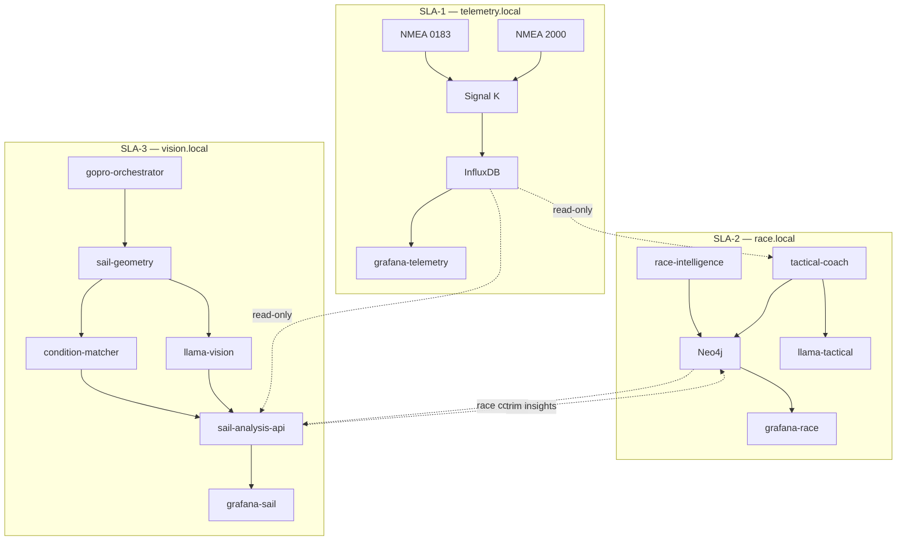

### 6.2 Data flow (race mode)

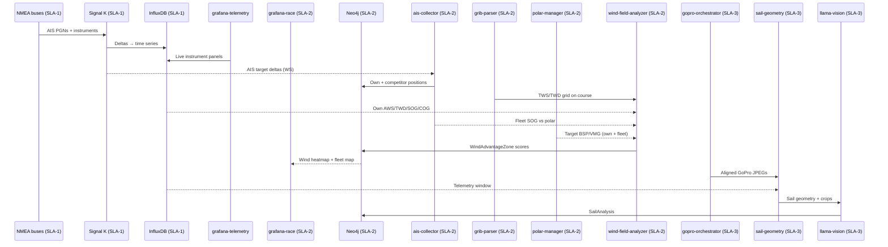

### 6.3 Offline vs online modes

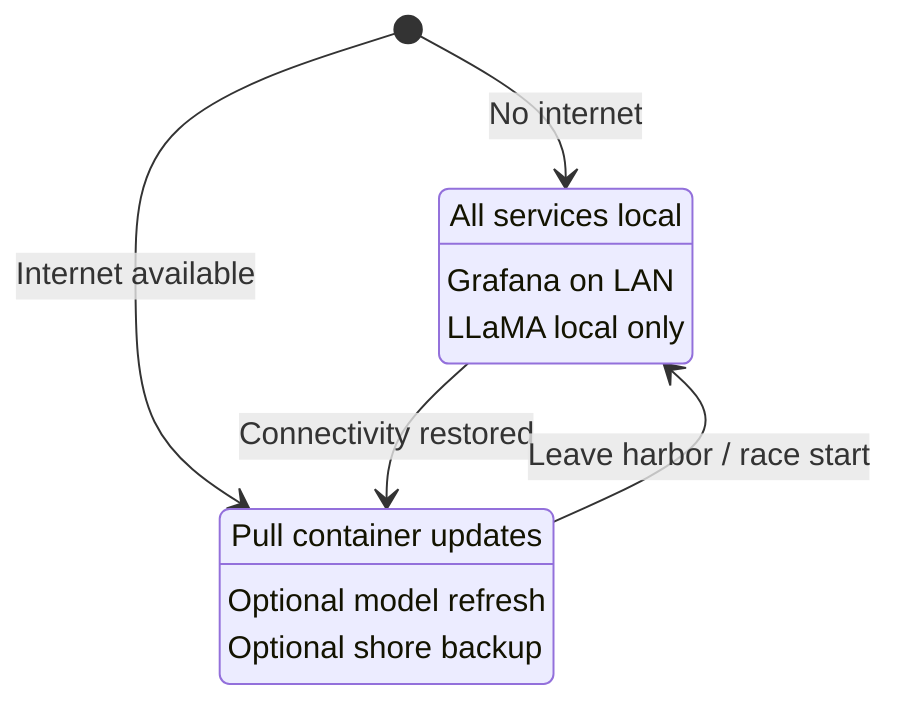

---

## 7. Software components

§7 sections below are ordered by **domain** (storage, vision, race logic, shore tools). For **build order**, use [§1.1](#11-implementation-map) and [§7.0](#70-implementation-order--section-index).

### 7.0 Implementation order — section index

Read and implement §7 subsections in this sequence (links stay stable):

| Order | § | Topic | Phase |
|-------|---|-------|-------|
| 1 | [7.15](#715-race--boat-data-repository-ai-sailing-data) | Data repo model | 0, 2A |
| 2 | [7.1](#71-signal-k-server-hub--sla-1-only) | Signal K | 1 |
| 3 | [7.2](#72-time-series--influxdb--sla-1-only) | InfluxDB | 1 |
| 4 | [7.4](#74-visualization--grafana) | Grafana (per tier) | 1+ |
| 5 | [7.19](#719-orc-certificate-collection--fleet-enrichment) | ORC shore collection | 2A |
| 6 | [7.20](#720-shore-weather--current-collection) | Weather shore collection | 2A |
| 7 | [7.23](#723-marine-map-gpx-export) | Marine map GPX | 2A |
| 8 | [7.3](#73-knowledge-graph--neo4j--sla-2-only) | Neo4j | 2B |
| 9 | [7.12](#712-grib-polars-ais--wind-on-course-analysis) | GRIB, polars, AIS, wind | 2C |
| 10 | [7.14](#714-handicap-numbers--scoring) | Handicaps | 2D |
| 11 | [7.13](#713-race-courses-waypoints--live-results) | Courses & live results | 2D |
| 12 | [7.6](#76-race-intelligence-service--sla-2-only) | Race intelligence | 2E |
| 13 | [7.16](#716-iregatta-reference-model--feature-traceability) | iRegatta parity | 2E |
| 14 | [7.17](#717-bg-h5000-reference-model--integration) | H5000 parity | 2E |
| 15 | [7.22](#722-fleet-polar-performance-timeline) | Fleet polar % Influx | 2F |
| 16 | [7.21](#721-tactical-insight-alerts--annunciation) | Tactical alerts | 2F |
| 17 | [7.5](#75-ai--llama--coral) | LLM coach | 2F |
| 18 | [7.18](#718-race-side-mcp--laptop-cursor) | Laptop MCP | 2G |
| 19 | [7.24](#724-race-live-sync-and-archive) | Race live sync & archive | 2H |
| 20 | [7.9](#79-gopro-hero13-black-fleet)–[7.11](#711-onshore-transformer-training-pipeline) | GoPro & training | 3, 5 |
| 21 | [7.7](#77-sail-vision-service-sla-3) | Sail vision API | 3 |
| 22 | [7.10](#710-sail-geometry--condition-similarity) | Sail geometry | 3 |
| 23 | [7.8](#78-web-crawler-integration-optional-online) | Web crawler (optional) | 2D+ |

Reference-only sections ([§7.16](#716-iregatta-reference-model--feature-traceability), [§7.17](#717-bg-h5000-reference-model--integration)) inform Phase 2E dashboards and YAML in the data repo.

---

### 7.1 Signal K Server (hub) — **SLA-1 only**

**Language:** Node.js (upstream Signal K); Python sidecars for course/polar sync  
**Source:** [SignalK/signalk-server](https://github.com/SignalK/signalk-server)  
**ADR:** [0021 — SLA-1 Signal K plugin strategy](./adr/0021-sla1-signalk-plugin-strategy.md)

Signal K is the **single source of truth** for live marine data. It:

- Reads NMEA 0183 and NMEA 2000 via PiCAN-M interfaces.
- Exposes `ws://localhost:3000/signalk/v1/stream` for subscribers.
- Hosts **`@signalk/course-provider`** for geometric course metrics (VMG, XTE, DTM, BTM, TTG).
- Receives active route waypoints from **`course-sk-sync`** (data-repo YAML → `navigation.course`).
- Receives polar performance deltas from **`signalk-polar-performance`** (`performance.*` paths).

**SLA-1 plugin stack (ADR-0021):**

| Component | Type | Responsibility |
|-----------|------|----------------|
| `@signalk/course-provider` | npm plugin in custom `signalk-server` image | Great-circle / rhumbline geometry from `navigation.course` |
| `course-sk-sync` | Python sidecar | Push active `WaypointList` YAML → SK course points (works when SLA-2 offline) |
| `signalk-polar-performance` | Python sidecar | `performance.polarSpeed`, `performance.polarSpeedRatio`, `performance.targetAngle` from `polar-manager` |
| `signalk-influx-bridge` | Python sidecar | Persist raw nav/env + `navigation.course.calcValues.*` + `performance.*` |
| `@signalk/calibration` | Optional npm plugin | Sensor correction when H5000 does not own a path |
| `signalk-bandg-performance-plugin` | Optional npm plugin | Forward performance paths to B&G MFD (N2K) |

**Rejected on SLA-1:** Node-RED; duplicate polar SoR inside Signal K admin.

**Future plugins:**

| Plugin | Responsibility |
|--------|----------------|
| `signalk-race-events` | Detect tacks, gybes, mark rounding; emit to Neo4j |
| `signalk-ai-bridge` | Forward curated context windows to coach service |

### 7.2 Time series — InfluxDB — **SLA-1 only**

**Language:** configuration + Flux/SQL queries; write path in Node.js or Python  
**Replaces:** CDF time series (previously via `push_to_cdf`)

**Schema strategy:**

- **Bucket:** `signalk` (raw, 90-day retention); `race` (downsampled, long retention — includes **`fleet_polar_performance`**); `ais_tracks` (competitor + own-boat AIS positions, 30-day retention).
- **Write policy:** SLA-1 owns `signalk`; SLA-2 services (`ais-collector`, `fleet-performance-tracker`, `race-intelligence`) write to `race` and `ais_tracks` via **scoped write token** only.
- **Measurement:** derived from Signal K path (e.g. `navigation_speedOverGround`).
- **Tags:** `vessel`, `source`, `pgn` (N2K), `context`, `race_id` (when active).
- **Fields:** numeric values; store strings in Neo4j instead.

**Migration from CogSail:** The `parse_signalK()` logic in `cogsail-python/push_to_cdf/Consume stream.py` maps deltas to external IDs — reuse this path→ID mapping as Influx measurement/field conventions.

### 7.3 Knowledge graph — Neo4j — **SLA-2 only**

**Language:** Cypher; ingestion via Python (`neo4j` driver) or Node.js (`neo4j-driver`)  
**Replaces:** CDF asset hierarchy + relationships (previously `cogsail-scripts/CreateBoats.py`, CDF data models)

**Core node labels:**

| Label | Examples |
|-------|----------|
| `Vessel` | Own boat (`is_own: true`), competitors (MMSI) |
| `Polar` | Polar diagram for a vessel (TWS × TWA → target BSP/VMG) |
| `GribModel` | Imported GRIB file metadata (model run, valid time, bbox) |
| `WindGrid` | Parsed wind field reference (linked to GribModel) |
| `WindAdvantageZone` | Course sector scored for favorable wind (runtime) |
| `AisTrack` | Time-series reference for vessel movement |
| `Race` | Regatta, passage race |
| `Course` | Windward/leeward, coastal — parsed from SI |
| `CourseRoute` | Named route variant (e.g. `11.1 Tristein`, `Bane A`, `Bane B`) |
| `ClassFlag` | Fleet class signal flag (e.g. Oscar, Foxtrot) per SI §7 |
| `StartBoatSignal` | Start-boat display linking signal → course (e.g. numeral 2 → Bane A) |
| `SupplementarySignal` | Modifies rounding (e.g. flag **T** → first mark starboard) |
| `CourseSelection` | Active course for current race + selection source |
| `Waypoint` | Mark/gate with lat/lon, rounding rule, optional distance |
| `OrcCertificate` | ORC cert variant (Club/DH/NS/Intl) per year; each has matched SLK |
| `HandicapRating` | ORC ToT/ToD/APH or WRS TCF — linked to certificate |
| `LiveStanding` | Current corrected-time position in fleet |
| `Mark` | Physical or virtual marks |
| `Leg` | Between marks |
| `Tack` / `Gybe` | Maneuver events |
| `Sailor` | Crew roles |
| `Tactic` | Pre-race plan, observed pattern |
| `WindSector` | Shift / persistent pattern |
| `SailGeometry` | Per-capture metrics from GoPro analysis (SLA-3) |
| `BestTrimSnapshot` | Top performance trim in a condition cluster |
| `TrimDelta` | Current vs best/optimal gap |
| `SailAnalysis` | Vision LLM narrative + fused recommendation |

**Example relationships:**

```cypher
(v:Vessel)-[:COMPETED_IN]->(r:Race)
(v:Vessel)-[:HAS_POLAR]->(p:Polar)
(r:Race)-[:USES_GRIB]->(g:GribModel)
(r:Race)-[:ON_COURSE]->(c:Course)
(c:Course)-[:HAS_ZONE]->(z:WindAdvantageZone)
(v:Vessel)-[:AIS_POSITION]->(pos:AisTrack)
(z:WindAdvantageZone)-[:DERIVED_FROM]->(g:GribModel)
(c:Course)-[:HAS_MARK]->(m:Mark)
(v:Vessel)-[:ROUNDED]->(m:Mark)
(v:Vessel)-[:PERFORMED]->(t:Tack)
(r:Race)-[:USES_SELECTION]->(sel:CourseSelection)
(sel)-[:SELECTED_ROUTE]->(cr:CourseRoute)
(cr:CourseRoute)-[:REQUIRES_SIGNAL]->(sb:StartBoatSignal)
(r:Regatta)-[:HAS_CLASS]->(cf:ClassFlag)
(v:Vessel)-[:SAILS_IN_CLASS]->(cf:ClassFlag)
```

Neo4j holds **context** (who, what, where, why); InfluxDB holds **telemetry** (how fast, when).

### 7.4 Visualization — Grafana

**One Grafana instance per SLA tier** — avoids dashboard load on the telemetry node. Grafana is **not** the primary helm UI for interactive race workflows ([§7.4.1](#741-race-helm-ui-grafana--signalk-plugins)).

| Instance | Tier | Port (default) | Dashboards |
|----------|------|----------------|------------|
| `grafana-telemetry` | SLA-1 | 3001 | SOG, COG, AWA, AWS, depth, heel, system health |
| `grafana-race` | SLA-2 | 3002 | Fleet map, polars, wind heatmap, **live standings**, course overlay, model score timeline |
| `race-ui` | SLA-2 | 3010 | **Primary helm** — Node.js/TS race optimization UI (see §7.4.1) |
| `grafana-sail` | SLA-3 | 3003 | Trim timeline, sail images, vision LLM output |

#### 7.4.1 Race helm UI — Grafana + Signal K plugins

**ADR:** [0018 — Helm UX, three-Pi, dual speaker](./adr/0018-helm-ux-three-pi-dual-speaker.md)

| Surface | Technology | Use for |
|---------|------------|---------|
| **B&G H5000** | Factory displays + **safety speaker** | Instruments, SailSteer, StartLine, depth/BSP/wind alarms |
| **`race-ui`** | **Node.js** + **TypeScript** (React or Svelte), Fastify/static | Start line, course confirm, laylines, steering bars, tactical alert ack, active GRIB model indicator |
| **Signal K plugins** | `@signalk/course-provider` + `course-sk-sync` + `signalk-polar-performance` | Course geometry (VMG/XTE/DTM) and polar % on standard SK paths — see [ADR-0021](./adr/0021-sla1-signalk-plugin-strategy.md) |
| **`course-editor`** | React/TS (legacy port 3010 — may merge into `race-ui`) | Waypoint edit, Start Line flag/course selection at harbor |
| **Grafana-race** | Grafana OSS | Wind/VMG history, fleet map heatmap, fleet polar % timeline, debrief |
| **iRegatta (phone)** | iOS app | Optional; same NMEA feed |

**`race-ui` data sources:** Signal K WebSocket (SLA-1), `race-intelligence` REST, `live-results` REST, `insight-alerts` WebSocket, `grib-model-scorer` active model API.

**Grafana scope (explicit):** time-series panels, geo map overlays, fleet performance tables, alert feed (read-only list), engineering health — **not** primary start-line or course-selection workflows.

### 7.5 AI — LLaMA + Coral

**Languages:** Python (orchestration), C++ runtime (llama.cpp), TFLite (Coral)

| Layer | SLA | Technology | Role |
|-------|-----|------------|------|
| Text LLM | SLA-2 | **llama.cpp** + GGUF | Tactical Q&A, debrief, start-line narration |
| Vision LLM | SLA-3 | **llama.cpp** multimodal | Sail trim analysis from camera frames |
| Text model | SLA-2 | Llama 3.2 1B–3B Instruct (Q4_K_M) | Low latency tactical coaching |
| Vision model | SLA-3 | Llama 3.2 Vision 11B or smaller quant | Sail shape / trim interpretation |
| Edge ML | SLA-3 | **Coral** + TFLite | ROI, luff detection, frame preprocessing |
| Tactical coach | SLA-2 | **Python** (FastAPI) | RAG over Neo4j + SLA-1 Influx (read-only) |
| Sail analyst | SLA-3 | **Python** (FastAPI) | Vision pipeline orchestration |

**Offline inference:** Models ship on disk per node (`/opt/models/sla-2/`, `/opt/models/sla-3/`). No cloud calls at sea.

**Recommended models:**

| Node | Model | Size |
|------|-------|------|
| SLA-2 (race) | `Llama-3.2-3B-Instruct-Q4_K_M.gguf` | ~2 GB |
| SLA-3 (vision) | `Llama-3.2-11B-Vision-Instruct-Q4_K_M.gguf` (or smaller) | 4–8 GB |

#### 7.5.1 Advisory agent context — Google OKF

**Format:** [Google Open Knowledge Format (OKF) v0.1](https://github.com/GoogleCloudPlatform/knowledge-catalog/blob/main/okf/SPEC.md)  
**System bundle:** `/opt/knowledge/sailing-system/` — architecture, marine paths, Neo4j schema reference  
**Race/boat bundles:** `/opt/ai-sailing-data/**/okf/` — per-regatta and per-boat-year concepts from [AI-sailing-data](https://github.com/cognite-fholm/AI-sailing-data)  
**Consumers:** `tactical-coach`, `sail-analysis-api`, `course-flag-detector`, `okf-loader`

OKF defines the **curated system context** that advisory agents read before and during inference. It complements — but does not replace — live data from InfluxDB and Neo4j:

| Layer | Role | Update frequency |
|-------|------|------------------|
| **OKF bundle** | Stable domain + **per-race/boat** concepts | Harbor / regatta prep; `race-data-sync` |
| **Neo4j** | Live race graph (fleet, course selection, standings) | Continuous during race |
| **InfluxDB** | Live telemetry (wind, SOG, heel) | Sub-second |

**Why OKF:** Vendor-neutral, human-readable markdown with YAML frontmatter; diffable in git; traversable by agents without proprietary SDKs. Producers (humans, `course-parser`, `okf-enricher`) and consumers (`tactical-coach`, vision LLM prompts) are independent.

**Bundle layout:**

```
knowledge/sailing-system/          # OKF Knowledge Bundle
├── index.md                       # okf_version: "0.1"; directory map
├── log.md                         # Change history
├── system/
│   ├── sla-tiers.md               # type: Reference — three-tier architecture
│   └── advisory-agents.md         # type: Playbook — which agent does what
├── marine/
│   ├── signalk-paths.md           # type: Reference — key Signal K paths
│   └── nmea-sources.md            # type: Reference — PiCAN-M buses
├── graph/
│   ├── neo4j-schema.md            # type: Reference — node labels & relationships
│   └── course-selection.md        # type: Playbook — StartBoatSignal / CourseSelection
├── regatta/
│   ├── hostcup-2025.md            # type: Playbook — Bane A/B, class flags, flag T
│   └── faerderseilasen-2026.md    # type: Playbook — §11 routes, §23 scoring
├── scoring/
│   ├── orc-handicaps.md           # type: Reference — APH, triple-number, WRS TCF
│   └── live-results.md            # type: Playbook — corrected time formula
├── wind/
│   ├── grib-usage.md              # type: Playbook — stale GRIB, fusion rules
│   └── polar-interpretation.md    # type: Reference — SLK columns, ORC derived
└── sail/
    ├── trim-metrics.md            # type: Reference — boom, draft, twist definitions
    └── gopro-capture.md           # type: Playbook — burst modes, geometry pipeline
```

**Example concept** (`regatta/hostcup-2025.md`):

```markdown
---
type: Playbook
title: Høstcup 2025 — courses and start-boat signals
description: Bane A/B selection, class flags, and supplementary flag T.
tags: [regatta, hostcup, course-selection]
resource: file://../Seilingsbestemmelser Høstcup 2025 ENDELIG.pdf
timestamp: 2026-07-05T00:00:00Z
---

# Class flags (§7)

| Class | Flag |
|-------|------|
| 1 | Oscar |
| 2 | Echo |
| 3 | Foxtrot |

# Course signals (Vedlegg 1)

- Numeral **2** on start boat → [Bane A](/regatta/routes/bane-a.md)
- Numeral **3** on start boat → [Bane B](/regatta/routes/bane-b.md)
- Flag **T** present → first mark **starboard**; absent → **port**

See [course selection playbook](/graph/course-selection.md).
```

**`okf-enricher` container (SLA-2):**

| Trigger | Action |
|---------|--------|
| `POST /courses/parse` completes | Write / update `regatta/{id}.md` concepts from parsed SI |
| `handicap-manager` import | Update `scoring/orc-handicaps.md` per vessel |
| Harbor sync | Regenerate `graph/neo4j-schema.md` from live schema |
| Manual edit | Crew edits markdown; git commit in harbor |

**Advisory agent consumption pattern:**

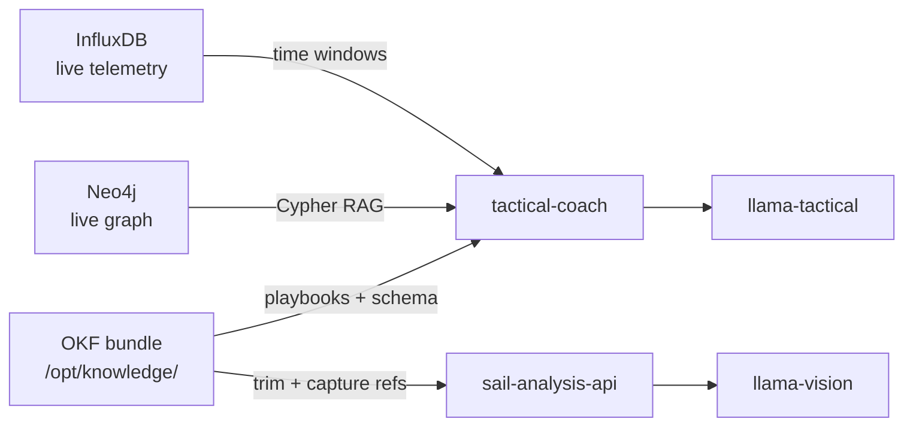

1. **Bootstrap:** Load bundle `index.md`; agent reads relevant concepts by `type` and `tags` (e.g. `Playbook` + `regatta`).
2. **Per query:** Merge OKF concept text with live Neo4j/Influx facts in the prompt.
3. **Citations:** Agent responses cite OKF concept IDs and live data paths (FR: no uncited tactical claims).

**`AGENTS.md` (bundle root, OKF convention):** Instructions for advisory agents — which concepts to read first, offline-only constraint, and override rules for `CourseSelection`.

**Offline:** Full bundle ships on disk with the Pi image; no network required to read context at sea.

### 7.6 Race intelligence service — **SLA-2 only**

**Language:** Python 3.11+  
**ADR:** [0010 — iRegatta reference model](./adr/0010-iregatta-reference-model.md)

Responsibilities (aligned with **iRegatta** start/race/layline logic — see [§7.16](#716-iregatta-reference-model--feature-traceability)):

- **Start sequence** — countdown sync-to-minute, pause/reset, burn-or-gain vs time-to-line, favored end from wind⊥line geometry.
- **Line metrics** — distance to line perpendicular to line and extensions; time-to-line at current COG/SOG; bow/GPS antenna offset.
- **Lift / wind shift** — heading vs 10 s rolling average; configurable threshold (iRegatta “lift indicator”).
- **Steering guidance** — optimum VMG tack/jibe angles from `polar-manager` (or manual angles in degraded mode).
- Polar comparison for **own boat and competitors** via `polar-manager` (performance %).
- Trigger `wind-field-analyzer` on leg changes.
- Debrief generation post-race (LLaMA + structured data + wind-zone summary).

Publishes computed fields to InfluxDB (`start_line`, `lift`, `steering_hint`) for `grafana-race` panels.

This replaces implicit analytics that were previously envisioned in CDF tools / future Java apps.

### 7.7 Sail vision service (SLA-3)

**Language:** Python 3.11+  
**SLA tier:** SLA-3 only

Orchestrates the GoPro fleet → geometry → condition-match → vision LLM pipeline. See [§7.9–7.11](#79-gopro-hero13-black-fleet).

**Does not** run on the telemetry node in race profile.

### 7.8 Web crawler integration (optional, online)

**Source repo:** [crawl_web](https://github.com/cognite-fholm/crawl_web)

When online, crawl race documents (NOR, SI, sailing instructions) and ingest summaries into Neo4j as `RaceDocument` nodes linked to `Race`. Not required for onboard core loop.

### 7.9 GoPro HERO13 Black fleet

**API:** [Open GoPro](https://gopro.github.io/OpenGoPro/) (BLE + Wi-Fi HTTP) via [Python SDK](https://gopro.github.io/OpenGoPro/python_sdk/)  
**Camera:** GoPro HERO13 Black (firmware ≥ v01.10.00)  
**Container:** `gopro-orchestrator` (Python 3.11+, `open-gopro` package)

#### 7.9.1 Fleet topology

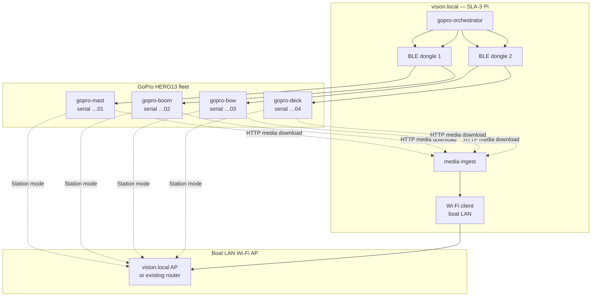

**BLE constraint:** Each HERO13 accepts **one BLE central** at a time. The orchestrator uses:

1. **Round-robin BLE** across 1–2 USB dongles for shutter triggers and health polls.
2. **Wi-Fi station mode** — cameras join boat LAN (`boat-vision` SSID); `media-ingest` pulls JPEGs via HTTP (`/gopro/media/list`, `/videos/DCIM/...`).

#### 7.9.2 Capture modes

| Mode | Trigger | Use case |
|------|---------|----------|
| **Scheduled still** | Cron every N s on stable leg | Continuous trim monitoring |
| **Synchronized burst** | `capture_trigger` event (AWA/AWS stable ±2° for 10 s) | Multi-camera geometry snapshot |
| **Maneuver bracket** | Tack/gybe detected (SLA-2 webhook) | Before/after trim comparison |
| **Manual** | Crew Grafana button | Ad-hoc inspection |

**Open GoPro commands (reference flow):**

```python
# Simplified — gopro-orchestrator
async with WirelessGoPro(identifier="…01") as gopro:
    await gopro.ble_command.set_shutter(shutter=Toggle.ENABLE)   # photo mode preset
    await gopro.ble_setting.photo_output.set(PhotoOutput.MAX_27MP)
    await gopro.ble_command.set_date_time(dt=synced_utc)         # GPS/NTP aligned
    await gopro.http_command.set_photo()                          # Wi-Fi path after connect
```

#### 7.9.3 Camera configuration (HERO13)

| Setting | Value | Rationale |
|---------|-------|-----------|
| Mode | Photo (not video) | Lower storage; sharper geometry |
| Resolution | 27 MP linear | Crop flexibility for sail ROI |
| FOV | Linear | Minimize distortion for angle math |
| Protune | Flat, sharpness high | Better edge detection |
| GPS | On (camera GPS) | Secondary timestamp; fuse with boat GPS |
| Wi-Fi | Station → boat LAN | Media download without phone |
| Sleep | Disabled during race session | Avoid HERO13 BLE wake bug — power-cycle checklist in docs |

#### 7.9.4 Timestamp alignment

Every capture record carries:

| Field | Source |
|-------|--------|
| `capture_id` | UUID generated by orchestrator |
| `t_trigger` | Vision Pi monotonic clock at shutter command |
| `t_exif` | EXIF DateTimeOriginal from GoPro JPEG |
| `t_influx` | Nearest SLA-1 telemetry window (±100 ms interpolated) |
| `race_id`, `leg_id` | SLA-2 session context |
| `camera_id` | `gopro-mast` \| `gopro-boom` \| `gopro-bow` \| `gopro-deck` |

All geometry and training exports key off `capture_id` + `t_influx`.

---

### 7.10 Sail geometry & condition similarity

**Containers:** `coral-preprocess`, `sail-geometry`, `condition-matcher`

#### 7.10.1 Geometry extraction pipeline

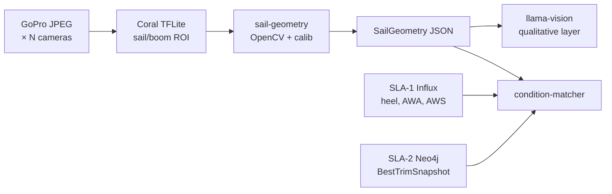

**`SailGeometry` metrics (per capture, per sail type):**

| Metric | Unit | Cameras | Description |
|--------|------|---------|-------------|
| `boom_angle` | ° | gopro-boom, gopro-deck | Boom angle relative to boat centerline (vision + IMU fusion) |
| `mast_heel` | ° | gopro-mast + SLA-1 heel | Mast axis angle; cross-check instrument heel |
| `draft_position` | % chord | gopro-mast | Deepest camber point from leading edge |
| `camber_depth` | % chord | gopro-mast | Max thickness / chord |
| `leech_twist` | ° | gopro-mast | Angle between upper and lower leech tangent |
| `luff_break_angle` | ° | gopro-bow | Genoa luff separation from forestay plane |
| `foot_tension_proxy` | 0–1 | gopro-boom | Visual foot shelf / wrinkle score |
| `vang_tension_proxy` | 0–1 | gopro-boom | Boom-to-leech geometry hint |

Camera extrinsics (mount position + bearing) are stored in `config/cameras.yaml` and refined per boat during calibration sail.

#### 7.10.2 Condition vector

Each capture is tagged with a **condition vector** for similarity search:

```json
{
  "tws_bucket": "12-14",
  "awa_bucket": "25-35",
  "twa_bucket": "32-42",
  "heel_bucket": "8-15",
  "sea_state": 2,
  "tack": "port",
  "sail_plan": "main+jib",
  "vmg_percentile": 0.82
}
```

Buckets derived from SLA-1 telemetry at `t_influx`. Stored on `SailGeometry` nodes in Neo4j.

#### 7.10.3 Best-trim comparison

**`BestTrimSnapshot`** nodes represent historically strong performance in a condition cluster:

```cypher
(:BestTrimSnapshot {
  condition_hash: "tws12_awa30_port",
  boom_angle: 4.2,
  mast_heel: 12.1,
  draft_position: 42,
  leech_twist: 8.5,
  vmg_avg: 5.8,
  session_id: "2025-06-regatta-3",
  rank: 1
})
```

**`condition-matcher` algorithm (onboard):**

1. Compute `condition_hash` from current telemetry.
2. Query Neo4j for `BestTrimSnapshot` within ±1 bucket on TWS, AWA, heel (Cypher + optional vector index).
3. If onshore-trained model available (see §7.11), call `trim-predictor` edge artifact for optimal targets.
4. Emit `TrimDelta` — difference between current `SailGeometry` and best/optimal.

**Crew-facing output (Grafana-sail):**

| Current | Best in conditions | Δ | Recommendation |
|---------|-------------------|---|----------------|
| Boom 6.2° | 4.0° | +2.2° | Ease boom 2° |
| Draft 38% | 45% | −7% | Move draft aft (outhaul/vang) |
| Heel 18° | 12° | +6° | Depower — traveler down / vang |

---

### 7.11 Onshore transformer training pipeline

**SLA tier:** **SLA-S (Shore)** — runs on larger onshore machines only; **not required at sea**.

**Purpose:** Train **multimodal transformer models** on aligned sensor + image data to learn optimal **boom angle**, **mast heel**, **sail shape**, and rig settings for any condition. Deploy compressed artifacts back to the boat for SLA-3 inference.

#### 7.11.1 End-to-end ML lifecycle

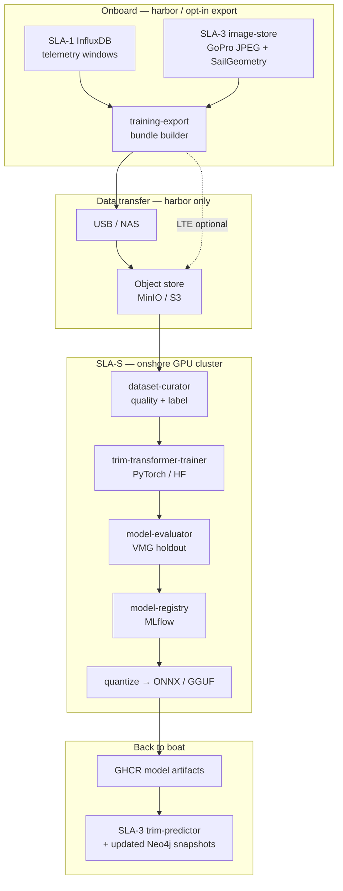

#### 7.11.2 Training dataset format

Each **training sample** = one synchronized multimodal window:

```
training_bundle/
├── manifest.json
├── sessions/
│   └── {session_id}/
│       ├── telemetry.parquet      # SLA-1: 30 s window @ 10 Hz
│       ├── captures/
│       │   ├── {capture_id}_mast.jpg
│       │   ├── {capture_id}_boom.jpg
│       │   └── {capture_id}_bow.jpg
│       ├── geometry/
│       │   └── {capture_id}.json  # SailGeometry (auto or human-refined)
│       └── labels/
│           └── {capture_id}.json  # OptimalTrim targets (see below)
```

**`manifest.json` fields:** `session_id`, `vessel_id`, `race_id`, `opt_in`, `export_timestamp`, `checksum`.

**Label sources (priority order):**

| Source | Description |
|--------|-------------|
| **Performance-derived** | Top-decile VMG segments in condition cluster → `SailGeometry` becomes positive label |
| **Expert annotation** | Coach labels optimal boom/heel/shape in web UI (shore) |
| **LLM-assisted pre-label** | Vision LLM proposes labels; human confirms in curation |
| **Transformer pseudo-label** | Prior model iteration bootstraps new sessions |

**`OptimalTrim` label schema:**

```json
{
  "boom_angle_deg": 4.0,
  "mast_heel_deg": 12.0,
  "draft_position_pct": 45,
  "camber_depth_pct": 12,
  "leech_twist_deg": 8.5,
  "vang_setting": 0.65,
  "cunningham_setting": 0.40,
  "outhaul_setting": 0.55,
  "traveler_position": 0.30,
  "confidence": 0.91
}
```

#### 7.11.3 Model architecture — TrimTransformer

**Framework:** PyTorch 2.x + Hugging Face Transformers (onshore); ONNX Runtime or quantized GGUF for edge deployment.

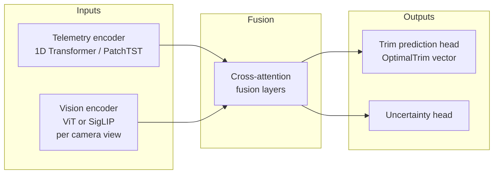

| Component | Specification |
|-----------|---------------|
| **Telemetry encoder** | 30 s × N channels (AWA, AWS, TWS, SOG, VMG, heel, rudder, loads); PatchTST or small Temporal Fusion Transformer |
| **Vision encoder** | One ViT-B/16 (or SigLIP) per camera view; weights optionally init from sail-pretrained checkpoint |
| **Fusion** | 4-layer cross-attention; telemetry tokens attend to image patch tokens |
| **Output head** | Regression → `OptimalTrim` (10–15 continuous targets) |
| **Auxiliary loss** | VMG prediction (helps learn performance-aligned representations) |
| **Training hardware** | 1–8× NVIDIA GPU (A100/L40S class); 32 GB+ VRAM for multi-view + long context |

**Loss function:**

```
L = λ₁ · MSE(optimal_trim, predicted_trim)
  + λ₂ · Huber(vmg, predicted_vmg)
  + λ₃ · contrastive(condition_embed, same_bucket)   # similar conditions cluster
```

#### 7.11.4 Shore infrastructure (SLA-S)

| Service | Technology | Role |
|---------|------------|------|
| `dataset-curator` | Python, Label Studio | QA, dedup, consent check, train/val/test split by **session** (no leakage) |
| `trim-transformer-trainer` | PyTorch Lightning | Distributed training |
| `model-registry` | MLflow | Versioned checkpoints |
| `model-evaluator` | Custom + W&B | Holdout by regatta; report per-condition MAE |
| `neo4j-shore` | Neo4j (optional) | Aggregate fleet learnings → publish `BestTrimSnapshot` sets to boats |

**Host:** Personal **gaming PC** with NVIDIA GPU (CUDA) — **SLA-S**, harbor/home network only  
**Containers:** `shore/docker-compose.sla-shore.yml` (not deployed on Pi; not cloud VM)

#### 7.11.5 Deployment back to boat

After training and evaluation:

1. **Quantize** model → ONNX INT8 or distil to smaller edge checkpoint.
2. Publish to `ghcr.io/cognite-fholm/trim-predictor:{version}`.
3. Harbor sync: SLA-3 pulls artifact; `condition-matcher` uses hybrid **k-NN (Neo4j) + neural predictor**.
4. Export curated `BestTrimSnapshot` Cypher → SLA-2 Neo4j import script.

**Onboard inference (no GPU required):**

| Artifact | Latency target | Runs in |
|----------|----------------|---------|
| `trim-predictor-lite.onnx` | &lt; 2 s | SLA-3 `condition-matcher` |
| `llama-vision` GGUF | &lt; 60 s | SLA-3 qualitative narrative |
| Neo4j `BestTrimSnapshot` | &lt; 500 ms | SLA-3 k-NN fallback (offline) |

#### 7.11.6 Data governance

| Rule | Implementation |
|------|----------------|
| Opt-in export | `TRAINING_EXPORT_CONSENT=true` in harbor UI; per-session toggle |
| PII / crew | No faces in training set — Coral blur pass optional |
| Competitor data | Exclude unless consented |
| Retention | Raw images on shore: 24 months; delete on request |
| Race mode | `training-export` container **stopped** when `RACE_MODE=true` |

**Shore hardware:** Use existing **gaming PC** rather than Azure/AWS GPU VMs — PyTorch + CUDA locally; publish artifacts to GHCR from harbor; see [§9.6](#96-shore-training--gaming-pc-sla-s).

---

### 7.12 GRIB, polars, AIS & wind-on-course analysis

**SLA tier:** SLA-2 (`grib-ingest`, `grib-parser`, `polar-manager`, `ais-collector`, `wind-field-analyzer`)  
**AIS source:** SLA-1 Signal K (NMEA 2000 AIS via PiCAN-M)  
**Languages:** Python 3.11+ (`cfgrib`/`xarray`, `pyais`, FastAPI)

#### 7.12.1 Data flow overview

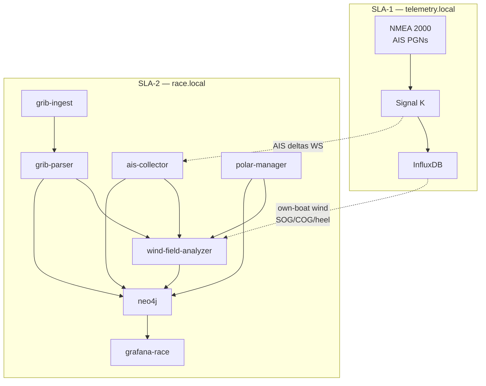

#### 7.12.2 GRIB ingestion — PredictWind multi-model + MET supplement

**Containers:** `grib-ingest`, `grib-parser`, `grib-model-scorer`  
**ADR:** [0019 — PredictWind multi-model GRIB](./adr/0019-predictwind-multi-model-grib.md)  
**Storage:** `/data/grib/` on SLA-2 (persistent volume `grib-store`)

**Primary source:** [PredictWind](https://www.predictwind.com/features/models) — download **all available high-resolution models** for the race bbox via subscription GRIB export and/or [PredictWind Marine](https://apps.apple.com/us/app/predictwind-marine-forecasts/id477048487) shore workflow. Shore skill **`predictwind-grib`** in AI-sailing-data records manifests.

**Supplement:** MET Norway `gribfiles` (Oslofjord weather/current/waves), Oslofjord current PNG plots, SMHI MetObs validation ([§7.20](#720-shore-weather--current-collection)).

| Mode | Schedule | Trigger |
|------|----------|---------|
| **PredictWind fetch** | Every **6 hours** when `ONLINE_MODE=true` | `grib-ingest` — **all configured PredictWind models** |
| **Pre-race fetch** | 72 h and 12 h before start | Shore + onboard per `grib-plan.yaml` |
| **Manual upload** | Harbor | PredictWind export, MET GRIB, `POST /grib/upload` |
| **USB import** | Harbor | Copy to `/data/grib/inbox/` |

**Configured sources (`config/grib-sources.yaml`):**

```yaml
sources:
  - name: predictwind
    type: predictwind_grib
    models: auto          # all models available for bbox — ECMWF, GFS, SPIRE, regional, etc.
    resolution: best      # finest available per model; clip to course bbox + margin
    schedule: "0 */6 * * *"
    docs: https://www.predictwind.com/features/models
  - name: metno-oslofjord
    type: metno_gribfiles
    area: oslofjord
    content: [current, waves]   # weather wind often superseded by PredictWind
    schedule: "0 */6 * * *"
  - name: manual
    type: upload
```

**Onboard model scoring (`grib-model-scorer`):**

During active `race_id`, continuously compare each ingested model's forecast wind at the boat position vs **observed** TWD/TWS from SLA-1. Maintain rolling error scores (30 min, 2 h, leg-to-date). Publish **`ActiveWindModel`** — the best-performing model for **this race and time**. `wind-field-analyzer` uses the active model for heatmaps; logs scores to Influx (`grib_model_score`) and Neo4j for debrief.

**Ingest pipeline:**

1. Download or receive GRIB2 file(s) per model.
2. Validate magic bytes; record `provider`, `model_id`, `resolution_km`, `model_run`, `valid_from`, `valid_to`, `bbox`.
3. `grib-parser` extracts **U/V wind** (and gust, pressure where present) → `WindGrid` store.
4. Register `GribModel` in Neo4j; link to active `Race`.
5. `grib-model-scorer` begins scoring when instruments provide ≥ 15 min of observations.
6. Prune files older than **7 days** (configurable).

**Offline use:** All successfully parsed models remain queryable at sea. `race-ui` and Grafana show **active model name**, age, and score margin vs runner-up. Warn if best model valid time &gt; 12 h behind race start.

#### 7.12.3 Polar diagram management

**Containers:** `polar-manager`, `polar-certificate-extractor`

Polars define target boat speed and VMG for each **TWS × TWA** combination. The **own boat** uses a high-fidelity **SLK** performance file. **Competitors** derive polars from ORC **certificate images or PDFs** when no SLK is available.

##### Own boat — SLK file (primary source)

| Attribute | Value |
|-----------|-------|
| **Format** | **SYLK (`.slk`)** — ORC / sail-performance export |
| **Reference file (dev)** | `AI-sailing-data/boats/NOR-10133/2026/assets/7710.slk` (from `7710 (3).slk`) |
| **Certificate** | `ORC Certificate for Xbox.pdf` — CertNo **7710** matches SLK data file |
| **Deploy path (Pi)** | `/data/polars/own/7710.slk` (copy at harbor sync) |
| **Parser** | `polar-manager` SLK module (`slk_parser.py`) |
| **Required** | Yes — system will not start race mode without own-boat polar |

**SLK column mapping** (from `7710 (3).slk` header):

| SLK column | Canonical field | Unit |
|------------|-----------------|------|
| `TWS` | `tws` | knots |
| `TWA` | `twa` | degrees |
| `BTV` | `bsp` | knots (boat speed) |
| `VMG` | `vmg` | knots |
| `AWS` | `aws` | knots |
| `AWA` | `awa` | degrees |
| `Heel` | `heel` | degrees |
| `Condition` | `point_of_sail` | `beat` \| `reach` \| `run` |
| `Sail` / `Reef` / `Flat` | `sail_config` | reef / flat state |

**Example SLK rows** (TWS 6 kt):

```
Condition=beat  TWA=42.4  BTV=5.26  VMG=3.89
Condition=run   TWA=141.5 BTV=4.91  VMG=3.84
Condition=reach TWA=52.0  BTV=5.86  VMG=3.61
```

**`config/vessel.yaml` (own boat):**

```yaml
vessel:
  id: own-boat
  name: "Xbox"
  sail_number: "NOR-10133"
  mmsi: "257771000"
  orc_cert_no: "7710"
  is_own: true
polar:
  source_type: slk
  path: "../7710 (3).slk"    # relative to repo on dev machine
  # path: "/data/polars/own/7710.slk"   # on Raspberry Pi
  slk_id: "7710"
  auto_reload: true          # re-parse when file mtime changes
```

On Windows dev: `polar-manager` resolves `../7710 (3).slk` from `AI-sailing-system/` → `C:\Repositories\boat_system\7710 (3).slk`.

##### Competitors — certificate image / PDF extraction

Competitors rarely provide SLK files. Polars are **derived** from ORC rating certificate diagrams.

| Attribute | Value |
|-----------|-------|
| **Input formats** | `.png`, `.jpg`, `.pdf` (ORC sail plan / certificate) |
| **Reference file (dev)** | `C:\Repositories\boat_system\off_course.png` |
| **Example vessel** | *OFF COURSE* — sail no. **NOR 15788** |
| **Container** | `polar-certificate-extractor` |
| **Confidence** | Lower than SLK — flagged `polar_source: derived` |

**Reference certificate content** (`off_course.png`):

| Extracted data | Example value | Use |
|----------------|---------------|-----|
| Boat name | OFF COURSE | Neo4j `Vessel.name` |
| Sail number | NOR 15788 | Roster matching |
| Mainsail area | 63.99 m² | VPP input |
| Headsail area | 46.36 m² | VPP input |
| Asymmetric | 158.63 m² | Downwind model |
| LOA, P, E, J, IG | 13.69, 17.25, 6.00, 5.02, 17.17 m | Rating geometry |
| MHW, HHU, SHW, … | sail widths | Shape coefficients |

**Extraction pipeline:**

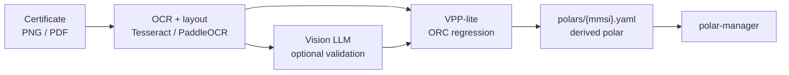

1. **`polar-certificate-extractor`** — OCR reads labelled dimensions and sail areas from diagram.
2. **Vision LLM** (optional cross-check on SLA-3 or SLA-2) validates OCR against image regions.
3. **VPP-lite** — estimates `TWS × TWA → BSP/VMG` from ORC dimensions (class-based regression or simplified velocity prediction).
4. Output saved as `polars/competitors/{mmsi}_derived.yaml` with `confidence` and `source_file` metadata.
5. Human review recommended in harbor before regatta (`polar_status: pending` → `approved`).

**`config/competitors.yaml` (example):**

```yaml
competitors:
  - name: "OFF COURSE"
    sail_number: "NOR 15788"
    mmsi: null                    # filled when AIS seen
    polar:
      source_type: certificate_image
      path: "../off_course.png"   # C:\Repositories\boat_system\off_course.png
      # path: "/data/polars/competitors/off_course.png"
      status: pending             # pending | approved | rejected
```

**API (extended):**

| Endpoint | Action |
|----------|--------|
| `POST /polars/own/reload` | Re-parse SLK from configured path |
| `POST /polars/competitor/extract` | Upload PNG/PDF → run certificate extractor |
| `POST /polars/competitor/{id}/approve` | Mark derived polar approved for race use |
| `GET /polars/{mmsi}` | Return canonical polar (`source: slk` \| `derived`) |
| `GET /polars/{mmsi}/target?tws=12&twa=42` | Interpolated target BSP/VMG |
| `GET /polars/{mmsi}/meta` | `source_type`, `confidence`, `source_file` |

##### Canonical internal format

All sources normalize to `polars/{mmsi_or_vessel_id}.yaml`:

```yaml
vessel_id: own-boat
mmsi: "257771000"
source_type: slk                    # slk | derived | manual
source_file: "7710 (3).slk"
confidence: 1.0                     # derived polars: 0.6–0.9 typical
boat_name: "7710"
points:
  - tws: 6
    twa: 42.4
    bsp: 5.262
    vmg: 3.8873
    aws: 10.5041
    awa: 22.64
    heel: 10.31
    point_of_sail: beat
```

**Neo4j:**

```cypher
MERGE (v:Vessel {mmsi: $mmsi})
MERGE (p:Polar {vessel_id: $vessel_id, season: $year})
SET p.source_type = $source_type,    // "slk" or "derived"
    p.source_file = $source_file,
    p.confidence = $confidence
MERGE (v)-[:HAS_POLAR {active: true}]->(p)
```

**Runtime use:**

- **Own boat (SLK):** `actual_VMG / target_VMG` → polar performance % — full confidence.
- **Competitors (derived):** same formula; `wind-field-analyzer` weights fleet term by `polar.confidence`.
- **`fleet-performance-tracker`:** persists fleet-wide `performance_pct` and `vmg_pct` every 30 s to Influx ([§7.22](#722-fleet-polar-performance-timeline)).
- Low-confidence derived polars (&lt; 0.7) show warning badge on grafana-race.

**File layout on dev machine:**

```
C:\Repositories\boat_system\
├── 7710 (3).slk              ← own-boat polar (SLK)
├── off_course.png            ← competitor certificate example
└── AI-sailing-system\        ← git repo
    └── config\
        ├── vessel.yaml
        └── competitors.yaml
```

#### 7.12.4 AIS collection — own boat and competitors

**Containers:** `ais-collector` (SLA-2), Signal K (SLA-1 ingest)

AIS arrives on the **NMEA 2000 backbone** via PiCAN-M (`can0`). Signal K decodes AIS PGNs into delta paths under `sensors.ais.*`.

| Target | MMSI source | Signal K path (reference) |
|--------|-------------|---------------------------|
| **Own boat** | Transponder MMSI | `navigation.position`, `navigation.courseOverGroundTrue`, `navigation.speedOverGround` + `sensors.ais.class` |
| **Competitors** | AIS class A/B | `sensors.ais.targets.{mmsi}.position`, `.course`, `.speed`, `.name` |

**`ais-collector` pipeline:**

1. Subscribe to `ws://telemetry.local:3000/signalk/v1/stream/?subscribe=none` — filter AIS deltas.
2. Write to **SLA-2 InfluxDB** replica bucket `ais_tracks` (or SLA-1 write + SLA-2 read — prefer SLA-2 local copy to avoid SLA-1 write load):

| Measurement | Tags | Fields |
|-------------|------|--------|
| `ais_position` | `mmsi`, `name`, `is_own`, `race_id` | `lat`, `lon`, `cog`, `sog`, `heading` |

3. Upsert `Vessel` nodes in Neo4j; mark `is_own: true` for configured own MMSI.
4. `competitor-sync` maintains regatta roster — links known competitors from entry list to AIS tracks.

**Refresh rate:** ≤ 10 s for class A; class B as received (typically 30 s–3 min).

**Own-boat cross-check:** Compare AIS SOG/COG with instrument SOG/COG from SLA-1; flag calibration drift &gt; 5%.

#### 7.12.5 Runtime wind-on-course analysis

**Container:** `wind-field-analyzer`  
**Runs:** Every **30–60 s** during active `race_id`; triggered on leg change and significant wind shift (&gt; 8° TWD in 5 min).

**Purpose:** Fuse **GRIB forecast**, **own instrument wind**, **fleet AIS movement**, and **polars** to estimate **where on the course favorable wind currently exists** — including areas where competitors are outperforming their polars (proxy for better pressure).

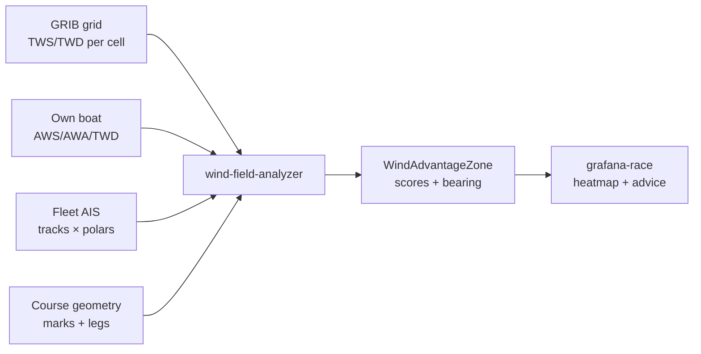

**Course discretization:**

- Divide active leg into **sectors** (default 0.25 NM grid or 500 m along-leg bins).
- For each sector center `(lat, lon)`:

| Input | Computation |
|-------|-------------|
| GRIB | Interpolate TWS/TWD at valid time nearest race now |
| Own instruments | Bias-correct GRIB with recent `AWS/TWD` residual (last 15 min) |
| Fleet AIS | For competitors in sector: `Δ = SOG_actual − SOG_polar(TWS,TWA)` |
| Own polar | `VMG_target` vs `VMG_actual` if own boat transited sector |

**Wind advantage score (0–1 per sector):**

```
score = w₁ · normalize(TWS)
      + w₂ · fleet_overperformance_mean
      + w₃ · (1 - competitor_density_penalty)
      + w₄ · vmg_potential_own_polar
```

Default weights: `w₁=0.35, w₂=0.40, w₃=0.10, w₄=0.15` (tunable per boat class).

**Outputs:**

| Artifact | Destination |
|----------|-------------|
| `WindAdvantageZone` nodes | Neo4j — sector polygon, score, TWS/TWD, timestamp |
| `wind_zone` time series | InfluxDB — sector scores for replay |
| Tactical recommendation | `tactical-coach` + grafana-race — e.g. *"Port side of beat: +1.2 kt fleet overperformance vs polars"* |
| GeoJSON layer | grafana-race geomap — green/yellow/red sectors |

**Example Cypher result:**

```cypher
(:WindAdvantageZone {
  sector_id: "leg2_bin_04",
  score: 0.82,
  tws_kn: 13.4,
  twd_deg: 245,
  fleet_delta_sog: 0.9,
  recommendation: "Favor port tack ladder — fleet gaining on polars"
})
```

**Offline behavior:** Without fresh GRIB, analyzer uses **last GRIB + instrument bias + AIS fleet deltas only** (degraded mode banner). AIS and polars work fully offline.

#### 7.12.6 Grafana-race panels (wind & fleet)

| Panel | Data source |
|-------|-------------|
| Fleet AIS map | Influx `ais_tracks` + Neo4j `Vessel` |
| GRIB wind barbs | `grib-parser` API overlay on course |
| Polar performance % | own + selected competitor MMSI |
| Wind advantage heatmap | `WindAdvantageZone` GeoJSON |
| GRIB freshness | `GribModel.valid_from` age indicator |

---

### 7.13 Race courses, waypoints & live results

**SLA tier:** SLA-2 (+ optional SLA-3 vision for flag photos)  
**Containers:** `course-parser`, `live-results`, `course-editor`, `course-flag-detector`  
**Reference SI (narrative routes):** `C:\Repositories\boat_system\Seilingsbestemmelser_Færderseilasen26_2.pdf` — §11  
**Reference SI (flag-signaled courses):** `C:\Repositories\boat_system\Seilingsbestemmelser Høstcup 2025 ENDELIG.pdf` — Vedlegg 1 & 2

#### 7.13.1 Competition program course parsing

Regatta **Sailing Instructions (SI)** and **Notice of Race (NOR)** PDFs describe race routes as narrative bullet lists — often with mixed coordinate precision. The system must parse these into structured waypoints for **VMG**, **leg geometry**, and **live results**.

**Reference — Færderseilasen 2026, §11:**

> *"Oppgitte GPS posisjoner er omtrentlige. De oppgitte distansene brukes til resultatberegning."*  
> *(Stated GPS positions are approximate. Stated distances are used for result calculation.)*

**Example routes extracted from chapter 11:**

| Route ID | Name | Coordinates in SI | Rounding notes |
|----------|------|-------------------|----------------|
| `11.1` | Tristein | Nærsnes `N59°46,3 Ø010°31,0`; lysbøye `N59°52,50' Ø010°38,76'` | Tristein stb, Bile port |
| `11.2` | Hollænderbåen | Same partial coords | Hollænderbåen stb |
| `11.3` | Mefjordbåen | Same | Mefjordbåen stb |
| `11.4` | Mølen | Same | Mølen + Bile port |
| `11.5` | Oslo–Moss | Same | Finish Moss |
| `11.6` | Tristein (Sarpsborg) | No coords — named islands | Sandøy stb, Tresteinene port |

**`course-parser` pipeline:**

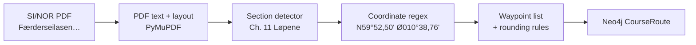

**Coordinate patterns parsed (WGS-84):**

| Pattern | Example | Decimal output |
|---------|---------|----------------|
| Degrees + decimal minutes | `N59°52,50' Ø010°38,76'` | `59.8750, 10.6460` |
| Degrees + decimal minutes (no prime) | `N59°46,3 Ø010°31,01` | `59.7717, 10.5168` |
| Named feature only | `Bygdøy og Nakholmen` | `coords: null` → user entry |

**Parsed waypoint schema (`waypoints/{route_id}.json`):**

```json
{
  "route_id": "11.1",
  "name": "Tristein",
  "regatta": "Færderseilasen 2026",
  "source_file": "Seilingsbestemmelser_Færderseilasen26_2.pdf",
  "source_section": "11.1",
  "distance_nm": null,
  "waypoints": [
    {"seq": 1, "name": "Startlinje Oslo havn", "lat": null, "lon": null, "type": "start"},
    {"seq": 2, "name": "Bygdøy og Nakholmen", "lat": null, "lon": null, "type": "gate", "note": "between"},
    {"seq": 3, "name": "Lysbøye Nesoddtangen", "lat": 59.875, "lon": 10.646, "type": "mark", "rounding": "pass_north_west"},
    {"seq": 4, "name": "Nærsnes", "lat": 59.7717, "lon": 10.5168, "type": "mark", "rounding": "pass_north_west"},
    {"seq": 5, "name": "Tristeingrunnen / Færder Fyr", "lat": null, "lon": null, "type": "mark", "rounding": "starboard"},
    {"seq": 6, "name": "Bile", "lat": null, "lon": null, "type": "mark", "rounding": "port"},
    {"seq": 7, "name": "Mål", "lat": null, "lon": null, "type": "finish"}
  ]
}
```

**API:**

| Endpoint | Action |
|----------|--------|
| `POST /courses/parse` | Upload SI/NOR PDF → extract all §11 routes |
| `GET /courses/{race_id}/routes` | List parsed routes for active regatta |
| `PUT /courses/{route_id}/waypoints` | Save user-edited coordinates |
| `GET /courses/{route_id}/geojson` | Course line for Grafana map |

**Parsing profiles** — `course-parser` supports two SI patterns:

| Profile | Example regatta | Course discovery |
|---------|-----------------|------------------|
| `narrative` | Færderseilasen §11 | Named sections (`11.1 Tristein`, …) |
| `flag_signaled` | Høstcup Vedlegg 1/2 | **Bane A / Bane B** + start-boat **numeral pennants** |

#### 7.13.2 Multiple courses per race & start-boat flag signaling

A single regatta often publishes **several possible courses** for the same race. The **actual course** is communicated at the start line by flags displayed on the **committee / start boat** — not known until the start sequence.

**Reference — Høstcup 2025, Vedlegg 1 (distanseseilaser):**

> *"Bane A seiles hvis tallstander 2 er vist ombord i startbåten ved start. Bane B seiles når tallstander 3 er vist ombord i startbåten ved start."*

**Supplementary signal (same appendix):**

> *"Dersom signalflagg **T** vises ombord i startbåten ved start skal første merke rundes om styrbord. Er ikke signalflagg T vist … skal første merke rundes om babord."*

**Class flags (Høstcup §7)** — identify which fleet you start with:

| Class | Description | Flag |
|-------|-------------|------|
| 1 | NOR Rating distanseseilaser | **Oscar** |
| 2 | NOR Rating shorthand distanse | **Echo** |
| 3 | NOR Rating baneseilaser | **Foxtrot** |

**Course variants per class (Høstcup):**

| Class | Appendix | Variants | Start-boat signal |
|-------|----------|----------|-------------------|
| 1–2 | Vedlegg 1 | **Bane A** (~22 nm), **Bane B** (~23 nm) | Numeral **2** → A, **3** → B |
| 3 | Vedlegg 2 | Short / medium / long windward-leeward | **None** / **2** / **3** |

**Vedlegg 2 baneseilaser sequences:**

| Signal on start boat | Mark sequence |
|---------------------|---------------|
| No numeral | Start – 1 – 1a – 2 – 1 – 1a – Mål |
| Numeral **2** | Start – 1 – 1a – Mål |
| Numeral **3** | Start – 1 – 1a – 2 – 1 – 1a – 2 – 1 – 1a – Mål |

**Data model (Neo4j):**

```cypher
(r:Regatta {id: "hostcup-2025"})-[:HAS_CLASS]->(cf:ClassFlag {
  class_no: 3,
  name: "NOR Rating baneseilaser",
  ics_flag: "Foxtrot",
  letter: "F"
})

(r)-[:OFFERS_COURSE]->(cr:CourseRoute {
  route_id: "bane-a",
  name: "Bane A",
  distance_nm: 22,
  appendix: "vedlegg-1"
})

(sb:StartBoatSignal {
  signal_type: "numeral_pennant",
  display: "2",
  maps_to_route_id: "bane-a"
})

(cr)-[:REQUIRES_SIGNAL]->(sb)

(ss:SupplementarySignal {
  ics_flag: "T",
  effect: "first_mark_rounding",
  rounding: "starboard",
  default_if_absent: "port"
})

(sel:CourseSelection {
  race_id: "hostcup-2025-race2",
  route_id: "bane-a",
  source: "user",           // user | vision | default
  vision_confidence: null,
  selected_at: datetime(),
  supplementary: ["T"]        // active modifier flags
})
```

**`course-parser` output for flag-signaled regattas (`courses/hostcup-2025.json`):**

```json
{
  "regatta_id": "hostcup-2025",
  "source_file": "Seilingsbestemmelser Høstcup 2025 ENDELIG.pdf",
  "class_flags": [
    {"class_no": 1, "ics_flag": "Oscar", "letter": "O"},
    {"class_no": 2, "ics_flag": "Echo", "letter": "E"},
    {"class_no": 3, "ics_flag": "Foxtrot", "letter": "F"}
  ],
  "start_boat_signals": [
    {"signal": "numeral_2", "display": "2", "route_id": "bane-a"},
    {"signal": "numeral_3", "display": "3", "route_id": "bane-b"},
    {"signal": "none", "display": null, "route_id": "wl-long", "classes": [3]}
  ],
  "supplementary_signals": [
    {"ics_flag": "T", "affects": "waypoint_1", "rounding_if_present": "starboard", "rounding_if_absent": "port"}
  ],
  "routes": [
    {
      "route_id": "bane-a",
      "name": "Bane A",
      "distance_nm": 22,
      "requires_signal": "numeral_2",
      "waypoints": [
        {"seq": 1, "name": "Kryssmerke", "lat": null, "lon": null, "rounding": "from_T_flag"},
        {"seq": 2, "name": "Østre Måsane", "lat": 59.8269, "lon": 10.5835, "rounding": "starboard"}
      ]
    },
    {
      "route_id": "bane-b",
      "name": "Bane B",
      "distance_nm": 23,
      "requires_signal": "numeral_3",
      "waypoints": []
    }
  ]
}
```

**Runtime behaviour:**

1. Before start: all `CourseRoute` variants for the regatta are loaded; **none** is active.
2. At start sequence: crew observes start boat (or receives GoPro capture).
3. `CourseSelection` is created — binds `race_id` + `route_id` + modifiers.
4. `live-results`, `wind-field-analyzer`, and VMG use **only the selected route**.
5. Changing selection mid-race requires user override + audit log (normally fixed at start).

#### 7.13.3 Start-line flag UX & vision detection

**Container:** `course-editor` (React/TypeScript) — **Start Line** panel  
**Optional:** `course-flag-detector` (SLA-2 or SLA-3) — Coral + vision on start-boat photo

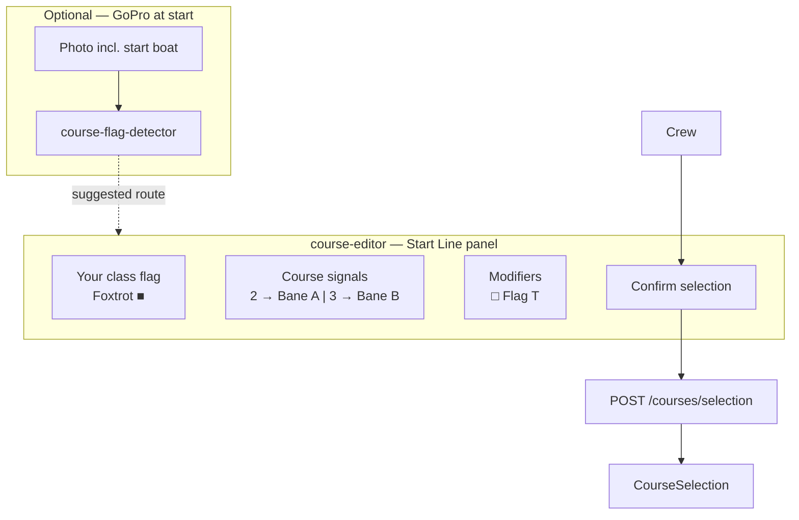

**UX requirements (`http://race.local:3010/start`):**

| Panel | Content |
|-------|---------|
| **Your class** | ICS flag graphic + name for own boat's fleet (from `vessel.yaml` `class_no` or user setting) — e.g. **Foxtrot** for Høstcup class 3 |
| **Course signals** | All `StartBoatSignal` options for this class — visual numeral pennants **2**, **3**, or "no numeral" with route name (**Bane A**, **Bane B**, WL short, …) |
| **Modifiers** | Toggle supplementary flags (**T**) when observed on start boat |
| **Vision suggestion** | If GoPro photo processed: *"Detected: numeral 2 → Bane A (87%)"* with **Accept** / **Override** |
| **Confirm** | Locks `CourseSelection` for active `race_id`; shows selected track on map |

**Flag visuals:** Render standard ICS racing flag shapes (numeral pennants 0–9, letter flags, **T** = red cross on white) — not text-only.

**`course-flag-detector` pipeline (optional):**

1. Trigger: manual upload, GoPro burst at start, or `capture_trigger` on preparatory signal.
2. Coral ROI: locate start boat / flag halyard region.
3. Classify visible flags: numeral pennants, **T**, class flags (CNN or small vision model).
4. Map to `StartBoatSignal` → suggested `route_id` + `SupplementarySignal[]`.
5. Return `{ suggested_route, confidence, flags_detected[] }` — **never auto-lock** without user confirm (configurable `auto_select_above_confidence: 0.95` for advanced users).

**API:**

| Endpoint | Action |
|----------|--------|
| `GET /courses/{regatta_id}/signals` | Class flags + start-boat signals + supplementary |
| `POST /courses/selection` | Set active course `{ race_id, route_id, supplementary[], source }` |
| `GET /courses/selection/{race_id}` | Current selection |
| `POST /courses/flag-detect` | Image → suggested course |
| `PUT /courses/selection/{race_id}/override` | User override with reason |

**Integration with Færderseilasen-style regattas:** Routes like `11.1`–`11.6` may also be signaled from the committee boat; parser stores optional `StartBoatSignal` mappings when SI defines them. If not defined, user picks route manually from list (same UX, no vision mapping).

#### 7.13.4 Waypoint coordinates — `course-editor` as system of record

**ADR:** [0020 — course-editor as coordinate system of record](./adr/0020-course-editor-coordinate-system-of-record.md)

`course-editor` is the **only** authoritative writer of waypoint **`lat` / `lon`**. `course-parser` and shore skills seed `WaypointList` YAML with structure and `si_coord` text; producers below **read** editor-saved YAML.

| Role | Component | Coordinates |
|------|-----------|-------------|
| Bootstrap | `course-parser`, `course-from-si` skill | Provisional or `null` — not final |
| **System of record** | **`course-editor`** | **Authoritative WGS-84** |
| Producers | `race-import`, `marine-map-gpx-export`, `live-results`, `race-intelligence`, `race-ui` | Read-only from SoR YAML → Neo4j |

When `course-parser` cannot resolve coordinates, the crew enters them via **`course-editor`** — a **React + TypeScript** SPA on the SLA-2 Pi (may merge into `race-ui` over time; coordinate SoR unchanged).

| Attribute | Value |
|-----------|-------|
| **Stack** | React 18, TypeScript, Vite |
| **Map** | Leaflet + OpenStreetMap tiles (cached offline) |
| **Host** | `http://race.local:3010` |
| **Container** | `course-editor` (nginx + static build) |
| **Auth** | Local PIN (harbor setup) |

**UX flow:**

1. Select regatta → select route (e.g. `11.1 Tristein`).
2. List shows waypoints with **red** (missing coords) / **green** (resolved).
3. Tap waypoint → place pin on map or type `lat/lon` (decimal or DMS).
4. Optional: tap own-boat AIS position to snap nearby mark.
5. **Save** → `PUT /courses/{route_id}/waypoints` → **`courses/routes/*.yaml`** (data repo) + Neo4j `Waypoint` MERGE (same values).
6. Optional **Export marine map** → regenerates `export/marine-map/` from saved YAML ([§7.23](#723-marine-map-gpx-export)).
7. Export GeoJSON for Grafana-race overlay (derived from SoR).

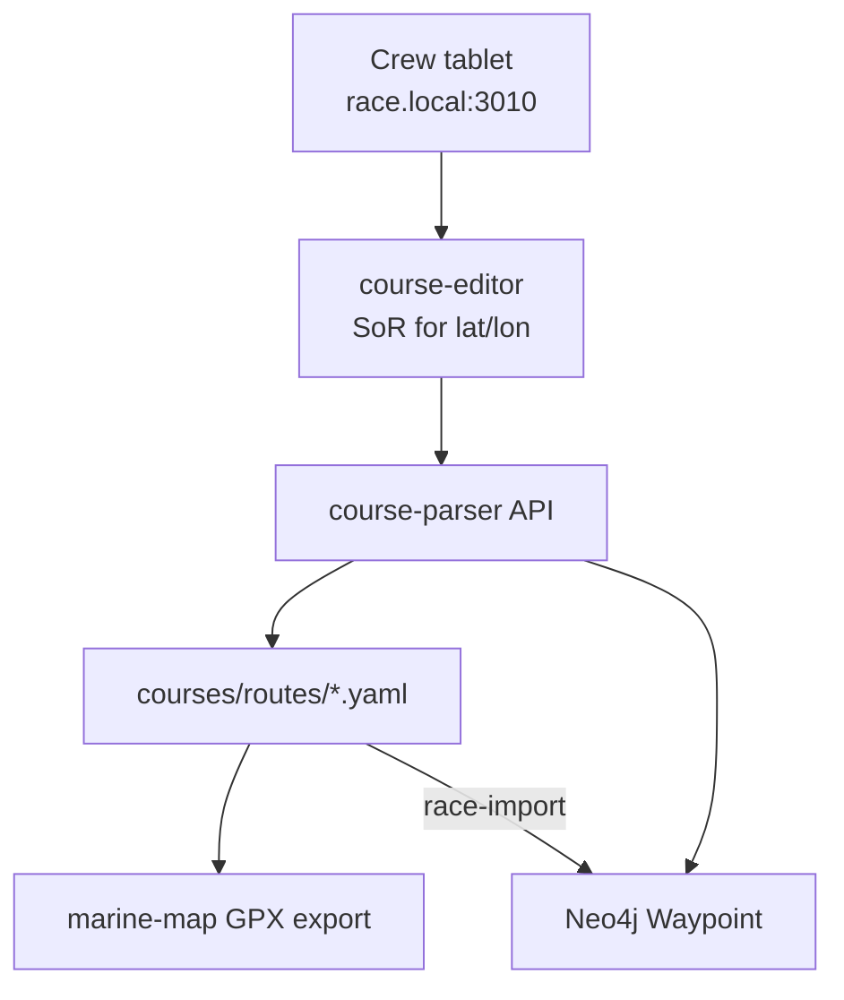

**Offline:** Map tiles pre-cached; editor works without internet after initial harbor setup.

#### 7.13.5 VMG and progress along course

**Container:** `live-results` (uses parsed waypoints + AIS + SLA-1 wind)

For **own boat and each competitor**, compute:

| Metric | Formula / method |
|--------|------------------|
| **Leg** | Active segment between last rounded WP and next WP |
| **DTM** | Distance to next mark (nm) |
| **BTM** | Bearing to mark (°T) |
| **VMG** | `SOG × cos(angle between COG and BTM)` — toward next mark |
| **Target VMG** | From polar at current TWS/TWA toward mark |
| **Course %** | Distance sailed along route / total route distance |
| **ETA** | `DTM / VMG` (when VMG &gt; 0) |

Coordinates from chapter 11 enable VMG **relative to the rhumb line** on each leg, not just absolute SOG.

**Influx measurements (`course_progress`):**

| Tags | Fields |
|------|--------|
| `mmsi`, `race_id`, `route_id`, `leg_seq` | `vmg`, `dtm`, `btm`, `course_pct`, `lat`, `lon` |

#### 7.13.6 Live results list (corrected time ordering)

**Reference SI §23:** *"Korrigert tid brukes til resultatberegning, korrigert tid = seilt tid × handicap"*

**`live-results`** computes **provisional standings** during the race (requires active **`CourseSelection`**):

```mermaid
flowchart LR
    AIS["AIS positions\nown + fleet"]
    WP["Waypoint route\n+ leg progress"]
    HCAP["handicap-manager\nactive TCF/APH"]
    LR["live-results"]
    STAND["LiveStanding\nranked list"]
    GF["grafana-race\nresults panel"]

    AIS --> LR
    WP --> LR
    HCAP --> LR
    LR --> STAND --> GF
```

**Per boat:**

1. **Elapsed time** — from start signal to now (or projected finish).
2. **Distance progress** — fraction of course completed (waypoint sequence + AIS projection).
3. **Projected finish time** — `elapsed / course_pct` (when &gt; 5% complete).
4. **Corrected time** — `projected_elapsed × handicap_factor` (see §7.14).
5. **Rank** — sort all vessels by corrected time ascending.

**Neo4j `LiveStanding` (refreshed every 30 s):**

```cypher
(:LiveStanding {
  mmsi: "…",
  rank: 3,
  elapsed_s: 14400,
  projected_finish_s: 28800,
  corrected_s: 34790,
  handicap_type: "aph_tot",
  handicap_value: 1.2082,
  course_pct: 0.50,
  vmg_to_mark: 4.2,
  updated_at: datetime()
})
```

**Grafana-race panel:** scratch sheet style table — rank, sail no., name, corrected time, delta to leader, leg, VMG.

---

### 7.14 Handicap numbers & scoring

**Container:** `handicap-manager`  
**Reference certificate:** `C:\Repositories\boat_system\ORC Certificate for Off Course.pdf`  
**Per-race scoring:** [ORC Weather Routing Scoring (WRS) 2026](https://orc.org/sailors/news-archive/orc-weather-routing-scoring-ready-for-2026-after-a-breakthrough-2025-season)

A single boat may carry **multiple handicap numbers** simultaneously. The active factor depends on **regatta scoring rules** and **race type**.

#### 7.14.1 Handicap types per vessel (ORC certificate)

Parsed from ORC certificate PDF (same pipeline as competitor polar extraction):

**Example — OFF COURSE (NOR 15788), CertNo 667232:**

| Type | Key | Value | Use when |
|------|-----|-------|----------|
| **APH ToD** | `aph_tod` | 496.6 s/NM | Time-on-distance, windward/leeward |
| **APH ToT** | `aph_tot` | 1.2082 | Time-on-time (single number) |
| **Cert number** | `cert_no` | 667232 | ORC database reference |
| **ORC Ref** | `orc_ref` | 03440003WLQ | Certificate ID |
| **Distanseseilas Singeltall** | `scoring_aph` | 1.2082 | Færderseilasen distance race (§23) |
| **Distanseseilas Trippeltall svak vind** | `scoring_triple_light` | 0.9544 | Light air |
| **Distanseseilas Trippeltall mellomvind** | `scoring_triple_medium` | 1.2160 | Medium wind |
| **Distanseseilas Trippeltall sterk vind** | `scoring_triple_heavy` | 1.3471 | Heavy wind |
| **Pølsebane Trippeltall** (weak/med/strong) | `scoring_wl_*` | 0.7409 / 0.9823 / 1.1070 | Windward-leeward courses |
| **Motvind Singeltall** | `scoring_upwind` | 1.1113 | Upwind-biased |
| **Medvind Singeltall** | `scoring_downwind` | 1.2015 | Downwind-biased |
| **Windward/Leeward ToD** | `tod_wl` | 615.6 s/NM | Course-specific allowance |
| **All purpose ToD** | `tod_allpurpose` | 496.6 s/NM | General |

**`config/handicaps.yaml` (OFF COURSE example):**

```yaml
vessels:
  - name: "OFF COURSE"
    sail_number: "NOR 15788"
    mmsi: null
    certificate:
      path: "../ORC Certificate for Off Course.pdf"
      cert_no: "667232"
      orc_ref: "03440003WLQ"
      valid_until: "2026-03-31"
    ratings:
      - type: aph_tot
        value: 1.2082
        source: certificate
      - type: aph_tod
        value: 496.6
        unit: sec_per_nm
        source: certificate
      - type: scoring_triple_light
        value: 0.9544
        source: certificate
      - type: scoring_triple_medium
        value: 1.2160
        source: certificate
      - type: scoring_triple_heavy
        value: 1.3471
        source: certificate
      # … additional scoring options from certificate page 2
```

**Neo4j model:**

```cypher
(v:Vessel)-[:HAS_HANDICAP]->(h:HandicapRating {
  type: "aph_tot",
  value: 1.2082,
  source: "certificate",
  valid_from: date("2025-08-11"),
  valid_to: date("2026-03-31"),
  active: false
})
```

Multiple `HandicapRating` nodes per vessel; exactly one marked `active` per race.

#### 7.14.2 Per-race handicap — ORC Weather Routing Scoring (WRS)

For regattas using **[ORC WRS](https://orc.org/sailors/news-archive/orc-weather-routing-scoring-ready-for-2026-after-a-breakthrough-2025-season)**, each boat receives a **custom Time Correction Factor (TCF)** per race — derived from:

- Predicted wind on each **leg** of the **declared course**
- Boat's **ORC polar performance curves**
- **Predicted Elapsed Time (PET)**

| Attribute | WRS behaviour |
|-----------|---------------|
| **Issued** | Few hours before start by ORC |
| **Scope** | Per race, per boat (not on certificate) |
| **Overrides** | Static APH ToT for that race only |
| **Input to system** | Manual upload, email, or `manage2sail` scrape |

**`HandicapRating` for WRS:**

```cypher
(v:Vessel)-[:HAS_HANDICAP]->(h:HandicapRating {
  type: "wrs_tcf",
  value: 1.0342,
  source: "orc_wrs",
  race_id: "faerderseilasen-2026-leg1",
  pet_seconds: 87432,
  issued_at: datetime(),
  active: true
})
```

**`handicap-manager` selection logic:**

```mermaid
flowchart TD
    START["Race session start"]
    WRS{"WRS TCF issued\nfor this race?"}
    RULES["Read SI §23\nscoring method"]
    WIND{"Triple number\nwind band?"}
    WRS_Y["Use wrs_tcf"]
    SINGLE["Use scoring_aph or aph_tot"]
    TRIPLE["Use scoring_triple_* by TWS"]
    START --> WRS
    WRS -->|yes| WRS_Y
    WRS -->|no| RULES --> WIND
    WIND -->|yes| TRIPLE
    WIND -->|no| SINGLE
```

For **Færderseilasen 2026 §23** (Racing classes): `corrected = elapsed × handicap` → use `aph_tot` / `scoring_aph` (1.2082) unless WRS or triple-number specified in SI.

#### 7.14.3 Integration with live results and polars

| Component | Handicap use |
|-----------|--------------|
| `live-results` | Active `HandicapRating` → corrected time ranking |
| `wind-field-analyzer` | Fleet overperformance vs **polar** (not handicap) |
| `polar-manager` | Speed prediction; separate from time correction |
| `tactical-coach` | Explains rank delta using handicap + VMG context |

**Own boat** — **Xbox** (NOR 10133): SLK `7710.slk` matches [ORC Certificate for Xbox.pdf](https://github.com/cognite-fholm/AI-sailing-data) (CertNo 7710). Competitor **OFF COURSE** uses separate ORC cert — both need `HandicapRating` nodes before live results activate.

#### 7.14.4 File layout (dev machine)

```
C:\Repositories\boat_system\
├── AI-sailing-system\          ← code, containers, CI
├── AI-sailing-data\            ← races, boats, planning (GitHub)
├── 7710 (3).slk                ← source polar → copied to data repo assets
├── ORC Certificate for Off Course.pdf
├── Seilingsbestemmelser_*.pdf
└── off_course.png
```

Legacy `AI-sailing-system/config/*.yaml` files are **deprecated** in favor of `AI-sailing-data` — kept as dev shortcuts until `race-import` is implemented.

### 7.15 Race & boat data repository (AI-sailing-data)

**Repository:** [github.com/cognite-fholm/AI-sailing-data](https://github.com/cognite-fholm/AI-sailing-data)  
**ADR:** [0009](./adr/0009-dual-repository-race-data.md), [0022](./adr/0022-yaml-ld-interconnected-data.md)  
**Schema:** `schema/README.md` in data repo  
**Linked Data format:** [W3C YAML-LD 1.0](https://w3c.github.io/yaml-ld/) — `schema/yaml-ld/context.jsonld`, agent skills `yaml-ld-write` / `yaml-ld-read`

#### 7.15.1 Purpose — onshore planning

All regatta preparation happens in **git** before leaving harbor:

| Activity | Data repo location |
|----------|-------------------|
| GRIB strategy | `races/.../planning/grib-plan.yaml` |
| Weather insights | `planning/weather-notes.md` |
| Course preference | `planning/course-preference.yaml` |
| Waypoints & routes | `courses/routes/*.yaml` |
| Fleet & handicaps | `fleet.yaml` + `boats/{sail_number}/{year}/ratings.yaml` |
| Human strategy | `wiki/planning.md` |
| Neo4j preload | `neo4j/import-order.yaml` + nodes/relationships |
| LLM bootstrap | `okf/*.md` |

#### 7.15.2 Boat organization

One boat may hold **multiple ORC certificates per year** (Club, DH, NS, International). Each certificate has a **unique ORC Ref** and a **matched SLK** — never share polars across certificate types.

```
boats/NOR-10133/                 # Xbox
  2024/season.yaml
  2024/certificates/
    international-034400038T6/   # SLK from own boat 2024.zip
    dh-international-03440003A8L/
    ns-international-034400038UH/
  2023/certificates/club-03440002JNA/
  2021/certificates/dh-club-03440001K3L/
```

Race planning sets `active_certificate_ref` in `planning/course-preference.yaml`.

Each **year** folder captures rating changes. Competitors the own boat has raced are retained for fleet analysis across seasons.

#### 7.15.3 Race organization

```
races/
  2025/2025-10-hostcup/         # Høstcup — Bane A/B, class flags
  2026/2026-06-faerderseilasen/ # Færderseilasen §11 routes
```

Folder name: `{year}-{month}-{slug}`. Manifest: `race.yaml` (`kind: Race`).

#### 7.15.4 Neo4j YAML import format

Declarative files use `apiVersion: sailing.cognite-fholm/v1` and **YAML-LD** headers ([§7.15.8](#7158-yaml-ld-linked-data-format)):

```yaml
"@context":
  - "https://sailing.cognite-fholm/schema/v1/context.jsonld"
  - "@base": "https://sailing.cognite-fholm/data/v1/"
"@id": "boats/NOR-10133/neo4j/nodes/vessel.yaml"
"@type": "sailing:Neo4jNode"
apiVersion: sailing.cognite-fholm/v1
kind: Neo4jNode
metadata:
  "@id": "urn:sailing:entity:vessel-xbox"
  ref: vessel-xbox
spec:
  labels: [Vessel]
  merge_keys: [id]
  properties:
    id: own-boat
    sail_number: "NOR-10133"
    is_own: true
```

`race-import` resolves `from` / `to` entity node objects (or legacy `from_ref` / `to_ref`) in relationship files and executes idempotent `MERGE`. **Runtime-only** labels (`LiveStanding`, `CourseSelection`, `AisTrack`) are never imported from git.

#### 7.15.5 `race-data-sync` service

**Container:** `race-data-sync` (SLA-2)  
**Config:** `config/data-repo.yaml`

| Setting | Default |
|---------|---------|
| `repo_url` | `https://github.com/cognite-fholm/AI-sailing-data.git` |
| `local_path` | `/opt/ai-sailing-data` |
| `branch` | `main` or race tag |
| `poll_interval_minutes` | 60 when `ONLINE_MODE=true` |
| `auto_pull` | `true` in harbor; `false` when `RACE_MODE=true` (configurable) |

**Flow:**

1. Compare `git rev-parse HEAD` with `git ls-remote origin`.
2. If remote ahead and policy allows → `git pull --ff-only`.
3. Emit event → `race-import` (optional auto) + `okf-loader` refresh + `polar-manager` reload.
4. Log sync result to Neo4j `DataSyncEvent` node.

**LTE:** Uses Teltonika router WAN — no marina Wi-Fi required for data-only updates.

**Complement (boat → GitHub):** `race-live-sync` pushes `race-live/current.yaml` every 5 min on LTE — [§7.24](#724-race-live-sync-and-archive), [ADR-0025](./adr/0025-race-live-sync-github-temporal.md). Use `SYNC_AUTO_PULL=false` during race to avoid merge conflicts with live push.

#### 7.15.6 `race-import` service

```bash
race-import apply --race faerderseilasen-2026 [--dry-run]
race-import apply --boat 7710 --year 2026
```

Loads boats referenced in `fleet.yaml`, then race `neo4j/import-order.yaml`. Validates against `schema/README.md` before MERGE.

Loads boats referenced in `fleet.yaml`, then race `neo4j/import-order.yaml`. Validates against `schema/README.md` and YAML-LD rules ([§7.15.8](#7158-yaml-ld-linked-data-format)) before MERGE.

#### 7.15.8 YAML-LD linked data format

**Standard:** [W3C YAML-LD 1.0](https://w3c.github.io/yaml-ld/) — Basic profile, UTF-8, YAML 1.2+  
**ADR:** [0022](./adr/0022-yaml-ld-interconnected-data.md)  
**Normative detail:** [AI-sailing-data `schema/yaml-ld/README.md`](https://github.com/cognite-fholm/AI-sailing-data/blob/main/schema/yaml-ld/README.md)  
**User guide:** [AI-sailing-data `docs/YAML_LD.md`](https://github.com/cognite-fholm/AI-sailing-data/blob/main/docs/YAML_LD.md)

All **interconnected fact YAML** under `boats/`, `races/`, and Neo4j templates in AI-sailing-data MUST be valid YAML-LD documents: convertible to JSON-LD without semantic loss.

##### 7.15.8.1 Why YAML-LD

| Before | After (YAML-LD) |
|--------|-----------------|
| `metadata.ref` strings matched by convention | Entity `@id` URNs (`urn:sailing:entity:{ref}`) |
| Cross-file links as bare strings | Typed node objects `{"@id": "...", "@type": "sailing:..."}` |
| No document identity | Document `@id` = repo-relative path under `@base` |
| YAML 1.1 `NO`/`yes` boolean traps | YAML 1.2 + quoted strings — [Norway problem](https://w3c.github.io/yaml-ld/#interoperability-considerations) avoided |

The Kubernetes-style envelope (`apiVersion`, `kind`, `metadata`, `spec`) is **retained** for human editing and Pydantic models.

##### 7.15.8.2 Required document headers

| Key | Value |
|-----|-------|
| `@context` | `https://sailing.cognite-fholm/schema/v1/context.jsonld` + `@base` |
| `@id` | Repo-relative path, e.g. `boats/NOR-10133/boat.yaml` |
| `@type` | `sailing:{Kind}` — must match `kind` |
| `metadata["@id"]` | `urn:sailing:entity:{metadata.ref}` |
| `apiVersion` | `sailing.cognite-fholm/v1` |

Shared vocabulary: [`schema/yaml-ld/context.jsonld`](https://github.com/cognite-fholm/AI-sailing-data/blob/main/schema/yaml-ld/context.jsonld).

##### 7.15.8.3 Cross-document references

**Entity link** (same graph node across files):

```yaml
active_certificate:
  "@type": "sailing:OrcCertificate"
  "@id": "urn:sailing:entity:cert-international-034400038T6"
```

**Document link** (whole file is the target):

```yaml
polar_document:
  "@type": "sailing:PolarSource"
  "@id": "boats/NOR-10133/2024/certificates/international-034400038T6/polar.yaml"
```

##### 7.15.8.4 Agent and runtime enforcement

| Role | Mechanism |
|------|-----------|
| Shore authoring | Cursor skills `yaml-ld-write` / `yaml-ld-read` in AI-sailing-data |
| Runtime services | `yaml-ld-read` skill + Pydantic models in AI-sailing-system |
| `race-preparation` | Must invoke `yaml-ld-write` for all emitted fact YAML |
| CI | JSON-LD expansion + pyshacl SHACL — `scripts/validate_yaml_ld.py` on PR |

##### 7.15.8.5 Legacy files

Files without `@context` are **legacy** (none remain in `boats/`/`races/` as of 2026-07-07). Services and agents still apply [legacy fallback](https://github.com/cognite-fholm/AI-sailing-data/blob/main/.cursor/skills/yaml-ld-read/SKILL.md#legacy-fallback) for out-of-band files. New files without YAML-LD headers are **non-conformant**.

##### 7.15.8.6 Excluded files

Not YAML-LD: `collected/**/*.json`, binary assets, OKF markdown, wiki prose, `docker-compose*.yml`, `deploy/env/*`.

#### 7.15.10 Ontology constraints and Neo4j projection

**ADR:** [0023](./adr/0023-shacl-neo4j-projection-no-fuseki.md)  
**Artifacts:** [AI-sailing-data `schema/shacl/`](https://github.com/cognite-fholm/AI-sailing-data/tree/main/schema/shacl), [`schema/neo4j-mapping.yaml`](https://github.com/cognite-fholm/AI-sailing-data/blob/main/schema/neo4j-mapping.yaml)

Three-layer schema model (shore, versioned in AI-sailing-data):

| Layer | Artifact | Role |
|-------|----------|------|
| **Vocabulary** | `schema/yaml-ld/context.jsonld` | `sailing:` IRIs, `kind` ↔ `@type` |
| **Constraints** | `schema/shacl/*.shacl.ttl` | SHACL — cardinality, required fields, Neo4j template rules |
| **Runtime projection** | `schema/neo4j-mapping.yaml` | Maps ontology types → Neo4j labels, MERGE keys, relationship types |

**Validation (shore CI only):** `scripts/validate_yaml_ld.py` expands YAML-LD → RDF, runs **pyshacl**, and checks `Neo4jRelationship` `from_ref` / `to_ref` resolve to known `urn:sailing:entity:*` URNs.

**Neo4j (SLA-2)** remains the **runtime** property graph. It is not an RDF triple store and does not run SHACL. Declarative `neo4j/*.yaml` templates are validated in CI before `race-import` MERGE.

**Explicit non-goal:** Apache Jena Fuseki (or any RDF triple store) on SLA-1 or SLA-2 for v1. Optional future shore-only SPARQL endpoint; not on the critical path.

#### 7.15.9 Dual-repo deployment

| Step | System repo | Data repo |
|------|-------------|-----------|
| Harbor clone | `git clone` → `/opt/ai-sailing-system` | `git clone` → `/opt/ai-sailing-data` |
| Version pin | `deploy/locks/current.env` digests | `git checkout` tag or commit |
| Sync script | `harbor-pull.sh` | `harbor-sync.sh` → `race-data-sync pull` |
| Race freeze | GHCR image lock | `git checkout race-faerder-2026` |

### 7.16 iRegatta reference model & feature traceability

**ADR:** [0010 — iRegatta reference model](./adr/0010-iregatta-reference-model.md)  
**Manual:** [iRegatta User Manual v2.86](https://zifigo.com/sites/default/files/iRegattaUserManual.pdf) (Let's Create / Zifigo)

**iRegatta** is the **functional reference** for crew-facing race UX: start line, laylines, polar steering, waypoint navigation, and wind presentation. The AI Sailing System **extends** iRegatta with AIS fleet, ORC handicap live results, GRIB wind zones, SI PDF course import, and Neo4j/LLM coaching — but **must not regress** the tactical features sailors expect from iRegatta.

#### 7.16.1 View mapping — iRegatta → our surfaces

| iRegatta view | Primary surface | Container / service |
|---------------|-----------------|---------------------|
| Race | `grafana-race` — Race dashboard | `grafana-race`, `polar-manager`, `race-intelligence` |
| Layline | `grafana-race` map overlay | `race-intelligence`, `polar-manager` |
| Start | `course-editor` Start panel + Grafana Start row | `race-intelligence`, `course-editor` |
| Wind | `course-editor` Wind panel (manual override) | Signal K + `race-intelligence` |
| Wind history | Grafana wind panel | InfluxDB (SLA-1 wind paths) |
| Navigation | `course-editor` Navigation tab | `live-results`, Neo4j `Waypoint` |
| Waypoints / routes | `course-editor` + `AI-sailing-data` YAML | `course-parser`, `race-import` |
| Statistics | Grafana + optional map tile | InfluxDB, `grafana-race` |
| Polar | `polar-manager` API + Grafana polar panel | `polar-manager` (SLK primary) |
| NMEA / wind instrument | Grafana instrument row | Signal K (SLA-1) |
| Settings | Grafana preferences + `deploy/env/race.env` | Compose env, user prefs store |

On **iPhone**, iRegatta uses horizontal swipe between views. On the boat we use **Grafana dashboards** (read-mostly, big screen) plus **`course-editor`** at `race.local:3010` for setup actions (line ends, waypoints, course flags, manual wind).

#### 7.16.2 Race view parity

| iRegatta feature | Implementation |
|------------------|----------------|
| Four configurable readouts | Grafana stat panels; datasource Signal K + `race-intelligence` |
| BIG-mode (focus 1–2 readouts) | Dashboard row collapse / TV mode profile |
| GPS freshness dot + accuracy | Panel from `navigation.position` timestamp + `navigation.gnss.type` / accuracy meta |
| COG/SOG damping 0/3/5/10 s | `race-intelligence` rolling window before display |
| Lift indicator | `lift_deg = heading_now − avg_heading_10s`; threshold from config |
| Speed / VMG history bars | Grafana bar gauge or custom panel; timeframe 2/4/10/20 min |
| Performance bar | `performance_pct = SOG / polar_target_bsp × 100` at current TWS/TWA |
| Steering bars (VMG optimum) | Compare COG to polar optimum upwind/downwind angles; arrow hints |

**Configurable readout catalog** (minimum): SOG, COG, STW, HDG (mag/true), AWA, AWS, TWD, TWS, VMG-to-mark, VMG-to-wind, DTM, BTM, performance %.

#### 7.16.3 Lift, damping, and steering calculations

Formulas match iRegatta manual §Calculations:

```
damped_cog = mean(COG over last N seconds)     # N ∈ {0,3,5,10}
lift_deg   = COG_now − mean(COG over 10 s)
performance_pct = SOG / polar_bsp(TWS, TWA) × 100

# Steering: when polar "tack/jibe from polar" enabled
twa_opt_up   = argmax VMG_upwind(polar, TWS)
twa_opt_down = argmax VMG_downwind(polar, TWS)
steer_hint   = signed_delta(COG, recommended_cog_for_optimum_VMG)
```

When **NMEA wind** is available (Signal K `environment.wind`), manual wind entry is disabled — same rule as iRegatta Wind view.

#### 7.16.4 Layline view parity

Requires active **navigation target** (`CourseSelection` + current `Waypoint`):

1. Determine **upwind vs downwind** from TWD vs bearing to mark.
2. Fetch optimum tack/jibe angles from `polar-manager` (`GET /polars/{id}/target?tws=&twa=`) or manual angles from Wind panel.
3. Render laylines on `grafana-race` map: red tack/jibe lines, grey bearing line, grey heading arrow.

On distance races (Færderseilasen §11), laylines apply per **leg** after `live-results` advances leg index.

#### 7.16.5 Start view parity

**Container:** `race-intelligence` + `course-editor` Start panel

| iRegatta feature | Behavior |
|------------------|----------|
| Countdown | `Start` / `Pause` / `Sync` — sync rounds to nearest minute |
| Paused + Sync | Reset to pre-sync value (not round) |
| Timer beep | Optional audio on vision/helm tablet — configurable milestones |
| Gun at 0:00 | Emit `race_started` event; switch Grafana to Race dashboard |
| Line ends | Mark **Pin** and **Boat** by position capture or select preloaded waypoints from `AI-sailing-data` |
| Favored end | Green/red ends from wind angle to line normal (assumes upwind first leg) |
| Wind arrow | Exaggerated TWD relative to line for quick visual bias |
| Distance to line (DTL) | Perpendicular from bow (with offset) to line **and extensions** |
| Time to line (TTL) | `DTL / (SOG × cos(angle(COG, line_normal)))` — `X:XX` if diverging |
| Over early | TTL &lt; countdown → red styling |
| Burn or gain bar | Early: red from top proportional to `(countdown − TTL) / countdown`; late: green from bottom; on target: yellow |

```yaml
# config/start-line.yaml (reference)
bow_offset_m: 4.5          # GPS antenna → bow, or phone → bow if no NMEA GPS
countdown_initial_s: 300
sync_rounds_to_minute: true
timer_beep: true
beep_at: [60, 30, 10, 5, 4, 3, 2, 1]
assumes_upwind_first_leg: true
```

**Note:** Høstcup-style **course flags** (ADR-0006) layer on top — favored end uses selected route’s first leg bearing when known.

#### 7.16.6 Wind view and wind history

| Mode | Source |
|------|--------|
| **NMEA / Signal K** | `environment.wind.angleApparent`, `speedApparent`, derived true wind |
| **Manual** | `course-editor` Wind panel: type direction, compass shoot, or two-tack bisection |
| **Tack/jibe angles** | From polar (`polar.use_tack_jibe_from_polar: true`) or manual |

**True wind derivation** (when only apparent available — iRegatta NMEA rules):

1. Prefer compass heading + STW from instruments.
2. Else use COG + SOG from GPS.

**Wind history:** Influx continuous query — 30 min window, 30 s `mean()` samples of TWD/TWS → Grafana time series (iRegatta Wind History graph).

#### 7.16.7 Navigation, waypoints, and routes

| iRegatta feature | Our implementation |
|------------------|-------------------|
| Start / pause nav | `CourseSelection.nav_active` in Neo4j; API `POST /navigation/start` |
| Bearing + distance to WP | `live-results` leg metrics (§7.13.5) |
| Route prev/next | `course-editor` or REST `POST /navigation/route/{id}/step` |
| Auto-advance | When `distance_to_wp < auto_advance_m` (default from env) |
| Next leg preview | Bearing, leg length, estimated TWA from GRIB or last TWD |
| Add waypoint | Editor or commit to `AI-sailing-data` `courses/routes/*.yaml` |
| Temp WP — bearing & distance | Editor dialog from current AIS/GPS position |
| Temp WP — cross-bearing | Editor: two positions + bearings; flag low confidence |
| Delete / delete all | Editor with confirm; git commit for persistent routes |

**VMG basis:** When navigating, VMG uses **bearing to mark** (iRegatta rule). When not navigating, VMG uses **wind direction** — `race-intelligence` publishes both.

#### 7.16.8 GPX interchange

| Direction | Path |
|-----------|------|
| Export | `course-editor` → `waypointExport.gpx` (USB or download) |
| Import | Append waypoints/routes to Neo4j + optional merge into data repo (no silent overwrite) |

GPX supplements — does not replace — structured YAML in `AI-sailing-data` (rounding rules, class flags).

#### 7.16.9 Polar formats and trim

| Format | Role |
|--------|------|
| **SLK** (ORC måletall) | **Primary** own-boat polar — `polar-manager` |
| **CSV 20×360** (iRegatta export) | Interop import/export via `polar-manager` `csv_polar` adapter |
| **ORC certificate image** | Competitor derived polar — `polar-certificate-extractor` |

**iRegatta Trim pipeline** (for sparse CSV or derived polars):

1. Mirror port/starboard (take max of paired angles).
2. Interpolate missing TWA columns.
3. Smooth over 10° spans.
4. Interpolate across TWS rows.
5. Smooth over 4 kt TWS spans.

**Onboard polar recording** (iRegatta Statistics → record) is **not** v1 — polars come from ORC SLK and shore preparation ([AI-sailing-data](https://github.com/cognite-fholm/AI-sailing-data) certificate folders).

#### 7.16.10 NMEA and instrument presentation

iRegatta consumes **NMEA 0183 over Wi‑Fi** (TCP/UDP). This system uses **Signal K on SLA-1** as the single decoder:

| iRegatta | AI Sailing System |
|----------|-------------------|
| NMEA Wi‑Fi to phone | NMEA 0183 + N2K → PiCAN-M → Signal K |
| Ignore checksum option | Signal K plugin `strictChecksum: false` per talker |
| Magnetic vs true HDG | `environment.wind` / `navigation.headingMagnetic` paths |
| Wind instrument view | Grafana dual gauge: true vs apparent |
| Send RMB target (beta) | Optional Signal K → NMEA 0183 outbound plugin when `nav_active` |

**Compatibility:** A phone running **iRegatta** may connect to the same Wi‑Fi NMEA bridge as the Pi — both can coexist during transition.

#### 7.16.11 Global UI settings mapping

| iRegatta setting | Our config |
|------------------|------------|
| White/black theme | Grafana theme + `course-editor` CSS |
| Speed/distance units | Grafana unit prefs; Signal K meta |
| Screen lock | Kiosk mode / Grafana playlist lock (helm tablet) |
| Auto-lock idle | Browser/Grafana idle timeout |
| Waypoint format DMS vs DDM | `course-editor` display pref |
| Graph timeframe | Grafana dashboard variable `$graph_window` |
| Show performance bar | `RACE_SHOW_PERFORMANCE_BAR` |
| Show steering bars | `RACE_SHOW_STEERING_BARS` |
| Lift threshold | `RACE_LIFT_THRESHOLD_DEG` |
| COG/SOG damping | `RACE_DAMPING_SECONDS` |

#### 7.16.12 Beyond iRegatta (explicit scope expansion)

| Capability | Why outside iRegatta |
|------------|---------------------|
| AIS fleet tracks | Requires N2K AIS + `ais-collector` |
| Live ORC corrected standings | `handicap-manager` + `live-results` |
| GRIB wind zones | `wind-field-analyzer` |
| SI PDF §11 parse | `course-parser` |
| Start-boat course flags | ADR-0006 |
| Multi-certificate ORC | `AI-sailing-data` per-cert SLK |
| LLM tactical coach | SLA-2 `tactical-coach` |
| GoPro trim vision | SLA-3 |

Full traceability table: [ADR-0010](./adr/0010-iregatta-reference-model.md).

### 7.17 B&G H5000 reference model & integration

**ADR:** [0011 — B&G H5000 reference model](./adr/0011-bg-h5000-reference-model.md)  
**Manual:** [H5000 Operation Manual 988-10630-003](https://cxjdfr.files.cmp.optimizely.com/download/assets/en-us-H5000_OM_EN_988-10630-003_w.pdf/f9fdbcee044d11f0a251baecc01b2173)

The **B&G H5000** is the **primary instrument and race-display reference** for own-boat sailing (Xbox, NOR-10133). H5000 CPU + Graphic/Race displays remain the helm UI; the Pi stack **ingests**, **records**, **extends** (fleet, handicaps, GRIB, coaching), and **mirrors** key pages on `grafana-race`.

#### 7.17.1 Architecture — coexistence with H5000

```mermaid
flowchart LR
  subgraph h5000["B&G H5000 network"]
    CPU["H5000 CPU\nHydra/Hercules/Performance"]
    GD["Graphic / Race Display"]
    SENS["Wind, BSP, heel, GPS, 3D motion"]
    PILOT["Pilot Computer"]
  end

  subgraph sla1["SLA-1 telemetry Pi"]
    PICAN["PiCAN-M N2K"]
    SK["Signal K Server"]
  end

  subgraph sla2["SLA-2 race Pi"]
    RI["race-intelligence"]
    PM["polar-manager"]
    GF["grafana-race"]
    CE["course-editor"]
  end

  SENS --> CPU
  CPU -->|NMEA 2000| PICAN
  PICAN --> SK
  SK -->|WebSocket| RI
  SK --> PM
  RI --> GF
  CE --> RI
  GD -.->|helm primary| CREW["Crew"]
  GF -.->|tactical big screen| CREW
```

**Rules:**

1. **Do not recompute true wind** if H5000 already publishes corrected TWD/TWS on N2K — prefer talker data; fallback to SK derivation only when missing.
2. **Bow offset** and **start-line geometry** follow H5000 semantics (perpendicular DTL, bias in degrees and **boat lengths**).
3. **Autopilot:** ingest mode/rudder/setpoint; **no rudder commands** from Pi in v1.
4. **Polar:** ORC **SLK** in `AI-sailing-data` is canonical; export H5000-compatible CSV for MFD import when needed.

#### 7.17.2 Display page mapping (Graphic Display → Grafana)

| H5000 page | Grafana dashboard / panel | Key metrics |
|------------|---------------------------|-------------|
| **SailSteer** | `race-sailsteer` | HDG/Course, BSP, tide set/rate, WP name, TWD, laylines, TWA, TWS |
| **Speed/Depth** | `race-speed-depth` | BSP, depth, acceleration bargraph |
| **WindPlot** | `race-windplot` | TWD/TWS + histogram (1–60 min) |
| **Start line** | `race-start` + `course-editor` Start | DIST P/S, DTL⊥, BIAS°, BIAS ADV (lengths), timer, wind barb |
| **Highway** | `race-highway` | BRG, COG, XTE, DTM, ETA, off-course limit |
| **Tide** | `race-tide` | BSP, tide angle/rate vs hull, wind |
| **Depth history** | `race-depth` | Depth trend histogram |
| **Autopilot** | `race-pilot` (read-only) | Mode, set HDG/wind, rudder °, perf level |

Race Display **dual-value + bargraph** layout → Grafana row `race-display-compact` (TV mode).

#### 7.17.3 SailSteer, laylines, and tidal correction

Configured via race `planning/layline-preferences.yaml` (`kind: LaylinePreferences`):

| Setting | H5000 option | Our default |
|---------|--------------|-------------|
| `target_wind_angle_source` | Polar / Actual / Manual | `polar` (from active `PolarSource`) |
| `tidal_flow_correction` | On/off layline offset | `true` when tide data available |
| `layline_limit_minutes` | 5, 10, 15, 30 | `10` |

`race-intelligence` computes laylines using:

- Active waypoint from `CourseSelection`
- TWA targets from `polar-manager` or manual angles
- Tidal set/rate from instruments or harbor model → layline rotation

#### 7.17.4 Start line (H5000 StartLine + BowPosition)

**Containers:** `race-intelligence`, `course-editor`

| H5000 field | Description | Neo4j / runtime |
|-------------|-------------|-----------------|
| DIST P / DIST S | Distance to port/starboard end | `StartLineState.dist_port_m`, `dist_starboard_m` |
| DIST LINE | Perpendicular distance to line + extensions | `dist_line_m` (bow-adjusted) |
| BIAS | Angle wind ⊥ line | `bias_deg` |
| BIAS ADV | Advantage at favored end in **boat lengths** | `bias_boat_lengths` |
| Line ends | Ping at bow on line; stale at midnight | `StartLineEnd` nodes with `pinged_at`, `stale_after` |
| Timer | Race countdown | `RaceTimer` |

```yaml
# races/.../planning/start-line.yaml — kind: StartLinePreferences
spec:
  bow_offset_m: 4.5
  sync_countdown_to_minute: true
  show_bias_boat_lengths: true
  line_ends_stale_at_midnight: true
  assumes_upwind_first_leg: true
```

Aligns with iRegatta start metrics ([§7.16.5](#7165-start-view-parity)); H5000 adds **bias in boat lengths** and **tide direction** on start page.

#### 7.17.5 Instrument profile & calibration (boat YAML)

**Path:** `boats/{sail_number}/instrumentation/`

| File | Kind | Content |
|------|------|---------|
| `profile.yaml` | `InstrumentProfile` | `cpu_tier`, `bow_offset_m`, `damping`, `measured_sources`, `motion_correction` |
| `calibration.yaml` | `InstrumentCalibration` | Depth offset, BSP factor, MHU align, heel correction table |
| `alarms.yaml` | `AlarmProfile` | Depth, BSP, wind thresholds |

Example profile — see `AI-sailing-data/boats/NOR-10133/instrumentation/profile.yaml`.

**Dual sensors (Hercules+):** `measured_sources.boat_speed.switch_policy`: `mwa` \| `heel` \| `mwa_heel` \| `port` \| `starboard` — documented in profile; switching executed on H5000 CPU; Pi logs active source from N2K if exposed.

**3D motion wind correction:** requires `motion_correction.enabled`, `mast_height_m`, Hercules+ tier — reference only in v1; validate TWD against H5000 display in harbor.

#### 7.17.6 Polars, VMG targets, and H5000 export

| Format | Direction | Service |
|--------|-----------|---------|
| **SLK** (ORC) | Shore → Pi | `polar-manager` primary |
| **H5000 polar CSV** | Pi ↔ MFD | `polar-manager` `h5000_csv` adapter (20 TWS × 360 TWA) |
| **VMG targets** | Shore YAML → display | `PolarSource.spec.vmg_targets` |

Certificate `polar.yaml` may include:

```yaml
spec:
  h5000_export:
    enabled: true
    last_export_path: assets/h5000-polar.csv
  vmg_targets:
    upwind_source: polar
    downwind_source: polar
```

#### 7.17.7 Damping and dynamic boat speed

H5000 applies per-variable damping (0–9 s). Map to `InstrumentProfile.spec.damping`:

```yaml
damping:
  boat_speed_s: 3
  cog_s: 3
  heading_s: 2
  wind_speed_s: 3
  dynamic_boat_speed: 5   # Hercules+ only; 0 = off
```

`race-intelligence` and Grafana apply damping before display — same role as iRegatta COG/SOG damping ([§7.16.3](#7163-lift-damping-and-steering-calculations)).

#### 7.17.8 Alarms

Mirror safety-critical H5000 alarms on Grafana alert rules driven from Signal K:

| Alarm | Typical source |
|-------|----------------|
| Depth low | `environment.depth.belowTransducer` |
| BSP high/low | `navigation.speedThroughWater` |
| Wind high | `environment.wind.speedTrue` |
| AIS proximity | SLA-2 `ais-collector` |

Acknowledge flow documented for helm tablet; full network alarm groups deferred to v2.

**Tactical insight alerts** (fleet rank, course, trim, wind tactics) are a **separate system** — see [§7.21](#721-tactical-insight-alerts--annunciation). Do not route performance alerts through H5000 safety alarm groups.

#### 7.17.9 Autopilot integration (read-only v1)

Ingest via N2K / Signal K:

| Field | Use |
|-------|-----|
| Pilot mode | Auto / Wind / Nav / Standby |
| Set heading / wind angle | Coach context |
| Rudder angle | Maneuver detection |
| Performance level | Display on `race-pilot` panel |

**No** `SET_RUDDER` or pilot engage commands from Pi services.

#### 7.17.10 Signal K variable map

H5000 operating variables map to Signal K paths in  
[`AI-sailing-data/schema/h5000-variable-map.yaml`](https://github.com/cognite-fholm/AI-sailing-data/blob/main/schema/h5000-variable-map.yaml).

Key variables: **BSP**, **COG**, **SOG**, **HDG**, **Course** (HDG+leeway), **TWA/TWD/TWS**, **VMG**, **XTE**, **heel**, **trim**, **leeway**, **rudder**, **setpoint**.

#### 7.17.11 Beyond H5000

| Capability | Component |
|------------|-----------|
| Live ORC fleet standings | `live-results` + `handicap-manager` |
| AIS wind-pressure map | `wind-field-analyzer` |
| SI course import | `course-parser` |
| Start-boat course flags | ADR-0006 |
| LLM coach | `tactical-coach` |
| GoPro trim | SLA-3 |

Full traceability: [ADR-0011](./adr/0011-bg-h5000-reference-model.md).

### 7.18 Race-side MCP & laptop Cursor

**ADR:** [0012 — Race-side MCP](./adr/0012-race-side-mcp-laptop-cursor.md)

At the regatta the user may bring a **laptop** with **Cursor**, join the **boat LAN** (Teltonika Wi‑Fi or Ethernet), and run the same agent-assisted analysis used on shore — but against **live** race state.

#### 7.18.1 Purpose

| Shore (GitHub) | At race (boat LAN + MCP) |
|----------------|--------------------------|
| Prepare `AI-sailing-data` in Cursor | Query **live** standings, legs, AIS |
| Static YAML + wiki | **Influx** history — VMG, wind, polars |
| Neo4j import templates | **Neo4j** runtime graph — ad hoc Cypher |
| OKF concepts | **wind-field-analyzer** recommendations |
| — | **Signal K** snapshots — current instruments |

MCP bridges Cursor’s tool protocol to onboard services without exposing raw database admin ports to the laptop.

#### 7.18.2 Service: `race-mcp-gateway`

**Container:** `race-mcp-gateway` (SLA-2)  
**Endpoint:** `http://race.local:3100` (MCP over HTTP/SSE)  
**Language:** Python 3.11+ with official MCP SDK

```mermaid
flowchart LR
  subgraph laptop [Navigator laptop]
    CUR[Cursor]
    MCPc[MCP client]
    CUR --> MCPc
  end

  subgraph sla2 [race.local SLA-2]
    GW[race-mcp-gateway :3100]
    LR[live-results]
    PM[polar-manager]
    WF[wind-field-analyzer]
    GW --> LR
    GW --> PM
    GW --> WF
  end

  subgraph backends [Read-only backends]
    NEO[Neo4j]
    IFX[InfluxDB]
    SK[Signal K]
    DATA[AI-sailing-data mount]
  end

  MCPc -->|Wi‑Fi boat LAN| GW
  GW --> NEO
  GW --> IFX
  GW --> SK
  GW --> DATA
```

#### 7.18.3 MCP server endpoints

Configured in `config/mcp-gateway.yaml`. Implementation: `race-mcp-gateway/`.

| Endpoint | Server id | Tools | Backend |
|----------|-----------|-------|---------|
| `/mcp/neo4j` | `race-neo4j` | `cypher_query`, `get_live_standings`, `get_course_selection`, `get_fleet_positions`, `get_graph_schema` | Neo4j read role |
| `/mcp/influx` | `race-influx` | `flux_query`, `get_latest_instruments`, `get_wind_history`, `list_buckets` | Influx read token (SLA-1) |
| `/mcp` | `race-boat` | All Neo4j + Influx tools above | Combined |
| *(planned)* | `race-context` | `read_yaml`, `read_wiki`, `search_okf`, `get_fleet_yaml` | `/opt/ai-sailing-data` |
| *(planned)* | `race-tactical` | `get_wind_zones`, `get_polar_target`, `get_start_line_state` | SLA-2 REST |
| *(planned)* | `signalk-snapshot` | `get_wind_now`, `get_navigation` | Signal K HTTP |

Detail: [docs/mcp-neo4j-influx.md](./docs/mcp-neo4j-influx.md)

**v1:** all tools **read-only**.  
**v2 (optional):** `append_race_note` → `wiki/race-day.md` with explicit enable flag.

#### 7.18.4 Laptop setup workflow

1. **Before race:** Clone `AI-sailing-data` on laptop; note active regatta path from `index.yaml`.
2. **On boat:** Join boat Wi‑Fi; verify `ping race.local`.
3. **Cursor MCP config** (user or project `.cursor/mcp.json`):

```json
{
  "mcpServers": {
    "race-boat": {
      "url": "http://race.local:3100/mcp",
      "headers": {
        "Authorization": "Bearer ${RACE_MCP_API_KEY}"
      }
    },
    "race-neo4j": {
      "url": "http://race.local:3100/mcp/neo4j",
      "headers": {
        "Authorization": "Bearer ${RACE_MCP_API_KEY}"
      }
    },
    "race-influx": {
      "url": "http://race.local:3100/mcp/influx",
      "headers": {
        "Authorization": "Bearer ${RACE_MCP_API_KEY}"
      }
    }
  }
}
```

4. Open `AI-sailing-data` workspace in Cursor; set `spec.active.regatta_id` context in prompts.
5. Example prompts:
   - *“Use race MCP: live standings for Doublehanded and corrected-time delta to leader.”*
   - *“Flux query: our VMG and TWA for the last 20 minutes on this beat.”*
   - *“Cypher: competitors within 0.5 nm on port side of the course.”*

See [docs/race-laptop-mcp.md](./docs/race-laptop-mcp.md).

#### 7.18.5 Security

| Control | Setting |
|---------|---------|
| Network scope | Boat LAN only — **no** LTE port forwarding |
| Authentication | `RACE_MCP_API_KEY` in `deploy/env/race.env` |
| Neo4j | Dedicated `mcp_analyst` user — read-only |
| Influx | Read token scoped to race bucket |
| Rate limits | `max_cypher_per_minute`, `max_flux_range_hours` in config |
| RACE_MODE | Gateway **stays on** — analysis does not mutate race state |
| Forbidden | Autopilot, Signal K write, `docker`, `git push` from MCP |

#### 7.18.6 Relationship to onboard LLM coach

| | `tactical-coach` (Pi LLM) | MCP + Cursor (laptop) |
|--|---------------------------|------------------------|
| Hardware | Raspberry Pi CPU | User laptop GPU/CPU |
| UI | Grafana / API | Cursor chat |
| Best for | Quick helm questions | Deep ad hoc analysis, multi-step queries |
| Offline | Yes | Yes (boat LAN only) |

Both consume OKF + live data; MCP does not replace `tactical-coach`.

#### 7.18.7 Config reference

```yaml
# config/mcp-gateway.yaml (reference)
apiVersion: sailing.cognite-fholm/v1
kind: McpGatewayConfig
spec:
  listen_port: 3100
  bind: boat_lan_only
  enabled_servers:
    - race-graph
    - race-telemetry
    - race-context
    - race-tactical
    - signalk-snapshot
  limits:
    max_cypher_per_minute: 30
    max_flux_range_hours: 48
  data_repo_path: /opt/ai-sailing-data
  signalk_url: http://telemetry.local:3000
  influx_url: http://telemetry.local:8086
  neo4j_uri: bolt://localhost:7687
```

### 7.19 ORC certificate collection & fleet enrichment

**ADR:** [0013 — ORC certificate fleet collection](./adr/0013-orc-certificate-fleet-collection.md)  
**Skill:** [AI-sailing-data `.cursor/skills/orc-sailor-services`](https://github.com/cognite-fholm/AI-sailing-data/tree/main/.cursor/skills/orc-sailor-services)  
**HAR reference:** `data.orc.org.har` — `ListCert` POST; `orc.org.har` — marketing site only

Shore agents collect ORC certificate **metadata and PDFs** for all entrants in the relevant class after `fleet.yaml` exists from Manage2Sail or SailRace System.

#### 7.19.1 Portal API (`data.orc.org/public/WPub.dll`)

| Action | Method | Auth | Output |
|--------|--------|------|--------|
| `activecerts` | GET `?CountryId={cc}&Family={n}` | None | XML — all active certs in family |
| `ListCert` | POST `SailNo`, `CountryId`, … | None | HTML — per-boat cert history |
| `CC/{dxtID}` | GET | Session cookie | PDF certificate copy |

**Family** filter for bulk fetch:

| `Family` | Use |
|----------|-----|
| `1` | ORC Standard / Club |
| `3` | Double Handed (DH Club, DH International) |
| `5` | Non Spinnaker |

Typical Norwegian Doublehanded regatta: **one** `activecerts` call matches full starter list; validate `orc_ref` from registration against live ORC.

#### 7.19.2 Shore pipeline (three scripts)

```mermaid
flowchart LR
  FLEET[fleet.yaml]
  META[fetch_fleet_certs.py]
  IDX[collected/orc/fleet-orc-index.yaml]
  PDF[download_cert_pdfs.py]
  MAT[materialize_boat_certs.py]
  BOATS[boats/sail/year/certificates/]

  FLEET --> META --> IDX
  IDX --> PDF
  IDX --> MAT
  PDF --> MAT --> BOATS
```

| Step | Script | Lands in |
|------|--------|----------|
| 1. Metadata | `fetch_fleet_certs.py` | `collected/orc/{race}/`, ref validation |
| 2. PDFs | `download_cert_pdfs.py` + cookie | `collected/orc/{race}/pdfs/` |
| 3. Stubs | `materialize_boat_certs.py` | `boats/{sail}/{year}/certificates/{type}-{orc_ref}/` |

**Provenance:** `schema/collected-sources.yaml` → `orc_sailor_services`.

#### 7.19.3 PDF authentication

`WPub.dll/CC/{id}` returns HTML without Sailor Services login. Shore workflow:

1. User logs in via browser once.
2. Export `Cookie` header to gitignored `_import/orc-cookie.txt` or `ORC_SESSION_COOKIE` env.
3. `download_cert_pdfs.py` validates `%PDF` magic bytes.

**Alternatives:** ORC måletall zip (own boat SLK), [crawl_web](https://github.com/cognite-fholm/crawl_web) bulk fetch, manual download.

#### 7.19.4 Downstream consumers (onboard)

| Service | Uses certificate assets |
|---------|-------------------------|
| `handicap-manager` | Ratings from PDF / `ratings.yaml` |
| `polar-certificate-extractor` | Competitor polars from `assets/orc-certificate.pdf` |
| `polar-manager` | Own-boat SLK from måletall |
| `race-import` | `OrcCertificate` nodes from `certificate.yaml` |
| `live-results` | Active handicap per `planning/course-preference.yaml` |

No new SLA-2 container in v1 — collection is **shore-only** via Cursor skill. Optional future: `orc-cert-sync` in harbor (Phase 2+).

#### 7.19.5 Integration with registration portals

| Source | Provides | ORC skill adds |
|--------|----------|----------------|
| Manage2Sail `regattaentry` | `orc_ref`, `Hcp`, `OrcCertificateType` | Live validation, expiry, `dxt_id`, PDF |
| SailRace System starters | Sail, name, sometimes ref | Fill missing refs via `activecerts` |

**Ref mismatch** example: registration `03440004IHD` vs live ORC `03440004TID` — index flags before race day.

---

### 7.20 Shore weather & current collection

**Repository:** [AI-sailing-data](https://github.com/cognite-fholm/AI-sailing-data) (shore skills)  
**ADR:** [0014](./adr/0014-shore-weather-current-collection.md), [0019](./adr/0019-predictwind-multi-model-grib.md)

**Primary wind forecast:** [PredictWind](https://www.predictwind.com/features/models) multi-model GRIB via skill **`predictwind-grib`** — download all available models at finest resolution ([PredictWind Marine app](https://apps.apple.com/us/app/predictwind-marine-forecasts/id477048487)). **Supplement:** MET Norway for Oslofjord **current** and **waves**; SMHI for boundary validation.

Oslofjord and Skagerrak regattas need **high-resolution** multi-model wind (PredictWind) plus fjord **current** and **waves** (MET) linked to each race folder.

#### 7.20.1 Sources

| Source | API / URL | Content | Skill |
|--------|-----------|---------|-------|
| **PredictWind GRIB** | [predictwind.com/features/models](https://www.predictwind.com/features/models) · [Marine app](https://apps.apple.com/us/app/predictwind-marine-forecasts/id477048487) | Multi-model wind (ECMWF, GFS, SPIRE, regional) — **best resolution** | `predictwind-grib` |
| MET Norway GRIB | `api.met.no/weatherapi/gribfiles/1.1/?area=oslofjord&content={weather\|current\|waves}` | Current (u/v −3 m), waves; wind supplement | `metno-oslofjord-weather` |
| Oslofjord varsler | [projects.met.no/~nilsmk/oslofjord](https://projects.met.no/~nilsmk/oslofjord/) | Human portal → same GRIB + current PNGs | — |
| YR GRIB help | [hjelp.yr.no GRIB article](https://hjelp.yr.no/hc/en-us/articles/360009342993-GRIB-weather-data) | Documentation for OpenCPN / local models | — |
| Oslofjord current plots | `api.met.no/weatherapi/oslofjord/0.1/?area={ferder1..4\|drammen1}&hour={0..48}` | PNG forecast maps (arrows + color bar) | `oslofjord-current-plots` |
| SMHI MetObs | `opendata-download-metobs.smhi.se/.../parameter/{3\|4\|24}/station/{id}/period/latest-hour/data.json` | Observed wind speed, gust, direction | `smhi-wind-observations` |

**Default SMHI validation station:** Väderöarna **81350** — Skagerrak boundary wind for Færder approach ([table view](https://www.smhi.se/vader/observationer/observationer/station/81350/vind/tabell)).

#### 7.20.2 Shore pipeline

```mermaid
flowchart LR
  PLAN[planning/grib-plan.yaml]
  PW[predictwind-grib]
  GRIB[metno-oslofjord-weather]
  PNG[oslofjord-current-plots]
  SMHI[smhi-wind-observations]
  MAN[collected/weather/manifest.yaml]
  NOTES[planning/weather-notes.md]
  BOAT["/data/grib/ on SLA-2"]
  SCORER[grib-model-scorer]

  PLAN --> PW --> MAN
  PLAN --> GRIB --> MAN
  PLAN --> PNG --> MAN
  PLAN --> SMHI --> MAN
  MAN --> NOTES
  PW --> BOAT
  GRIB --> BOAT
  BOAT --> SCORER
```

| Script | Output |
|--------|--------|
| `fetch_grib.py` | `collected/weather/grib/*.grb` + `WeatherCollection` manifest |
| `fetch_current_plots.py` | `collected/weather/current-plots/*.png` + area index |
| `fetch_smhi_wind.py` | `collected/weather/smhi-{station}.json` |

GRIB binaries are **gitignored**; manifests and `grib-plan.yaml` are committed per race.

#### 7.20.3 Current plot interpretation (agent skill)

The `oslofjord-current-plots` skill includes a **reference guide** for reading PNG maps:

- **Areas:** `ferder1`–`ferder4` (Færder approach tiers), `drammen1` (inner fjord)
- **Color bar:** m/s current speed; arrows show direction **toward** which water moves
- **Hour parameter:** forecast lead time from model run — align with race start in `Europe/Oslo`
- **Cross-check:** compare qualitative PNG with GRIB `current_oslofjord.grb` u/v at same valid time

No automated CV in v1 — agents and humans interpret images using `reference.md`, then record conclusions in `weather-notes.md`.

#### 7.20.4 Downstream consumers (onboard)

| Service | Uses weather assets |
|---------|---------------------|
| `grib-ingest` / `grib-parser` | GRIB files copied to `/data/grib/` at harbor |
| `wind-field-analyzer` | GRIB + AIS + polar fusion |
| `race-intelligence` | Start-line current bias hints from planning notes |
| `tactical-coach` | OKF + `weather-notes.md` for advisory context |

Collection is **shore-only** via Cursor skills (same pattern as ORC §7.19).

#### 7.20.5 Race linkage

Each Oslofjord race should have:

```
races/{year}/{race}/
  planning/grib-plan.yaml      # models, schedule, MET area, SMHI stations
  planning/weather-notes.md    # interpretation after collection
  collected/weather/
    manifest.yaml              # kind: WeatherCollection (merged entries)
    grib/                      # gitignored *.grb
    current-plots/
    smhi-81350.json
```

`GribPlan.spec.sources` references collector skills and validation stations; `WeatherCollection` records provenance for harbor sync.

---

### 7.21 Tactical insight alerts & annunciation

**ADR:** [0015 — Tactical insight alerts and voice annunciation](./adr/0015-tactical-insight-alerts-annunciation.md)

Analysis services produce insights continuously; the helm needs **proactive notification** when something actionable happens — not only passive Grafana panels or on-demand coach queries.

#### 7.21.1 Scope vs safety alarms

| | Safety alarms ([§7.17.8](#7178-alarms)) | Tactical insight alerts (this section) |
|---|----------------------------------------|----------------------------------------|
| Purpose | Boat/instrument limits, collision risk | **Race optimization** — performance, tactics, fleet position |
| Source | Signal K / H5000 thresholds | SLA-2/3 analysis services |
| Severity | info / warning / **critical** | info / warning / **urgent** |
| Voice | **H5000 speaker only** ([ADR-0018](./adr/0018-helm-ux-three-pi-dual-speaker.md)) | Optional Piper TTS on **dedicated tactical speaker** (Speaker B) |
| UI | H5000 displays | **`race-ui`** primary; Grafana alert feed secondary |
| Config | `AlarmProfile` (`alarms.yaml`) | `InsightAlertProfile` (`tactical-alerts.yaml`) |

**Two speakers:** H5000 safety audio and tactical TTS use **separate hardware**. Tactical alerts **never** route through H5000 alarm groups or the H5000 speaker.

#### 7.21.2 Alert broker — `insight-alerts`

Central **SLA-2** service (`:8095`) that:

1. Receives **`InsightEvent`** JSON from producers
2. Evaluates rules from active `InsightAlertProfile`
3. Deduplicates (same `rule_id` + context within cooldown)
4. Routes to enabled **channels**
5. Persists to Neo4j (`InsightAlert`) and Influx annotations

```mermaid
flowchart LR
  P[Producers] -->|POST /events| IA[insight-alerts]
  IA --> UI[race-ui + Grafana feed]
  IA --> TTS[Piper → tactical speaker B]
  IA --> NEO[Neo4j history]
```

#### 7.21.3 Producers and example triggers

| Producer | Category | Example trigger |
|----------|----------|-----------------|
| `live-results` | `fleet_position` | Corrected rank drops ≥ N places in T minutes |
| `fleet-performance-tracker` | `fleet_position` | `performance_pct` below threshold; `rank_delta_15m` from Influx |
| `live-results` | `fleet_position` | Delta to leader widens beyond threshold on leg |
| `race-intelligence` | `course` | XTE &gt; limit for &gt; 30 s while navigating |
| `race-intelligence` | `course` | Favored tack / layline side changed |
| `race-intelligence` | `start_line` | TTL &lt; burn window; bias end shift |
| `wind-field-analyzer` | `wind_tactics` | Persistent header on unfavored side (GRIB + AIS) |
| `sail-analysis-api` | `sail_trim` | Trim score below polar target for &gt; 2 min |
| `tactical-coach` | `coach` | High-confidence LLM insight (structured payload) |

Producers emit events; **thresholds live in YAML**, not hard-coded per service.

#### 7.21.4 `InsightEvent` payload (v1)

```yaml
event_id: "uuid"
timestamp: "2026-07-05T10:15:00Z"
race_id: faerderseilasen-2026
category: fleet_position
rule_id: rank_drop_15min
severity: warning
title: "Fleet position"
message: "Dropped 3 places in 15 minutes — VMG 0.4 kt below polar"
message_short: "Three places lost — check VMG"
data:
  rank_before: 5
  rank_after: 8
  vmg_delta_kt: -0.4
source_service: live-results
ttl_s: 600
```

`message_short` is used for TTS (≤ 12 words).

#### 7.21.5 Configuration — `InsightAlertProfile`

Per race: `races/{year}/{race}/planning/tactical-alerts.yaml`  
Optional boat override: `boats/{sail}/instrumentation/tactical-alerts.yaml`

```yaml
apiVersion: sailing.cognite-fholm/v1
kind: InsightAlertProfile
metadata:
  race_id: faerderseilasen-2026
spec:
  channels:
    ui: true
    grafana_panel: race-alerts
    course_editor: true
    tts:
      enabled: true
      min_severity: warning
      locale: nb-NO
      speaker_device: alsa:plughw:1,0
      max_per_10min: 6
  rules:
    - id: rank_drop_15min
      category: fleet_position
      enabled: true
      severity: warning
      params:
        places: 3
        window_min: 15
    - id: xte_off_course
      category: course
      enabled: true
      severity: warning
      params:
        xte_m: 50
        persist_s: 30
    - id: trim_under_target
      category: sail_trim
      enabled: true
      severity: info
      params:
        polar_pct_below: 85
        persist_s: 120
      channels:
        tts: false   # visual only
  ack:
    cooldown_min: 30
```

#### 7.21.6 UX channels

| Channel | Component | Behavior |
|---------|-----------|----------|
| **Grafana** | `grafana-race` → **Alert feed** panel | Scrollable list; severity color; ack button links to API |
| **course-editor** | Alert strip + history drawer | WebSocket from `insight-alerts`; toast for `warning`+ |
| **Race Display row** | Optional compact alert icon | Mirrors H5000 severity icon pattern ([§7.17.7](#7177-race-display-parity)) |

Unacknowledged `urgent` alerts pulse on UI until ack or TTL expiry.

#### 7.21.7 Voice annunciation

When `spec.channels.tts.enabled`:

1. Broker enqueues `message_short` if severity ≥ `min_severity`
2. **Piper** synthesizes WAV (offline arm64 model in harbor bundle)
3. Playback via **ALSA** to USB or Bluetooth speaker (`speaker_device`)
4. **espeak-ng** fallback if Piper model missing
5. **Separate audio path:** tactical TTS uses **Speaker B only** — H5000 safety annunciation on **Speaker A** is independent; no preemption or shared queue ([ADR-0018](./adr/0018-helm-ux-three-pi-dual-speaker.md))

Helm acknowledges via course-editor or Grafana → `POST /alerts/{id}/ack` → suppresses repeat voice for `ack.cooldown_min`.

**Hardware:** Standard USB speaker or marine Bluetooth receiver on boat LAN; no cloud TTS.

#### 7.21.8 API surface (v1)

| Method | Path | Purpose |
|--------|------|---------|
| `POST` | `/events` | Producers submit `InsightEvent` |
| `GET` | `/alerts/active` | Active alerts for UI |
| `GET` | `/alerts/history` | Recent alerts (query params: race_id, category) |
| `POST` | `/alerts/{id}/ack` | Acknowledge; start cooldown |
| `WS` | `/alerts/stream` | Push to course-editor / Grafana live |

`race-mcp-gateway` (planned): `get_active_alerts`, `ack_alert` tools for laptop Cursor.

#### 7.21.9 Degradation

| Condition | Behavior |
|-----------|----------|
| SLA-3 offline | No `sail_trim` events; other categories continue |
| TTS disabled / no speaker | UI channels only |
| `insight-alerts` down | Producers log locally; no alert UX (race continues) |
| `RACE_MODE=true` | Service stays up; no container updates |

---

### 7.22 Fleet polar performance timeline

**ADR:** [0016 — Fleet polar performance timeline in InfluxDB](./adr/0016-fleet-polar-performance-influx.md)  
**Container:** `fleet-performance-tracker` (SLA-2)

Continuously records how well **each boat in the fleet** sails relative to **its ORC certificate polar** and the **active race handicap number** — indexed by **time** and **location** for Grafana timelines, geo maps, and MCP Flux analysis.

#### 7.22.1 Purpose

| Question | Source |
|----------|--------|
| Who is sailing above/below polar right now? | Latest `fleet_polar_performance` point per `mmsi` |
| How did polar % evolve over the race? | Influx time range query per vessel |
| Where on the course was boat X slow? | Geo map coloured by `performance_pct` |
| Fast on polar but losing on handicap? | Join `performance_pct` with `live-results` rank / `handicap_value` |

Distinct from **corrected-time rank** ([§7.13.6](#7136-live-results-list-corrected-time-ordering)) — polar % measures **boat speed vs VPP**, not scoring.

#### 7.22.2 Pipeline

```mermaid
flowchart TB
  subgraph inputs [Inputs every 30 s]
    SK[signalk bucket\nown BSP/SOG/TWS/TWA]
    AIS[ais_tracks bucket\nfleet lat/lon/SOG]
    PM[polar-manager\ntarget BSP/VMG]
    HM[handicap-manager\nactive factor]
    LR[live-results\nleg, rank, course_pct]
  end

  FPT[fleet-performance-tracker]
  OUT["Influx race bucket\nfleet_polar_performance"]

  SK --> FPT
  AIS --> FPT
  PM --> FPT
  HM --> FPT
  LR --> FPT
  FPT --> OUT
```

**Cadence:** 30 s while `race_id` active; pause when no race session.

#### 7.22.3 Influx schema — `fleet_polar_performance`

**Bucket:** `race`  
**Measurement:** `fleet_polar_performance`

| Tags | Description |
|------|-------------|
| `race_id` | Active regatta |
| `mmsi` | Vessel MMSI |
| `sail_number` | e.g. `NOR-10133` |
| `vessel_name` | Display name |
| `is_own` | `true` \| `false` |
| `leg_seq` | Current leg index from `live-results` |
| `route_id` | Active course route |
| `polar_ref` | ORC ref or polar node id |
| `polar_source` | `slk` \| `derived` |
| `polar_quality` | `high` \| `low` (derived confidence &lt; 0.7) |
| `handicap_type` | Active scoring key — e.g. `scoring_aph`, `aph_tot`, `scoring_triple_medium` |
| `certificate_type` | `club` \| `dh` \| `international` \| … |
| `data_quality` | `ok` \| `stale` \| `estimated_wind` |

| Fields | Unit | Description |
|--------|------|-------------|
| `lat` | ° | WGS-84 |
| `lon` | ° | WGS-84 |
| `sog` | kn | Speed over ground (AIS or GPS) |
| `bsp` | kn | Speed through water (own boat only; null for AIS-only) |
| `tws` | kn | True wind speed used for polar lookup |
| `twa` | ° | True wind angle used for polar lookup |
| `cog` | ° | Course over ground |
| `bsp_target` | kn | Interpolated from polar at TWS/TWA |
| `vmg_target` | kn | Interpolated polar VMG |
| `vmg_actual` | kn | VMG to mark (navigating) or to wind |
| `performance_pct` | % | `sog` (or `bsp`) / `bsp_target × 100` |
| `vmg_pct` | % | `vmg_actual / vmg_target × 100` |
| `handicap_value` | — | Active race handicap factor (e.g. 1.2082) |
| `course_pct` | 0–1 | Fraction of course complete |
| `rank` | int | Corrected-time rank snapshot |
| `rank_delta_15m` | int | Rank change over 15 min (for alert rules) |

**Example line protocol:**

```
fleet_polar_performance,race_id=faerderseilasen-2026,mmsi=257771000,sail_number=NOR-10133,is_own=true,leg_seq=2,polar_source=slk,handicap_type=scoring_aph,polar_quality=high,data_quality=ok lat=59.12,lon=10.45,sog=6.8,bsp=6.5,tws=8.2,twa=38.0,bsp_target=6.9,vmg_target=5.4,vmg_actual=5.1,performance_pct=98.6,vmg_pct=94.4,handicap_value=1.042,rank=4,course_pct=0.32 1717574400
```

#### 7.22.4 Leg rollups — `fleet_polar_leg_summary`

Written once per leg per vessel when `live-results` advances `leg_seq`:

| Tags | Fields |
|------|--------|
| `race_id`, `mmsi`, `leg_seq`, `handicap_type` | `performance_pct_mean`, `performance_pct_p50`, `vmg_pct_mean`, `distance_nm`, `duration_s` |

Enables leg-by-leg comparison tables without downsampling raw 30 s points.

#### 7.22.5 Polar and handicap resolution

| Vessel | Polar | Wind for lookup | Speed actual |
|--------|-------|-----------------|--------------|
| **Own boat** | SLK from `polar-manager` | Instrument TWS/TWA (Influx `signalk`) | BSP preferred; SOG fallback |
| **Competitor** | SLK or derived from ORC cert | Estimated TWA from COG − TWD; TWS from GRIB at lat/lon or fleet consensus | AIS SOG |

**Handicap:** `handicap-manager` exposes active factor for the race — from `races/.../scoring.yaml` + certificate `ratings.yaml` (see [§7.14](#714-handicap-numbers--scoring)). WRS triple-number races switch `handicap_type` when TWS crosses band thresholds.

#### 7.22.6 Grafana visualization

New **`grafana-race` → Fleet Performance** dashboard:

| Panel | Query / viz |
|-------|-------------|
| **Fleet polar %** | Time series — `performance_pct` by `sail_number` |
| **VMG %** | Time series — `vmg_pct` by boat |
| **Geo trail** | Map — path coloured by `performance_pct` (last 30 min slider) |
| **Leaderboard** | Table — current `performance_pct`, `vmg_pct`, `rank`, `handicap_type` |
| **Leg summary** | Bar chart from `fleet_polar_leg_summary` |

Annotations: leg changes, wind band switches (WRS), tack/gybe events from `race-intelligence`.

#### 7.22.7 Retention and downsampling

| Stage | Resolution | Retention |
|-------|------------|-----------|
| Raw | 30 s | 14 days |
| Downsampled (`fleet_polar_performance_5m`) | 5 min mean | 2 years |
| Leg summary | per leg | race lifetime |

Task runs on SLA-1 Influx; configured in `influxdb/tasks/fleet-performance-downsample.flux`.

#### 7.22.8 Consumers

| Consumer | Use |
|----------|-----|
| `grafana-race` | Timeline, map, tables |
| `wind-field-analyzer` | Validate wind zones against fleet over-performance clusters |
| `insight-alerts` | Rules on `performance_pct`, `rank_delta_15m` ([§7.21](#721-tactical-insight-alerts--annunciation)) |
| `tactical-coach` | Debrief context — *"you were at 82% polar on leg 2"* |
| `race-mcp-gateway` | Flux queries for laptop Cursor |
| Post-race export | Harbor CSV/Parquet from Influx |

#### 7.22.9 API (v1)

| Method | Path | Purpose |
|--------|------|---------|
| `GET` | `/fleet-performance/latest` | Snapshot all boats — current polar % |
| `GET` | `/fleet-performance/{mmsi}/series` | Time range for one boat |
| `GET` | `/fleet-performance/geo` | Points with lat/lon for map layer (last N min) |

---

### 7.23 Marine map GPX export

**ADR:** [0017 — Marine map GPX export bundle](./adr/0017-marine-map-gpx-export.md)  
**Skill:** `marine-map-gpx-export` in **AI-sailing-data**

Helm crews import regatta routes into **marine chart apps** (Navionics, PredictWind Marine, OpenCPN, B&G/VRM). The reference format is a **zip folder** of GPX 1.1 **route** files — e.g. `Hollenderen2018/RoutePwg.gpx` with dense `<rtept>` points (PredictWind export).

#### 7.23.1 Race folder artifact

Each prepared regatta includes:

```
races/{year}/{race}/
  courses/
    regatta.yaml              # CourseCatalog
    routes/*.yaml             # WaypointList per route
  export/
    marine-map/
      Route*.gpx              # one per course variant
      manifest.yaml           # kind: MarineMapExport
      {RaceName}{Year}.zip    # optional import bundle
```

Generated **from `course-editor` saved coordinates** in `courses/routes/*.yaml`; committed to **AI-sailing-data** git; synced to boat via `race-data-sync`. Do not edit GPX by hand to fix marks — fix in **course-editor** and re-export ([ADR-0020](./adr/0020-course-editor-coordinate-system-of-record.md)).

#### 7.23.2 GPX format

| Element | Value |
|---------|-------|
| Version | GPX 1.1 |
| Structure | Single `<rte>` with `<rtept lat lon>` polyline |
| `creator` | `www.predictwind.com` when `--predictwind-compat` (default) |
| `<name>` | Route display name (`WaypointList.spec.name`) |
| `<src>` | `route_id` (e.g. `11.1`, `PWG`) |
| Point density | Great-circle interpolation every **0.5 NM** between resolved marks |

Routes with fewer than two resolved `lat`/`lon` waypoints are **skipped**; `manifest.yaml` lists `unresolved_waypoints`.

#### 7.23.3 Zip profiles

| Profile | Folder in zip | File names | Example |
|---------|---------------|------------|---------|
| `predictwind_legacy` | `{Name}{Year}` | `Route{label}.gpx` | `Hollenderen2018/RoutePwg.gpx` |
| `standard` | `{year}-{slug}` | `route-{id}.gpx` | `2026-06-faerderseilasen/route-11-1.gpx` |

Set `export_label` on `CourseCatalog.routes[]` or `WaypointList.spec` for legacy names (`Blue`, `pwe`, `pwg`).

#### 7.23.4 Shore pipeline

```mermaid
flowchart LR
  SI[SI PDF / course-parser bootstrap]
  CE[course-editor SoR]
  YAML[WaypointList YAML]
  SKILL[marine-map-gpx-export]
  GPX[export/marine-map/]
  CHART[Navionics / PredictWind / OpenCPN]

  SI -->|structure only| YAML
  CE -->|lat/lon authority| YAML
  YAML --> SKILL --> GPX
  GPX -->|SD card / phone| CHART
```

```bash
python .cursor/skills/marine-map-gpx-export/scripts/export_marine_map.py \
  races/2026/2026-06-faerderseilasen --profile predictwind_legacy --zip
```

#### 7.23.5 Relation to onboard navigation

| Layer | Source |
|-------|--------|
| Chartplotter route | GPX export **derived from** `course-editor` YAML ([ADR-0020](./adr/0020-course-editor-coordinate-system-of-record.md)) |
| Live leg / XTE | `race-intelligence` + Neo4j `CourseRoute` (imported from same YAML) |
| Fleet progress | `live-results` + Influx `course_progress` |

GPX is the **harbor handoff** to MFD apps; Neo4j remains runtime truth on the boat.

#### 7.23.6 Follow-up (system)

- `marine-map-gpx-export` runs **after** `course-editor` save (harbor skill or editor button) — not directly from SI parse
- `course-parser` seeds structure only; SI-extracted coords are **provisional** until confirmed in editor
- Stale GPX detection when YAML `metadata.updated_at` &gt; `MarineMapExport.generated_at`

---

### 7.24 Race live sync and archive

**ADRs:** [0024](./adr/0024-post-race-neo4j-export-to-data-repo.md) (finalize / archive kinds), [0025](./adr/0025-race-live-sync-github-temporal.md) (live git push)  
**Data repo guide:** [AI-sailing-data `docs/RACE_LIVE_SYNC.md`](https://github.com/cognite-fholm/AI-sailing-data/blob/main/docs/RACE_LIVE_SYNC.md)  
**Related:** [§7.3](#73-knowledge-graph--neo4j--sla-2-only), [§7.15.5](#7155-race-data-sync-service), [ADR-0009](./adr/0009-dual-repository-race-data.md), [ADR-0022](./adr/0022-yaml-ld-interconnected-data.md), [ADR-0023](./adr/0023-shacl-neo4j-projection-no-fuseki.md)

During a regatta, **Neo4j** holds knowledge that does not exist in git: provisional standings, course selection, tactical insights, and GRIB model scores. That knowledge must flow **continuously** to **GitHub** (when LTE is up) so cloud agents can reason during the race, and **finalize** into archived YAML-LD after the finish for future regatta prep.

**Temporal model:** Each 5-minute tick updates `race-live/current.yaml` and creates a **git commit** on branch `race-live/{regatta_id}`. Playback = `git log` / `git show` on that branch — no per-tick duplicate files.

**Non-goal:** High-frequency telemetry (Influx, AIS tracks, raw GRIB).

#### 7.24.1 Data flow (pull, live push, finalize)

```mermaid
flowchart LR
  subgraph github [GitHub AI-sailing-data]
    MAIN[main — shore prep]
    LIVE_BR[race-live/regatta_id]
    POST[post-race archive]
  end

  subgraph boat [SLA-2 boat]
    PULL[race-data-sync pull]
    IMP[race-import]
    NEO[(Neo4j)]
    SYNC[race-live-sync]
    RUNTIME[live-results, insights, GRIB scorer]
  end

  MAIN --> PULL --> IMP --> NEO
  RUNTIME --> NEO
  NEO --> SYNC --> LIVE_BR
  SYNC -->|finalize| POST
  LIVE_BR -->|merge| MAIN
```

| Direction | Service | When |
|-----------|---------|------|
| GitHub → boat | `race-data-sync` | Harbor; optional when not `RACE_MODE` |
| Neo4j → GitHub | `race-live-sync` | Every **5 min** when `ONLINE_MODE=true` and LTE up |
| Finalize → `main` | `race-live-sync finalize` | After race — `post-race/*.yaml` + merge branch |

#### 7.24.2 Folder layout

```
races/{year}/{year}-{month}-{slug}/
  race-live/                    # during race (git timeline on race-live branch)
    current.yaml                # kind: RaceLiveSnapshot
    sync-manifest.yaml          # kind: RaceLiveSyncManifest
  post-race/                    # after finalize on main
    results.yaml                # kind: RaceResults
    outcome.yaml                # kind: RaceOutcome
    insights.yaml               # kind: RaceInsightArchive
    grib-scores.yaml            # kind: GribModelOutcome
    export-manifest.yaml        # kind: PostRaceExport
  wiki/debrief.md
  collected/results/
```

#### 7.24.3 YAML `kind`s

**Live (during race):**

| `kind` | File | Temporal fields |
|--------|------|-----------------|
| `RaceLiveSnapshot` | `race-live/current.yaml` | `spec.observed_at`, `spec.sequence`, `spec.race_phase` |
| `RaceLiveSyncManifest` | `race-live/sync-manifest.yaml` | `spec.last_push_at`, `spec.last_commit_sha`, `spec.branch` |

`RaceLiveSnapshot.spec` consolidates: `standings`, `fleet_performance`, `course_selection`, `insights`, `grib_scores`, `deltas`, entity links to regatta/vessels/routes. See [§7.27](#727-enriched-live-snapshot) and [ADR-0028](./adr/0028-enriched-live-snapshot-fleet-performance-temporal.md).

**Archive (after finalize):** `RaceResults`, `RaceOutcome`, `RaceInsightArchive`, `GribModelOutcome`, `PostRaceExport` — split from final snapshot per [ADR-0024](./adr/0024-post-race-neo4j-export-to-data-repo.md).

Example (`RaceLiveSnapshot` fragment):

```yaml
"@id": "races/2026/2026-06-faerderseilasen/race-live/current.yaml"
"@type": "sailing:RaceLiveSnapshot"
kind: RaceLiveSnapshot
metadata:
  ref: live-faerder-2026
  "@id": "urn:sailing:entity:live-faerder-2026"
spec:
  observed_at: "2026-06-14T11:35:00Z"
  sequence: 42
  race_phase: racing
  regatta:
    "@type": "sailing:Regatta"
    "@id": "urn:sailing:entity:regatta-faerder-2026"
  standings:
    - rank: 3
      vessel:
        "@type": "sailing:Vessel"
        "@id": "urn:sailing:entity:vessel-xbox"
      sail_number: "NOR-10133"
      corrected_seconds: 28800
  course_selection:
    route:
      "@type": "sailing:CourseRoute"
      "@id": "urn:sailing:entity:route-11-1"
    selected_at: "2026-06-14T09:15:00Z"
  insights:
    - type: layline_pressure
      severity: info
      observed_at: "2026-06-14T11:32:00Z"
      summary: "Port layline favorable for next leg"
```

#### 7.24.4 `race-live-sync` service

**Container:** `race-live-sync` (SLA-2)  
**Config:** `config/data-repo.yaml`, Neo4j credentials, `GITHUB_TOKEN` (runtime only)

| Endpoint / CLI | Action |
|----------------|--------|
| Loop (default) | Export + commit + push every `RACE_LIVE_SYNC_INTERVAL_MINUTES` |
| `POST /sync` | Single tick |
| `race-live-sync finalize --race {id}` | Write `post-race/*.yaml`, merge branch → `main`, archive `race.yaml` |

**Tick algorithm:**

1. Skip if `RACE_LIVE_SYNC_ENABLED=false` or connectivity probe fails.
2. Query Neo4j per [`neo4j-mapping.yaml` `live_projections`](https://github.com/cognite-fholm/AI-sailing-data/blob/main/schema/neo4j-mapping.yaml).
3. Write `race-live/current.yaml` (`sequence` += 1, `observed_at` = now UTC).
4. Update `sync-manifest.yaml` (`last_commit_sha`, `push_status`).
5. `git commit` on `race-live/{regatta_id}`; `git push` if token present.

**Secrets (never in image):** `GITHUB_TOKEN` from Docker secret `/run/secrets/github_token` or `deploy/env/harbor.env` (gitignored). Fine-grained PAT with **contents: write** on AI-sailing-data only. Install once per boat ([ADR-0027](./adr/0027-data-repo-runtime-policy-zero-pi-config.md)).

| Env | Default (race) | Meaning |
|-----|----------------|---------|
| `RACE_LIVE_SYNC_ENABLED` | `true` | Master switch |
| `RACE_LIVE_SYNC_INTERVAL_MINUTES` | `5` | Push interval |
| `ONLINE_MODE` | `true` when LTE up | Enable connectivity probe |
| `SYNC_AUTO_PULL` | `false` | No pull during race |
| `RACE_MODE` | `true` | Blocks Watchtower only; **live sync allowed** |

#### 7.24.5 Cloud AI and playback

| Use case | Pattern |
|----------|---------|
| Live analysis | Poll `race-live/{regatta_id}` branch; read `race-live/current.yaml` at `HEAD` |
| Playback | `git log -- races/.../race-live/` then `git show {sha}:.../current.yaml` |
| Post-race prep | Read `post-race/` on `main` after finalize |

#### 7.24.6 Re-import safety

- `race-import` MUST NOT MERGE `race-live/` or `post-race/` as runtime Neo4j nodes.
- `race.yaml` tracks `spec.live_sync_sequence`, `spec.last_live_sync_at` during race; `spec.status: archived` after finalize.

#### 7.24.7 Projection contract

[`schema/neo4j-mapping.yaml`](https://github.com/cognite-fholm/AI-sailing-data/blob/main/schema/neo4j-mapping.yaml):

- `live_projections` — Neo4j → `RaceLiveSnapshot` (during race)
- `export_projections` — finalize → `post-race/` kinds
- `runtime_only_labels` — summarized, never copied verbatim

---

### 7.25 Race lifecycle automation

**ADR:** [0026](./adr/0026-race-lifecycle-scheduled-harbor-automation.md)  
**Related:** [§7.24](#724-race-live-sync-and-archive), [§7.15.5](#7155-race-data-sync-service), [ADR-0009](./adr/0009-dual-repository-race-data.md)

Harbor setup and race-mode transitions SHOULD be **automatic** when `race.yaml` includes `spec.schedule` and `index.yaml` declares the active regatta.

#### 7.25.1 Active race context

| Source | Field | Boat consumers |
|--------|-------|----------------|
| `index.yaml` | `spec.active.regatta_id` | Authoritative (shore + agents) |
| `index.yaml` | `spec.races[]` → `path` for active id | Resolves race folder |
| `config/data-repo.yaml` | `active.*` | Synced from index via `sync_active_context.py` |

Crew/agents set active regatta **once** in `index.yaml` (Phase 9). Boat services MUST NOT require hand-editing multiple config files.

#### 7.25.2 Schedule in `race.yaml`

```yaml
spec:
  timezone: Europe/Oslo
  start_date: "2026-06-12"
  schedule:
    harbor_sync_at: "2026-06-11T18:00:00+02:00"
    warning_signal_at: "2026-06-12T10:00:00+02:00"
    start_at: "2026-06-12T11:00:00+02:00"
    live_sync_lead_minutes: 30
    estimated_finish_at: "2026-06-13T04:00:00+02:00"
    auto_race_mode: true
    auto_finalize: true
```

Portal skills SHOULD populate `start_at` from SI / Manage2Sail when available.

#### 7.25.3 `race-lifecycle` service

**Container:** `race-lifecycle` (SLA-2)  
**Poll:** 60 s (configurable)  
**Output:** `/var/run/ai-sailing/race-lifecycle.json`

| Phase | When | Automated actions |
|-------|------|-------------------|
| `planned` | Before `harbor_sync_at` | — |
| `harbor_ready` | ≥ `harbor_sync_at` | `sync_active_context`, pull, `race-import` |
| `armed` | ≥ `start_at - live_sync_lead_minutes` | Enable live sync policy |
| `racing` | ≥ `start_at` | `race_mode=true` |
| `finalize_pending` | ≥ `estimated_finish_at` | `race-live-sync finalize` if `auto_finalize` |
| `archived` | After finalize | Return to harbor policy |

Peer services (`race-data-sync`, `race-live-sync`) read lifecycle flags — they do not parse schedule independently.

**Still manual once per boat:** `GITHUB_TOKEN` install, digest lock on system upgrade ([ADR-0008](./adr/0008-github-docker-deployment-lifecycle.md)). **Deprecated:** swapping `deploy/env/race.env` — see [§7.26](#726-data-repo-runtime-policy).

---

### 7.26 Data-repo runtime policy

**ADR:** [0027](./adr/0027-data-repo-runtime-policy-zero-pi-config.md)  
**Related:** [§7.25](#725-race-lifecycle-automation), [ADR-0009](./adr/0009-dual-repository-race-data.md)

Competition boats use **one** compose env file (`deploy/env/harbor.env`). Per-regatta behavior is pulled from **AI-sailing-data** — not hand-edited on the Pi before the start gun.

#### 7.26.1 Policy sources (git, non-secret)

| File | Contents |
|------|----------|
| `index.yaml` | `spec.active.regatta_id` |
| `race.yaml` | `spec.schedule` — harbor sync, start, finalize windows |
| `planning/runtime-policy.yaml` | Optional sync interval, live sync interval, MCP on/off, Watchtower preference |

`race-data-sync` pulls the data repo on a schedule. `race-lifecycle` merges schedule + runtime policy into `/var/run/ai-sailing/race-lifecycle.json`.

#### 7.26.2 Secrets (Pi bootstrap, not per regatta)

| Secret | Storage |
|--------|---------|
| `GITHUB_TOKEN` | `deploy/secrets/github_token` → Docker secret (long-lived fine-grained PAT) |
| Neo4j / MCP passwords | `harbor.env` (gitignored) |

**MUST NOT** commit token values to AI-sailing-data.

#### 7.26.3 Deprecated: `race.env` swap

`deploy/env/race.env` per-regatta switching is **deprecated** ([ADR-0027](./adr/0027-data-repo-runtime-policy-zero-pi-config.md)). Use `WATCHTOWER_NO_PULL=true` in `harbor.env` and lifecycle `race_mode` for guardrails.

#### 7.26.4 Shore-only per regatta

1. Set active regatta in `index.yaml`
2. Ensure `race.yaml` `spec.schedule`
3. Optional `planning/runtime-policy.yaml`
4. `git push`

---

### 7.27 Enriched live snapshot

**ADR:** [0028](./adr/0028-enriched-live-snapshot-fleet-performance-temporal.md)  
**Related:** [§7.24](#724-race-live-sync-and-archive), [§7.22](#722-fleet-polar-performance-timeline), [ADR-0016](./adr/0016-fleet-polar-performance-influx.md)

The 5-minute git push ([ADR-0025](./adr/0025-race-live-sync-github-temporal.md)) MUST answer tactical fleet questions, not only store an empty standings list.

#### 7.27.1 Three layers

| Layer | Cadence | Store | Role |
|-------|---------|-------|------|
| 1 | 30 s | Influx `fleet_polar_performance` | High-resolution SoT on boat |
| 2 | 5 min | `RaceLiveSnapshot` in git | Rollup + deltas + insights for shore |
| 3 (opt.) | 5 min | Dolt tables | Row-level `DOLT_DIFF` between sequences |

#### 7.27.2 Extended `RaceLiveSnapshot.spec`

| Field | Purpose |
|-------|---------|
| `standings[]` | Corrected-time rank **if race finished now** — `corrected_seconds`, `delta_to_leader_s`, `course_pct`, `leg_seq` |
| `fleet_performance[]` | Per-boat rollup: `performance_pct`, `vmg_pct`, `vmg_actual`, position, TWS/TWA, `polar_outlier` |
| `insights[]` | Precomputed: `polar_outperformers`, `polar_underperformers`, `vmg_leaders_leg`, `wind_advantage`, … |
| `deltas` | vs previous `sequence` — fleet rank changes, own-boat summary |

Polar outlier thresholds (defaults): **above** ≥ 105% `performance_pct`; **below** ≤ 90%.

#### 7.27.3 Tactical questions

| Question | Answer from snapshot |
|----------|----------------------|
| Results if finished now? | `standings[]` by `corrected_seconds` |
| Who beats polar — where, conditions? | `fleet_performance` + `insights[polar_outperformers]` |
| Who is under polar? | `polar_outlier: below` + `polar_underperformers` |
| Better course/speed to mark? | `vmg_actual` / `vmg_pct` on active `leg_seq`; `vmg_leaders_leg` |
| Better wind/current? | `wind_advantage` insight; GRIB + position-group TWS comparison |

#### 7.27.4 Rollup pipeline

`race-live-sync` each tick: query Influx (last 5 min mean per boat) + `live-results` / Neo4j → write YAML → git commit. Does not duplicate 30 s AIS in git.

---

### 7.28 Race decision intelligence

**ADR:** [0031](./adr/0031-race-decision-intelligence-playbook.md)  
**Related:** [§7.21](#721-tactical-insight-alerts-and-annunciation), [§7.22](#722-fleet-polar-performance-timeline), [§7.27](#727-enriched-live-snapshot), [docs/race-decision-playbook.md](./docs/race-decision-playbook.md)

The system SHALL provide practical, repeatable answers to high-value race questions and present recommendations in a consistent decision format.

#### 7.28.1 Decision answer contract

Every tactical answer SHOULD include:

1. Recommendation (action now),
2. Evidence (signals + sources),
3. Confidence (high/medium/low),
4. Risk/guardrail (what could invalidate),
5. Next reassessment window.

#### 7.28.2 Canonical question families

| Family | Typical question |
|--------|-------------------|
| Corrected-time projection | If race finished now, what are results and deltas? |
| Fleet performance outliers | Who is above/below polar; where and in what conditions? |
| Mark progress efficiency | Who has best VMG/course to next mark (own boat vs fleet)? |
| Wind/current leverage | Which boats likely have better pressure/current now? |
| Start line tactics | Favored end, long-tack-first bias, time-to-line adjustments |
| Layline & mark control | Overshoot risk, layline margin, tack/jibe timing |
| Sail and trim setup | Sail choice, main/traveler/sheet/forestay/jib-shape guidance |
| Helm command | Magnetic steer target balancing VMG, speed, and risk |

#### 7.28.3 Sail trim confidence model

When direct sail-shape sensing is unavailable, trim answers MUST declare reduced confidence and identify missing signals.

| Data available | Confidence ceiling |
|----------------|--------------------|
| Telemetry + polar only | Medium |
| + fleet comparative evidence | Medium-high |
| + SLA-3 vision and trim geometry | High |

#### 7.28.4 Safety and authority

Decision intelligence is advisory only:

- no automatic helm/autopilot control,
- no silent write-back to Signal K,
- user confirms critical maneuvers (start, mark approach, tactical tack/jibe).

---

## 8. Technology matrix

| Concern | Choice | Language | Rationale |
|---------|--------|----------|-----------|
| Marine hub | Signal K Server | Node.js / TS | Industry standard; PiCAN-M compatible; plugin ecosystem |
| Live stream | WebSocket (Signal K v1) | — | Proven in `subscribe_to_websocket` |
| Message buffer | Redis Streams (v1) | — | Lighter than RabbitMQ on Pi; optional |
| Time series DB | InfluxDB 2.x | Flux | Purpose-built; Grafana native |
| Graph DB | Neo4j 5 Community | Cypher | Replaces CDF relationships; rich tactical queries |
| Dashboards | Grafana OSS | — | De facto for InfluxDB |
| LLM runtime | llama.cpp | C++ / Python bindings | Best ARM edge performance for LLaMA |
| Edge ML | Coral libedgetpu | Python | Accelerate non-LLM models |
| GoPro control | Open GoPro Python SDK | Python | HERO13 BLE + Wi-Fi capture |
| Sail geometry | OpenCV + custom calib | Python | Angles and shape metrics |
| Onshore training | PyTorch + Hugging Face | Python | TrimTransformer on GPU servers |
| Model registry | MLflow | — | Versioned shore → edge deploy |
| GRIB parsing | cfgrib / xarray / eccodes | Python | Decode GRIB2 wind grids on SLA-2 |
| AIS decode | pyais + Signal K paths | Python | Fleet position ingest |
| Polars | NumPy interpolation | Python | Target BSP/VMG per TWS/TWA |
| Wind analysis | Custom fusion service | Python | GRIB + AIS + polar runtime |
| Course PDF parse | PyMuPDF + regex/NLP | Python | SI chapter 11 → waypoints |
| Course editor | React + TypeScript + Vite | TS/TSX | Manual waypoint entry on Pi |
| Live results | FastAPI + Neo4j | Python | Corrected-time standings |
| Handicap registry | ORC PDF parser | Python | Certificate + WRS TCF per race |
| Agent context | **Google OKF** v0.1 | Markdown/YAML | Knowledge bundle for advisory agents |
| Race/boat data | **AI-sailing-data** GitHub repo | YAML/OKF | Temporal planning; Neo4j import source |
| Data sync | `race-data-sync` | Python | Git pull data repo via LTE/Wi-Fi |
| Graph import | `race-import` | Python | MERGE neo4j YAML bundles |
| Race MCP | `race-mcp-gateway` + MCP SDK | Python | Laptop Cursor → live Neo4j/Influx/YAML on boat LAN |
| TTS (alerts) | Piper + espeak-ng | C++ / CLI | Offline voice annunciation for tactical alerts |
| API / coach | FastAPI | Python | Async, typed, small footprint |
| Containers | Docker Compose | YAML | Repeatable; works on Pi arm64 |
| CI/CD | **GitHub Actions** | YAML | Lint, test, build arm64, push GHCR |
| Container registry | **GHCR** (`ghcr.io/cognite-fholm`) | OCI | Free with GitHub; same org as repo |
| Pi orchestration | Docker Compose + systemd | — | No Kubernetes; optional Watchtower in harbor |
| Shore training host | **Gaming PC** (SLA-S) | Docker Compose | Local GPU; harbor-only TrimTransformer training |
| Remote updates | Watchtower (harbor only) | — | Pull from GHCR when `RACE_MODE=false` |
| Config | Environment + YAML | — | No cloud config dependency |

---

## 9. Deployment architecture

### 9.1 Container layout (per SLA tier)

Each tier has its own Compose file. **Never merge SLA-1 with SLA-3 on the same Pi in race profile.**

```mermaid
graph TB
    subgraph sla1["docker-compose.sla-1.yml — telemetry.local"]
        sk["signalk-server :3000\nhost network"]
        bridge["signalk-influx-bridge"]
        influx["influxdb :8086"]
        g1["grafana-telemetry :3001"]
        sk --> bridge --> influx --> g1
    end

    subgraph sla2["docker-compose.sla-2.yml — race.local"]
        neo["neo4j :7474"]
        race["race-intelligence"]
        ais["ais-collector"]
        comp["competitor-sync"]
        grib_in["grib-ingest"]
        grib_p["grib-parser"]
        polar["polar-manager"]
        wind["wind-field-analyzer"]
        course["course-parser"]
        results["live-results"]
        hcap["handicap-manager"]
        editor["course-editor :3010"]
        llm2["llama-tactical :8080"]
        coach["tactical-coach :8090"]
        g2["grafana-race :3002"]
        race --> neo
        ais --> neo
        comp --> neo
        polar --> neo
        course --> neo
        hcap --> neo
        results --> neo
        grib_in --> grib_p --> wind --> neo
        ais --> wind
        polar --> wind
        ais --> results
        course --> results
        hcap --> results
        coach --> llm2
        coach --> neo
        neo --> g2
    end

    subgraph sla3["docker-compose.sla-3.yml — vision.local"]
        gopro["gopro-orchestrator"]
        ingest["media-ingest"]
        coral["coral-preprocess"]
        geo["sail-geometry"]
        match["condition-matcher"]
        llm3["llama-vision :8081"]
        sail["sail-analysis-api :8091"]
        store["image-store"]
        export["training-export"]
        g3["grafana-sail :3003"]
        gopro --> ingest --> coral --> geo --> match --> sail
        geo --> llm3 --> sail
        ingest --> store
        sail --> g3
    end

    influx -.->|read-only| coach
    influx -.->|read-only| sail
    neo -.->|race context| sail
    sail -.->|SailAnalysis| neo
```

**Compose file mapping:**

| File | Deploy to | Watchtower in race mode |
|------|-----------|-------------------------|
| `docker-compose.sla-1.yml` | `telemetry.local` | **Disabled** |
| `docker-compose.sla-2.yml` | `race.local` | Harbor only |
| `docker-compose.sla-3.yml` | `vision.local` | Harbor only |
| `docker-compose.harbor.yml` | Overlay — enables Watchtower per tier | When `RACE_MODE=false` |

### 9.2 Platform commitment — GitHub + Docker

The project goes **all-in on GitHub and Docker**. No Azure Container Registry, Kubernetes, or cloud edge orchestration for the boat stack. Shore ML runs on **own hardware** (gaming PC), not rented cloud GPU.

| Concern | Choice | Rationale |
|---------|--------|-----------|
| Source control | **GitHub** (`cognite-fholm/AI-sailing-system`) | Single home for code, issues, releases |
| CI | **GitHub Actions** | Free tier; native GHCR push; path-filtered workflows per SLA tier |
| Registry | **GHCR** (`ghcr.io/cognite-fholm/*`) | Zero marginal cost; digest-pinned deploys |
| Edge runtime | **Docker Compose** on Raspberry Pi (`linux/arm64`) | Matches ADR-0001/0002; no k3s overhead |
| Edge updates | **Watchtower** (harbor overlay only) | Pull-based; disabled during races |
| Shore training | **Gaming PC** + `docker-compose.sla-shore.yml` | Cost-effective vs cloud GPU VMs |
| Config / knowledge | Git + bind mounts | Not baked into app images |

**Explicitly out of scope:** ACR, AKS, Argo CD, Terraform cloud state, direct Actions→SSH deploy to boat.

### 9.3 CI pipeline — GitHub Actions → GHCR

**Workflow layout** (`.github/workflows/`):

| Workflow | Trigger | Actions |
|----------|---------|---------|
| `ci.yml` | Pull request | Lint, unit tests, compose config validate |
| `publish-sla-1.yml` | Push to `main` (path: `signalk/**`, `influxdb/**`, …) | `docker buildx` **linux/arm64** → push GHCR |
| `publish-sla-2.yml` | Push to `main` (path: `tactical-coach/**`, `course-parser/**`, …) | Same |
| `publish-sla-3.yml` | Push to `main` (path: `gopro-orchestrator/**`, `sail-geometry/**`, …) | Same |
| `release.yml` | Tag `v*` | Build all tiers; write `deploy/locks/{tag}.env`; GitHub Release notes |

**Image tagging:**

| Tag | When | Use |
|-----|------|-----|
| `sha-{git_sha}` | Every `main` build | Traceability |
| `main` | Latest successful `main` | Harbor dev pulls |
| `v0.4.0` | Git tag | Regatta freeze / production |
| `@sha256:…` | Digest | **Pinned** in `deploy/locks/*.env` |

**Build rules:**

1. **arm64 only** for Pi images (amd64 optional for local dev smoke tests).
2. **Path filters** — do not rebuild all 20+ services on every commit.
3. **No GGUF / training data in images** — see §9.7.
4. **Self-hosted arm64 runner** (optional Phase 4+) on a spare Pi at home when QEMU builds become slow.

**Secrets (GitHub repo settings):**

| Secret | Purpose |
|--------|---------|
| `GITHUB_TOKEN` (built-in) | Push to GHCR (`packages: write`) |
| None required for Pi pull | GHCR public packages or `docker login ghcr.io` once on each Pi |

### 9.4 CD on Raspberry Pi — Docker Compose

Each Pi runs **one SLA compose stack**, started by **systemd** (`ai-sailing-sla-N.service`).

```bash
# Example — race.local (SLA-2)
cd /opt/ai-sailing-system
source deploy/env/harbor.env          # or race.env during regatta
docker compose -f docker-compose.sla-2.yml \
  --env-file deploy/locks/current.env \
  up -d
```

**Compose overlays:**

| File | When |
|------|------|
| `docker-compose.sla-N.yml` | Always — service definitions |
| `deploy/locks/current.env` | Image digest pins (`POLAR_MANAGER_IMAGE=…@sha256:…`) |
| `docker-compose.harbor.yml` | `RACE_MODE=false` — enables Watchtower on SLA-2/3 |
| `deploy/compact|standard|race/*.yml` | Topology overrides (1–3 Pi) |

**Watchtower policy:**

| Tier | Watchtower | Label |
|------|------------|-------|
| SLA-1 | **Never** | `com.centurylinklabs.watchtower.enable=false` on all services |
| SLA-2 | Harbor only | Enabled via `docker-compose.harbor.yml` |
| SLA-3 | Harbor only | Same |

Watchtower updates **one container at a time**; SLA-1 is updated only via **manual** `compose pull && up` in harbor.

### 9.5 Lifecycle states and guardrails

```mermaid
stateDiagram-v2
    [*] --> Development
    Development --> Harbor: merge to main, pull on Pi
    Harbor --> RaceFreeze: pre-regatta lock digests
    RaceFreeze --> Racing: RACE_MODE=true
    Racing --> Harbor: regatta ends, RACE_MODE=false
    Harbor --> Development: local compose build
    Racing --> Offline: no internet
    Offline --> Harbor: return to marina
```

| State | `RACE_MODE` | Watchtower | SLA-1 update | Training export |
|-------|-------------|------------|--------------|-----------------|
| **Development** | `false` | off | local build OK | n/a |
| **Harbor** | `false` | SLA-2/3 on | manual only | opt-in consent |
| **Race freeze** | `false` | off | manual + checklist | stopped |
| **Racing** | `true` | **off all tiers** | **forbidden** | **stopped** |
| **Offline** | `true` | off | USB `docker load` only | stopped |

**Guardrails (non-negotiable):**

| ID | Rule |
|----|------|
| **GR-1** | `RACE_MODE=true` → Watchtower disabled on every Pi (`WATCHTOWER_NO_PULL=true` or harbor overlay not loaded) |
| **GR-2** | SLA-1 `signalk-server` never auto-restarts from Watchtower — NMEA gaps at start sequence are unacceptable |
| **GR-3** | Deploy order when upgrading: **SLA-3 → SLA-2 → SLA-1**; never all tiers simultaneously |
| **GR-4** | Production compose uses **digest pins** from `deploy/locks/` — not bare `:latest` |
| **GR-5** | `training-export` and shore push containers **stopped** when `RACE_MODE=true` |
| **GR-6** | Neo4j / InfluxDB / image-store volumes are **never** destroyed by `compose up` — migrations are explicit jobs |
| **GR-7** | Rollback = restore previous `deploy/locks/*.env` + `compose up` — keep last two lock files |
| **GR-8** | Harbor sync script runs **models + OKF + config** separately from container pulls |
| **GR-9** | GitHub Release tag required before any regatta freeze lock file is marked `production` |
| **GR-10** | No off-device data export without `TRAINING_EXPORT_CONSENT` |

**Race freeze procedure** (before regatta):

1. Tag release: `git tag v0.4.0 && git push --tags`
2. CI builds all images; `release.yml` writes `deploy/locks/v0.4.0.env`
3. Copy to Pis: `deploy/locks/current.env` (or symlink)
4. On each Pi in harbor: `scripts/harbor-sync.sh` (models, OKF, config) then `scripts/harbor-pull.sh`
5. Run pre-flight checklist (§9.3 former 9.3 → §9.9)
6. Confirm `deploy/secrets/github_token` on all nodes ([ADR-0027](./adr/0027-data-repo-runtime-policy-zero-pi-config.md)) — **do not** swap `race.env` per regatta
7. Disable Watchtower / stop harbor overlay

### 9.6 Shore training — gaming PC (SLA-S)

**Hardware:** Personal **gaming PC** with NVIDIA GPU (CUDA). Not deployed to Raspberry Pi. Not a cloud VM.

**Location:** Home / workshop — same LAN as harbor Pis when syncing training bundles.

| Component | Runs on | Deploy |
|-----------|---------|--------|
| `dataset-curator` | Gaming PC | `docker compose -f shore/docker-compose.sla-shore.yml` |
| `trim-transformer-trainer` | Gaming PC (GPU) | Same |
| `model-evaluator` | Gaming PC | Same |
| `MLflow` (local) | Gaming PC | Volume `~/mlflow/` |

**Data flow:**

```mermaid
flowchart LR
    BOAT["SLA-3 training-export\nharbor USB or LAN"]
    BUNDLE["training bundle\n/opt/exports/"]
    PC["Gaming PC\nSLA-S Compose"]
    MLF["MLflow checkpoints"]
    GHCR["GHCR\ntrim-predictor:v*"]
    PI3["vision.local\nSLA-3"]

    BOAT -->|consent only| BUNDLE --> PC
    PC --> MLF
    PC -->|quantize + publish| GHCR
    GHCR -->|harbor pull| PI3
```

**Shore lifecycle:**

1. **Ingest** — copy harbor export bundle to PC (`rsync` / USB).
2. **Curate** — `dataset-curator` splits by **session** (no frame leakage).
3. **Train** — `trim-transformer-trainer` on GPU; log to local MLflow.
4. **Evaluate** — hold out full regatta sessions; gate release on MAE thresholds.
5. **Publish** — push `trim-predictor:{version}` to GHCR (arm64 ONNX artifact or thin inference image).
6. **Deploy to boat** — harbor: `harbor-pull.sh` on `vision.local`; import `BestTrimSnapshot` to Neo4j.

**Cost:** electricity only — no Azure/AWS GPU rental.

### 9.7 Artifact classes — what CI builds vs harbor sync

| Artifact | In GHCR image? | How it reaches the Pi |
|----------|----------------|------------------------|
| Python / Node app services | Yes | `compose pull` |
| `course-editor` static build | Yes | same |
| LLaMA GGUF (2–8 GB) | **No** | `scripts/harbor-sync.sh` → `/opt/models/sla-{2,3}/` |
| `trim-predictor` ONNX | Optional thin image | GHCR on release + harbor pull |
| OKF knowledge bundle | **No** | `git pull` or rsync → `/opt/knowledge/` |
| `config/*.yaml` | **No** | bind mount `/opt/ai-sailing-system/config/` |
| Polars (SLK / derived YAML) | **No** | `data/polars/` volume |
| GRIB files | **No** | `data/grib/` volume |
| Neo4j / InfluxDB data | **Never** | named volumes; backup via `scripts/backup-volumes.sh` |

### 9.8 Rollback and offline fallback

**Rollback (harbor, internet available):**

```bash
cp deploy/locks/v0.3.9.env deploy/locks/current.env
./scripts/harbor-pull.sh --tier 3
./scripts/harbor-pull.sh --tier 2
# SLA-1 only if required:
./scripts/harbor-pull.sh --tier 1
```

**Offline (no registry):**

```bash
# Prepared on shore before departure:
docker save ghcr.io/cognite-fholm/tactical-coach:v0.4.0 | gzip > tactical-coach.tar.gz
# On Pi:
docker load < tactical-coach.tar.gz
```

Keep a USB stick with **saved images + lock file** matching the frozen regatta stack.

### 9.9 Remote upgrade strategy (summary)

**Problem:** Upgrade containers from harbor Wi-Fi without breaking NMEA or mid-race stability.

**Approach** (unchanged principles, now under GitHub + Docker guardrails):

1. **Immutable images** on GHCR (`linux/arm64`).
2. **Watchtower** — harbor only, SLA-2/3, one service at a time.
3. **Signal K** — `network_mode: host`; manual SLA-1 updates only in harbor with `candump` pre-check.
4. **Per-tier rollout** — SLA-3 → SLA-2 → SLA-1 (GR-3).
5. **Pre-race freeze** — digest lock file + `RACE_MODE=true` (GR-1, GR-4).
6. **Rollback** — previous `deploy/locks/*.env` (GR-7).
7. **Offline** — `docker load` from USB (§9.8).

**NMEA bus consideration:** Container restarts on `signalk-server` cause brief data gaps (~seconds). Watchtower **never** targets SLA-1. A systemd timer may start Watchtower only when `RACE_MODE=false` and network is up.

### 9.10 Local-only operation checklist

- [ ] Each tier has independent `restart: unless-stopped`
- [ ] DNS not required (use `/etc/hosts` for `telemetry.local`, `race.local`, `vision.local`)
- [ ] Grafana auth enabled on all three instances
- [ ] Models pre-downloaded on SLA-2 and SLA-3 nodes
- [ ] InfluxDB volume on SLA-1; Neo4j volume on SLA-2; image-store on SLA-3
- [ ] NTP optional (GPS time from Signal K on SLA-1 preferred)
- [ ] Inter-tier firewall: SLA-2/SLA-3 read-only access to SLA-1 Influx API

---

## 10. Lineage from cognite-fholm / CogSail

### 10.1 Repository analysis

| Repository | Era | Role | Carry forward | Replace |
|------------|-----|------|-------------|---------|
| [CogSail](https://github.com/cognite-fholm/CogSail) | 2018–2021 | Java/Android client experiments | UX lessons, marine domain model | Java stack, CDF client |
| [Cogsail-raspberry-pi](https://github.com/cognite-fholm/Cogsail-raspberry-pi) | 2021 | Java on RPi | Onboard deployment concept | Java runtime |
| [cogsail-raspberry](https://github.com/cognite-fholm/cogsail-raspberry) | 2021 | RPi project skeleton | — | Empty/stale |
| [cogsail-python](https://github.com/cognite-fholm/cogsail-python) | 2024 | **SignalK → RabbitMQ → CDF** | `parse_signalK()`, stream pattern, OAuth-free local variant | CDF, RabbitMQ (optional), cloud |
| [subscribe_to_websocket](https://github.com/cognite-fholm/subscribe_to_websocket) | 2024 | WebSocket → RabbitMQ | WebSocket subscription pattern | RabbitMQ coupling |
| [push_to_cdf](https://github.com/cognite-fholm/push_to_cdf) | 2024 | RabbitMQ → CDF time series | Batching, dedup, offset tracking | CDF SDK |
| [cogsail-scripts](https://github.com/cognite-fholm/cogsail-scripts) | 2019 | CDF asset hierarchy (MMSI boats) | MMSI → vessel graph model | CDF assets API |
| [crawl_web](https://github.com/cognite-fholm/crawl_web) | 2024 | Race web crawling | NOR/SI ingestion pipeline | — |
| [3d_processing](https://github.com/cognite-fholm/3d_processing) | 2024 | 3D data processing | Future: course/spatial overlays | — |
| [Cognite-Sailing](https://github.com/cognite-fholm/Cognite-Sailing) | 2018 | Early prototype | Historical reference | Empty |

### 10.2 Architecture evolution

```mermaid
flowchart LR
    subgraph Old["CogSail (2024) — cogsail-python"]
        SKold["Signal K\nWebSocket"]
        RMQ["RabbitMQ Streams"]
        CDF["Cognite Data Fusion\ntime series + assets"]
        SKold --> RMQ --> CDF
    end

    subgraph New["AI Sailing System (2026)"]
        SKnew["Signal K\n+ PiCAN-M"]
        IFXnew["InfluxDB"]
        N4Jnew["Neo4j"]
        GRnew["Grafana"]
        LLM["LLaMA / llama.cpp"]
        SKnew --> IFXnew
        SKnew --> N4Jnew
        IFXnew --> GRnew
        N4Jnew --> GRnew
        IFXnew --> LLM
        N4Jnew --> LLM
    end

    Old -.->|migrate patterns| New
```

### 10.3 Specific code reuse

1. **`parse_signalK()`** (`cogsail-python/push_to_cdf/Consume stream.py`) — adapt to write Influx points instead of CDF `time_series.data.insert_multiple`.
2. **WebSocket subscriber** (`subscribe_to_websocket/`) — replace RabbitMQ sink with direct Influx line protocol or Redis Streams consumer.
3. **MMSI asset hierarchy** (`cogsail-scripts/CreateBoats.py`) — translate to Cypher `MERGE (v:Vessel {mmsi: $mmsi})`.
4. **RabbitMQ offset persistence** (CDF data model `RabbitMQOffset`) — replace with InfluxDB task checkpoint or Redis consumer group ID.

---

## 11. Functional requirements

FR subsections below follow **SLA tier** grouping. For **build order**, use [§1.1](#11-implementation-map):

| Build phase | FR subsections |
|-------------|----------------|
| 0, 4 | [11.6](#116-operations) |
| 1 | [11.1](#111-sla-1--telemetry) |
| 2A | [11.9](#119-orc-certificate-collection-shore), [11.10](#1110-shore-weather--current-collection), [11.13](#1113-marine-map-gpx-export), [11.14](#1114-yaml-ld-linked-data-ai-sailing-data), [11.15](#1115-shacl-constraints-and-neo4j-projection) |
| 2B–2D | [11.2](#112-sla-2--race-competitors-grib-polars--wind) FR-10–41, [11.14](#1114-yaml-ld-linked-data-ai-sailing-data), [11.15](#1115-shacl-constraints-and-neo4j-projection) |
| 2E | [11.2](#112-sla-2--race-competitors-grib-polars--wind) FR-42–59, [11.7](#117-bg-h5000-integration--display-parity) |
| 2F | [11.11](#1111-tactical-insight-alerts--annunciation), [11.12](#1112-fleet-polar-performance-timeline-influxdb), [11.5](#115-ai-coaching-cross-tier) |
| 2G | [11.8](#118-race-side-mcp-laptop-cursor) |
| 2H | [11.16](#1116-post-race-analysis-export), [11.17](#1117-race-live-sync), [11.14](#1114-yaml-ld-linked-data-ai-sailing-data) |
| 3 | [11.3](#113-sla-3--sail-performance-vision-gopro-hero13) |
| 5 | [11.4](#114-onshore-training-sla-s) |

### 11.1 SLA-1 — Telemetry

| ID | Requirement |
|----|-------------|
| FR-1 | Ingest NMEA 2000 PGNs from `can0` at 250 kbit/s |
| FR-2 | Ingest NMEA 0183 from `/dev/ttyS0` at configurable baud |
| FR-3 | Publish all data to Signal K v1 delta stream within 200 ms |
| FR-4 | Persist numeric telemetry to InfluxDB with &lt; 500 ms write latency (p95) |
| FR-5 | Support optional I²C environmental sensors |
| FR-6 | SLA-1 operates independently when SLA-2 and SLA-3 are offline |

### 11.2 SLA-2 — Race, competitors, GRIB, polars & wind

| ID | Requirement |
|----|-------------|
| FR-10 | User can start/stop a **race session** (tags all data with `race_id`) |
| FR-11 | System detects tacks and gybes from heading/rudder/AWA thresholds |
| FR-12 | Grafana-race shows live VMG and **polar %** for own boat and selected competitors |
| FR-13 | Neo4j stores leg boundaries, mark roundings, and competitor positions |
| FR-14 | Post-race debrief includes wind-zone summary within 5 min of session end |
| FR-15 | **AIS** collected for own boat and all visible competitors (MMSI, COG, SOG, position) |
| FR-16 | `ais-collector` refreshes fleet positions ≤ 10 s (class A) from N2K via Signal K |
| FR-17 | **GRIB** auto-fetched every 6 h when `ONLINE_MODE=true`; manual upload supported |
| FR-18 | Latest GRIB usable offline; age warning if stale &gt; 12 h at race start |
| FR-19 | **Own-boat polar** loaded from **SLK** file (`7710 (3).slk`); auto-reload on change |
| FR-20 | `polar-manager` parses SYLK columns: TWS, TWA, BTV, VMG, AWS, AWA, Heel, Condition |
| FR-21 | **Competitor polars** derived from ORC certificate **PNG/PDF** via `polar-certificate-extractor` |
| FR-22 | Derived polars require harbor **approve** before use in wind-field scoring (configurable) |
| FR-23 | `polar-manager` interpolates target BSP/VMG for any TWS/TWA |
| FR-24 | `wind-field-analyzer` updates course wind-advantage map every 30–60 s during race |
| FR-25 | Wind zones fuse GRIB, own instruments, fleet AIS overperformance vs polars |
| FR-26 | Crew sees heatmap + recommendation (e.g. favored side of beat) on grafana-race |
| FR-27 | crawl_web agent ingests NOR/SI when online |
| FR-28 | `course-parser` extracts §11 routes from SI PDF (e.g. Færderseilasen) |
| FR-29 | Coordinates parsed from `N59°52,50' Ø010°38,76'` (WGS-84) format |
| FR-30 | Waypoints without coords entered only in `course-editor` at `:3010`; editor is SoR for `lat`/`lon` ([ADR-0020](./adr/0020-course-editor-coordinate-system-of-record.md)) |
| FR-31 | `live-results` ranks fleet by corrected time (`elapsed × handicap`) |
| FR-32 | VMG to next mark computed for own boat and competitors using waypoint geometry |
| FR-33 | `handicap-manager` loads multiple ORC ratings per vessel from certificate PDF |
| FR-34 | Per-race **ORC WRS TCF** overrides static handicap when issued |
| FR-35 | Active handicap selected from SI scoring rule + wind band (single/triple/WRS) |
| FR-36 | Parser loads **multiple course variants** per regatta (e.g. Bane A / Bane B) |
| FR-37 | `StartBoatSignal` maps start-boat displays (numeral 2/3) to `CourseRoute` |
| FR-38 | `ClassFlag` linked to own boat; shown in course-editor Start Line panel |
| FR-39 | User **confirms** active course at start; stored as `CourseSelection` |
| FR-40 | Optional `course-flag-detector` suggests course from start-boat photo; user may override |
| FR-41 | Supplementary signals (e.g. flag **T**) modify waypoint rounding rules |
| FR-42 | **iRegatta parity:** Grafana race dashboard with configurable readouts (SOG, COG, VMG, wind, DTM, performance %) |
| FR-43 | **iRegatta parity:** COG/SOG damping selectable 0/3/5/10 s before display |
| FR-44 | **iRegatta parity:** Lift indicator — heading vs 10 s average; threshold configurable |
| FR-45 | **iRegatta parity:** Speed and VMG history graphs with 2/4/10/20 min window |
| FR-46 | **iRegatta parity:** Performance bar — actual vs polar BSP as percentage |
| FR-47 | **iRegatta parity:** Steering bars toward optimum VMG from polar tack/jibe angles |
| FR-48 | **iRegatta parity:** Layline overlay on map when navigating to active waypoint |
| FR-49 | **iRegatta parity:** Start countdown with sync-to-minute, pause, optional timer beeps |
| FR-50 | **iRegatta parity:** Start line pin/boat ends; favored end; DTL perpendicular to line + extensions |
| FR-51 | **iRegatta parity:** Time-to-line at current COG/SOG; burn-or-gain bar vs countdown |
| FR-52 | **iRegatta parity:** Bow/GPS antenna offset applied to distance-to-line |
| FR-53 | **iRegatta parity:** Manual wind entry (type, compass, two-tack) when instruments unavailable |
| FR-54 | **iRegatta parity:** Wind history — 30 min rolling, 30 s samples |
| FR-55 | **iRegatta parity:** Route auto-advance when within configurable distance of waypoint |
| FR-56 | **iRegatta parity:** Temporary waypoints by bearing+distance and cross-bearing |
| FR-57 | **iRegatta parity:** GPX import/export for waypoints and routes |
| FR-58 | **iRegatta parity:** Polar trim (mirror, interpolate, smooth) for CSV/derived polars |
| FR-59 | **iRegatta parity:** Optional NMEA RMB outbound when navigating (autopilot target) |

### 11.3 SLA-3 — Sail performance vision (GoPro HERO13)

| ID | Requirement |
|----|-------------|
| FR-61 | Orchestrate 3–5 GoPro HERO13 cameras via Open GoPro BLE/Wi-Fi |
| FR-62 | Synchronized multi-camera still burst within ±200 ms |
| FR-63 | Coral preprocess extracts sail/boom ROI before geometry + LLM |
| FR-64 | `sail-geometry` computes boom angle, mast heel, draft, twist, luff metrics |
| FR-65 | Each capture aligned to SLA-1 telemetry (`t_influx` ±100 ms) |
| FR-66 | `condition-matcher` finds best `BestTrimSnapshot` in similar conditions |
| FR-67 | Crew sees current vs best Δ for boom, heel, draft on grafana-sail |
| FR-68 | Vision LLM produces qualitative trim narrative per capture burst |
| FR-69 | Results published to SLA-2 Neo4j as `SailGeometry`, `TrimDelta`, `SailAnalysis` |
| FR-70 | SLA-3 pausable without affecting SLA-1 or SLA-2 |
| FR-71 | GoPro capture at start may feed `course-flag-detector` (user confirms course) |

### 11.4 Onshore training (SLA-S)

| ID | Requirement |
|----|-------------|
| FR-72 | `training-export` builds multimodal bundles (telemetry + images + geometry) in harbor |
| FR-73 | Export requires explicit `TRAINING_EXPORT_CONSENT` per session |
| FR-74 | Shore pipeline trains TrimTransformer on GPU machines (PyTorch) |
| FR-75 | Model predicts optimal boom angle, mast heel, sail shape for condition vector |
| FR-76 | Evaluator holds out full regatta sessions — no random frame leakage |
| FR-77 | Quantized `trim-predictor` artifact deployable to SLA-3 via GHCR |
| FR-78 | `BestTrimSnapshot` sets sync from shore to boat Neo4j after training round |

### 11.5 AI coaching (cross-tier)

| ID | Requirement |
|----|-------------|
| FR-80 | SLA-2 text LLM answers tactical questions in &lt; 30 s on Pi 5 |
| FR-81 | No tier sends data off-device without explicit opt-in |
| FR-82 | SLA-2 coach context: OKF bundle + telemetry + race graph + wind zones + **selected course** |
| FR-83 | SLA-3 vision LLM receives OKF trim/capture playbooks in prompt context |
| FR-84 | `okf-enricher` syncs parsed SI, handicaps, and schema into OKF concepts |
| FR-85 | Advisory agents cite OKF concept IDs and live data sources in responses |

### 11.6 Operations

| ID | Requirement |
|----|-------------|
| FR-90 | SLA-1 full stack boots in &lt; 60 s on power-on |
| FR-91 | Remote container update per tier without manual SSH (when online) |
| FR-92 | `RACE_MODE=true` disables Watchtower on all tiers; SLA-1 never auto-updates |
| FR-93 | System runs with zero internet for 72+ hours across all tiers |
| FR-94 | Each tier deployable via separate `docker compose -f docker-compose.sla-N.yml` |
| FR-95 | `grib-store` and `polars/` volumes persist across reboots on SLA-2 |
| FR-96 | All app images built by **GitHub Actions** and published to **GHCR** (`linux/arm64`) |
| FR-97 | Pi deployment uses **Docker Compose** only — no Kubernetes on boat hardware |
| FR-98 | `RACE_MODE=true` enforces guardrails GR-1–GR-5 (no Watchtower, no training export) |
| FR-99 | Regatta deploys use **digest-pinned** images from `deploy/locks/*.env` |
| FR-100 | Shore TrimTransformer training runs on **local gaming PC** (SLA-S), not cloud GPU |
| FR-101 | Harbor sync separates **container pulls** from **models / OKF / config** artifacts |
| FR-102 | **AI-sailing-data** holds races (by year/date) and boats (by sail number/year) |
| FR-103 | `race-data-sync` compares local vs GitHub and pulls when newer (policy-gated) |
| FR-104 | `race-import` applies declarative Neo4j YAML from data repo without clobbering runtime nodes |
| FR-105 | Deploy uses **both** system image lock and data repo git ref at race freeze |
| FR-106 | Teltonika LTE provides WAN for data sync and GRIB when marina Wi-Fi unavailable |

### 11.7 B&G H5000 integration & display parity

| ID | Requirement |
|----|-------------|
| FR-107 | Signal K ingests H5000 N2K wind, BSP, heel, GPS, depth without duplicate true-wind solver when CPU publishes TWD |
| FR-108 | Grafana `race-sailsteer` mirrors H5000 SailSteer fields including laylines when navigating |
| FR-109 | Start page shows DIST P/S, DTL⊥, BIAS°, BIAS ADV (boat lengths), favored end — H5000 semantics |
| FR-110 | Grafana `race-windplot` provides TWD/TWS histograms (1–60 min windows) |
| FR-111 | Grafana `race-highway` shows XTE, DTM, ETA, COG, off-course limit per active route leg |
| FR-112 | `PolarSource` supports H5000 CSV export/import and `vmg_targets` configuration |
| FR-113 | Layline computation supports tidal flow correction and 5/10/15/30 min layline limit bands |
| FR-114 | Race Display-style compact row: two primary values + performance bargraph |
| FR-115 | `InstrumentProfile` documents dual wind/BSP sensors and switch policy (read from H5000) |
| FR-116 | `InstrumentProfile` documents 3D motion wind correction and mast height when equipped |
| FR-117 | `InstrumentCalibration` persists BSP, depth, MHU align, heel correction table in data repo |
| FR-118 | **Course** (HDG + leeway) available for layline/tack logic when leeway calibrated |
| FR-119 | Per-variable damping 0–9 s configurable in `InstrumentProfile`; dynamic BSP damping when tier ≥ Hercules |
| FR-120 | Race timer matches H5000: countdown, sync, stop, reset; line ping with midnight stale rule |
| FR-121 | Critical alarms (depth, BSP, wind) configurable via `AlarmProfile` |
| FR-122 | Harbor export slot for H5000 webserver calibration backup under `instrumentation/backup/` |
| FR-123 | Autopilot mode, setpoint, rudder angle ingested read-only — no drive commands from Pi |

### 11.8 Race-side MCP (laptop Cursor)

| ID | Requirement |
|----|-------------|
| FR-124 | `race-mcp-gateway` on SLA-2 exposes MCP over boat LAN (`race.local:3100`) |
| FR-125 | MCP tools read live standings, fleet positions, and course selection from Neo4j |
| FR-126 | MCP tools run bounded Flux queries against Influx telemetry (read token) |
| FR-127 | MCP tools read active race/boat YAML and wiki from mounted `AI-sailing-data` |
| FR-128 | MCP tools return wind zones, polar targets, and start-line state from SLA-2 APIs |
| FR-129 | MCP gateway authenticated; not exposed on LTE WAN; read-only default role |
| FR-130 | Rate limits protect SLA-2 CPU during ad hoc agent queries |
| FR-131 | Gateway remains available when `RACE_MODE=true` |
| FR-132 | [docs/race-laptop-mcp.md](./docs/race-laptop-mcp.md) documents laptop + Cursor setup |
| FR-139 | Dedicated MCP endpoint `/mcp/neo4j` with read-only Cypher and curated standing queries |
| FR-140 | Dedicated MCP endpoint `/mcp/influx` with bounded Flux and instrument snapshot tools |
| FR-141 | Combined `/mcp` endpoint exposes both Neo4j and Influx tool sets |
| FR-142 | [docs/mcp-neo4j-influx.md](./docs/mcp-neo4j-influx.md) documents tools, buckets, and example queries |

### 11.9 ORC certificate collection (shore)

| ID | Requirement |
|----|-------------|
| FR-133 | Shore skill fetches ORC metadata for all `fleet.yaml` entrants via `activecerts` XML (family inferred from class) |
| FR-134 | Per-boat `ListCert` fallback when entrant absent from bulk active list |
| FR-135 | `fleet-orc-index.yaml` records ref mismatches vs registration `orc_ref` |
| FR-136 | Authenticated `download_cert_pdfs.py` stores PDFs with `%PDF` validation; cookies never in git |
| FR-137 | `materialize_boat_certs.py` creates `boats/{sail}/{year}/certificates/{type}-{orc_ref}/` with `manifest.yaml` |
| FR-138 | `collected-sources.yaml` registers `orc_sailor_services` provenance |

### 11.10 Shore weather & current collection

| ID | Requirement |
|----|-------------|
| FR-143 | `metno-oslofjord-weather` skill downloads GRIB (`weather`, `current`, `waves`) for `oslofjord` (or race bbox area) and writes `WeatherCollection` manifest |
| FR-144 | `oslofjord-current-plots` skill fetches PNG maps for race-relevant areas (`ferder4`, etc.) with interpretation guide in `reference.md` |
| FR-145 | `smhi-wind-observations` skill fetches MetObs JSON for configured validation stations (default 81350) |
| FR-146 | `grib-plan.yaml` documents PredictWind models, MET supplement, refresh schedule, SMHI stations, and boat path `/data/grib/` |
| FR-147 | GRIB binaries gitignored; only manifests and planning YAML committed |
| FR-148 | `collected-sources.yaml` registers `predictwind_grib`, `metno_gribfiles`, `metno_oslofjord_plots`, `smhi_metobs` provenance |
| FR-149 | `planning/weather-notes.md` records agent/human interpretation after collection |
| FR-181 | `predictwind-grib` skill documents PredictWind multi-model download for race bbox |
| FR-182 | Shore workflow supports PredictWind Marine export and subscription GRIB into `collected/weather/grib/` |
| FR-184 | `grib-ingest` ingests all configured PredictWind models at best available resolution |
| FR-185 | `grib-model-scorer` ranks models vs observed wind during active `race_id` and publishes `ActiveWindModel` |
| FR-186 | `race-ui` and Grafana show active GRIB model, score, and file age |

### 11.11 Tactical insight alerts & annunciation

| ID | Requirement |
|----|-------------|
| FR-150 | `insight-alerts` service on SLA-2 ingests `InsightEvent` from analysis producers and evaluates `InsightAlertProfile` rules |
| FR-151 | Alert categories: `fleet_position`, `course`, `sail_trim`, `wind_tactics`, `start_line`, `coach` — separate from safety alarms (FR-121) |
| FR-152 | Active alerts visible on **`race-ui`** alert strip and `grafana-race` alert feed panel |
| FR-153 | Helm can acknowledge alerts; repeat annunciation suppressed for configurable cooldown |
| FR-154 | Optional TTS via Piper (espeak-ng fallback) to **tactical speaker** (ALSA `speaker_device`) when `channels.tts.enabled` |
| FR-155 | Voice rate limit (`max_per_10min`) and `min_severity` prevent alert fatigue |
| FR-156 | Safety alarms remain on **H5000 speaker only**; tactical TTS uses separate **tactical speaker** ([ADR-0018](./adr/0018-helm-ux-three-pi-dual-speaker.md)) |
| FR-157 | `InsightAlertProfile` in `planning/tactical-alerts.yaml` per race; optional boat override |
| FR-158 | Producers (`live-results`, `race-intelligence`, `wind-field-analyzer`, `sail-analysis-api`, `tactical-coach`) emit structured events with `message_short` for voice |
| FR-159 | Alert history in Neo4j (`InsightAlert`) and Influx annotations for debrief |
| FR-160 | `insight-alerts` remains available when `RACE_MODE=true` |
| FR-161 | Degrade gracefully when SLA-3 offline — fleet/course alerts continue without trim category |

### 11.12 Fleet polar performance timeline (InfluxDB)

| ID | Requirement |
|----|-------------|
| FR-162 | `fleet-performance-tracker` samples all roster vessels every 30 s during active `race_id` |
| FR-163 | Writes `fleet_polar_performance` to Influx `race` bucket with lat/lon, polar %, VMG %, and handicap tags |
| FR-164 | Own boat uses instrument BSP/TWS/TWA; competitors use AIS SOG + estimated TWA |
| FR-165 | Polar targets from `polar-manager` per vessel certificate (SLK or derived) |
| FR-166 | `handicap_type` and `handicap_value` reflect active race scoring from `handicap-manager` / `scoring.yaml` |
| FR-167 | `fleet_polar_leg_summary` written on leg change with mean/median polar % per leg |
| FR-168 | Grafana Fleet Performance dashboard — time series, geo map, leg table |
| FR-169 | SLA-2 write token scoped to `race` and `ais_tracks` only — no writes to `signalk` |
| FR-170 | Downsample 30 s → 5 min after 14 days; retain leg summaries for debrief |
| FR-171 | `race-mcp-gateway` Flux examples query `fleet_polar_performance` by race and boat |
| FR-172 | Vessels without polar skipped with logged gap; `polar_quality=low` for derived confidence &lt; 0.7 |

### 11.13 Marine map GPX export

| ID | Requirement |
|----|-------------|
| FR-173 | Shore skill generates GPX 1.1 `<rte>` files from `CourseCatalog` + `WaypointList` YAML |
| FR-174 | Output in `races/.../export/marine-map/` with `MarineMapExport` manifest |
| FR-175 | Zip bundle matches `predictwind_legacy` profile (`{Name}{Year}/Route*.gpx`) for chart import |
| FR-176 | Great-circle interpolation between resolved marks (default 0.5 NM step) |
| FR-177 | `export_label` on routes for legacy file names (`RoutePwg.gpx`, etc.) |
| FR-178 | Manifest records `unresolved_waypoints` when SI coords missing |
| FR-179 | `marine-map-gpx-export`, `race-import`, `live-results`, and Neo4j import **read** coordinates from `course-editor`-saved `WaypointList` YAML — editor is sole writer |
| FR-187 | `course-editor` save persists to `courses/routes/*.yaml` and triggers optional marine-map GPX regeneration |
| FR-188 | Hand-editing `waypoints[].lat/lon` in git is discouraged; `prep-status` phase 5 complete when all routes pass editor validation |
| FR-180 | Documented import path for Navionics, PredictWind Marine, OpenCPN |

### 11.14 YAML-LD linked data (AI-sailing-data)

**ADR:** [0022](./adr/0022-yaml-ld-interconnected-data.md) · **Spec:** [§7.15.8](./spec.md#7158-yaml-ld-linked-data-format) · **Standard:** [W3C YAML-LD 1.0](https://w3c.github.io/yaml-ld/)

| ID | Requirement |
|----|-------------|
| FR-189 | All interconnected fact YAML in AI-sailing-data conforms to YAML-LD 1.0 **Basic profile** (UTF-8, YAML 1.2+) |
| FR-190 | Every fact document declares `@context`, `@id`, `@type`, and `metadata["@id"]` per [schema/yaml-ld](https://github.com/cognite-fholm/AI-sailing-data/tree/main/schema/yaml-ld) |
| FR-191 | Cross-entity references use JSON-LD node objects with `@id` and `@type` — not bare slug strings (new/edited files) |
| FR-192 | Shared vocabulary published at `schema/yaml-ld/context.jsonld` with one `sailing:{Kind}` term per registered `kind` |
| FR-193 | Cursor agents use `yaml-ld-write` / `yaml-ld-read` skills with documented do/don't enforcement |
| FR-194 | Runtime services (`race-import`, `course-sk-sync`, `polar-manager`) resolve links via YAML-LD rules with legacy fallback |
| FR-195 | CI validates YAML-LD expand/compatibility on PR |
| FR-196 | `kind` MUST equal local name of `@type`; mismatch is a validation error |

### 11.15 SHACL constraints and Neo4j projection

**ADR:** [0023](./adr/0023-shacl-neo4j-projection-no-fuseki.md) · **Spec:** [§7.15.10](./spec.md#71510-ontology-constraints-and-neo4j-projection) · **Standard:** [SHACL](https://www.w3.org/TR/shacl/)

| ID | Requirement |
|----|-------------|
| FR-197 | SHACL shapes committed under `schema/shacl/` for each graph-projected `kind` |
| FR-198 | Shore CI runs pyshacl on the combined RDF dataset from migrated YAML-LD files |
| FR-199 | `Neo4jRelationship` `from_ref` / `to_ref` MUST resolve to `urn:sailing:entity:{ref}` in the dataset |
| FR-200 | `schema/neo4j-mapping.yaml` documents `kind` → Neo4j label projection and runtime-only labels |
| FR-201 | No Fuseki or RDF triple store on SLA-1/SLA-2 for v1 |

### 11.16 Post-race analysis export

**ADR:** [0024](./adr/0024-post-race-neo4j-export-to-data-repo.md) · **Spec:** [§7.24](./spec.md#724-race-live-sync-and-archive)

| ID | Requirement |
|----|-------------|
| FR-202 | `race-live-sync` exports whitelisted Neo4j runtime data to `race-live/current.yaml` and pushes to GitHub on `race-live/{regatta_id}` branch |
| FR-203 | Post-race YAML kinds (`RaceResults`, `RaceOutcome`, `RaceInsightArchive`, `GribModelOutcome`, `PostRaceExport`) conform to YAML-LD 1.0 Basic profile |
| FR-204 | Post-race documents link to regatta, vessel, and course entities via `urn:sailing:entity:{ref}` node objects |
| FR-205 | Export excludes high-frequency telemetry (Influx series, AIS tracks, raw GRIB binaries) |
| FR-206 | `race-import` MUST NOT re-import post-race kinds as runtime `LiveStanding` or `InsightAlert` nodes |
| FR-207 | `schema/neo4j-mapping.yaml` documents `export_projections` (Neo4j label → post-race `kind`) |
| FR-208 | SHACL shapes in `schema/shacl/post-race.shacl.ttl` validate post-race YAML in CI |
| FR-209 | After export, `race.yaml` `spec.status` is `archived` with `post_race_exported_at` timestamp |
| FR-210 | Official portal results in `collected/results/` MAY be merged into `RaceResults` with `spec.source` provenance |
| FR-211 | Future `race-preparation` reads archived `post-race/` for competitor and own-boat history |

### 11.17 Race live sync

**ADR:** [0025](./adr/0025-race-live-sync-github-temporal.md) · **Spec:** [§7.24](./spec.md#724-race-live-sync-and-archive)

| ID | Requirement |
|----|-------------|
| FR-212 | `race-live-sync` pushes `race-live/*.yaml` to GitHub every **5 minutes** when `ONLINE_MODE=true` and LTE connectivity succeeds |
| FR-213 | Live sync uses branch `race-live/{regatta_id}`; commits message includes `sequence` and `observed_at` |
| FR-214 | `RaceLiveSnapshot` includes `observed_at`, `sequence`, `race_phase`, standings, course selection, insights, GRIB scores |
| FR-215 | `RaceLiveSyncManifest` records `last_push_at`, `last_commit_sha`, `branch`, `push_status` |
| FR-216 | `GITHUB_TOKEN` injected at runtime via Docker secret or deploy env — **never** baked into container image |
| FR-217 | `RACE_MODE=true` blocks Watchtower auto-updates but **does not** block `race-live-sync` |
| FR-218 | `SYNC_AUTO_PULL=false` during race; boat wins conflicts on `race-live/*` paths |
| FR-219 | `schema/neo4j-mapping.yaml` documents `live_projections` (Neo4j → `RaceLiveSnapshot`) |
| FR-220 | SHACL shapes in `schema/shacl/race-live.shacl.ttl` validate live YAML in CI |
| FR-221 | `race-live-sync finalize` writes `post-race/*.yaml`, merges branch to `main`, sets `race.yaml` archived |
| FR-222 | Cloud agents MAY read `race-live/{regatta_id}` branch `HEAD` for during-race analysis without boat VPN |

### 11.18 Race lifecycle automation

**ADR:** [0026](./adr/0026-race-lifecycle-scheduled-harbor-automation.md) · **Spec:** [§7.25](./spec.md#725-race-lifecycle-automation)

| ID | Requirement |
|----|-------------|
| FR-223 | `index.yaml` `spec.active.regatta_id` is the authoritative active race context |
| FR-224 | `sync_active_context` updates `config/data-repo.yaml` `active` from `index.yaml` on boat |
| FR-225 | `race.yaml` MAY include `spec.schedule` with `harbor_sync_at`, `start_at`, `estimated_finish_at` |
| FR-226 | `race-lifecycle` service transitions phases from schedule and writes shared lifecycle state |
| FR-227 | At `harbor_sync_at`, lifecycle triggers data pull and `race-import` without manual SSH |
| FR-228 | At `start_at - live_sync_lead_minutes`, lifecycle enables live sync policy |
| FR-229 | At `start_at`, lifecycle sets `race_mode` when `auto_race_mode` is true |
| FR-230 | At `estimated_finish_at`, lifecycle MAY trigger finalize when `auto_finalize` is true |
| FR-231 | `race-data-sync` and `race-live-sync` respect lifecycle flags in shared state file |

### 11.19 Data-repo runtime policy

**ADR:** [0027](./adr/0027-data-repo-runtime-policy-zero-pi-config.md) · **Spec:** [§7.26](./spec.md#726-data-repo-runtime-policy)

| ID | Requirement |
|----|-------------|
| FR-232 | Competition boats SHALL use a single `harbor.env` without per-regatta env file swap |
| FR-233 | Non-secret runtime policy MAY live in `planning/runtime-policy.yaml` in the active race folder |
| FR-234 | `race-lifecycle` SHALL merge runtime policy into shared lifecycle state for peer services |
| FR-235 | `GITHUB_TOKEN` SHALL be installed once on the Pi via Docker secret (long-lived PAT acceptable) |
| FR-236 | Token values MUST NOT be committed to AI-sailing-data |
| FR-237 | `harbor-pull.sh` SHALL refuse image pull when lifecycle `race_mode` is true |

### 11.20 Enriched live snapshot

**ADR:** [0028](./adr/0028-enriched-live-snapshot-fleet-performance-temporal.md) · **Spec:** [§7.27](./spec.md#727-enriched-live-snapshot)

| ID | Requirement |
|----|-------------|
| FR-238 | `RaceLiveSnapshot` SHALL include `standings[]` with corrected-time projection if race finished at `observed_at` |
| FR-239 | `RaceLiveSnapshot` SHALL include `fleet_performance[]` per tracked vessel with polar %, VMG %, position, and conditions |
| FR-240 | Each `fleet_performance` entry SHALL include `rank_delta_since_last` vs previous `sequence` |
| FR-241 | `race-live-sync` SHALL rollup Influx `fleet_polar_performance` over the sync interval (default 5 min) |
| FR-242 | `insights[]` SHALL precompute polar outperformers, underperformers, VMG leg leaders, and wind-advantage summaries |
| FR-243 | Polar outlier classification SHALL use configurable thresholds (default above ≥ 105%, below ≤ 90%) |
| FR-244 | 30 s performance data SHALL remain in Influx — git snapshot MUST NOT duplicate full AIS time series |
| FR-245 | Optional Dolt mirror MAY store per-tick rows for `DOLT_DIFF` without replacing git YAML-LD |

### 11.21 Race decision intelligence

**ADR:** [0031](./adr/0031-race-decision-intelligence-playbook.md) · **Spec:** [§7.28](./spec.md#728-race-decision-intelligence)

| ID | Requirement |
|----|-------------|
| FR-246 | Tactical-coach and MCP workflows SHALL support a canonical race question set covering corrected-time projection, polar outliers, course/VMG leaders, wind/current leverage, start favored end, layline control, sail choice, and steer target |
| FR-247 | Decision responses SHALL include recommendation, evidence, confidence, risk/guardrail, and next reassessment window |
| FR-248 | Corrected-time “if finished now” answers SHALL source from `RaceLiveSnapshot.standings[]` or `live-results` equivalent and include leader delta |
| FR-249 | Polar outlier answers SHALL include position, leg context, and prevailing conditions (minimum TWS/TWA and course progress) |
| FR-250 | Start-line favored-end answers SHALL include bias angle, boat-length advantage, and long-tack-first implication when route geometry supports it |
| FR-251 | Layline/overshoot control answers SHALL include mark approach margin and explicit tack/jibe trigger guidance with uncertainty bounds |
| FR-252 | Helm heading recommendations SHALL state magnetic steer target, intended VMG/speed trade-off, and primary invalidation conditions (shift/current change) |
| FR-253 | Sail/trim recommendations (main, traveler, sheet, forestay, jib shape) SHALL report confidence level based on available telemetry/vision evidence |
| FR-254 | User documentation SHALL provide race-day playbook examples for these decision families with copy/paste prompts for tactical-coach and MCP |
| FR-255 | The decision workflow SHALL support an optional boat-specific `SailDecisionMatrix` input (TWS/TWA sail crossover guidance) to improve sail/trim recommendations |

---

## 12. Non-functional requirements

| Category | SLA-1 | SLA-2 | SLA-3 |
|----------|-------|-------|-------|
| Availability (race) | 99.99% | 99.9% | 95% |
| Latency (dashboard) | &lt; 1 s | &lt; 3 s | &lt; 60 s per analysis |
| Storage | 32 GB min; 7 days raw @ 10 Hz | Neo4j 16 GB+; GRIB 2–5 GB; polars &lt;100 MB | GoPro JPEG ring 64 GB+ |
| Power | N2K SMPS or 12 V DC | 12 V DC | 12 V DC |
| Isolation | Dedicated Pi in race profile | Separate Pi or shared with SLA-3 | Separate Pi required in race profile |
| Security | No default passwords; read token for cross-tier Influx | Neo4j auth; REST API keys | Camera data local only |
| Maintainability | Independent compose stack per tier | Same | Same |

---

## 13. Repository layout (planned)

```
AI-sailing-system/
├── spec.md
├── docs/
│   ├── ARCHITECTURE.md           # Architecture index (repos, tiers, ADRs)
│   ├── deployment-lifecycle.md
│   └── references/README.md      # iRegatta + H5000 manual links
├── adr/
├── docker-compose.sla-1.yml    # Telemetry tier
├── docker-compose.sla-2.yml    # Race & competitor tier
├── docker-compose.sla-3.yml    # Sail vision tier
├── docker-compose.harbor.yml     # Watchtower overlay (harbor mode)
├── .github/
│   └── workflows/                # CI: lint/test; CD: build arm64 → GHCR
├── deploy/
│   ├── README.md                 # Lifecycle, guardrails, race freeze
│   ├── env/
│   │   ├── harbor.env.example
│   │   └── race.env.example
│   ├── locks/                    # Digest-pinned image env files per release
│   ├── compact/                  # Single-Pi overrides
│   ├── standard/                 # 2-Pi overrides
│   └── race/                     # 3-Pi overrides (recommended)
├── scripts/
│   ├── harbor-sync.sh            # Models, OKF, config (not containers)
│   ├── harbor-pull.sh            # compose pull per tier
│   ├── install-pi-telemetry.sh
│   ├── install-pi-race.sh
│   └── install-pi-vision.sh
├── signalk/                      # SLA-1
├── influxdb/                     # SLA-1
├── grafana/
│   ├── telemetry/                # SLA-1 dashboards
│   ├── race/                     # SLA-2 dashboards
│   └── sail/                     # SLA-3 dashboards
├── neo4j/                        # SLA-2
├── race-intelligence/            # SLA-2 start line, lift, steering
├── race-data-sync/               # SLA-2 git pull AI-sailing-data
├── race-import/                  # SLA-2 Neo4j YAML MERGE
├── race-mcp-gateway/             # SLA-2 MCP for laptop Cursor (boat LAN)
├── competitor-sync/                # SLA-2 fleet roster
├── ais-collector/                  # SLA-2 AIS ingest from Signal K
├── grib-ingest/                    # SLA-2 scheduled GRIB fetch + upload
├── grib-parser/                    # SLA-2 GRIB2 → wind grid
├── polar-manager/                  # SLA-2 SLK parser + polar API
├── polar-certificate-extractor/    # SLA-2 ORC PNG/PDF → derived polar
├── wind-field-analyzer/
├── course-parser/                  # SLA-2 SI/NOR PDF → waypoints
├── course-editor/                  # SLA-2 React/TS waypoint + Start Line flag UX
├── course-flag-detector/           # Optional start-boat flag vision (Coral)
├── live-results/                   # SLA-2 corrected-time standings
├── handicap-manager/               # SLA-2 ORC + WRS handicaps
├── config/
│   ├── vessel.yaml
│   ├── competitors.yaml
│   ├── courses.yaml                # Active regatta + route selection
│   ├── handicaps.yaml              # Multi-rating per vessel
│   ├── cameras.yaml
│   └── grib-sources.yaml
├── examples/
│   └── README.md                   # Parent-dir polar files (boat_system/)
├── data/                           # gitignored — runtime volumes
│   ├── grib/
│   └── polars/                     # Canonical YAML (generated from SLK / derived)
├── tactical-coach/                 # SLA-2
├── live-results/                   # SLA-2 standings
├── fleet-performance-tracker/      # SLA-2 fleet polar % → Influx
├── insight-alerts/                 # SLA-2 tactical alert broker + TTS
├── gopro-orchestrator/           # SLA-3 Open GoPro fleet control
├── media-ingest/                   # SLA-3 GoPro HTTP download
├── sail-geometry/                  # SLA-3 angle & shape metrics
├── condition-matcher/              # SLA-3 best-trim comparison
├── coral-preprocess/               # SLA-3
├── sail-analysis/                  # SLA-3 API
├── training-export/                # SLA-3 harbor bundle builder
├── shore/                          # SLA-S onshore only
│   ├── dataset-curator/
│   ├── trim-transformer-trainer/
│   ├── model-evaluator/
│   └── docker-compose.sla-shore.yml
├── models/
│   ├── sla-2/                      # Text GGUF manifests
│   └── sla-3/                      # Vision GGUF manifests
├── knowledge/                      # OKF bundle (advisory agent context)
└── docs/
    ├── ARCHITECTURE.md             # Architecture index
    ├── hardware-setup.md
    ├── sla-tiers.md
    ├── deployment-lifecycle.md
    ├── race-laptop-mcp.md          # Laptop Cursor + MCP at regatta
    └── references/README.md
```

---

## 14. Implementation phases

Phases match [§1.1 Implementation map](#11-implementation-map). Checklists are ordered for execution; ADR numbers stay chronological.

**Acceptance tests:** [tests/bdd/README.md](./tests/bdd/README.md) — Gherkin scenarios per phase; CI runs all non-`@wip` BDD + unit tests with coverage.

### Phase 0 — Foundation

- [x] Repository created; [spec.md](./spec.md) v0.21
- [x] [docs/ARCHITECTURE.md](./docs/ARCHITECTURE.md) — architecture index
- [x] ADR-0001 through ADR-0023 (see [adr/README.md](./adr/README.md#implementation-order))
- [x] Dual-repo model ([AI-sailing-data](https://github.com/cognite-fholm/AI-sailing-data)) + race prep guide + user guides
- [x] Deploy scaffolding, workflow stubs, harbor scripts
- [x] Runtime containers — Phase 1 & 2B core (compose + services)
- [x] [docs/DEV-SETUP.md](./docs/DEV-SETUP.md) — laptop Docker/WSL prerequisites

### Phase 1 — SLA-1 telemetry (MVP)

**ADR:** 0001, 0011 (ingest), [0021](./adr/0021-sla1-signalk-plugin-strategy.md) · **§7:** 7.1, 7.2, 7.4 · **FR:** 11.1

- [ ] Signal K on Pi with PiCAN-M
- [x] `docker-compose.sla-1.yml`
- [x] Custom `signalk-server` image with `@signalk/course-provider`
- [x] `course-sk-sync` — data-repo YAML → `navigation.course`
- [x] `signalk-polar-performance` — `performance.*` from `polar-manager`
- [x] InfluxDB bridge (`signalk-influx-bridge`) — includes `calcValues` + `performance` paths
- [x] grafana-telemetry live dashboard (provisioning scaffold)

### Phase 2A — Shore race prep (AI-sailing-data)

**ADR:** 0009, 0013, 0014, 0017, **0022**, **0023** · **§7:** 7.15, 7.15.8, 7.15.10, 7.19, 7.20, 7.23 · **FR:** 11.9, 11.10, 11.13, **11.14**, **11.15**

Runs onshore (laptop); can parallel Phase 1.

- [x] Race prep skills + `RACE_PREPARATION_GUIDE.md` in data repo
- [x] ORC certificate collection skill (`orc-sailor-services`)
- [x] MET GRIB, Oslofjord current plots, SMHI wind skills
- [x] Marine map GPX export skill + Færder example
- [x] YAML-LD standard — `schema/yaml-ld/`, ADR-0022, skills, [docs/YAML_LD.md](https://github.com/cognite-fholm/AI-sailing-data/blob/main/docs/YAML_LD.md), CI expand validation, GitHub Pages context host
- [x] SHACL constraints + Neo4j projection — `schema/shacl/`, `schema/neo4j-mapping.yaml`, ADR-0023, pyshacl in CI
- [x] High-traffic YAML-LD migration — `index.yaml`, `boats/NOR-10133/boat.yaml`, Færder 2026 bundle (20 files)
- [x] Bulk migration of all legacy YAML files (81 fact files; `scripts/migrate_bulk_yaml_ld.py`)
- [ ] Complete waypoint lat/lon for all course variants — **via `course-editor`** (SoR); then re-export marine map
- [ ] `prep-status.yaml` on all target races

### Phase 2B — Graph import & sync

**ADR:** 0009, **0022**, **0023** · **§7:** 7.3, 7.15, 7.15.8, 7.15.10 · **FR:** 11.2 (import), **11.14**, **11.15**

- [x] Neo4j projection map — `schema/neo4j-mapping.yaml` (ADR-0023); runtime schema in Neo4j still populated by import
- [x] `docker-compose.sla-2.yml` (core services)
- [x] `race-data-sync` + `race-import` — pull [AI-sailing-data](https://github.com/cognite-fholm/AI-sailing-data)
- [ ] YAML-LD CI validation (FR-195) — JSON-LD expand on PR
- [x] YAML-LD CI in AI-sailing-data + system CI checkout validation

### Phase 2C — GRIB, polars, AIS, wind

**ADR:** 0004 · **§7:** 7.12 · **FR:** 11.2 FR-15–26

- [x] `polar-manager` stub — ORC `7710-target-speeds.txt` API (`GET /polars/{id}/target`)
- [ ] `polar-manager` full SLK parser + fleet registry
- [ ] `ais-collector`
- [ ] `grib-ingest` + `grib-parser` + `wind-field-analyzer`
- [ ] Shore GRIB assets from data repo → runtime ingest

### Phase 2D — Courses, handicaps, live results

**ADR:** 0005, 0006 · **§7:** 7.13, 7.14 · **FR:** 11.2 FR-27–41

- [ ] `course-parser` — Færderseilasen §11 PDF
- [ ] `course-editor` — React/TS waypoint + Start Line flag/course selection UI
- [ ] `course-flag-detector` — optional start-boat flag vision
- [ ] `handicap-manager` — ORC certificate + WRS TCF
- [ ] `live-results` — corrected-time standings + VMG

### Phase 2E — Race UX (iRegatta + H5000 parity)

**ADR:** 0010, 0011 · **§7:** 7.6, 7.16, 7.17 · **FR:** 11.2 FR-42–59, 11.7

- [ ] `race-intelligence` — start line, lift, steering
- [ ] grafana-race dashboards (SailSteer, Start, WindPlot, Highway)

### Phase 2F — Fleet analytics & tactical alerts

**ADR:** 0015, 0016 · **§7:** 7.21, 7.22, 7.5 · **FR:** 11.11, 11.12, 11.5

- [ ] `fleet-performance-tracker` — fleet polar % timeline → Influx ([ADR-0016](./adr/0016-fleet-polar-performance-influx.md))
- [ ] `insight-alerts` — tactical alert broker, Grafana/course-editor UX, optional Piper TTS ([ADR-0015](./adr/0015-tactical-insight-alerts-annunciation.md))
- [ ] grafana-race **Alert feed** (§7.21) + **Fleet Performance** panel (§7.22)
- [ ] `tactical-coach` — LLM context from alerts + telemetry

### Phase 2G — Race laptop MCP

**ADR:** 0012 · **§7:** 7.18 · **FR:** 11.8

- [x] `race-mcp-gateway` scaffold — Neo4j + Influx MCP (`race-mcp-gateway/`)
- [ ] Auth, rate limits, read-only production profile
- [ ] Cursor MCP config template in data repo (`race-laptop-mcp` skill)

### Phase 2H — Race live sync & archive (Neo4j → GitHub)

**ADR:** 0024, 0025, 0009 · **§7:** 7.24, 7.15 · **FR:** 11.16, 11.17, 11.14

- [ ] `race-live-sync` service — 5 min loop + finalize ([ADR-0025](./adr/0025-race-live-sync-github-temporal.md))
- [ ] `GITHUB_TOKEN` via Docker secret / `race.env` (never in image)
- [ ] Live YAML kinds + SHACL (`RaceLiveSnapshot`, `RaceLiveSyncManifest`)
- [ ] Archive kinds + SHACL (`RaceResults`, …) — finalize from last snapshot
- [ ] `schema/neo4j-mapping.yaml` `live_projections` + `export_projections`
- [ ] `race-live-sync` skill + [RACE_LIVE_SYNC.md](https://github.com/cognite-fholm/AI-sailing-data/blob/main/docs/RACE_LIVE_SYNC.md)
- [ ] Harbor: configure token → enable sync → cloud AI watches `race-live/{regatta_id}` branch

### Phase 3 — SLA-3 GoPro sail vision

**ADR:** 0003 · **§7:** 7.9–7.11, 7.7 · **FR:** 11.3

- [ ] `docker-compose.sla-3.yml`
- [ ] `gopro-orchestrator` — HERO13 fleet (Open GoPro)
- [ ] `sail-geometry` + `condition-matcher`
- [ ] Coral preprocess + vision LLM
- [ ] grafana-sail dashboards (current vs best trim)

### Phase 4 — GitHub CI/CD & multi-Pi ops

**ADR:** 0008 · **§9** · **FR:** 11.6

Can start after Phase 1 stabilizes.

- [x] `.github/workflows/ci.yml` — YAML + compose validation + Phase 0 BDD on PR/main
- [x] `publish-sla-1.yml` — arm64 build → GHCR (`signalk-influx-bridge`)
- [x] `publish-sla-2.yml` — arm64 build → GHCR (partial matrix; skips missing Dockerfiles)
- [ ] `publish-sla-3.yml` — arm64 build → GHCR
- [x] `release.yml` — tag → `deploy/locks/{version}.env`
- [x] `docker-compose.harbor.yml` + Watchtower (SLA-2/3 only)
- [x] `scripts/harbor-sync.sh` + `harbor-pull.sh`
- [ ] Race profile (3-node) deployment guide + systemd units
- [ ] Migrate `cogsail-python` mapping utilities

### Phase 5 — Shore training (gaming PC / SLA-S)

**ADR:** 0003 · **§7.11**, **§9.6** · **FR:** 11.4

- [ ] `training-export` harbor bundles (opt-in)
- [ ] `shore/docker-compose.sla-shore.yml` on **local gaming PC** (CUDA)
- [ ] TrimTransformer train/eval → GHCR `trim-predictor`
- [ ] `trim-predictor` edge deployment to SLA-3
- [ ] `BestTrimSnapshot` shore → boat Neo4j sync

---

## 15. Open questions

| # | Question | Notes |
|---|----------|-------|
| OQ-1 | Primary GRIB model for region? | **Resolved** — PredictWind multi-model ingest; finest resolution per model; onboard `grib-model-scorer` picks best fit per race/time ([ADR-0019](./adr/0019-predictwind-multi-model-grib.md)). MET Norway supplements current/waves. |
| OQ-2 | VPP-lite model for derived polars? | ORC regression table vs custom neural VPP |
| OQ-3 | AIS class B timeout handling? | Stale track grey-out after 5 min |
| OQ-4 | Wind-zone weight tuning per class? | One-design vs ORC handicap fleet |
| OQ-5 | GRIB spatial resolution on Pi? | **Resolved** — ingest best available PredictWind resolution; clip to race bbox; scorer selects model, not fixed grid ([ADR-0019](./adr/0019-predictwind-multi-model-grib.md)) |
| OQ-6 | Include rig load cells in training labels? | If available on N2K |

---

## 16. References

- [Signal K specification](https://signalk.org/specification/)
- [Signal K server](https://github.com/SignalK/signalk-server)
- [PiCAN-M documentation](https://copperhilltech.com/content/pican-m_UGB_10.pdf)
- [Google Coral NPU](https://github.com/google-coral/coralnpu)
- [InfluxDB documentation](https://docs.influxdata.com/)
- [Neo4j documentation](https://neo4j.com/docs/)
- [llama.cpp](https://github.com/ggerganov/llama.cpp)
- [Open GoPro specification](https://gopro.github.io/OpenGoPro/)
- [Open GoPro Python SDK](https://gopro.github.io/OpenGoPro/python_sdk/)
- [cfgrib documentation](https://ecmwf.github.io/cfgrib/)
- [pyais](https://github.com/M0r13n/pyais)
- [GoPro HERO13 Black](https://gopro.com/en/us/shop/cameras/hero13-black/CHDHX-131-master.html)
- [CogSail Python (prior art)](https://github.com/cognite-fholm/cogsail-python)
- [iRegatta User Manual v2.86](https://zifigo.com/sites/default/files/iRegattaUserManual.pdf) — functional reference for race/start/layline UX ([ADR-0010](./adr/0010-iregatta-reference-model.md), [§7.16](./spec.md#716-iregatta-reference-model--feature-traceability))
- [B&G H5000 Operation Manual 988-10630-003](https://cxjdfr.files.cmp.optimizely.com/download/assets/en-us-H5000_OM_EN_988-10630-003_w.pdf/f9fdbcee044d11f0a251baecc01b2173) — instrument, SailSteer, StartLine, calibration ([ADR-0011](./adr/0011-bg-h5000-reference-model.md), [§7.17](./spec.md#717-bg-h5000-reference-model--integration))
- [Zifigo / Let's Create — iRegatta](https://zifigo.com/)
