# AI Sailing System — Specification

**Version:** 0.5.0-draft  
**Date:** 2026-07-05  
**Author:** cognite-fholm  
**Status:** Draft — architecture & requirements

---

## 1. Executive summary

The **AI Sailing System** is an onboard edge platform for **competitive sailing**. It ingests marine sensor data over NMEA 0183 and NMEA 2000, normalizes it through **Signal K**, stores high-frequency telemetry in **InfluxDB**, models boats, races, courses, and tactics in **Neo4j**, visualizes performance in **Grafana**, and provides **local AI coaching** using **LLaMA** models.

The platform is organized into **three SLA tiers**, each running in **dedicated containers** and optionally on **separate Raspberry Pi devices**:

| Tier | Domain | SLA priority |
|------|--------|----------------|
| **SLA-1** | On-boat telemetry | Critical — must never fail during a race |
| **SLA-2** | Race & competitor information | Important — tactical context; GRIB, polars, AIS, wind-on-course |
| **SLA-3** | Sail performance (vision / LLM) | Analytical — best-effort; heaviest compute |

The system is designed to:

- Run **fully offline** during a race (no internet required).
- Operate on one or more **Raspberry Pi** nodes with a **PiCAN-M HAT** on the telemetry node (NMEA buses + 3 A SMPS).
- Use a **Google Coral** accelerator on the vision node for sail-image preprocessing.
- **Isolate tiers** so image analysis and race-graph workloads cannot starve live instrument data.
- Support **remote upgrades** via container-based deployment when connectivity is available.
- Build directly on lessons learned from the existing **CogSail** repositories.

---

## 2. Problem statement

Competitive sailors need more than raw instrument readouts. They need:

1. **Unified data** — wind, speed, heading, depth, engine, autopilot, polar data, and custom sensors in one model.
2. **Race context** — marks, legs, start line, fleet position, course geometry, **GRIB wind fields**, and **polar targets** linked to live telemetry.
3. **Performance insight** — VMG, target angles, polar comparison (own boat + competitors), tack/gybe quality, and leg summaries.
4. **Tactical memory** — what worked on this course, in these conditions, against this fleet — including **runtime wind-advantage zones** derived from GRIB + AIS fleet behavior.
5. **Trustworthy edge operation** — must work at sea with intermittent or zero connectivity.

The prior CogSail stack proved that Signal K → stream buffer → structured storage works, but relied on **Cognite Data Fusion (CDF)** in the cloud. This system keeps the proven ingestion patterns and replaces CDF with **InfluxDB + Neo4j + Grafana**, adding **local LLaMA** for AI assistance.

---

## 3. Goals and non-goals

### 3.1 Goals

| ID | Goal |
|----|------|
| G1 | Win-focused analytics: start timing, laylines, wind shifts, fleet leverage, leg debrief |
| G2 | Signal K as the canonical onboard marine data model |
| G3 | Sub-second local dashboards via Grafana |
| G4 | Graph queries for race/tactic/boat relationships via Neo4j |
| G5 | Local LLM inference without cloud dependency during races |
| G6 | Containerized services with remote upgrade path |
| G7 | NMEA 0183 + NMEA 2000 via PiCAN-M HAT |
| G8 | Reuse and migrate concepts from cognite-fholm CogSail repos |
| G9 | Three isolated SLA tiers in separate containers; tiers may run on separate RPi nodes |
| G10 | SLA-1 telemetry survives failure or overload of SLA-2 / SLA-3 |
| G11 | GRIB files refreshed on a regular schedule when online; usable offline after sync |
| G12 | Polar diagrams for own boat and competitors drive VMG/target analysis |
| G13 | AIS tracks for own boat and fleet enable runtime wind-on-course analysis |
| G14 | Parse race courses from competition program PDFs (e.g. SI chapter 11) |
| G15 | Live corrected-time standings from waypoints, handicaps, and AIS progress |
| G16 | Multiple handicap numbers per boat (ORC certificate + per-race WRS TCF) |

### 3.2 Non-goals (v1)

- Autonomous vessel control or autopilot override.
- Class rule enforcement or protest filing automation.
- Replacing dedicated race tracking services (e.g. YB Tracking) — integration may come later.
- Training large models onboard — only **inference** of pre-quantized models.
- Full cloud SaaS replacement — optional sync/export may be added later.

---

## 4. Hardware platform

### 4.1 Reference bill of materials

Hardware is assigned **per SLA tier**. A single-boat deployment may use 1–3 Raspberry Pi nodes.

| Component | SLA tier | Role | Notes |
|-----------|----------|------|-------|
| **Raspberry Pi 5** (4 GB) | SLA-1 | Telemetry node | PiCAN-M HAT; runs Signal K + InfluxDB only |
| **Raspberry Pi 5** (8 GB) | SLA-2 | Race node | Neo4j, race intelligence, tactical LLM |
| **Raspberry Pi 5** (8 GB) | SLA-3 | Vision node | Cameras, Coral dongle, sail vision LLM |
| **PiCAN-M HAT + 3 A SMPS** | SLA-1 only | Marine I/O + power | NMEA 0183 + NMEA 2000; **must** live on telemetry node |
| **Google Coral accelerator** | SLA-3 | Sail image preprocessing | USB/PCIe on vision node; see [§7.5](#75-ai--llama--coral) |
| **GoPro HERO13 Black** (×3–5) | SLA-3 | Sail & boom imaging | Wireless capture via [Open GoPro](https://gopro.github.io/OpenGoPro/); see [§7.9](#79-gopro-hero13-black-fleet) |
| **USB Bluetooth 5.0 dongles** (×2, optional) | SLA-3 | Multi-GoPro BLE | One BLE central per camera; or Wi-Fi station mode on boat LAN |
| **32 GB+ industrial microSD** or **NVMe (Pi 5)** | All nodes | OS + data | Per-node persistent storage |
| **Boat LAN (Ethernet/Wi-Fi)** | All | Inter-node link | Gigabit preferred when tiers are split across Pis |
| **12 V marine supply** | All | Power | N2K SMPS on telemetry node; DC-DC for additional nodes |
| **Wi-Fi / LTE (optional)** | SLA-2 | Remote deploy & sync | Not required for race operation |

**Deployment profiles:**

| Profile | Nodes | When to use |
|---------|-------|-------------|
| **Compact** | 1× Pi 5 (8 GB) | Testing, day sailing; all tiers with cgroup CPU/RAM limits |
| **Standard** | 2× Pi — SLA-1 + SLA-2/3 combined | Club racing; telemetry isolated from vision |
| **Race** | 3× Pi — one per tier | Recommended for serious regatta sailing |

### 4.2 PiCAN-M integration

```
NMEA 2000 backbone ──► Micro-C (J1) ──► can0 (SocketCAN, 250 kbit/s)
NMEA 0183 talker/listener ──► RS-422 screw terminal (J3) ──► /dev/ttyS0
I²C sensors (wind, env) ──► Qwiic (J4)
12 V N2K power ──► onboard SMPS ──► 5 V for Pi + HAT
```

**Signal K configuration (reference):**

- NMEA 2000: `canboatjs` or Signal K N2K plugin reading `can0` — includes **AIS PGNs** (129038, 129039, 129809, 129810) forwarded to SLA-2.
- NMEA 0183: serial port plugin on `/dev/ttyS0` (4800/38400/115200 as appropriate).
- I²C sensors: optional plugin or custom Python reader publishing Signal K deltas.

### 4.3 Coral accelerator note

The linked [google-coral/coralnpu](https://github.com/google-coral/coralnpu) repository describes Coral's **ML accelerator core** (successor/evolution of Edge TPU). For v1:

- **LLaMA inference** runs on the **ARM CPU** via **llama.cpp** (quantized GGUF models).
- **Coral** accelerates **complementary** workloads: wake/event detection, image classification (crew/camera), custom TFLite models — not full transformer LLM inference.

This split is intentional and matches hardware capabilities.

---

## 5. Three-tier SLA architecture

The system is partitioned into **three independent SLA tiers**. Each tier:

- Runs in its **own Docker Compose stack** (separate `docker-compose.sla-N.yml`).
- Has **dedicated containers** — no tier shares a process with another.
- Communicates over the **boat LAN** via defined APIs only (no shared databases across tiers except read replicas where noted).
- May run on the **same physical Raspberry Pi** (with resource limits) or on **dedicated Raspberry Pi hardware**.

**Golden rule:** SLA-1 must continue operating if SLA-2 or SLA-3 crash, restart, or saturate CPU/RAM.

### 5.1 Tier overview

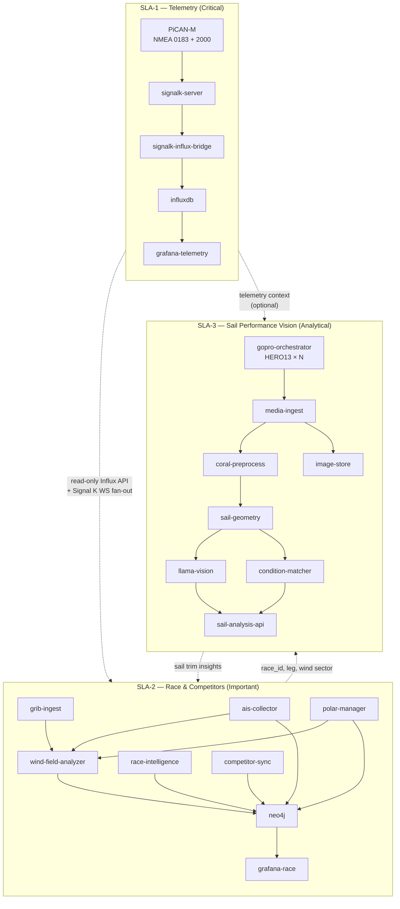

### 5.2 SLA definitions

#### SLA-1 — On-boat telemetry

**Purpose:** Ingest, normalize, persist, and display **live instrument data**. This is the safety-critical and race-critical path.

| Attribute | Target |
|-----------|--------|
| **Availability** | 99.99% during active race session |
| **Write latency** | Signal K delta → InfluxDB &lt; 500 ms (p95) |
| **Dashboard refresh** | &lt; 1 s for SOG, COG, AWA, AWS, depth, heel |
| **Recovery time** | &lt; 30 s after container restart |
| **Internet** | Not required |
| **PiCAN-M** | Required on this node |

**Containers (`docker-compose.sla-1.yml`):**

| Container | Image | Responsibility |
|-----------|-------|----------------|
| `signalk-server` | `ghcr.io/.../signalk` | NMEA ingest, Signal K hub; **host network** for CAN/serial |
| `signalk-influx-bridge` | `ghcr.io/.../influx-bridge` | Delta → Influx line protocol |
| `influxdb` | `influxdb:2` | Time series store (telemetry bucket only) |
| `grafana-telemetry` | `grafana/grafana` | Live instrument panels only |
| `redis` (optional) | `redis:alpine` | Write buffer if burst load |

**Does not include:** Neo4j, LLM, cameras, crawl jobs, or sail analysis.

**Hardware:** Raspberry Pi 5 (4 GB minimum) **with PiCAN-M HAT**. Dedicated node in race profile.

---

#### SLA-2 — Race and competitor information

**Purpose:** Model **races, courses, marks, fleet, and competitors**; ingest **GRIB** weather grids and **polar diagrams**; collect **AIS** for own boat and competitors; run **runtime wind-on-course analysis** to identify where favorable wind exists on the course.

| Attribute | Target |
|-----------|--------|
| **Availability** | 99.9% during race; graceful degradation acceptable |
| **Query latency** | Neo4j tactical query &lt; 3 s (p95) |
| **AIS refresh** | Own + competitor positions ≤ 10 s (from N2K AIS PGNs) |
| **GRIB refresh** | Scheduled every 6 h when online; manual pre-race upload |
| **Wind-field analysis** | Course wind map updated every 30–60 s during active race |
| **Recovery time** | &lt; 2 min; SLA-1 unaffected |
| **Internet** | Required for GRIB auto-fetch; optional for AIS (local N2K) |

**Containers (`docker-compose.sla-2.yml`):**

| Container | Image | Responsibility |
|-----------|-------|----------------|
| `neo4j` | `neo4j:5-community` | Race graph, vessels, marks, polars, wind zones |
| `race-intelligence` | `ghcr.io/.../race-intelligence` | Session control, tack/gybe detection, leg timing |
| `ais-collector` | `ghcr.io/.../ais-collector` | Own-boat + competitor AIS from SLA-1 Signal K stream |
| `competitor-sync` | `ghcr.io/.../competitor-sync` | MMSI registry, fleet roster, polar linkage |
| `grib-ingest` | `ghcr.io/.../grib-ingest` | Scheduled download, manual upload, GRIB validation |
| `grib-parser` | `ghcr.io/.../grib-parser` | Decode GRIB2 → grid store; spatial query API |
| `polar-manager` | `ghcr.io/.../polar-manager` | Load **SLK** polar for own boat; serve canonical YAML |
| `polar-certificate-extractor` | `ghcr.io/.../polar-certificate-extractor` | Derive competitor polars from ORC certificate **PNG/PDF** |
| `handicap-manager` | `ghcr.io/.../handicap-manager` | ORC certificate handicaps + per-race WRS TCF per vessel |
| `course-parser` | `ghcr.io/.../course-parser` | Extract courses/waypoints from SI/NOR PDFs |
| `live-results` | `ghcr.io/.../live-results` | Corrected-time standings + VMG along course legs |
| `course-editor` | `ghcr.io/.../course-editor` | React/TypeScript UX — manual waypoint coordinates |
| `crawl-agent` | `ghcr.io/.../crawl-agent` | NOR/SI crawl ([crawl_web](https://github.com/cognite-fholm/crawl_web) lineage) |
| `llama-tactical` | `ghcr.io/.../llama-cpp` | Text LLM — debrief, tactical Q&A |
| `tactical-coach` | `ghcr.io/.../tactical-coach` | FastAPI RAG over Neo4j + Influx + wind zones |
| `grafana-race` | `grafana/grafana` | Fleet map, polars, GRIB overlay, wind-advantage heatmap |

**Reads from SLA-1:** InfluxDB (telemetry + AIS-derived paths), Signal K WebSocket (`navigation`, `environment.wind`, AIS deltas). **Never writes to SLA-1 storage.**

See [§7.12](#712-grib-polars-ais--wind-on-course-analysis), [§7.13](#713-race-courses-waypoints--live-results), and [§7.14](#714-handicap-numbers--scoring).

**Hardware:** Raspberry Pi 5 (8 GB). May share a Pi with SLA-3 in compact profile; **must not share with SLA-1** in race profile.

---

#### SLA-3 — Sail performance (GoPro vision / LLM)

**Purpose:** Orchestrate a fleet of **GoPro HERO13 Black** cameras to photograph sails and boom rigging, extract **geometry** (angles, camber, twist), compare against **best-known trim in similar conditions**, and publish coaching insights.

| Attribute | Target |
|-----------|--------|
| **Availability** | 95% — best-effort; may be paused during maneuvers |
| **Capture sync** | Multi-GoPro still burst within ±200 ms (PPS via `capture_trigger`) |
| **Analysis latency** | Geometry + condition match &lt; 60 s (p95) on Pi 5 |
| **Capture rate** | 0.2–1 Hz per camera (configurable); burst on leg stable |
| **Recovery time** | &lt; 5 min; no impact on SLA-1 |
| **Internet** | Not required at sea; harbor sync for training export |

**Containers (`docker-compose.sla-3.yml`):**

| Container | Image | Responsibility |
|-----------|-------|----------------|
| `gopro-orchestrator` | `ghcr.io/.../gopro-orchestrator` | Discover, arm, and trigger HERO13 fleet via Open GoPro BLE/Wi-Fi |
| `media-ingest` | `ghcr.io/.../media-ingest` | Download photos from GoPro HTTP API; timestamp alignment |
| `coral-preprocess` | `ghcr.io/.../coral-preprocess` | Sail ROI, luff line, boom line detection (TFLite on Coral) |
| `sail-geometry` | `ghcr.io/.../sail-geometry` | Compute angles & shape metrics from ROIs + camera extrinsics |
| `condition-matcher` | `ghcr.io/.../condition-matcher` | Find best historical trim in similar wind/heel/SOG |
| `llama-vision` | `ghcr.io/.../llama-cpp-vision` | Multimodal LLM — qualitative sail shape narrative |
| `sail-analysis-api` | `ghcr.io/.../sail-analysis` | FastAPI; merge geometry + match + LLM → SLA-2 |
| `image-store` | `ghcr.io/.../image-store` | Ring buffer of frames, geometry JSON, capture metadata |
| `training-export` | `ghcr.io/.../training-export` | Harbor-only bundles for onshore ML (opt-in) |
| `grafana-sail` | `grafana/grafana` | Trim timeline, geometry gauges, best-vs-actual overlays |

**GoPro fleet (reference: 4 cameras):**

| Camera ID | Mount | Primary metrics |
|-----------|-------|-----------------|
| `gopro-mast` | Mast, above spreaders | Mainsail camber, draft %, leech twist, mast bend hint |
| `gopro-boom` | Boom gooseneck / mid-boom | **Boom angle** vs centerline, vang/kicker geometry, foot tension |
| `gopro-bow` | Bow pulpit | Genoa/jib luff, entry angle, sheet lead hint |
| `gopro-deck` (optional) | Cockpit looking up | Mainsail profile, **mast heel** visual, traveler context |

**Vision + geometry scope:**

- **Boom angle** (° off centerline / relative to TWA bucket).
- **Mast heel** (° — fused from SLA-1 `attitude.heel` + visual mast axis from `gopro-mast`).
- **Sail shape:** camber depth, draft position (% chord), leech twist (°), luff break severity.
- **Rig settings (visual proxy):** vang tension indicator, cunningham, outhaul, traveler position (where visible).
- **Condition comparison:** *"In 12–14 kt AWA 25–35° you historically carried 2° more boom angle and 15% further-aft draft with +0.3 kt VMG."*

**Reads from SLA-1:** AWA, AWS, TWS, TWD, SOG, VMG, heel, rudder, sheet/load sensors if available.  
**Reads from SLA-2:** `race_id`, leg, tack, `ConditionBucket` nodes.  
**Writes to SLA-2:** `SailAnalysis`, `SailGeometry`, `TrimDelta` nodes; links to `BestTrimSnapshot`.

**Hardware:** Raspberry Pi 5 (8 GB) + **Coral dongle** + 3–5× **GoPro HERO13 Black** + boat LAN Wi-Fi AP. **Always isolated from SLA-1.**

See [§7.9](#79-gopro-hero13-black-fleet), [§7.10](#710-sail-geometry--condition-similarity), and [§7.11](#711-onshore-transformer-training-pipeline).

---

### 5.3 SLA comparison matrix

| Dimension | SLA-1 Telemetry | SLA-2 Race & Competitors | SLA-3 Sail Vision |
|-----------|-----------------|--------------------------|-------------------|
| Priority | P0 — critical | P1 — important | P2 — analytical |
| Uptime target | 99.99% | 99.9% | 95% |
| PiCAN-M required | Yes | No | No |
| Coral required | No | No | Yes (preprocess) |
| Cameras | — | — | 3–5× GoPro HERO13 Black |
| LLM type | None | Text (llama.cpp) | Vision (llama.cpp multimodal) |
| Primary store | InfluxDB | Neo4j | Image store + metadata |
| Grafana instance | `grafana-telemetry` | `grafana-race` | `grafana-sail` |
| Survives other tier failure | — | Yes (SLA-1 up) | Yes (SLA-1 up) |
| Remote auto-update in race | **Never** | Harbor only | Harbor only |

### 5.4 Multi-node deployment topologies

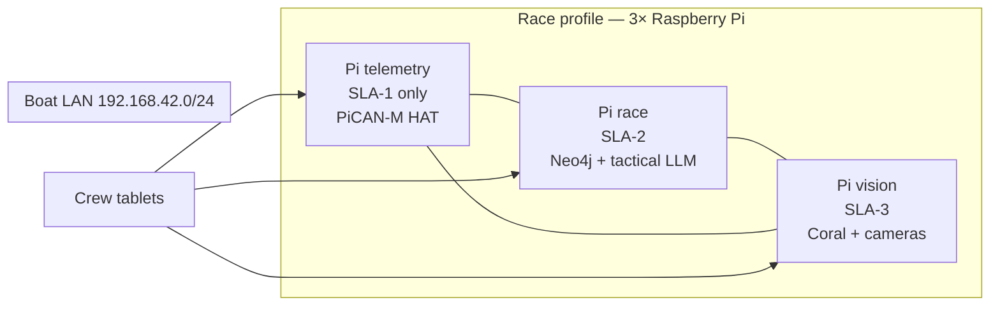

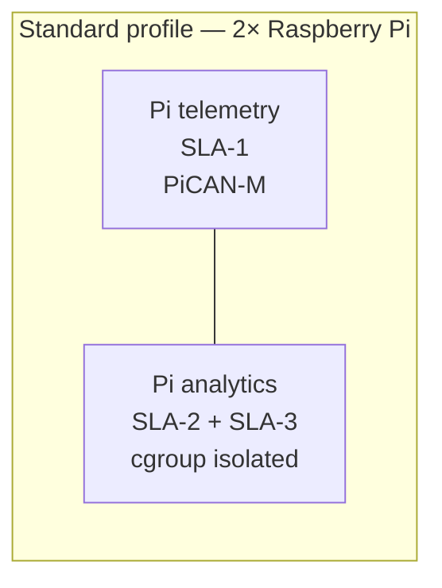

**DNS / hostnames (boat LAN):**

| Host | Tier | Services |
|------|------|----------|
| `telemetry.local` | SLA-1 | Signal K `:3000`, Influx `:8086`, Grafana `:3001` |
| `race.local` | SLA-2 | Neo4j `:7474`, coach `:8090`, Grafana `:3002` |
| `vision.local` | SLA-3 | sail API `:8091`, Grafana `:3003` |

### 5.5 Inter-tier communication contract

| From → To | Protocol | Data | Direction |
|-----------|----------|------|-----------|
| SLA-1 → SLA-2 | Signal K WebSocket | AIS deltas + own-boat navigation | Read-only fan-out |
| SLA-1 → SLA-2 | Influx HTTP API | Telemetry, wind, SOG/COG | Read-only |
| SLA-1 → SLA-3 | Influx HTTP API | AWA/AWS/heel window | Read-only |
| SLA-2 → SLA-3 | REST | `race_id`, active leg, target AWA | Push on leg change |
| SLA-3 → SLA-2 | REST | `SailAnalysis`, trim scores | Push on analysis complete |
| SLA-2 → SLA-1 | **None** | — | **No writes upstream** |
| SLA-3 → SLA-1 | **None** | — | **No writes upstream** |

**Failure isolation:** If `race.local` or `vision.local` is unreachable, SLA-1 continues logging and displaying instruments. Crew sees a degraded-mode banner on tactical/vision dashboards only.

### 5.6 Resource governance (same-Pi multi-tier)

When multiple tiers share one Pi (compact / standard profile), enforce:

```yaml
# Example Docker Compose deploy.resources per tier
sla-1: { cpus: "2.0", memory: 2G }   # guaranteed
sla-2: { cpus: "1.5", memory: 3G }   # burstable
sla-3: { cpus: "2.0", memory: 3G }   # lowest priority — throttled when sla-1 under load
```

A `tier-watchdog` sidecar on shared nodes pauses SLA-3 containers when SLA-1 Influx write latency exceeds 500 ms for 30 s.

---

## 6. System architecture

### 6.1 High-level context

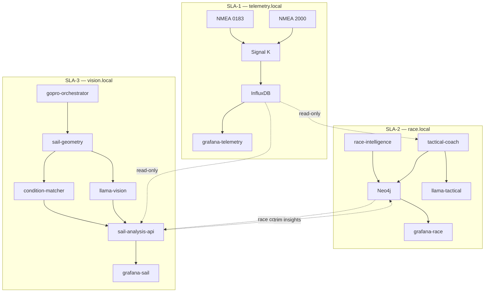

### 6.2 Data flow (race mode)

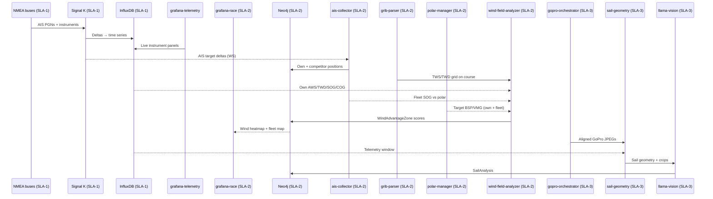

### 6.3 Offline vs online modes

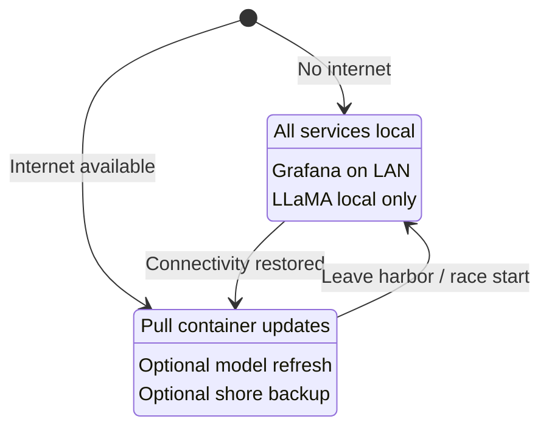

---

## 7. Software components

### 7.1 Signal K Server (hub) — **SLA-1 only**

**Language:** Node.js (TypeScript for custom plugins)  
**Source:** [SignalK/signalk-server](https://github.com/SignalK/signalk-server)

Signal K is the **single source of truth** for live marine data. It:

- Reads NMEA 0183 and NMEA 2000 via PiCAN-M interfaces.
- Exposes `ws://localhost:3000/signalk/v1/stream` for subscribers.
- Hosts plugins for InfluxDB export, Neo4j event emission, and coach triggers.

**Custom plugins planned:**

| Plugin | Responsibility |
|--------|----------------|
| `signalk-to-influxdb2` | Fork/adapt existing community plugin; map Signal K paths → Influx measurements |
| `signalk-race-events` | Detect tacks, gybes, mark rounding; emit to Neo4j |
| `signalk-ai-bridge` | Forward curated context windows to coach service |

### 7.2 Time series — InfluxDB — **SLA-1 only**

**Language:** configuration + Flux/SQL queries; write path in Node.js or Python  
**Replaces:** CDF time series (previously via `push_to_cdf`)

**Schema strategy:**

- **Bucket:** `signalk` (raw, 90-day retention); `race` (downsampled, long retention); `ais_tracks` (competitor + own-boat AIS positions, 30-day retention).
- **Measurement:** derived from Signal K path (e.g. `navigation_speedOverGround`).
- **Tags:** `vessel`, `source`, `pgn` (N2K), `context`, `race_id` (when active).
- **Fields:** numeric values; store strings in Neo4j instead.

**Migration from CogSail:** The `parse_signalK()` logic in `cogsail-python/push_to_cdf/Consume stream.py` maps deltas to external IDs — reuse this path→ID mapping as Influx measurement/field conventions.

### 7.3 Knowledge graph — Neo4j — **SLA-2 only**

**Language:** Cypher; ingestion via Python (`neo4j` driver) or Node.js (`neo4j-driver`)  
**Replaces:** CDF asset hierarchy + relationships (previously `cogsail-scripts/CreateBoats.py`, CDF data models)

**Core node labels:**

| Label | Examples |
|-------|----------|
| `Vessel` | Own boat (`is_own: true`), competitors (MMSI) |
| `Polar` | Polar diagram for a vessel (TWS × TWA → target BSP/VMG) |
| `GribModel` | Imported GRIB file metadata (model run, valid time, bbox) |
| `WindGrid` | Parsed wind field reference (linked to GribModel) |
| `WindAdvantageZone` | Course sector scored for favorable wind (runtime) |
| `AisTrack` | Time-series reference for vessel movement |
| `Race` | Regatta, passage race |
| `Course` | Windward/leeward, coastal — parsed from SI |
| `CourseRoute` | Named route variant (e.g. `11.1 Tristein`) |
| `Waypoint` | Mark/gate with lat/lon, rounding rule, optional distance |
| `HandicapRating` | ORC ToT/ToD/APH or WRS TCF for a vessel |
| `LiveStanding` | Current corrected-time position in fleet |
| `Mark` | Physical or virtual marks |
| `Leg` | Between marks |
| `Tack` / `Gybe` | Maneuver events |
| `Sailor` | Crew roles |
| `Tactic` | Pre-race plan, observed pattern |
| `WindSector` | Shift / persistent pattern |
| `SailGeometry` | Per-capture metrics from GoPro analysis (SLA-3) |
| `BestTrimSnapshot` | Top performance trim in a condition cluster |
| `TrimDelta` | Current vs best/optimal gap |
| `SailAnalysis` | Vision LLM narrative + fused recommendation |

**Example relationships:**

```cypher
(v:Vessel)-[:COMPETED_IN]->(r:Race)
(v:Vessel)-[:HAS_POLAR]->(p:Polar)
(r:Race)-[:USES_GRIB]->(g:GribModel)
(r:Race)-[:ON_COURSE]->(c:Course)
(c:Course)-[:HAS_ZONE]->(z:WindAdvantageZone)
(v:Vessel)-[:AIS_POSITION]->(pos:AisTrack)
(z:WindAdvantageZone)-[:DERIVED_FROM]->(g:GribModel)
(c:Course)-[:HAS_MARK]->(m:Mark)
(v:Vessel)-[:ROUNDED]->(m:Mark)
(v:Vessel)-[:PERFORMED]->(t:Tack)
(t:Tactic)-[:SUGGESTS]->(a:Action)
```

Neo4j holds **context** (who, what, where, why); InfluxDB holds **telemetry** (how fast, when).

### 7.4 Visualization — Grafana

**One Grafana instance per SLA tier** — avoids dashboard load on the telemetry node.

| Instance | Tier | Port (default) | Dashboards |
|----------|------|----------------|------------|
| `grafana-telemetry` | SLA-1 | 3001 | SOG, COG, AWA, AWS, depth, heel, system health |
| `grafana-race` | SLA-2 | 3002 | Fleet map, polars, wind heatmap, **live standings**, course overlay |
| `course-editor` | SLA-2 | 3010 | React/TypeScript waypoint editor (when coords missing) |
| `grafana-sail` | SLA-3 | 3003 | Trim timeline, sail images, vision LLM output |

### 7.5 AI — LLaMA + Coral

**Languages:** Python (orchestration), C++ runtime (llama.cpp), TFLite (Coral)

| Layer | SLA | Technology | Role |
|-------|-----|------------|------|
| Text LLM | SLA-2 | **llama.cpp** + GGUF | Tactical Q&A, debrief, start-line narration |
| Vision LLM | SLA-3 | **llama.cpp** multimodal | Sail trim analysis from camera frames |
| Text model | SLA-2 | Llama 3.2 1B–3B Instruct (Q4_K_M) | Low latency tactical coaching |
| Vision model | SLA-3 | Llama 3.2 Vision 11B or smaller quant | Sail shape / trim interpretation |
| Edge ML | SLA-3 | **Coral** + TFLite | ROI, luff detection, frame preprocessing |
| Tactical coach | SLA-2 | **Python** (FastAPI) | RAG over Neo4j + SLA-1 Influx (read-only) |
| Sail analyst | SLA-3 | **Python** (FastAPI) | Vision pipeline orchestration |

**Offline inference:** Models ship on disk per node (`/opt/models/sla-2/`, `/opt/models/sla-3/`). No cloud calls at sea.

**Recommended models:**

| Node | Model | Size |
|------|-------|------|
| SLA-2 (race) | `Llama-3.2-3B-Instruct-Q4_K_M.gguf` | ~2 GB |
| SLA-3 (vision) | `Llama-3.2-11B-Vision-Instruct-Q4_K_M.gguf` (or smaller) | 4–8 GB |

### 7.6 Race intelligence service — **SLA-2 only**

**Language:** Python 3.11+

Responsibilities:

- Start sequence helper (time-to-start, line bias from headings).
- Polar comparison for **own boat and competitors** via `polar-manager`.
- Wind shift detection (statistical + graph persistence).
- Trigger `wind-field-analyzer` on leg changes.
- Debrief generation post-race (LLaMA + structured data + wind-zone summary).

This replaces implicit analytics that were previously envisioned in CDF tools / future Java apps.

### 7.7 Sail vision service (SLA-3)

**Language:** Python 3.11+  
**SLA tier:** SLA-3 only

Orchestrates the GoPro fleet → geometry → condition-match → vision LLM pipeline. See [§7.9–7.11](#79-gopro-hero13-black-fleet).

**Does not** run on the telemetry node in race profile.

### 7.8 Web crawler integration (optional, online)

**Source repo:** [crawl_web](https://github.com/cognite-fholm/crawl_web)

When online, crawl race documents (NOR, SI, sailing instructions) and ingest summaries into Neo4j as `RaceDocument` nodes linked to `Race`. Not required for onboard core loop.

### 7.9 GoPro HERO13 Black fleet

**API:** [Open GoPro](https://gopro.github.io/OpenGoPro/) (BLE + Wi-Fi HTTP) via [Python SDK](https://gopro.github.io/OpenGoPro/python_sdk/)  
**Camera:** GoPro HERO13 Black (firmware ≥ v01.10.00)  
**Container:** `gopro-orchestrator` (Python 3.11+, `open-gopro` package)

#### 7.9.1 Fleet topology

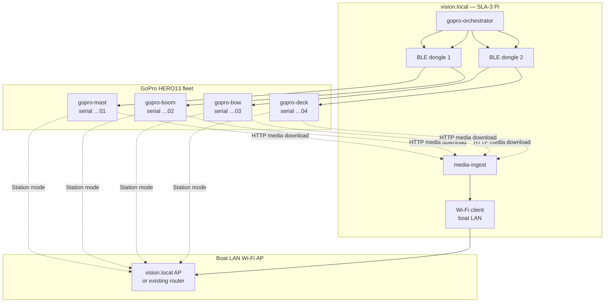

**BLE constraint:** Each HERO13 accepts **one BLE central** at a time. The orchestrator uses:

1. **Round-robin BLE** across 1–2 USB dongles for shutter triggers and health polls.
2. **Wi-Fi station mode** — cameras join boat LAN (`boat-vision` SSID); `media-ingest` pulls JPEGs via HTTP (`/gopro/media/list`, `/videos/DCIM/...`).

#### 7.9.2 Capture modes

| Mode | Trigger | Use case |
|------|---------|----------|
| **Scheduled still** | Cron every N s on stable leg | Continuous trim monitoring |
| **Synchronized burst** | `capture_trigger` event (AWA/AWS stable ±2° for 10 s) | Multi-camera geometry snapshot |
| **Maneuver bracket** | Tack/gybe detected (SLA-2 webhook) | Before/after trim comparison |
| **Manual** | Crew Grafana button | Ad-hoc inspection |

**Open GoPro commands (reference flow):**

```python
# Simplified — gopro-orchestrator
async with WirelessGoPro(identifier="…01") as gopro:
    await gopro.ble_command.set_shutter(shutter=Toggle.ENABLE)   # photo mode preset
    await gopro.ble_setting.photo_output.set(PhotoOutput.MAX_27MP)
    await gopro.ble_command.set_date_time(dt=synced_utc)         # GPS/NTP aligned
    await gopro.http_command.set_photo()                          # Wi-Fi path after connect
```

#### 7.9.3 Camera configuration (HERO13)

| Setting | Value | Rationale |
|---------|-------|-----------|
| Mode | Photo (not video) | Lower storage; sharper geometry |
| Resolution | 27 MP linear | Crop flexibility for sail ROI |
| FOV | Linear | Minimize distortion for angle math |
| Protune | Flat, sharpness high | Better edge detection |
| GPS | On (camera GPS) | Secondary timestamp; fuse with boat GPS |
| Wi-Fi | Station → boat LAN | Media download without phone |
| Sleep | Disabled during race session | Avoid HERO13 BLE wake bug — power-cycle checklist in docs |

#### 7.9.4 Timestamp alignment

Every capture record carries:

| Field | Source |
|-------|--------|
| `capture_id` | UUID generated by orchestrator |
| `t_trigger` | Vision Pi monotonic clock at shutter command |
| `t_exif` | EXIF DateTimeOriginal from GoPro JPEG |
| `t_influx` | Nearest SLA-1 telemetry window (±100 ms interpolated) |
| `race_id`, `leg_id` | SLA-2 session context |
| `camera_id` | `gopro-mast` \| `gopro-boom` \| `gopro-bow` \| `gopro-deck` |

All geometry and training exports key off `capture_id` + `t_influx`.

---

### 7.10 Sail geometry & condition similarity

**Containers:** `coral-preprocess`, `sail-geometry`, `condition-matcher`

#### 7.10.1 Geometry extraction pipeline

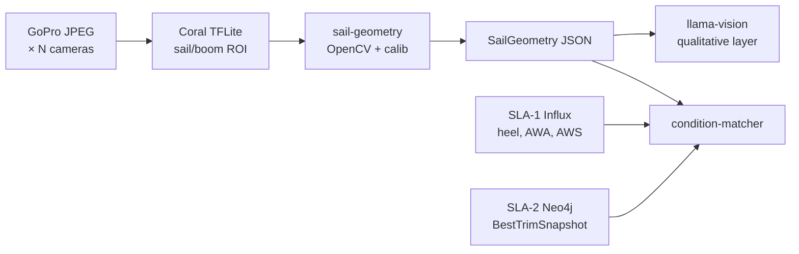

**`SailGeometry` metrics (per capture, per sail type):**

| Metric | Unit | Cameras | Description |
|--------|------|---------|-------------|
| `boom_angle` | ° | gopro-boom, gopro-deck | Boom angle relative to boat centerline (vision + IMU fusion) |
| `mast_heel` | ° | gopro-mast + SLA-1 heel | Mast axis angle; cross-check instrument heel |
| `draft_position` | % chord | gopro-mast | Deepest camber point from leading edge |
| `camber_depth` | % chord | gopro-mast | Max thickness / chord |
| `leech_twist` | ° | gopro-mast | Angle between upper and lower leech tangent |
| `luff_break_angle` | ° | gopro-bow | Genoa luff separation from forestay plane |
| `foot_tension_proxy` | 0–1 | gopro-boom | Visual foot shelf / wrinkle score |
| `vang_tension_proxy` | 0–1 | gopro-boom | Boom-to-leech geometry hint |

Camera extrinsics (mount position + bearing) are stored in `config/cameras.yaml` and refined per boat during calibration sail.

#### 7.10.2 Condition vector

Each capture is tagged with a **condition vector** for similarity search:

```json
{
  "tws_bucket": "12-14",
  "awa_bucket": "25-35",
  "twa_bucket": "32-42",
  "heel_bucket": "8-15",
  "sea_state": 2,
  "tack": "port",
  "sail_plan": "main+jib",
  "vmg_percentile": 0.82
}
```

Buckets derived from SLA-1 telemetry at `t_influx`. Stored on `SailGeometry` nodes in Neo4j.

#### 7.10.3 Best-trim comparison

**`BestTrimSnapshot`** nodes represent historically strong performance in a condition cluster:

```cypher
(:BestTrimSnapshot {
  condition_hash: "tws12_awa30_port",
  boom_angle: 4.2,
  mast_heel: 12.1,
  draft_position: 42,
  leech_twist: 8.5,
  vmg_avg: 5.8,
  session_id: "2025-06-regatta-3",
  rank: 1
})
```

**`condition-matcher` algorithm (onboard):**

1. Compute `condition_hash` from current telemetry.
2. Query Neo4j for `BestTrimSnapshot` within ±1 bucket on TWS, AWA, heel (Cypher + optional vector index).
3. If onshore-trained model available (see §7.11), call `trim-predictor` edge artifact for optimal targets.
4. Emit `TrimDelta` — difference between current `SailGeometry` and best/optimal.

**Crew-facing output (Grafana-sail):**

| Current | Best in conditions | Δ | Recommendation |
|---------|-------------------|---|----------------|
| Boom 6.2° | 4.0° | +2.2° | Ease boom 2° |
| Draft 38% | 45% | −7% | Move draft aft (outhaul/vang) |
| Heel 18° | 12° | +6° | Depower — traveler down / vang |

---

### 7.11 Onshore transformer training pipeline

**SLA tier:** **SLA-S (Shore)** — runs on larger onshore machines only; **not required at sea**.

**Purpose:** Train **multimodal transformer models** on aligned sensor + image data to learn optimal **boom angle**, **mast heel**, **sail shape**, and rig settings for any condition. Deploy compressed artifacts back to the boat for SLA-3 inference.

#### 7.11.1 End-to-end ML lifecycle

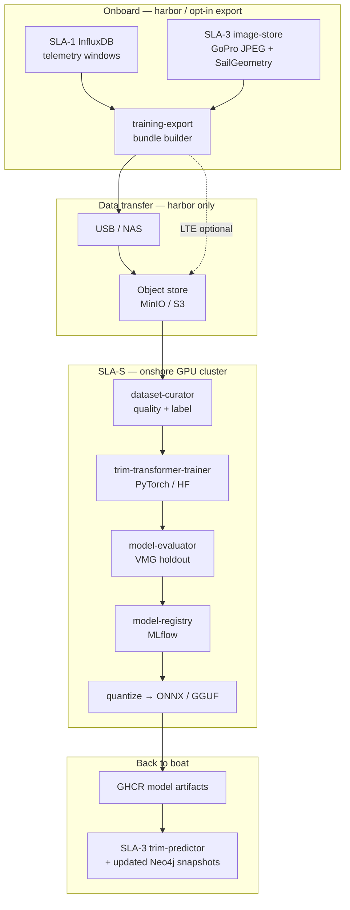

#### 7.11.2 Training dataset format

Each **training sample** = one synchronized multimodal window:

```
training_bundle/
├── manifest.json
├── sessions/
│   └── {session_id}/
│       ├── telemetry.parquet      # SLA-1: 30 s window @ 10 Hz
│       ├── captures/
│       │   ├── {capture_id}_mast.jpg
│       │   ├── {capture_id}_boom.jpg
│       │   └── {capture_id}_bow.jpg
│       ├── geometry/
│       │   └── {capture_id}.json  # SailGeometry (auto or human-refined)
│       └── labels/
│           └── {capture_id}.json  # OptimalTrim targets (see below)
```

**`manifest.json` fields:** `session_id`, `vessel_id`, `race_id`, `opt_in`, `export_timestamp`, `checksum`.

**Label sources (priority order):**

| Source | Description |
|--------|-------------|
| **Performance-derived** | Top-decile VMG segments in condition cluster → `SailGeometry` becomes positive label |
| **Expert annotation** | Coach labels optimal boom/heel/shape in web UI (shore) |
| **LLM-assisted pre-label** | Vision LLM proposes labels; human confirms in curation |
| **Transformer pseudo-label** | Prior model iteration bootstraps new sessions |

**`OptimalTrim` label schema:**

```json
{
  "boom_angle_deg": 4.0,
  "mast_heel_deg": 12.0,
  "draft_position_pct": 45,
  "camber_depth_pct": 12,
  "leech_twist_deg": 8.5,
  "vang_setting": 0.65,
  "cunningham_setting": 0.40,
  "outhaul_setting": 0.55,
  "traveler_position": 0.30,
  "confidence": 0.91
}
```

#### 7.11.3 Model architecture — TrimTransformer

**Framework:** PyTorch 2.x + Hugging Face Transformers (onshore); ONNX Runtime or quantized GGUF for edge deployment.

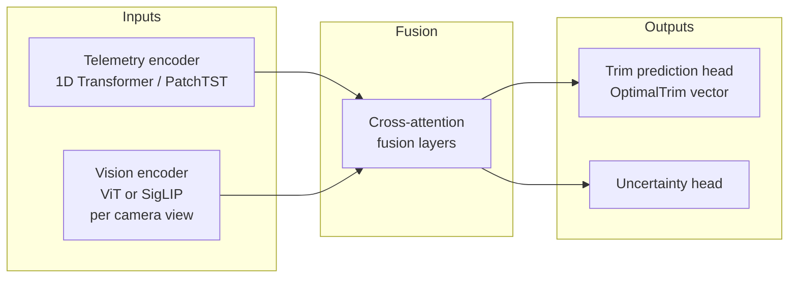

| Component | Specification |
|-----------|---------------|
| **Telemetry encoder** | 30 s × N channels (AWA, AWS, TWS, SOG, VMG, heel, rudder, loads); PatchTST or small Temporal Fusion Transformer |
| **Vision encoder** | One ViT-B/16 (or SigLIP) per camera view; weights optionally init from sail-pretrained checkpoint |
| **Fusion** | 4-layer cross-attention; telemetry tokens attend to image patch tokens |
| **Output head** | Regression → `OptimalTrim` (10–15 continuous targets) |
| **Auxiliary loss** | VMG prediction (helps learn performance-aligned representations) |
| **Training hardware** | 1–8× NVIDIA GPU (A100/L40S class); 32 GB+ VRAM for multi-view + long context |

**Loss function:**

```
L = λ₁ · MSE(optimal_trim, predicted_trim)
  + λ₂ · Huber(vmg, predicted_vmg)
  + λ₃ · contrastive(condition_embed, same_bucket)   # similar conditions cluster
```

#### 7.11.4 Shore infrastructure (SLA-S)

| Service | Technology | Role |
|---------|------------|------|
| `dataset-curator` | Python, Label Studio | QA, dedup, consent check, train/val/test split by **session** (no leakage) |
| `trim-transformer-trainer` | PyTorch Lightning | Distributed training |
| `model-registry` | MLflow | Versioned checkpoints |
| `model-evaluator` | Custom + W&B | Holdout by regatta; report per-condition MAE |
| `neo4j-shore` | Neo4j (optional) | Aggregate fleet learnings → publish `BestTrimSnapshot` sets to boats |

**Containers:** `docker-compose.sla-shore.yml` (not deployed on Pi).

#### 7.11.5 Deployment back to boat

After training and evaluation:

1. **Quantize** model → ONNX INT8 or distil to smaller edge checkpoint.
2. Publish to `ghcr.io/cognite-fholm/trim-predictor:{version}`.
3. Harbor sync: SLA-3 pulls artifact; `condition-matcher` uses hybrid **k-NN (Neo4j) + neural predictor**.
4. Export curated `BestTrimSnapshot` Cypher → SLA-2 Neo4j import script.

**Onboard inference (no GPU required):**

| Artifact | Latency target | Runs in |
|----------|----------------|---------|
| `trim-predictor-lite.onnx` | &lt; 2 s | SLA-3 `condition-matcher` |
| `llama-vision` GGUF | &lt; 60 s | SLA-3 qualitative narrative |
| Neo4j `BestTrimSnapshot` | &lt; 500 ms | SLA-3 k-NN fallback (offline) |

#### 7.11.6 Data governance

| Rule | Implementation |
|------|----------------|
| Opt-in export | `TRAINING_EXPORT_CONSENT=true` in harbor UI; per-session toggle |
| PII / crew | No faces in training set — Coral blur pass optional |
| Competitor data | Exclude unless consented |
| Retention | Raw images on shore: 24 months; delete on request |
| Race mode | `training-export` container **stopped** when `RACE_MODE=true` |

| Race mode | `training-export` container **stopped** when `RACE_MODE=true` |

---

### 7.12 GRIB, polars, AIS & wind-on-course analysis

**SLA tier:** SLA-2 (`grib-ingest`, `grib-parser`, `polar-manager`, `ais-collector`, `wind-field-analyzer`)  
**AIS source:** SLA-1 Signal K (NMEA 2000 AIS via PiCAN-M)  
**Languages:** Python 3.11+ (`cfgrib`/`xarray`, `pyais`, FastAPI)

#### 7.12.1 Data flow overview

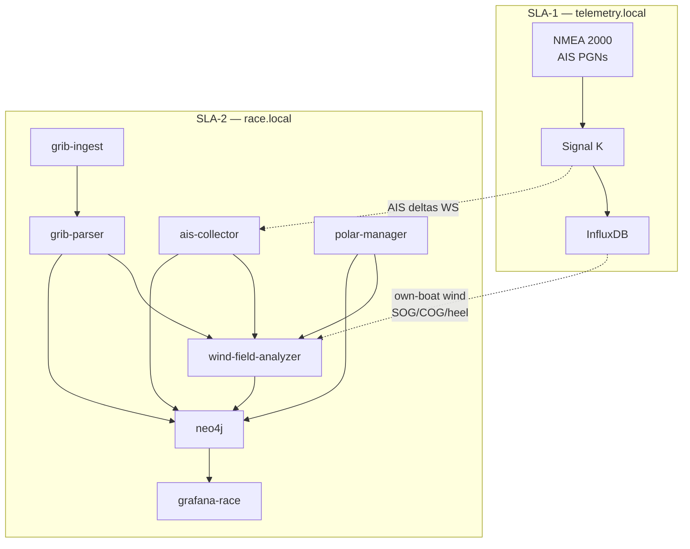

#### 7.12.2 GRIB ingestion — regular upload schedule

**Containers:** `grib-ingest`, `grib-parser`  
**Storage:** `/data/grib/` on SLA-2 (persistent volume `grib-store`)

| Mode | Schedule | Trigger |
|------|----------|---------|
| **Automatic fetch** | Every **6 hours** when `ONLINE_MODE=true` | `grib-ingest` cron (`0 */6 * * *`) |
| **Pre-race fetch** | Manual + 24 h before start | Grafana / API `POST /grib/fetch` |
| **Manual upload** | Anytime in harbor | `POST /grib/upload` (multipart `.grb2`) |
| **USB import** | Harbor | Copy to `/data/grib/inbox/` — file watcher ingests |
| **Shore push** | Optional | Shore server rsync/scp to `race.local` |

**Configured sources (`config/grib-sources.yaml`):**

```yaml
sources:
  - name: gfs-opendap
    url_template: "https://{host}/grib2/{run}/gfswave.t{fh}z.global.0p25.f{step}.grib2"
    model: GFS
    schedule: "0 */6 * * *"
    bbox_from: course   # auto-clip to active course + 10 NM margin
  - name: manual
    type: upload
```

**Ingest pipeline:**

1. Download or receive GRIB2 file.
2. Validate magic bytes, record `model_run`, `valid_from`, `valid_to`, `bbox`.
3. `grib-parser` extracts **U/V wind** (and optional gust, pressure) → `WindGrid` store (Zarr or GeoJSON tiles on Pi).
4. Register `GribModel` node in Neo4j; link to active `Race` when `race_id` set.
5. Prune GRIB files older than **7 days** (configurable).

**Offline use:** Latest successfully parsed GRIB remains queryable at sea without internet. Grafana shows **GRIB age** warning if valid time &gt; 12 h behind race start.

#### 7.12.3 Polar diagram management

**Containers:** `polar-manager`, `polar-certificate-extractor`

Polars define target boat speed and VMG for each **TWS × TWA** combination. The **own boat** uses a high-fidelity **SLK** performance file. **Competitors** derive polars from ORC **certificate images or PDFs** when no SLK is available.

##### Own boat — SLK file (primary source)

| Attribute | Value |
|-----------|-------|
| **Format** | **SYLK (`.slk`)** — ORC / sail-performance export |
| **Reference file (dev)** | `C:\Repositories\boat_system\7710 (3).slk` |
| **Deploy path (Pi)** | `/data/polars/own/7710.slk` (copy at harbor sync) |
| **Parser** | `polar-manager` SLK module (`slk_parser.py`) |
| **Required** | Yes — system will not start race mode without own-boat polar |

**SLK column mapping** (from `7710 (3).slk` header):

| SLK column | Canonical field | Unit |
|------------|-----------------|------|
| `TWS` | `tws` | knots |
| `TWA` | `twa` | degrees |
| `BTV` | `bsp` | knots (boat speed) |
| `VMG` | `vmg` | knots |
| `AWS` | `aws` | knots |
| `AWA` | `awa` | degrees |
| `Heel` | `heel` | degrees |
| `Condition` | `point_of_sail` | `beat` \| `reach` \| `run` |
| `Sail` / `Reef` / `Flat` | `sail_config` | reef / flat state |

**Example SLK rows** (TWS 6 kt):

```
Condition=beat  TWA=42.4  BTV=5.26  VMG=3.89
Condition=run   TWA=141.5 BTV=4.91  VMG=3.84
Condition=reach TWA=52.0  BTV=5.86  VMG=3.61
```

**`config/vessel.yaml` (own boat):**

```yaml
vessel:
  id: own-boat
  name: "7710"
  mmsi: "257771000"          # set to transponder MMSI
  is_own: true
polar:
  source_type: slk
  path: "../7710 (3).slk"    # relative to repo on dev machine
  # path: "/data/polars/own/7710.slk"   # on Raspberry Pi
  slk_id: "7710"
  auto_reload: true          # re-parse when file mtime changes
```

On Windows dev: `polar-manager` resolves `../7710 (3).slk` from `AI-sailing-system/` → `C:\Repositories\boat_system\7710 (3).slk`.

##### Competitors — certificate image / PDF extraction

Competitors rarely provide SLK files. Polars are **derived** from ORC rating certificate diagrams.

| Attribute | Value |
|-----------|-------|
| **Input formats** | `.png`, `.jpg`, `.pdf` (ORC sail plan / certificate) |
| **Reference file (dev)** | `C:\Repositories\boat_system\off_course.png` |
| **Example vessel** | *OFF COURSE* — sail no. **NOR 15788** |
| **Container** | `polar-certificate-extractor` |
| **Confidence** | Lower than SLK — flagged `polar_source: derived` |

**Reference certificate content** (`off_course.png`):

| Extracted data | Example value | Use |
|----------------|---------------|-----|
| Boat name | OFF COURSE | Neo4j `Vessel.name` |
| Sail number | NOR 15788 | Roster matching |
| Mainsail area | 63.99 m² | VPP input |
| Headsail area | 46.36 m² | VPP input |
| Asymmetric | 158.63 m² | Downwind model |
| LOA, P, E, J, IG | 13.69, 17.25, 6.00, 5.02, 17.17 m | Rating geometry |
| MHW, HHU, SHW, … | sail widths | Shape coefficients |

**Extraction pipeline:**

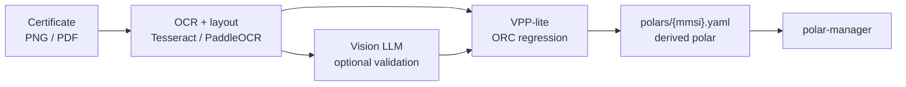

1. **`polar-certificate-extractor`** — OCR reads labelled dimensions and sail areas from diagram.
2. **Vision LLM** (optional cross-check on SLA-3 or SLA-2) validates OCR against image regions.
3. **VPP-lite** — estimates `TWS × TWA → BSP/VMG` from ORC dimensions (class-based regression or simplified velocity prediction).
4. Output saved as `polars/competitors/{mmsi}_derived.yaml` with `confidence` and `source_file` metadata.
5. Human review recommended in harbor before regatta (`polar_status: pending` → `approved`).

**`config/competitors.yaml` (example):**

```yaml
competitors:
  - name: "OFF COURSE"
    sail_number: "NOR 15788"
    mmsi: null                    # filled when AIS seen
    polar:
      source_type: certificate_image
      path: "../off_course.png"   # C:\Repositories\boat_system\off_course.png
      # path: "/data/polars/competitors/off_course.png"
      status: pending             # pending | approved | rejected
```

**API (extended):**

| Endpoint | Action |
|----------|--------|
| `POST /polars/own/reload` | Re-parse SLK from configured path |
| `POST /polars/competitor/extract` | Upload PNG/PDF → run certificate extractor |
| `POST /polars/competitor/{id}/approve` | Mark derived polar approved for race use |
| `GET /polars/{mmsi}` | Return canonical polar (`source: slk` \| `derived`) |
| `GET /polars/{mmsi}/target?tws=12&twa=42` | Interpolated target BSP/VMG |
| `GET /polars/{mmsi}/meta` | `source_type`, `confidence`, `source_file` |

##### Canonical internal format

All sources normalize to `polars/{mmsi_or_vessel_id}.yaml`:

```yaml
vessel_id: own-boat
mmsi: "257771000"
source_type: slk                    # slk | derived | manual
source_file: "7710 (3).slk"
confidence: 1.0                     # derived polars: 0.6–0.9 typical
boat_name: "7710"
points:
  - tws: 6
    twa: 42.4
    bsp: 5.262
    vmg: 3.8873
    aws: 10.5041
    awa: 22.64
    heel: 10.31
    point_of_sail: beat
```

**Neo4j:**

```cypher
MERGE (v:Vessel {mmsi: $mmsi})
MERGE (p:Polar {vessel_id: $vessel_id, season: $year})
SET p.source_type = $source_type,    // "slk" or "derived"
    p.source_file = $source_file,
    p.confidence = $confidence
MERGE (v)-[:HAS_POLAR {active: true}]->(p)
```

**Runtime use:**

- **Own boat (SLK):** `actual_VMG / target_VMG` → polar performance % — full confidence.
- **Competitors (derived):** same formula; `wind-field-analyzer` weights fleet term by `polar.confidence`.
- Low-confidence derived polars (&lt; 0.7) show warning badge on grafana-race.

**File layout on dev machine:**

```
C:\Repositories\boat_system\
├── 7710 (3).slk              ← own-boat polar (SLK)
├── off_course.png            ← competitor certificate example
└── AI-sailing-system\        ← git repo
    └── config\
        ├── vessel.yaml
        └── competitors.yaml
```

#### 7.12.4 AIS collection — own boat and competitors

**Containers:** `ais-collector` (SLA-2), Signal K (SLA-1 ingest)

AIS arrives on the **NMEA 2000 backbone** via PiCAN-M (`can0`). Signal K decodes AIS PGNs into delta paths under `sensors.ais.*`.

| Target | MMSI source | Signal K path (reference) |
|--------|-------------|---------------------------|
| **Own boat** | Transponder MMSI | `navigation.position`, `navigation.courseOverGroundTrue`, `navigation.speedOverGround` + `sensors.ais.class` |
| **Competitors** | AIS class A/B | `sensors.ais.targets.{mmsi}.position`, `.course`, `.speed`, `.name` |

**`ais-collector` pipeline:**

1. Subscribe to `ws://telemetry.local:3000/signalk/v1/stream/?subscribe=none` — filter AIS deltas.
2. Write to **SLA-2 InfluxDB** replica bucket `ais_tracks` (or SLA-1 write + SLA-2 read — prefer SLA-2 local copy to avoid SLA-1 write load):

| Measurement | Tags | Fields |
|-------------|------|--------|
| `ais_position` | `mmsi`, `name`, `is_own`, `race_id` | `lat`, `lon`, `cog`, `sog`, `heading` |

3. Upsert `Vessel` nodes in Neo4j; mark `is_own: true` for configured own MMSI.
4. `competitor-sync` maintains regatta roster — links known competitors from entry list to AIS tracks.

**Refresh rate:** ≤ 10 s for class A; class B as received (typically 30 s–3 min).

**Own-boat cross-check:** Compare AIS SOG/COG with instrument SOG/COG from SLA-1; flag calibration drift &gt; 5%.

#### 7.12.5 Runtime wind-on-course analysis

**Container:** `wind-field-analyzer`  
**Runs:** Every **30–60 s** during active `race_id`; triggered on leg change and significant wind shift (&gt; 8° TWD in 5 min).

**Purpose:** Fuse **GRIB forecast**, **own instrument wind**, **fleet AIS movement**, and **polars** to estimate **where on the course favorable wind currently exists** — including areas where competitors are outperforming their polars (proxy for better pressure).

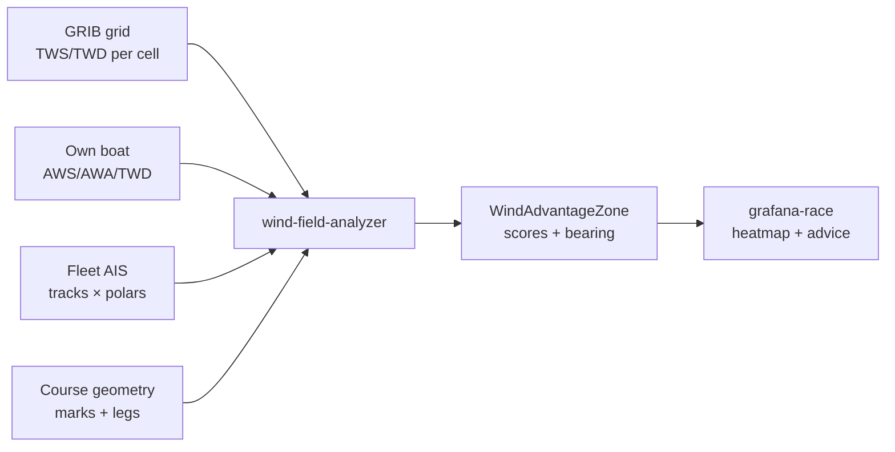

**Course discretization:**

- Divide active leg into **sectors** (default 0.25 NM grid or 500 m along-leg bins).
- For each sector center `(lat, lon)`:

| Input | Computation |
|-------|-------------|
| GRIB | Interpolate TWS/TWD at valid time nearest race now |
| Own instruments | Bias-correct GRIB with recent `AWS/TWD` residual (last 15 min) |
| Fleet AIS | For competitors in sector: `Δ = SOG_actual − SOG_polar(TWS,TWA)` |
| Own polar | `VMG_target` vs `VMG_actual` if own boat transited sector |

**Wind advantage score (0–1 per sector):**

```
score = w₁ · normalize(TWS)
      + w₂ · fleet_overperformance_mean
      + w₃ · (1 - competitor_density_penalty)
      + w₄ · vmg_potential_own_polar
```

Default weights: `w₁=0.35, w₂=0.40, w₃=0.10, w₄=0.15` (tunable per boat class).

**Outputs:**

| Artifact | Destination |
|----------|-------------|
| `WindAdvantageZone` nodes | Neo4j — sector polygon, score, TWS/TWD, timestamp |
| `wind_zone` time series | InfluxDB — sector scores for replay |
| Tactical recommendation | `tactical-coach` + grafana-race — e.g. *"Port side of beat: +1.2 kt fleet overperformance vs polars"* |
| GeoJSON layer | grafana-race geomap — green/yellow/red sectors |

**Example Cypher result:**

```cypher
(:WindAdvantageZone {
  sector_id: "leg2_bin_04",
  score: 0.82,
  tws_kn: 13.4,
  twd_deg: 245,
  fleet_delta_sog: 0.9,
  recommendation: "Favor port tack ladder — fleet gaining on polars"
})
```

**Offline behavior:** Without fresh GRIB, analyzer uses **last GRIB + instrument bias + AIS fleet deltas only** (degraded mode banner). AIS and polars work fully offline.

#### 7.12.6 Grafana-race panels (wind & fleet)

| Panel | Data source |
|-------|-------------|
| Fleet AIS map | Influx `ais_tracks` + Neo4j `Vessel` |
| GRIB wind barbs | `grib-parser` API overlay on course |
| Polar performance % | own + selected competitor MMSI |
| Wind advantage heatmap | `WindAdvantageZone` GeoJSON |
| GRIB freshness | `GribModel.valid_from` age indicator |

---

### 7.13 Race courses, waypoints & live results

**SLA tier:** SLA-2  
**Containers:** `course-parser`, `live-results`, `course-editor` (React/TypeScript)  
**Reference SI:** `C:\Repositories\boat_system\Seilingsbestemmelser_Færderseilasen26_2.pdf` — **Chapter 11 (Løpene)**

#### 7.13.1 Competition program course parsing

Regatta **Sailing Instructions (SI)** and **Notice of Race (NOR)** PDFs describe race routes as narrative bullet lists — often with mixed coordinate precision. The system must parse these into structured waypoints for **VMG**, **leg geometry**, and **live results**.

**Reference — Færderseilasen 2026, §11:**

> *"Oppgitte GPS posisjoner er omtrentlige. De oppgitte distansene brukes til resultatberegning."*  
> *(Stated GPS positions are approximate. Stated distances are used for result calculation.)*

**Example routes extracted from chapter 11:**

| Route ID | Name | Coordinates in SI | Rounding notes |
|----------|------|-------------------|----------------|
| `11.1` | Tristein | Nærsnes `N59°46,3 Ø010°31,0`; lysbøye `N59°52,50' Ø010°38,76'` | Tristein stb, Bile port |
| `11.2` | Hollænderbåen | Same partial coords | Hollænderbåen stb |
| `11.3` | Mefjordbåen | Same | Mefjordbåen stb |
| `11.4` | Mølen | Same | Mølen + Bile port |
| `11.5` | Oslo–Moss | Same | Finish Moss |
| `11.6` | Tristein (Sarpsborg) | No coords — named islands | Sandøy stb, Tresteinene port |

**`course-parser` pipeline:**

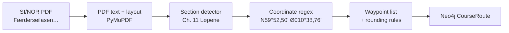

**Coordinate patterns parsed (WGS-84):**

| Pattern | Example | Decimal output |
|---------|---------|----------------|
| Degrees + decimal minutes | `N59°52,50' Ø010°38,76'` | `59.8750, 10.6460` |
| Degrees + decimal minutes (no prime) | `N59°46,3 Ø010°31,01` | `59.7717, 10.5168` |
| Named feature only | `Bygdøy og Nakholmen` | `coords: null` → user entry |

**Parsed waypoint schema (`waypoints/{route_id}.json`):**

```json
{
  "route_id": "11.1",
  "name": "Tristein",
  "regatta": "Færderseilasen 2026",
  "source_file": "Seilingsbestemmelser_Færderseilasen26_2.pdf",
  "source_section": "11.1",
  "distance_nm": null,
  "waypoints": [
    {"seq": 1, "name": "Startlinje Oslo havn", "lat": null, "lon": null, "type": "start"},
    {"seq": 2, "name": "Bygdøy og Nakholmen", "lat": null, "lon": null, "type": "gate", "note": "between"},
    {"seq": 3, "name": "Lysbøye Nesoddtangen", "lat": 59.875, "lon": 10.646, "type": "mark", "rounding": "pass_north_west"},
    {"seq": 4, "name": "Nærsnes", "lat": 59.7717, "lon": 10.5168, "type": "mark", "rounding": "pass_north_west"},
    {"seq": 5, "name": "Tristeingrunnen / Færder Fyr", "lat": null, "lon": null, "type": "mark", "rounding": "starboard"},
    {"seq": 6, "name": "Bile", "lat": null, "lon": null, "type": "mark", "rounding": "port"},
    {"seq": 7, "name": "Mål", "lat": null, "lon": null, "type": "finish"}
  ]
}
```

**API:**

| Endpoint | Action |
|----------|--------|
| `POST /courses/parse` | Upload SI/NOR PDF → extract all §11 routes |
| `GET /courses/{race_id}/routes` | List parsed routes for active regatta |
| `PUT /courses/{route_id}/waypoints` | Save user-edited coordinates |
| `GET /courses/{route_id}/geojson` | Course line for Grafana map |

#### 7.13.2 Manual waypoint entry — React/TypeScript UX

When `course-parser` cannot resolve coordinates, the crew enters them via **`course-editor`** — a lightweight **React + TypeScript** SPA served from the SLA-2 Pi.

| Attribute | Value |
|-----------|-------|
| **Stack** | React 18, TypeScript, Vite |
| **Map** | Leaflet + OpenStreetMap tiles (cached offline) |
| **Host** | `http://race.local:3010` |
| **Container** | `course-editor` (nginx + static build) |
| **Auth** | Local PIN (harbor setup) |

**UX flow:**

1. Select regatta → select route (e.g. `11.1 Tristein`).
2. List shows waypoints with **red** (missing coords) / **green** (resolved).
3. Tap waypoint → place pin on map or type `lat/lon` (decimal or DMS).
4. Optional: tap own-boat AIS position to snap nearby mark.
5. **Save** → `PUT /courses/{route_id}/waypoints` → Neo4j + JSON on disk.
6. Export GeoJSON for Grafana-race overlay.

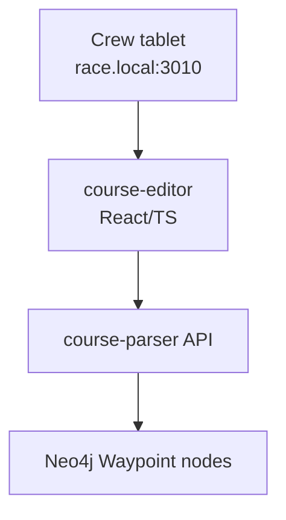

**Offline:** Map tiles pre-cached; editor works without internet after initial harbor setup.

#### 7.13.3 VMG and progress along course

**Container:** `live-results` (uses parsed waypoints + AIS + SLA-1 wind)

For **own boat and each competitor**, compute:

| Metric | Formula / method |
|--------|------------------|
| **Leg** | Active segment between last rounded WP and next WP |
| **DTM** | Distance to next mark (nm) |
| **BTM** | Bearing to mark (°T) |
| **VMG** | `SOG × cos(angle between COG and BTM)` — toward next mark |
| **Target VMG** | From polar at current TWS/TWA toward mark |
| **Course %** | Distance sailed along route / total route distance |
| **ETA** | `DTM / VMG` (when VMG &gt; 0) |

Coordinates from chapter 11 enable VMG **relative to the rhumb line** on each leg, not just absolute SOG.

**Influx measurements (`course_progress`):**

| Tags | Fields |
|------|--------|
| `mmsi`, `race_id`, `route_id`, `leg_seq` | `vmg`, `dtm`, `btm`, `course_pct`, `lat`, `lon` |

#### 7.13.4 Live results list (corrected time ordering)

**Reference SI §23:** *"Korrigert tid brukes til resultatberegning, korrigert tid = seilt tid × handicap"*

**`live-results`** computes **provisional standings** during the race:

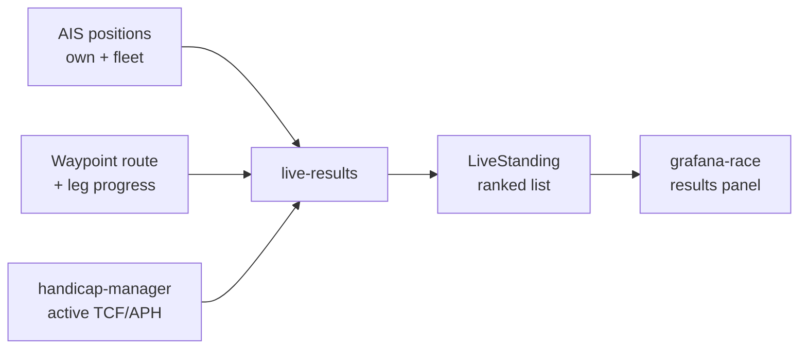

**Per boat:**

1. **Elapsed time** — from start signal to now (or projected finish).
2. **Distance progress** — fraction of course completed (waypoint sequence + AIS projection).
3. **Projected finish time** — `elapsed / course_pct` (when &gt; 5% complete).
4. **Corrected time** — `projected_elapsed × handicap_factor` (see §7.14).
5. **Rank** — sort all vessels by corrected time ascending.

**Neo4j `LiveStanding` (refreshed every 30 s):**

```cypher
(:LiveStanding {
  mmsi: "…",
  rank: 3,
  elapsed_s: 14400,
  projected_finish_s: 28800,
  corrected_s: 34790,
  handicap_type: "aph_tot",
  handicap_value: 1.2082,
  course_pct: 0.50,
  vmg_to_mark: 4.2,
  updated_at: datetime()
})
```

**Grafana-race panel:** scratch sheet style table — rank, sail no., name, corrected time, delta to leader, leg, VMG.

---

### 7.14 Handicap numbers & scoring

**Container:** `handicap-manager`  
**Reference certificate:** `C:\Repositories\boat_system\ORC Certificate for Off Course.pdf`  
**Per-race scoring:** [ORC Weather Routing Scoring (WRS) 2026](https://orc.org/sailors/news-archive/orc-weather-routing-scoring-ready-for-2026-after-a-breakthrough-2025-season)

A single boat may carry **multiple handicap numbers** simultaneously. The active factor depends on **regatta scoring rules** and **race type**.

#### 7.14.1 Handicap types per vessel (ORC certificate)

Parsed from ORC certificate PDF (same pipeline as competitor polar extraction):

**Example — OFF COURSE (NOR 15788), CertNo 667232:**

| Type | Key | Value | Use when |
|------|-----|-------|----------|
| **APH ToD** | `aph_tod` | 496.6 s/NM | Time-on-distance, windward/leeward |
| **APH ToT** | `aph_tot` | 1.2082 | Time-on-time (single number) |
| **Cert number** | `cert_no` | 667232 | ORC database reference |
| **ORC Ref** | `orc_ref` | 03440003WLQ | Certificate ID |
| **Distanseseilas Singeltall** | `scoring_aph` | 1.2082 | Færderseilasen distance race (§23) |
| **Distanseseilas Trippeltall svak vind** | `scoring_triple_light` | 0.9544 | Light air |
| **Distanseseilas Trippeltall mellomvind** | `scoring_triple_medium` | 1.2160 | Medium wind |
| **Distanseseilas Trippeltall sterk vind** | `scoring_triple_heavy` | 1.3471 | Heavy wind |
| **Pølsebane Trippeltall** (weak/med/strong) | `scoring_wl_*` | 0.7409 / 0.9823 / 1.1070 | Windward-leeward courses |
| **Motvind Singeltall** | `scoring_upwind` | 1.1113 | Upwind-biased |
| **Medvind Singeltall** | `scoring_downwind` | 1.2015 | Downwind-biased |
| **Windward/Leeward ToD** | `tod_wl` | 615.6 s/NM | Course-specific allowance |
| **All purpose ToD** | `tod_allpurpose` | 496.6 s/NM | General |

**`config/handicaps.yaml` (OFF COURSE example):**

```yaml
vessels:
  - name: "OFF COURSE"
    sail_number: "NOR 15788"
    mmsi: null
    certificate:
      path: "../ORC Certificate for Off Course.pdf"
      cert_no: "667232"
      orc_ref: "03440003WLQ"
      valid_until: "2026-03-31"
    ratings:
      - type: aph_tot
        value: 1.2082
        source: certificate
      - type: aph_tod
        value: 496.6
        unit: sec_per_nm
        source: certificate
      - type: scoring_triple_light
        value: 0.9544
        source: certificate
      - type: scoring_triple_medium
        value: 1.2160
        source: certificate
      - type: scoring_triple_heavy
        value: 1.3471
        source: certificate
      # … additional scoring options from certificate page 2
```

**Neo4j model:**

```cypher
(v:Vessel)-[:HAS_HANDICAP]->(h:HandicapRating {
  type: "aph_tot",
  value: 1.2082,
  source: "certificate",
  valid_from: date("2025-08-11"),
  valid_to: date("2026-03-31"),
  active: false
})
```

Multiple `HandicapRating` nodes per vessel; exactly one marked `active` per race.

#### 7.14.2 Per-race handicap — ORC Weather Routing Scoring (WRS)

For regattas using **[ORC WRS](https://orc.org/sailors/news-archive/orc-weather-routing-scoring-ready-for-2026-after-a-breakthrough-2025-season)**, each boat receives a **custom Time Correction Factor (TCF)** per race — derived from:

- Predicted wind on each **leg** of the **declared course**
- Boat's **ORC polar performance curves**
- **Predicted Elapsed Time (PET)**

| Attribute | WRS behaviour |
|-----------|---------------|
| **Issued** | Few hours before start by ORC |
| **Scope** | Per race, per boat (not on certificate) |
| **Overrides** | Static APH ToT for that race only |
| **Input to system** | Manual upload, email, or `manage2sail` scrape |

**`HandicapRating` for WRS:**

```cypher
(v:Vessel)-[:HAS_HANDICAP]->(h:HandicapRating {
  type: "wrs_tcf",
  value: 1.0342,
  source: "orc_wrs",
  race_id: "faerderseilasen-2026-leg1",
  pet_seconds: 87432,
  issued_at: datetime(),
  active: true
})
```

**`handicap-manager` selection logic:**

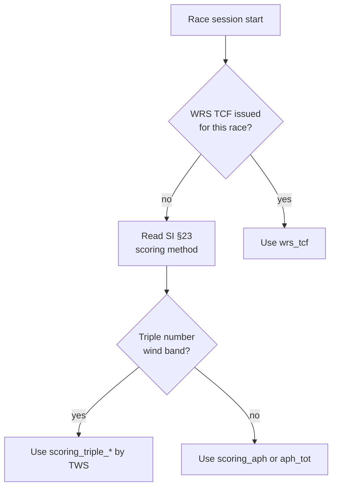

For **Færderseilasen 2026 §23** (Racing classes): `corrected = elapsed × handicap` → use `aph_tot` / `scoring_aph` (1.2082) unless WRS or triple-number specified in SI.

#### 7.14.3 Integration with live results and polars

| Component | Handicap use |
|-----------|--------------|
| `live-results` | Active `HandicapRating` → corrected time ranking |
| `wind-field-analyzer` | Fleet overperformance vs **polar** (not handicap) |
| `polar-manager` | Speed prediction; separate from time correction |
| `tactical-coach` | Explains rank delta using handicap + VMG context |

**Own boat** (`7710 (3).slk`) + **competitor** (`ORC Certificate for Off Course.pdf`): both need `HandicapRating` nodes before live results activate.

#### 7.14.4 File layout (dev machine)

```
C:\Repositories\boat_system\
├── Seilingsbestemmelser_Færderseilasen26_2.pdf   ← SI; chapter 11 routes
├── ORC Certificate for Off Course.pdf              ← competitor handicaps + polar
├── 7710 (3).slk                                  ← own-boat polar
├── off_course.png                                ← competitor polar (image fallback)
└── AI-sailing-system\
    └── config\
        ├── courses.yaml
        ├── handicaps.yaml
        ├── vessel.yaml
        └── competitors.yaml
```

---

## 8. Technology matrix

| Concern | Choice | Language | Rationale |
|---------|--------|----------|-----------|
| Marine hub | Signal K Server | Node.js / TS | Industry standard; PiCAN-M compatible; plugin ecosystem |
| Live stream | WebSocket (Signal K v1) | — | Proven in `subscribe_to_websocket` |
| Message buffer | Redis Streams (v1) | — | Lighter than RabbitMQ on Pi; optional |
| Time series DB | InfluxDB 2.x | Flux | Purpose-built; Grafana native |
| Graph DB | Neo4j 5 Community | Cypher | Replaces CDF relationships; rich tactical queries |
| Dashboards | Grafana OSS | — | De facto for InfluxDB |
| LLM runtime | llama.cpp | C++ / Python bindings | Best ARM edge performance for LLaMA |
| Edge ML | Coral libedgetpu | Python | Accelerate non-LLM models |
| GoPro control | Open GoPro Python SDK | Python | HERO13 BLE + Wi-Fi capture |
| Sail geometry | OpenCV + custom calib | Python | Angles and shape metrics |
| Onshore training | PyTorch + Hugging Face | Python | TrimTransformer on GPU servers |
| Model registry | MLflow | — | Versioned shore → edge deploy |
| GRIB parsing | cfgrib / xarray / eccodes | Python | Decode GRIB2 wind grids on SLA-2 |
| AIS decode | pyais + Signal K paths | Python | Fleet position ingest |
| Polars | NumPy interpolation | Python | Target BSP/VMG per TWS/TWA |
| Wind analysis | Custom fusion service | Python | GRIB + AIS + polar runtime |
| Course PDF parse | PyMuPDF + regex/NLP | Python | SI chapter 11 → waypoints |
| Course editor | React + TypeScript + Vite | TS/TSX | Manual waypoint entry on Pi |
| Live results | FastAPI + Neo4j | Python | Corrected-time standings |
| Handicap registry | ORC PDF parser | Python | Certificate + WRS TCF per race |
| API / coach | FastAPI | Python | Async, typed, small footprint |
| Containers | Docker Compose | YAML | Repeatable; works on Pi arm64 |
| Remote updates | Watchtower or custom agent | — | Pull from GHCR when online |
| Config | Environment + YAML | — | No cloud config dependency |

---

## 9. Deployment architecture

### 9.1 Container layout (per SLA tier)

Each tier has its own Compose file. **Never merge SLA-1 with SLA-3 on the same Pi in race profile.**

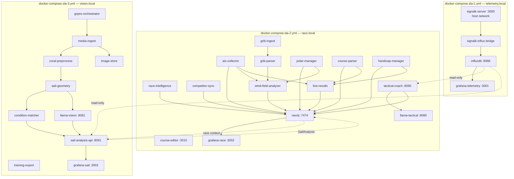

**Compose file mapping:**

| File | Deploy to | Watchtower in race mode |
|------|-----------|-------------------------|
| `docker-compose.sla-1.yml` | `telemetry.local` | **Disabled** |
| `docker-compose.sla-2.yml` | `race.local` | Harbor only |
| `docker-compose.sla-3.yml` | `vision.local` | Harbor only |
| `docker-compose.harbor.yml` | Overlay — enables Watchtower per tier | When `RACE_MODE=false` |

### 9.2 Remote upgrade strategy

**Problem:** How to upgrade containers at sea (or from harbor Wi-Fi) without breaking the NMEA bus stack.

**Approach:**

1. **Immutable images** — publish multi-arch (`linux/arm64`) images to GitHub Container Registry (`ghcr.io/cognite-fholm/...`).
2. **Watchtower** — polls registry on schedule when `WATCHTOWER_HTTP_API_PERIODIC_POLLS` or network is up; updates one service at a time.
3. **Signal K stays up** — `network_mode: host` on SLA-1 `signalk-server` only; CAN/serial device paths remain stable.
4. **Per-tier rollout** — upgrade SLA-3 first, then SLA-2, **never SLA-1** during an active race session.
5. **Pre-race freeze** — `WATCHTOWER_NO_PULL=true` on all compose files, or disable via label on SLA-1 always.
5. **Rollback** — pin image digests in `docker-compose.prod.yml`; keep previous digest in `.env.previous`.
6. **Offline updates** — USB stick with `docker load` images as fallback.

**NMEA bus consideration:** Container restarts on `signalk-server` cause brief data gaps (~seconds). Watchtower should run **only in harbor mode**, not during active racing. A systemd timer can enable Watchtower when `eth0/wlan0` has internet and `RACE_MODE=false`.

### 9.3 Local-only operation checklist

- [ ] Each tier has independent `restart: unless-stopped`
- [ ] DNS not required (use `/etc/hosts` for `telemetry.local`, `race.local`, `vision.local`)
- [ ] Grafana auth enabled on all three instances
- [ ] Models pre-downloaded on SLA-2 and SLA-3 nodes
- [ ] InfluxDB volume on SLA-1; Neo4j volume on SLA-2; image-store on SLA-3
- [ ] NTP optional (GPS time from Signal K on SLA-1 preferred)
- [ ] Inter-tier firewall: SLA-2/SLA-3 read-only access to SLA-1 Influx API

---

## 10. Lineage from cognite-fholm / CogSail

### 10.1 Repository analysis

| Repository | Era | Role | Carry forward | Replace |
|------------|-----|------|-------------|---------|
| [CogSail](https://github.com/cognite-fholm/CogSail) | 2018–2021 | Java/Android client experiments | UX lessons, marine domain model | Java stack, CDF client |
| [Cogsail-raspberry-pi](https://github.com/cognite-fholm/Cogsail-raspberry-pi) | 2021 | Java on RPi | Onboard deployment concept | Java runtime |
| [cogsail-raspberry](https://github.com/cognite-fholm/cogsail-raspberry) | 2021 | RPi project skeleton | — | Empty/stale |
| [cogsail-python](https://github.com/cognite-fholm/cogsail-python) | 2024 | **SignalK → RabbitMQ → CDF** | `parse_signalK()`, stream pattern, OAuth-free local variant | CDF, RabbitMQ (optional), cloud |
| [subscribe_to_websocket](https://github.com/cognite-fholm/subscribe_to_websocket) | 2024 | WebSocket → RabbitMQ | WebSocket subscription pattern | RabbitMQ coupling |
| [push_to_cdf](https://github.com/cognite-fholm/push_to_cdf) | 2024 | RabbitMQ → CDF time series | Batching, dedup, offset tracking | CDF SDK |
| [cogsail-scripts](https://github.com/cognite-fholm/cogsail-scripts) | 2019 | CDF asset hierarchy (MMSI boats) | MMSI → vessel graph model | CDF assets API |
| [crawl_web](https://github.com/cognite-fholm/crawl_web) | 2024 | Race web crawling | NOR/SI ingestion pipeline | — |
| [3d_processing](https://github.com/cognite-fholm/3d_processing) | 2024 | 3D data processing | Future: course/spatial overlays | — |
| [Cognite-Sailing](https://github.com/cognite-fholm/Cognite-Sailing) | 2018 | Early prototype | Historical reference | Empty |

### 10.2 Architecture evolution

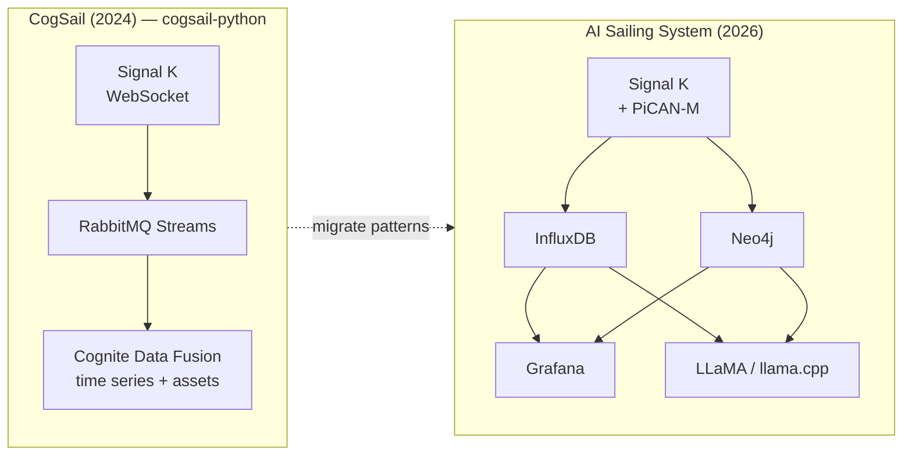

### 10.3 Specific code reuse

1. **`parse_signalK()`** (`cogsail-python/push_to_cdf/Consume stream.py`) — adapt to write Influx points instead of CDF `time_series.data.insert_multiple`.
2. **WebSocket subscriber** (`subscribe_to_websocket/`) — replace RabbitMQ sink with direct Influx line protocol or Redis Streams consumer.
3. **MMSI asset hierarchy** (`cogsail-scripts/CreateBoats.py`) — translate to Cypher `MERGE (v:Vessel {mmsi: $mmsi})`.
4. **RabbitMQ offset persistence** (CDF data model `RabbitMQOffset`) — replace with InfluxDB task checkpoint or Redis consumer group ID.

---

## 11. Functional requirements

### 11.1 SLA-1 — Telemetry

| ID | Requirement |
|----|-------------|
| FR-1 | Ingest NMEA 2000 PGNs from `can0` at 250 kbit/s |
| FR-2 | Ingest NMEA 0183 from `/dev/ttyS0` at configurable baud |
| FR-3 | Publish all data to Signal K v1 delta stream within 200 ms |
| FR-4 | Persist numeric telemetry to InfluxDB with &lt; 500 ms write latency (p95) |
| FR-5 | Support optional I²C environmental sensors |
| FR-6 | SLA-1 operates independently when SLA-2 and SLA-3 are offline |

### 11.2 SLA-2 — Race, competitors, GRIB, polars & wind

| ID | Requirement |
|----|-------------|
| FR-10 | User can start/stop a **race session** (tags all data with `race_id`) |
| FR-11 | System detects tacks and gybes from heading/rudder/AWA thresholds |
| FR-12 | Grafana-race shows live VMG and **polar %** for own boat and selected competitors |
| FR-13 | Neo4j stores leg boundaries, mark roundings, and competitor positions |
| FR-14 | Post-race debrief includes wind-zone summary within 5 min of session end |
| FR-15 | **AIS** collected for own boat and all visible competitors (MMSI, COG, SOG, position) |
| FR-16 | `ais-collector` refreshes fleet positions ≤ 10 s (class A) from N2K via Signal K |
| FR-17 | **GRIB** auto-fetched every 6 h when `ONLINE_MODE=true`; manual upload supported |
| FR-18 | Latest GRIB usable offline; age warning if stale &gt; 12 h at race start |
| FR-19 | **Own-boat polar** loaded from **SLK** file (`7710 (3).slk`); auto-reload on change |
| FR-20 | `polar-manager` parses SYLK columns: TWS, TWA, BTV, VMG, AWS, AWA, Heel, Condition |
| FR-21 | **Competitor polars** derived from ORC certificate **PNG/PDF** via `polar-certificate-extractor` |
| FR-22 | Derived polars require harbor **approve** before use in wind-field scoring (configurable) |
| FR-23 | `polar-manager` interpolates target BSP/VMG for any TWS/TWA |
| FR-24 | `wind-field-analyzer` updates course wind-advantage map every 30–60 s during race |
| FR-25 | Wind zones fuse GRIB, own instruments, fleet AIS overperformance vs polars |
| FR-26 | Crew sees heatmap + recommendation (e.g. favored side of beat) on grafana-race |
| FR-27 | crawl_web agent ingests NOR/SI when online |
| FR-28 | `course-parser` extracts §11 routes from SI PDF (e.g. Færderseilasen) |
| FR-29 | Coordinates parsed from `N59°52,50' Ø010°38,76'` (WGS-84) format |
| FR-30 | Waypoints without coords editable in React `course-editor` at `:3010` |
| FR-31 | `live-results` ranks fleet by corrected time (`elapsed × handicap`) |
| FR-32 | VMG to next mark computed for own boat and competitors using waypoint geometry |
| FR-33 | `handicap-manager` loads multiple ORC ratings per vessel from certificate PDF |
| FR-34 | Per-race **ORC WRS TCF** overrides static handicap when issued |
| FR-35 | Active handicap selected from SI scoring rule + wind band (single/triple/WRS) |

### 11.3 SLA-3 — Sail performance vision (GoPro HERO13)

| ID | Requirement |
|----|-------------|
| FR-40 | Orchestrate 3–5 GoPro HERO13 cameras via Open GoPro BLE/Wi-Fi |
| FR-41 | Synchronized multi-camera still burst within ±200 ms |
| FR-42 | Coral preprocess extracts sail/boom ROI before geometry + LLM |
| FR-43 | `sail-geometry` computes boom angle, mast heel, draft, twist, luff metrics |
| FR-44 | Each capture aligned to SLA-1 telemetry (`t_influx` ±100 ms) |
| FR-45 | `condition-matcher` finds best `BestTrimSnapshot` in similar conditions |
| FR-46 | Crew sees current vs best Δ for boom, heel, draft on grafana-sail |
| FR-47 | Vision LLM produces qualitative trim narrative per capture burst |
| FR-48 | Results published to SLA-2 Neo4j as `SailGeometry`, `TrimDelta`, `SailAnalysis` |
| FR-49 | SLA-3 pausable without affecting SLA-1 or SLA-2 |

### 11.4 Onshore training (SLA-S)

| ID | Requirement |
|----|-------------|
| FR-50 | `training-export` builds multimodal bundles (telemetry + images + geometry) in harbor |
| FR-51 | Export requires explicit `TRAINING_EXPORT_CONSENT` per session |
| FR-52 | Shore pipeline trains TrimTransformer on GPU machines (PyTorch) |
| FR-53 | Model predicts optimal boom angle, mast heel, sail shape for condition vector |
| FR-54 | Evaluator holds out full regatta sessions — no random frame leakage |
| FR-55 | Quantized `trim-predictor` artifact deployable to SLA-3 via GHCR |
| FR-56 | `BestTrimSnapshot` sets sync from shore to boat Neo4j after training round |

### 11.5 AI coaching (cross-tier)

| ID | Requirement |
|----|-------------|
| FR-60 | SLA-2 text LLM answers tactical questions in &lt; 30 s on Pi 5 |
| FR-61 | No tier sends data off-device without explicit opt-in |
| FR-62 | SLA-2 coach context: telemetry + race graph + **active wind zones** |
| FR-63 | SLA-3 vision LLM runs only on vision node; no SLA-1 co-location in race profile |

### 11.6 Operations

| ID | Requirement |
|----|-------------|
| FR-70 | SLA-1 full stack boots in &lt; 60 s on power-on |
| FR-71 | Remote container update per tier without manual SSH (when online) |
| FR-72 | `RACE_MODE=true` disables Watchtower on all tiers; SLA-1 never auto-updates |
| FR-73 | System runs with zero internet for 72+ hours across all tiers |
| FR-74 | Each tier deployable via separate `docker compose -f docker-compose.sla-N.yml` |
| FR-75 | `grib-store` and `polars/` volumes persist across reboots on SLA-2 |

---

## 12. Non-functional requirements

| Category | SLA-1 | SLA-2 | SLA-3 |
|----------|-------|-------|-------|
| Availability (race) | 99.99% | 99.9% | 95% |
| Latency (dashboard) | &lt; 1 s | &lt; 3 s | &lt; 60 s per analysis |
| Storage | 32 GB min; 7 days raw @ 10 Hz | Neo4j 16 GB+; GRIB 2–5 GB; polars &lt;100 MB | GoPro JPEG ring 64 GB+ |
| Power | N2K SMPS or 12 V DC | 12 V DC | 12 V DC |
| Isolation | Dedicated Pi in race profile | Separate Pi or shared with SLA-3 | Separate Pi required in race profile |
| Security | No default passwords; read token for cross-tier Influx | Neo4j auth; REST API keys | Camera data local only |
| Maintainability | Independent compose stack per tier | Same | Same |

---

## 13. Repository layout (planned)

```
AI-sailing-system/
├── spec.md
├── adr/
├── docker-compose.sla-1.yml    # Telemetry tier
├── docker-compose.sla-2.yml    # Race & competitor tier
├── docker-compose.sla-3.yml    # Sail vision tier
├── docker-compose.harbor.yml     # Watchtower overlay (harbor mode)
├── deploy/
│   ├── compact/                  # Single-Pi overrides
│   ├── standard/                 # 2-Pi overrides
│   └── race/                     # 3-Pi overrides (recommended)
├── signalk/                      # SLA-1
├── influxdb/                     # SLA-1
├── grafana/
│   ├── telemetry/                # SLA-1 dashboards
│   ├── race/                     # SLA-2 dashboards
│   └── sail/                     # SLA-3 dashboards
├── neo4j/                        # SLA-2
├── race-intelligence/            # SLA-2
├── competitor-sync/                # SLA-2 fleet roster
├── ais-collector/                  # SLA-2 AIS ingest from Signal K
├── grib-ingest/                    # SLA-2 scheduled GRIB fetch + upload
├── grib-parser/                    # SLA-2 GRIB2 → wind grid
├── polar-manager/                  # SLA-2 SLK parser + polar API
├── polar-certificate-extractor/    # SLA-2 ORC PNG/PDF → derived polar
├── wind-field-analyzer/
├── course-parser/                  # SLA-2 SI/NOR PDF → waypoints
├── course-editor/                  # SLA-2 React/TS waypoint UX
├── live-results/                   # SLA-2 corrected-time standings
├── handicap-manager/               # SLA-2 ORC + WRS handicaps
├── config/
│   ├── vessel.yaml
│   ├── competitors.yaml
│   ├── courses.yaml                # Active regatta + route selection
│   ├── handicaps.yaml              # Multi-rating per vessel
│   ├── cameras.yaml
│   └── grib-sources.yaml
├── examples/
│   └── README.md                   # Parent-dir polar files (boat_system/)
├── data/                           # gitignored — runtime volumes
│   ├── grib/
│   └── polars/                     # Canonical YAML (generated from SLK / derived)
├── tactical-coach/                 # SLA-2
├── gopro-orchestrator/           # SLA-3 Open GoPro fleet control
├── media-ingest/                   # SLA-3 GoPro HTTP download
├── sail-geometry/                  # SLA-3 angle & shape metrics
├── condition-matcher/              # SLA-3 best-trim comparison
├── coral-preprocess/               # SLA-3
├── sail-analysis/                  # SLA-3 API
├── training-export/                # SLA-3 harbor bundle builder
├── shore/                          # SLA-S onshore only
│   ├── dataset-curator/
│   ├── trim-transformer-trainer/
│   ├── model-evaluator/
│   └── docker-compose.sla-shore.yml
├── models/
│   ├── sla-2/                      # Text GGUF manifests
│   └── sla-3/                      # Vision GGUF manifests
├── scripts/
│   ├── install-pi-telemetry.sh
│   ├── install-pi-race.sh
│   └── install-pi-vision.sh
└── docs/
    ├── hardware-setup.md
    └── sla-tiers.md
```

---

## 14. Implementation phases

### Phase 0 — Specification (current)
- [x] Repository created
- [x] spec.md
- [x] ADR-0001
- [x] ADR-0002 (three-tier SLA)

### Phase 1 — SLA-1 telemetry (MVP)
- [ ] Signal K on Pi with PiCAN-M
- [ ] `docker-compose.sla-1.yml`
- [ ] InfluxDB bridge
- [ ] grafana-telemetry live dashboard

### Phase 2 — SLA-2 race, GRIB, polars, AIS, courses & results
- [ ] Neo4j schema (Vessel, Polar, GribModel, WindAdvantageZone, Waypoint, HandicapRating)
- [ ] `docker-compose.sla-2.yml`
- [ ] `ais-collector` + `polar-manager` (SLK + ORC PDF)
- [ ] `grib-ingest` + `grib-parser` + `wind-field-analyzer`
- [ ] `course-parser` — Færderseilasen §11 PDF
- [ ] `course-editor` — React/TS waypoint UI
- [ ] `handicap-manager` — ORC certificate + WRS TCF
- [ ] `live-results` — corrected-time standings + VMG
- [ ] grafana-race dashboards

### Phase 3 — SLA-3 GoPro sail vision
- [ ] `docker-compose.sla-3.yml`
- [ ] `gopro-orchestrator` — HERO13 fleet (Open GoPro)
- [ ] `sail-geometry` + `condition-matcher`
- [ ] Coral preprocess + vision LLM
- [ ] grafana-sail dashboards (current vs best trim)

### Phase 4 — Multi-Pi & remote ops
- [ ] Race profile (3-node) deployment guide
- [ ] GHCR publish pipeline per tier
- [ ] Watchtower harbor mode per compose file
- [ ] tier-watchdog for compact profile
- [ ] Migrate `cogsail-python` mapping utilities

### Phase 5 — Onshore training (SLA-S)
- [ ] `training-export` harbor bundles
- [ ] `docker-compose.sla-shore.yml` on GPU server
- [ ] TrimTransformer training pipeline
- [ ] `trim-predictor` edge deployment to SLA-3
- [ ] `BestTrimSnapshot` shore → boat sync

---

## 15. Open questions

| # | Question | Notes |
|---|----------|-------|
| OQ-1 | Primary GRIB model for region? | GFS global vs regional HARMONIE/AROME |
| OQ-2 | VPP-lite model for derived polars? | ORC regression table vs custom neural VPP |
| OQ-3 | AIS class B timeout handling? | Stale track grey-out after 5 min |
| OQ-4 | Wind-zone weight tuning per class? | One-design vs ORC handicap fleet |
| OQ-5 | GRIB spatial resolution on Pi? | 0.25° vs clipped high-res regional |
| OQ-6 | Include rig load cells in training labels? | If available on N2K |

---

## 16. References

- [Signal K specification](https://signalk.org/specification/)
- [Signal K server](https://github.com/SignalK/signalk-server)
- [PiCAN-M documentation](https://copperhilltech.com/content/pican-m_UGB_10.pdf)
- [Google Coral NPU](https://github.com/google-coral/coralnpu)
- [InfluxDB documentation](https://docs.influxdata.com/)
- [Neo4j documentation](https://neo4j.com/docs/)
- [llama.cpp](https://github.com/ggerganov/llama.cpp)
- [Open GoPro specification](https://gopro.github.io/OpenGoPro/)
- [Open GoPro Python SDK](https://gopro.github.io/OpenGoPro/python_sdk/)
- [cfgrib documentation](https://ecmwf.github.io/cfgrib/)
- [pyais](https://github.com/M0r13n/pyais)
- [GoPro HERO13 Black](https://gopro.com/en/us/shop/cameras/hero13-black/CHDHX-131-master.html)
- [CogSail Python (prior art)](https://github.com/cognite-fholm/cogsail-python)
