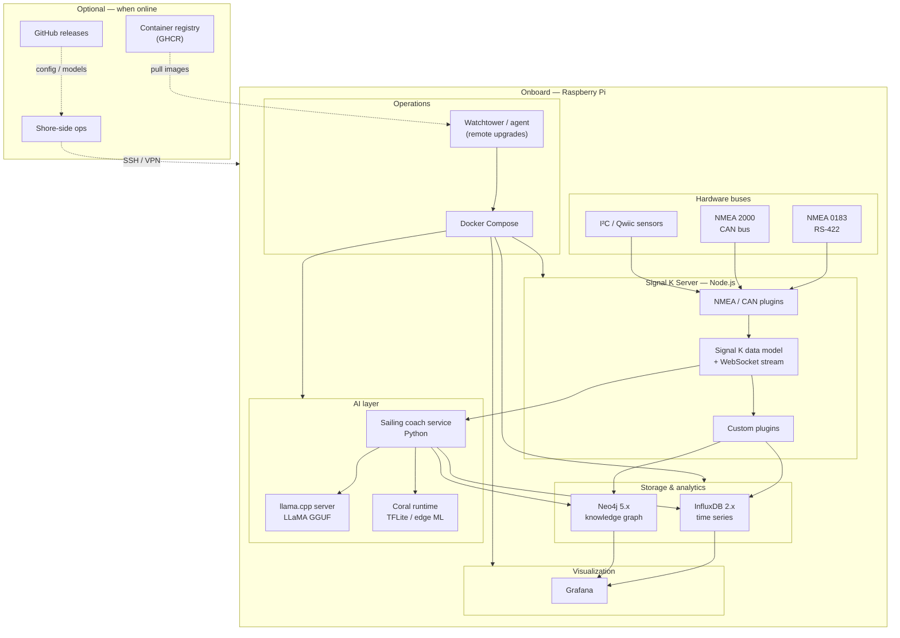
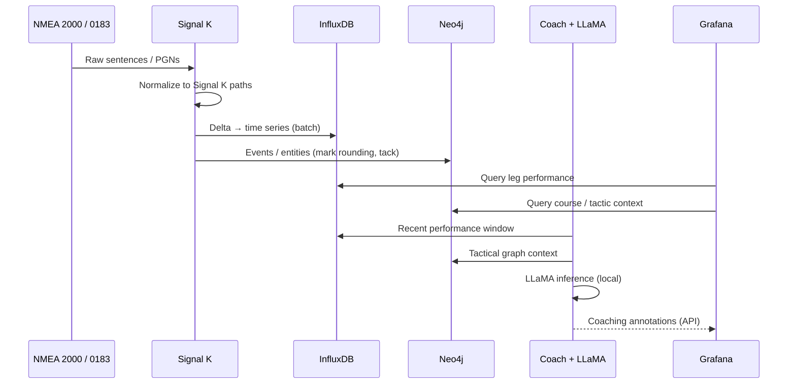
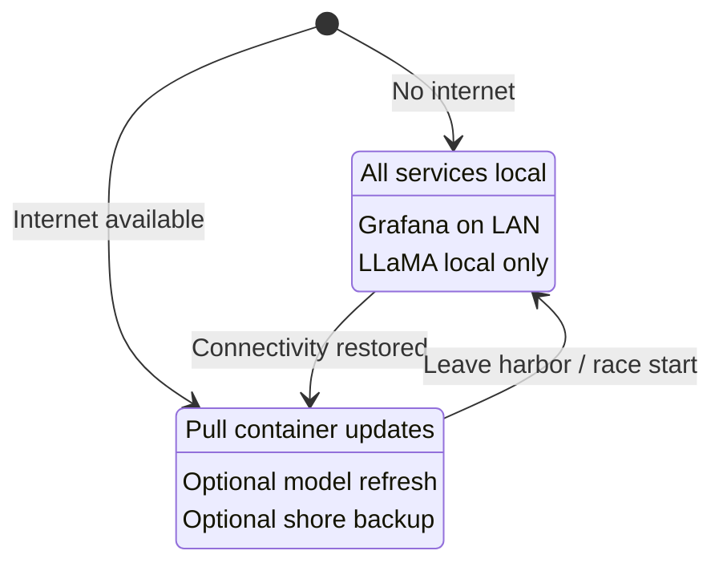
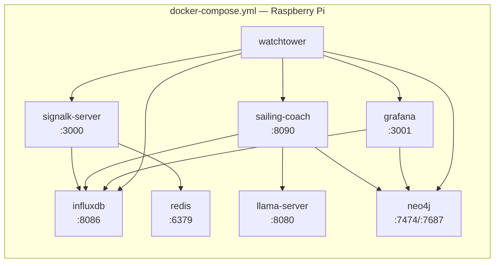
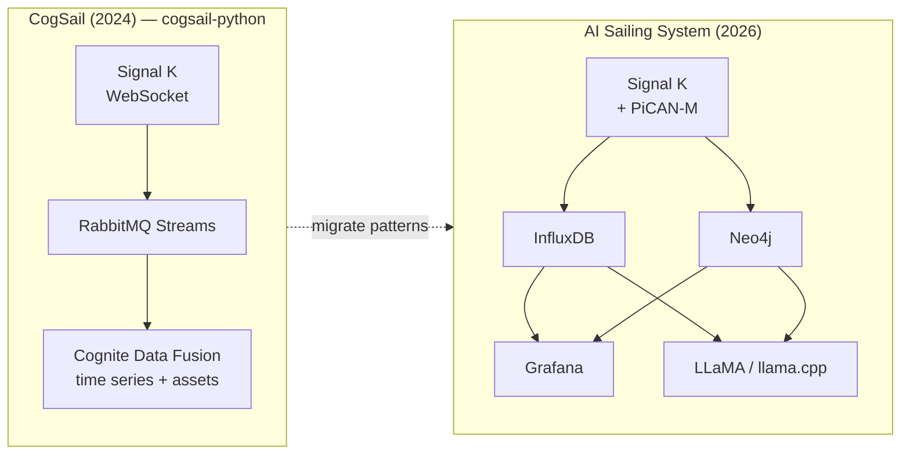

# AI Sailing System — Specification

**Version:** 0.1.0-draft  
**Date:** 2026-07-04  
**Author:** cognite-fholm  
**Status:** Draft — architecture & requirements

---

## 1. Executive summary

The **AI Sailing System** is an onboard edge platform for **competitive sailing**. It ingests marine sensor data over NMEA 0183 and NMEA 2000, normalizes it through **Signal K**, stores high-frequency telemetry in **InfluxDB**, models boats, races, courses, and tactics in **Neo4j**, visualizes performance in **Grafana**, and provides **local AI coaching** using **LLaMA** models.

The system is designed to:

- Run **fully offline** during a race (no internet required).
- Operate on a **Raspberry Pi** with a **PiCAN-M HAT** (NMEA buses + 3 A SMPS).
- Use a **Google Coral** accelerator for edge ML workloads where applicable.
- Support **remote upgrades** via container-based deployment when connectivity is available.
- Build directly on lessons learned from the existing **CogSail** repositories.

---

## 2. Problem statement

Competitive sailors need more than raw instrument readouts. They need:

1. **Unified data** — wind, speed, heading, depth, engine, autopilot, polar data, and custom sensors in one model.
2. **Race context** — marks, legs, start line, fleet position, and course geometry linked to live telemetry.
3. **Performance insight** — VMG, target angles, polar comparison, tack/gybe quality, and leg summaries.
4. **Tactical memory** — what worked on this course, in these conditions, against this fleet.
5. **Trustworthy edge operation** — must work at sea with intermittent or zero connectivity.

The prior CogSail stack proved that Signal K → stream buffer → structured storage works, but relied on **Cognite Data Fusion (CDF)** in the cloud. This system keeps the proven ingestion patterns and replaces CDF with **InfluxDB + Neo4j + Grafana**, adding **local LLaMA** for AI assistance.

---

## 3. Goals and non-goals

### 3.1 Goals

| ID | Goal |
|----|------|
| G1 | Win-focused analytics: start timing, laylines, wind shifts, fleet leverage, leg debrief |
| G2 | Signal K as the canonical onboard marine data model |
| G3 | Sub-second local dashboards via Grafana |
| G4 | Graph queries for race/tactic/boat relationships via Neo4j |
| G5 | Local LLM inference without cloud dependency during races |
| G6 | Containerized services with remote upgrade path |
| G7 | NMEA 0183 + NMEA 2000 via PiCAN-M HAT |
| G8 | Reuse and migrate concepts from cognite-fholm CogSail repos |

### 3.2 Non-goals (v1)

- Autonomous vessel control or autopilot override.
- Class rule enforcement or protest filing automation.
- Replacing dedicated race tracking services (e.g. YB Tracking) — integration may come later.
- Training large models onboard — only **inference** of pre-quantized models.
- Full cloud SaaS replacement — optional sync/export may be added later.

---

## 4. Hardware platform

### 4.1 Reference bill of materials

| Component | Role | Notes |
|-----------|------|-------|
| **Raspberry Pi 5** (8 GB recommended) | Main compute | Pi 4 (4 GB+) acceptable; Pi 5 preferred for AI and I/O |
| **PiCAN-M HAT + 3 A SMPS** | Marine I/O + power | NMEA 0183 (RS-422 `/dev/ttyS0`), NMEA 2000 (SocketCAN `can0`), optional N2K backbone power |
| **Google Coral accelerator** | Edge ML | USB Accelerator or PCIe/M.2 depending on enclosure; see [§6.5](#65-ai--llama--coral) |
| **32 GB+ industrial microSD** or **NVMe (Pi 5)** | OS + data | Marine vibration and power-fluctuation tolerant media preferred |
| **12 V marine supply** | Power | Via NMEA 2000 backbone (SMPS version) or dedicated DC-DC |
| **Wi-Fi / LTE (optional)** | Remote deploy & sync | Not required for race operation |

### 4.2 PiCAN-M integration

```
NMEA 2000 backbone ──► Micro-C (J1) ──► can0 (SocketCAN, 250 kbit/s)
NMEA 0183 talker/listener ──► RS-422 screw terminal (J3) ──► /dev/ttyS0
I²C sensors (wind, env) ──► Qwiic (J4)
12 V N2K power ──► onboard SMPS ──► 5 V for Pi + HAT
```

**Signal K configuration (reference):**

- NMEA 2000: `canboatjs` or Signal K N2K plugin reading `can0`.
- NMEA 0183: serial port plugin on `/dev/ttyS0` (4800/38400/115200 as appropriate).
- I²C sensors: optional plugin or custom Python reader publishing Signal K deltas.

### 4.3 Coral accelerator note

The linked [google-coral/coralnpu](https://github.com/google-coral/coralnpu) repository describes Coral's **ML accelerator core** (successor/evolution of Edge TPU). For v1:

- **LLaMA inference** runs on the **ARM CPU** via **llama.cpp** (quantized GGUF models).
- **Coral** accelerates **complementary** workloads: wake/event detection, image classification (crew/camera), custom TFLite models — not full transformer LLM inference.

This split is intentional and matches hardware capabilities.

---

## 5. System architecture

### 5.1 High-level context



### 5.2 Data flow (race mode)



### 5.3 Offline vs online modes



---

## 6. Software components

### 6.1 Signal K Server (hub)

**Language:** Node.js (TypeScript for custom plugins)  
**Source:** [SignalK/signalk-server](https://github.com/SignalK/signalk-server)

Signal K is the **single source of truth** for live marine data. It:

- Reads NMEA 0183 and NMEA 2000 via PiCAN-M interfaces.
- Exposes `ws://localhost:3000/signalk/v1/stream` for subscribers.
- Hosts plugins for InfluxDB export, Neo4j event emission, and coach triggers.

**Custom plugins planned:**

| Plugin | Responsibility |
|--------|----------------|
| `signalk-to-influxdb2` | Fork/adapt existing community plugin; map Signal K paths → Influx measurements |
| `signalk-race-events` | Detect tacks, gybes, mark rounding; emit to Neo4j |
| `signalk-ai-bridge` | Forward curated context windows to coach service |

### 6.2 Time series — InfluxDB

**Language:** configuration + Flux/SQL queries; write path in Node.js or Python  
**Replaces:** CDF time series (previously via `push_to_cdf`)

**Schema strategy:**

- **Bucket:** `signalk` (raw, 90-day retention); `race` (downsampled, long retention).
- **Measurement:** derived from Signal K path (e.g. `navigation_speedOverGround`).
- **Tags:** `vessel`, `source`, `pgn` (N2K), `context`, `race_id` (when active).
- **Fields:** numeric values; store strings in Neo4j instead.

**Migration from CogSail:** The `parse_signalK()` logic in `cogsail-python/push_to_cdf/Consume stream.py` maps deltas to external IDs — reuse this path→ID mapping as Influx measurement/field conventions.

### 6.3 Knowledge graph — Neo4j

**Language:** Cypher; ingestion via Python (`neo4j` driver) or Node.js (`neo4j-driver`)  
**Replaces:** CDF asset hierarchy + relationships (previously `cogsail-scripts/CreateBoats.py`, CDF data models)

**Core node labels:**

| Label | Examples |
|-------|----------|
| `Vessel` | Own boat, competitors (MMSI) |
| `Race` | Regatta, passage race |
| `Course` | Windward/leeward, coastal |
| `Mark` | Physical or virtual marks |
| `Leg` | Between marks |
| `Tack` / `Gybe` | Maneuver events |
| `Sailor` | Crew roles |
| `Tactic` | Pre-race plan, observed pattern |
| `WindSector` | Shift / persistent pattern |

**Example relationships:**

```cypher
(v:Vessel)-[:COMPETED_IN]->(r:Race)
(r:Race)-[:ON_COURSE]->(c:Course)
(c:Course)-[:HAS_MARK]->(m:Mark)
(v:Vessel)-[:ROUNDED]->(m:Mark)
(v:Vessel)-[:PERFORMED]->(t:Tack)
(t:Tactic)-[:SUGGESTS]->(a:Action)
```

Neo4j holds **context** (who, what, where, why); InfluxDB holds **telemetry** (how fast, when).

### 6.4 Visualization — Grafana

**Language:** provisioning YAML + JSON dashboards; Flux/Cypher where applicable

**Dashboard families:**

1. **Live race** — SOG, VMG, AWA/AWS, heel, course over ground, start line bias.
2. **Leg debrief** — leg time, tack count, average VMG vs polar.
3. **Tactical** — Neo4j-backed panel (via JSON API or Neo4j datasource plugin).
4. **System health** — CPU, disk, container status, Signal K throughput.

Grafana is served locally (`http://boat.local:3001`) and is usable from tablets on the boat LAN without internet.

### 6.5 AI — LLaMA + Coral

**Languages:** Python (orchestration), C++ runtime (llama.cpp), TFLite (Coral)

| Layer | Technology | Role |
|-------|------------|------|
| LLM inference | **llama.cpp** + GGUF | Tactical Q&A, debrief summaries, layline narration |
| Model | **LLaMA 3.x / Llama 3.2** 1B–3B quantized (Q4_K_M) | Balance of quality vs Pi CPU/RAM |
| Edge ML | **Coral** + TFLite | Event classifiers, optional vision — not LLM |
| Coach service | **Python** (FastAPI) | RAG over Neo4j + Influx; prompt assembly; guardrails |

**Offline inference:** Models ship on disk (`/opt/models/`). No Hugging Face or Ollama cloud calls at sea.

**Recommended models (Pi 5, 8 GB):**

- Primary: `Llama-3.2-3B-Instruct-Q4_K_M.gguf` (~2 GB)
- Fallback: `Llama-3.2-1B-Instruct-Q4_K_M.gguf` (lower latency)

### 6.6 Race intelligence service (new)

**Language:** Python 3.11+

Responsibilities:

- Start sequence helper (time-to-start, line bias from headings).
- Polar comparison (requires polar file ingestion).
- Wind shift detection (statistical + graph persistence).
- Debrief generation post-race (LLaMA + structured data).

This replaces implicit analytics that were previously envisioned in CDF tools / future Java apps.

### 6.7 Web crawler integration (optional, online)

**Source repo:** [crawl_web](https://github.com/cognite-fholm/crawl_web)

When online, crawl race documents (NOR, SI, sailing instructions) and ingest summaries into Neo4j as `RaceDocument` nodes linked to `Race`. Not required for onboard core loop.

---

## 7. Technology matrix

| Concern | Choice | Language | Rationale |
|---------|--------|----------|-----------|
| Marine hub | Signal K Server | Node.js / TS | Industry standard; PiCAN-M compatible; plugin ecosystem |
| Live stream | WebSocket (Signal K v1) | — | Proven in `subscribe_to_websocket` |
| Message buffer | Redis Streams (v1) | — | Lighter than RabbitMQ on Pi; optional |
| Time series DB | InfluxDB 2.x | Flux | Purpose-built; Grafana native |
| Graph DB | Neo4j 5 Community | Cypher | Replaces CDF relationships; rich tactical queries |
| Dashboards | Grafana OSS | — | De facto for InfluxDB |
| LLM runtime | llama.cpp | C++ / Python bindings | Best ARM edge performance for LLaMA |
| Edge ML | Coral libedgetpu | Python | Accelerate non-LLM models |
| API / coach | FastAPI | Python | Async, typed, small footprint |
| Containers | Docker Compose | YAML | Repeatable; works on Pi arm64 |
| Remote updates | Watchtower or custom agent | — | Pull from GHCR when online |
| Config | Environment + YAML | — | No cloud config dependency |

---

## 8. Deployment architecture

### 8.1 Container layout



### 8.2 Remote upgrade strategy

**Problem:** How to upgrade containers at sea (or from harbor Wi-Fi) without breaking the NMEA bus stack.

**Approach:**

1. **Immutable images** — publish multi-arch (`linux/arm64`) images to GitHub Container Registry (`ghcr.io/cognite-fholm/...`).
2. **Watchtower** — polls registry on schedule when `WATCHTOWER_HTTP_API_PERIODIC_POLLS` or network is up; updates one service at a time.
3. **Signal K stays up** — host networking or `network_mode: host` for `signalk-server` so CAN/serial device paths remain stable across restarts.
4. **Pre-race freeze** — `WATCHTOWER_NO_PULL=true` or label `com.centurylinklabs.watchtower.enable=false` on critical race-day services.
5. **Rollback** — pin image digests in `docker-compose.prod.yml`; keep previous digest in `.env.previous`.
6. **Offline updates** — USB stick with `docker load` images as fallback.

**NMEA bus consideration:** Container restarts on `signalk-server` cause brief data gaps (~seconds). Watchtower should run **only in harbor mode**, not during active racing. A systemd timer can enable Watchtower when `eth0/wlan0` has internet and `RACE_MODE=false`.

### 8.3 Local-only operation checklist

- [ ] All containers in `restart: unless-stopped`
- [ ] DNS not required (use `/etc/hosts` for `boat.local`)
- [ ] Grafana auth enabled (local admin password)
- [ ] Models pre-downloaded
- [ ] Neo4j and InfluxDB volumes on persistent storage
- [ ] NTP optional (GPS time from Signal K preferred)

---

## 9. Lineage from cognite-fholm / CogSail

### 9.1 Repository analysis

| Repository | Era | Role | Carry forward | Replace |
|------------|-----|------|-------------|---------|
| [CogSail](https://github.com/cognite-fholm/CogSail) | 2018–2021 | Java/Android client experiments | UX lessons, marine domain model | Java stack, CDF client |
| [Cogsail-raspberry-pi](https://github.com/cognite-fholm/Cogsail-raspberry-pi) | 2021 | Java on RPi | Onboard deployment concept | Java runtime |
| [cogsail-raspberry](https://github.com/cognite-fholm/cogsail-raspberry) | 2021 | RPi project skeleton | — | Empty/stale |
| [cogsail-python](https://github.com/cognite-fholm/cogsail-python) | 2024 | **SignalK → RabbitMQ → CDF** | `parse_signalK()`, stream pattern, OAuth-free local variant | CDF, RabbitMQ (optional), cloud |
| [subscribe_to_websocket](https://github.com/cognite-fholm/subscribe_to_websocket) | 2024 | WebSocket → RabbitMQ | WebSocket subscription pattern | RabbitMQ coupling |
| [push_to_cdf](https://github.com/cognite-fholm/push_to_cdf) | 2024 | RabbitMQ → CDF time series | Batching, dedup, offset tracking | CDF SDK |
| [cogsail-scripts](https://github.com/cognite-fholm/cogsail-scripts) | 2019 | CDF asset hierarchy (MMSI boats) | MMSI → vessel graph model | CDF assets API |
| [crawl_web](https://github.com/cognite-fholm/crawl_web) | 2024 | Race web crawling | NOR/SI ingestion pipeline | — |
| [3d_processing](https://github.com/cognite-fholm/3d_processing) | 2024 | 3D data processing | Future: course/spatial overlays | — |
| [Cognite-Sailing](https://github.com/cognite-fholm/Cognite-Sailing) | 2018 | Early prototype | Historical reference | Empty |

### 9.2 Architecture evolution



### 9.3 Specific code reuse

1. **`parse_signalK()`** (`cogsail-python/push_to_cdf/Consume stream.py`) — adapt to write Influx points instead of CDF `time_series.data.insert_multiple`.
2. **WebSocket subscriber** (`subscribe_to_websocket/`) — replace RabbitMQ sink with direct Influx line protocol or Redis Streams consumer.
3. **MMSI asset hierarchy** (`cogsail-scripts/CreateBoats.py`) — translate to Cypher `MERGE (v:Vessel {mmsi: $mmsi})`.
4. **RabbitMQ offset persistence** (CDF data model `RabbitMQOffset`) — replace with InfluxDB task checkpoint or Redis consumer group ID.

---

## 10. Functional requirements

### 10.1 Data ingestion

| ID | Requirement |
|----|-------------|
| FR-1 | Ingest NMEA 2000 PGNs from `can0` at 250 kbit/s |
| FR-2 | Ingest NMEA 0183 from `/dev/ttyS0` at configurable baud |
| FR-3 | Publish all data to Signal K v1 delta stream within 200 ms |
| FR-4 | Persist numeric telemetry to InfluxDB with &lt; 1 s write latency |
| FR-5 | Support optional I²C environmental sensors |

### 10.2 Race & performance

| ID | Requirement |
|----|-------------|
| FR-10 | User can start/stop a **race session** (tags all data with `race_id`) |
| FR-11 | System detects tacks and gybes from heading/rudder/AWA thresholds |
| FR-12 | Grafana shows live VMG, target %, and polar delta when polar file loaded |
| FR-13 | Neo4j stores leg boundaries and mark roundings |
| FR-14 | Post-race debrief available as text within 5 min of session end |

### 10.3 AI coaching

| ID | Requirement |
|----|-------------|
| FR-20 | Local LLM answers tactical questions in &lt; 30 s on Pi 5 |
| FR-21 | Coach service never sends data off-device without explicit opt-in |
| FR-22 | Prompt context includes last 15 min telemetry + active race graph |
| FR-23 | Coral-accelerated classifiers optional for maneuver detection |

### 10.4 Operations

| ID | Requirement |
|----|-------------|
| FR-30 | Full stack boots in &lt; 3 min on power-on |
| FR-31 | Remote container update without manual SSH (when online) |
| FR-32 | `RACE_MODE=true` disables automatic updates |
| FR-33 | System runs with zero internet for 72+ hours |

---

## 11. Non-functional requirements

| Category | Target |
|----------|--------|
| Availability (race) | 99.9% local uptime |
| Latency (dashboard) | &lt; 2 s end-to-end for live panels |
| Storage | 32 GB min; 7 days raw at 10 Hz across 50 paths |
| Power | Operate from N2K SMPS or 12 V DC |
| Security | No default passwords; TLS on remote access only |
| Maintainability | All services containerized; config in Git |

---

## 12. Repository layout (planned)

```
AI-sailing-system/
├── spec.md                    # This document
├── adr/                       # Architecture Decision Records
├── docker-compose.yml         # Pi reference stack
├── docker-compose.harbor.yml  # With Watchtower enabled
├── signalk/
│   ├── settings.json          # Signal K server config
│   └── plugin-config/         # Plugin settings
├── grafana/
│   └── provisioning/          # Dashboards, datasources
├── influxdb/
│   └── config/                # Bucket definitions
├── neo4j/
│   └── cypher/                # Schema, seed data
├── coach/
│   └── sailing_coach/         # FastAPI + RAG
├── models/                    # GGUF model manifests (not binaries)
├── scripts/
│   ├── install-pi.sh          # PiCAN-M + OS setup
│   └── migrate-from-cogsail.py
└── docs/
    └── hardware-setup.md
```

---

## 13. Implementation phases

### Phase 0 — Specification (current)
- [x] Repository created
- [x] spec.md
- [x] ADR-0001

### Phase 1 — Data pipeline (MVP)
- [ ] Signal K on Pi with PiCAN-M
- [ ] InfluxDB plugin / sidecar
- [ ] Grafana live dashboard
- [ ] Docker Compose for Pi arm64

### Phase 2 — Graph & race session
- [ ] Neo4j schema
- [ ] Race session tagging
- [ ] Tack/gybe detection → Neo4j
- [ ] Leg debrief dashboard

### Phase 3 — AI coach
- [ ] llama.cpp container
- [ ] Coach FastAPI service
- [ ] RAG from Influx + Neo4j
- [ ] Coral event classifier (optional)

### Phase 4 — Remote ops
- [ ] GHCR publish pipeline
- [ ] Watchtower harbor mode
- [ ] USB offline update script
- [ ] Migrate `cogsail-python` mapping utilities

---

## 14. Open questions

| # | Question | Notes |
|---|----------|-------|
| OQ-1 | Pi 4 vs Pi 5 as minimum spec? | Pi 5 strongly recommended for LLaMA |
| OQ-2 | Redis vs direct Influx write? | Redis adds resilience; direct is simpler |
| OQ-3 | Neo4j Community vs Aura (optional sync)? | Community for offline-first |
| OQ-4 | Which Coral hardware variant? | USB dongle vs PCIe on Pi 5 |
| OQ-5 | Polar file format standard? | `.pol` / ORC / custom CSV |
| OQ-6 | Integration with existing race broadcast APIs? | Future phase |

---

## 15. References

- [Signal K specification](https://signalk.org/specification/)
- [Signal K server](https://github.com/SignalK/signalk-server)
- [PiCAN-M documentation](https://copperhilltech.com/content/pican-m_UGB_10.pdf)
- [Google Coral NPU](https://github.com/google-coral/coralnpu)
- [InfluxDB documentation](https://docs.influxdata.com/)
- [Neo4j documentation](https://neo4j.com/docs/)
- [llama.cpp](https://github.com/ggerganov/llama.cpp)
- [CogSail Python (prior art)](https://github.com/cognite-fholm/cogsail-python)
