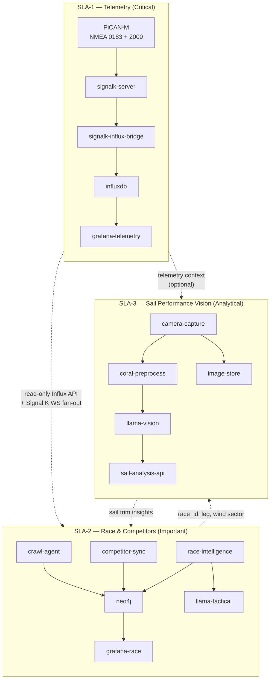
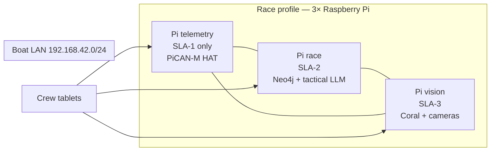
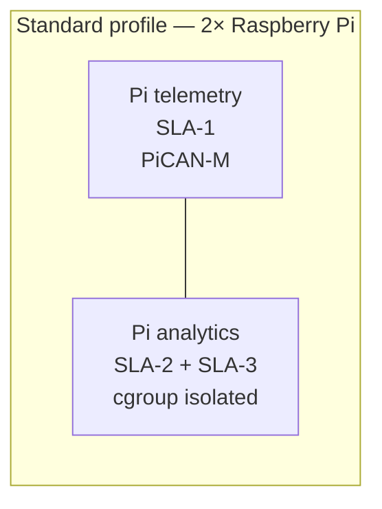
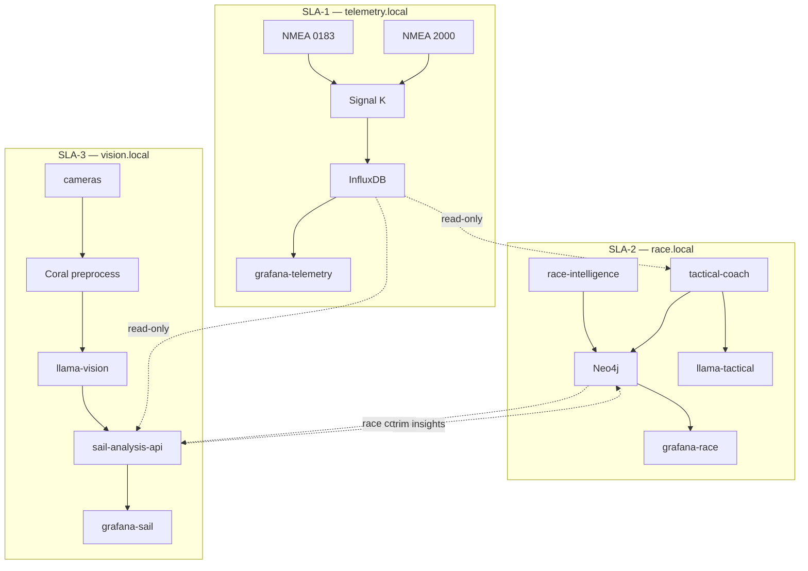
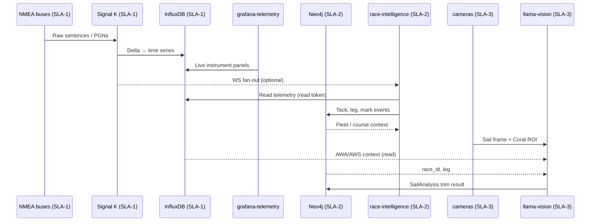
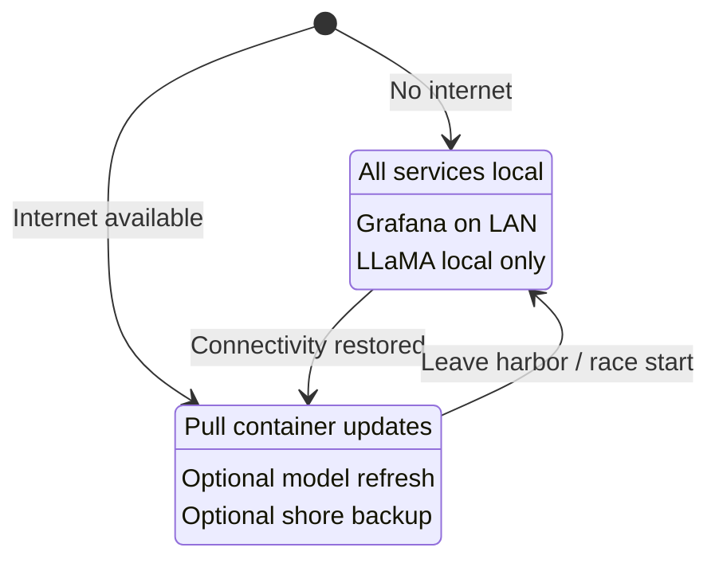
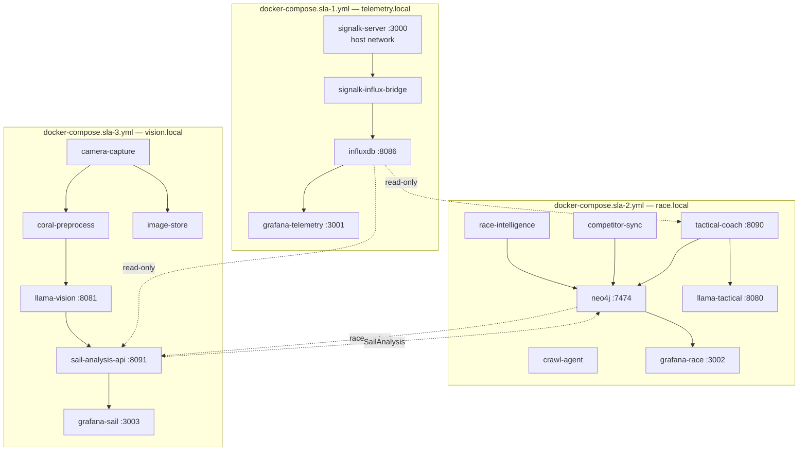
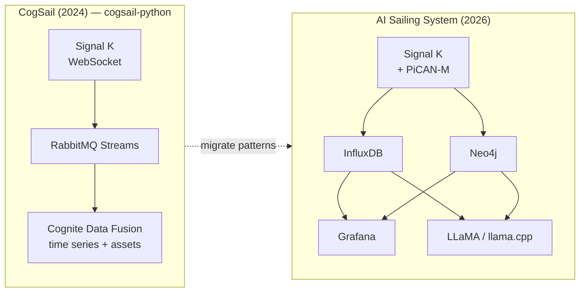

# AI Sailing System — Specification

**Version:** 0.2.0-draft  
**Date:** 2026-07-04  
**Author:** cognite-fholm  
**Status:** Draft — architecture & requirements

---

## 1. Executive summary

The **AI Sailing System** is an onboard edge platform for **competitive sailing**. It ingests marine sensor data over NMEA 0183 and NMEA 2000, normalizes it through **Signal K**, stores high-frequency telemetry in **InfluxDB**, models boats, races, courses, and tactics in **Neo4j**, visualizes performance in **Grafana**, and provides **local AI coaching** using **LLaMA** models.

The platform is organized into **three SLA tiers**, each running in **dedicated containers** and optionally on **separate Raspberry Pi devices**:

| Tier | Domain | SLA priority |
|------|--------|----------------|
| **SLA-1** | On-boat telemetry | Critical — must never fail during a race |
| **SLA-2** | Race & competitor information | Important — tactical context; may degrade |
| **SLA-3** | Sail performance (vision / LLM) | Analytical — best-effort; heaviest compute |

The system is designed to:

- Run **fully offline** during a race (no internet required).
- Operate on one or more **Raspberry Pi** nodes with a **PiCAN-M HAT** on the telemetry node (NMEA buses + 3 A SMPS).
- Use a **Google Coral** accelerator on the vision node for sail-image preprocessing.
- **Isolate tiers** so image analysis and race-graph workloads cannot starve live instrument data.
- Support **remote upgrades** via container-based deployment when connectivity is available.
- Build directly on lessons learned from the existing **CogSail** repositories.

---

## 2. Problem statement

Competitive sailors need more than raw instrument readouts. They need:

1. **Unified data** — wind, speed, heading, depth, engine, autopilot, polar data, and custom sensors in one model.
2. **Race context** — marks, legs, start line, fleet position, and course geometry linked to live telemetry.
3. **Performance insight** — VMG, target angles, polar comparison, tack/gybe quality, and leg summaries.
4. **Tactical memory** — what worked on this course, in these conditions, against this fleet.
5. **Trustworthy edge operation** — must work at sea with intermittent or zero connectivity.

The prior CogSail stack proved that Signal K → stream buffer → structured storage works, but relied on **Cognite Data Fusion (CDF)** in the cloud. This system keeps the proven ingestion patterns and replaces CDF with **InfluxDB + Neo4j + Grafana**, adding **local LLaMA** for AI assistance.

---

## 3. Goals and non-goals

### 3.1 Goals

| ID | Goal |
|----|------|
| G1 | Win-focused analytics: start timing, laylines, wind shifts, fleet leverage, leg debrief |
| G2 | Signal K as the canonical onboard marine data model |
| G3 | Sub-second local dashboards via Grafana |
| G4 | Graph queries for race/tactic/boat relationships via Neo4j |
| G5 | Local LLM inference without cloud dependency during races |
| G6 | Containerized services with remote upgrade path |
| G7 | NMEA 0183 + NMEA 2000 via PiCAN-M HAT |
| G8 | Reuse and migrate concepts from cognite-fholm CogSail repos |
| G9 | Three isolated SLA tiers in separate containers; tiers may run on separate RPi nodes |
| G10 | SLA-1 telemetry survives failure or overload of SLA-2 / SLA-3 |

### 3.2 Non-goals (v1)

- Autonomous vessel control or autopilot override.
- Class rule enforcement or protest filing automation.
- Replacing dedicated race tracking services (e.g. YB Tracking) — integration may come later.
- Training large models onboard — only **inference** of pre-quantized models.
- Full cloud SaaS replacement — optional sync/export may be added later.

---

## 4. Hardware platform

### 4.1 Reference bill of materials

Hardware is assigned **per SLA tier**. A single-boat deployment may use 1–3 Raspberry Pi nodes.

| Component | SLA tier | Role | Notes |
|-----------|----------|------|-------|
| **Raspberry Pi 5** (4 GB) | SLA-1 | Telemetry node | PiCAN-M HAT; runs Signal K + InfluxDB only |
| **Raspberry Pi 5** (8 GB) | SLA-2 | Race node | Neo4j, race intelligence, tactical LLM |
| **Raspberry Pi 5** (8 GB) | SLA-3 | Vision node | Cameras, Coral dongle, sail vision LLM |
| **PiCAN-M HAT + 3 A SMPS** | SLA-1 only | Marine I/O + power | NMEA 0183 + NMEA 2000; **must** live on telemetry node |
| **Google Coral accelerator** | SLA-3 | Sail image preprocessing | USB/PCIe on vision node; see [§7.5](#75-ai--llama--coral) |
| **USB / CSI cameras** | SLA-3 | Sail trim capture | Mast, boom, or deck-mounted; 1–3 cameras |
| **32 GB+ industrial microSD** or **NVMe (Pi 5)** | All nodes | OS + data | Per-node persistent storage |
| **Boat LAN (Ethernet/Wi-Fi)** | All | Inter-node link | Gigabit preferred when tiers are split across Pis |
| **12 V marine supply** | All | Power | N2K SMPS on telemetry node; DC-DC for additional nodes |
| **Wi-Fi / LTE (optional)** | SLA-2 | Remote deploy & sync | Not required for race operation |

**Deployment profiles:**

| Profile | Nodes | When to use |
|---------|-------|-------------|
| **Compact** | 1× Pi 5 (8 GB) | Testing, day sailing; all tiers with cgroup CPU/RAM limits |
| **Standard** | 2× Pi — SLA-1 + SLA-2/3 combined | Club racing; telemetry isolated from vision |
| **Race** | 3× Pi — one per tier | Recommended for serious regatta sailing |

### 4.2 PiCAN-M integration

```
NMEA 2000 backbone ──► Micro-C (J1) ──► can0 (SocketCAN, 250 kbit/s)
NMEA 0183 talker/listener ──► RS-422 screw terminal (J3) ──► /dev/ttyS0
I²C sensors (wind, env) ──► Qwiic (J4)
12 V N2K power ──► onboard SMPS ──► 5 V for Pi + HAT
```

**Signal K configuration (reference):**

- NMEA 2000: `canboatjs` or Signal K N2K plugin reading `can0`.
- NMEA 0183: serial port plugin on `/dev/ttyS0` (4800/38400/115200 as appropriate).
- I²C sensors: optional plugin or custom Python reader publishing Signal K deltas.

### 4.3 Coral accelerator note

The linked [google-coral/coralnpu](https://github.com/google-coral/coralnpu) repository describes Coral's **ML accelerator core** (successor/evolution of Edge TPU). For v1:

- **LLaMA inference** runs on the **ARM CPU** via **llama.cpp** (quantized GGUF models).
- **Coral** accelerates **complementary** workloads: wake/event detection, image classification (crew/camera), custom TFLite models — not full transformer LLM inference.

This split is intentional and matches hardware capabilities.

---

## 5. Three-tier SLA architecture

The system is partitioned into **three independent SLA tiers**. Each tier:

- Runs in its **own Docker Compose stack** (separate `docker-compose.sla-N.yml`).
- Has **dedicated containers** — no tier shares a process with another.
- Communicates over the **boat LAN** via defined APIs only (no shared databases across tiers except read replicas where noted).
- May run on the **same physical Raspberry Pi** (with resource limits) or on **dedicated Raspberry Pi hardware**.

**Golden rule:** SLA-1 must continue operating if SLA-2 or SLA-3 crash, restart, or saturate CPU/RAM.

### 5.1 Tier overview



### 5.2 SLA definitions

#### SLA-1 — On-boat telemetry

**Purpose:** Ingest, normalize, persist, and display **live instrument data**. This is the safety-critical and race-critical path.

| Attribute | Target |
|-----------|--------|
| **Availability** | 99.99% during active race session |
| **Write latency** | Signal K delta → InfluxDB &lt; 500 ms (p95) |
| **Dashboard refresh** | &lt; 1 s for SOG, COG, AWA, AWS, depth, heel |
| **Recovery time** | &lt; 30 s after container restart |
| **Internet** | Not required |
| **PiCAN-M** | Required on this node |

**Containers (`docker-compose.sla-1.yml`):**

| Container | Image | Responsibility |
|-----------|-------|----------------|
| `signalk-server` | `ghcr.io/.../signalk` | NMEA ingest, Signal K hub; **host network** for CAN/serial |
| `signalk-influx-bridge` | `ghcr.io/.../influx-bridge` | Delta → Influx line protocol |
| `influxdb` | `influxdb:2` | Time series store (telemetry bucket only) |
| `grafana-telemetry` | `grafana/grafana` | Live instrument panels only |
| `redis` (optional) | `redis:alpine` | Write buffer if burst load |

**Does not include:** Neo4j, LLM, cameras, crawl jobs, or sail analysis.

**Hardware:** Raspberry Pi 5 (4 GB minimum) **with PiCAN-M HAT**. Dedicated node in race profile.

---

#### SLA-2 — Race and competitor information

**Purpose:** Model **races, courses, marks, fleet, and competitors**; provide tactical context, start-line logic, and text-based coaching grounded in structured data.

| Attribute | Target |
|-----------|--------|
| **Availability** | 99.9% during race; graceful degradation acceptable |
| **Query latency** | Neo4j tactical query &lt; 3 s (p95) |
| **Competitor refresh** | AIS / manual fleet list ≤ 30 s when sources available |
| **Recovery time** | &lt; 2 min; SLA-1 unaffected |
| **Internet** | Optional — crawl agent and competitor feeds when online |

**Containers (`docker-compose.sla-2.yml`):**

| Container | Image | Responsibility |
|-----------|-------|----------------|
| `neo4j` | `neo4j:5-community` | Race graph, vessels, marks, tactics |
| `race-intelligence` | `ghcr.io/.../race-intelligence` | Session control, tack/gybe detection, leg timing |
| `competitor-sync` | `ghcr.io/.../competitor-sync` | AIS/MMSI fleet ingest → Neo4j |
| `crawl-agent` | `ghcr.io/.../crawl-agent` | NOR/SI crawl ([crawl_web](https://github.com/cognite-fholm/crawl_web) lineage) |
| `llama-tactical` | `ghcr.io/.../llama-cpp` | Text LLM — debrief, tactical Q&A |
| `tactical-coach` | `ghcr.io/.../tactical-coach` | FastAPI RAG over Neo4j + SLA-1 Influx (read-only) |
| `grafana-race` | `grafana/grafana` | Race, fleet, leg, tactical dashboards |

**Reads from SLA-1:** InfluxDB HTTP API (read token) and/or Signal K WebSocket fan-out on boat LAN (`ws://telemetry.local:3000/signalk/v1/stream`). **Never writes to SLA-1 storage.**

**Hardware:** Raspberry Pi 5 (8 GB). May share a Pi with SLA-3 in compact profile; **must not share with SLA-1** in race profile.

---

#### SLA-3 — Sail performance (vision / LLM)

**Purpose:** Capture **sail images**, analyze trim, shape, and performance using **vision-capable LLM** inference plus Coral-accelerated preprocessing.

| Attribute | Target |
|-----------|--------|
| **Availability** | 95% — best-effort; may be paused during maneuvers |
| **Analysis latency** | Single frame analysis &lt; 60 s (p95) on Pi 5 |
| **Capture rate** | 0.2–1 fps per camera (configurable) |
| **Recovery time** | &lt; 5 min; no impact on SLA-1 |
| **Internet** | Not required (models pre-loaded) |

**Containers (`docker-compose.sla-3.yml`):**

| Container | Image | Responsibility |
|-----------|-------|----------------|
| `camera-capture` | `ghcr.io/.../camera-capture` | USB/CSI frame grab; exposure sync |
| `coral-preprocess` | `ghcr.io/.../coral-preprocess` | ROI detection, luff detection, image normalize |
| `llama-vision` | `ghcr.io/.../llama-cpp-vision` | Multimodal LLM — sail shape, trim, curl analysis |
| `sail-analysis-api` | `ghcr.io/.../sail-analysis` | FastAPI; publishes trim scores to SLA-2 |
| `image-store` | `ghcr.io/.../image-store` | Local ring buffer of frames + analysis metadata |
| `grafana-sail` | `grafana/grafana` | Sail trim timeline, overlay panels |

**Vision LLM scope (examples):**

- Leech telltale behavior and upper-twist indication from mast camera.
- Genoa luff break vs. entry angle from bow camera.
- Mainsail draft position and vang/cunningham effectiveness (debrief, not real-time actuation).
- Post-leg summary: *"Mainsail was over-trimmed above 15 kt AWA on port tack leg 2."*

**Reads from SLA-1:** Optional telemetry window (AWA, AWS, heel) to correlate sail state with conditions.  
**Writes to SLA-2:** `SailAnalysis` nodes and `TRIM_INDICATES` relationships in Neo4j via API.

**Hardware:** Raspberry Pi 5 (8 GB) + **Coral dongle** + 1–3 cameras. **Always isolated from SLA-1** — vision workloads are CPU/GPU/RAM heavy.

---

### 5.3 SLA comparison matrix

| Dimension | SLA-1 Telemetry | SLA-2 Race & Competitors | SLA-3 Sail Vision |
|-----------|-----------------|--------------------------|-------------------|
| Priority | P0 — critical | P1 — important | P2 — analytical |
| Uptime target | 99.99% | 99.9% | 95% |
| PiCAN-M required | Yes | No | No |
| Coral required | No | No | Yes (preprocess) |
| LLM type | None | Text (llama.cpp) | Vision (llama.cpp multimodal) |
| Primary store | InfluxDB | Neo4j | Image store + metadata |
| Grafana instance | `grafana-telemetry` | `grafana-race` | `grafana-sail` |
| Survives other tier failure | — | Yes (SLA-1 up) | Yes (SLA-1 up) |
| Remote auto-update in race | **Never** | Harbor only | Harbor only |

### 5.4 Multi-node deployment topologies





**DNS / hostnames (boat LAN):**

| Host | Tier | Services |
|------|------|----------|
| `telemetry.local` | SLA-1 | Signal K `:3000`, Influx `:8086`, Grafana `:3001` |
| `race.local` | SLA-2 | Neo4j `:7474`, coach `:8090`, Grafana `:3002` |
| `vision.local` | SLA-3 | sail API `:8091`, Grafana `:3003` |

### 5.5 Inter-tier communication contract

| From → To | Protocol | Data | Direction |
|-----------|----------|------|-----------|
| SLA-1 → SLA-2 | Influx HTTP API | Telemetry queries (Flux) | Read-only |
| SLA-1 → SLA-2 | Signal K WebSocket | Live deltas (optional) | Read-only fan-out |
| SLA-1 → SLA-3 | Influx HTTP API | AWA/AWS/heel window | Read-only |
| SLA-2 → SLA-3 | REST | `race_id`, active leg, target AWA | Push on leg change |
| SLA-3 → SLA-2 | REST | `SailAnalysis`, trim scores | Push on analysis complete |
| SLA-2 → SLA-1 | **None** | — | **No writes upstream** |
| SLA-3 → SLA-1 | **None** | — | **No writes upstream** |

**Failure isolation:** If `race.local` or `vision.local` is unreachable, SLA-1 continues logging and displaying instruments. Crew sees a degraded-mode banner on tactical/vision dashboards only.

### 5.6 Resource governance (same-Pi multi-tier)

When multiple tiers share one Pi (compact / standard profile), enforce:

```yaml
# Example Docker Compose deploy.resources per tier
sla-1: { cpus: "2.0", memory: 2G }   # guaranteed
sla-2: { cpus: "1.5", memory: 3G }   # burstable
sla-3: { cpus: "2.0", memory: 3G }   # lowest priority — throttled when sla-1 under load
```

A `tier-watchdog` sidecar on shared nodes pauses SLA-3 containers when SLA-1 Influx write latency exceeds 500 ms for 30 s.

---

## 6. System architecture

### 6.1 High-level context



### 6.2 Data flow (race mode)



### 6.3 Offline vs online modes



---

## 7. Software components

### 7.1 Signal K Server (hub) — **SLA-1 only**

**Language:** Node.js (TypeScript for custom plugins)  
**Source:** [SignalK/signalk-server](https://github.com/SignalK/signalk-server)

Signal K is the **single source of truth** for live marine data. It:

- Reads NMEA 0183 and NMEA 2000 via PiCAN-M interfaces.
- Exposes `ws://localhost:3000/signalk/v1/stream` for subscribers.
- Hosts plugins for InfluxDB export, Neo4j event emission, and coach triggers.

**Custom plugins planned:**

| Plugin | Responsibility |
|--------|----------------|
| `signalk-to-influxdb2` | Fork/adapt existing community plugin; map Signal K paths → Influx measurements |
| `signalk-race-events` | Detect tacks, gybes, mark rounding; emit to Neo4j |
| `signalk-ai-bridge` | Forward curated context windows to coach service |

### 7.2 Time series — InfluxDB — **SLA-1 only**

**Language:** configuration + Flux/SQL queries; write path in Node.js or Python  
**Replaces:** CDF time series (previously via `push_to_cdf`)

**Schema strategy:**

- **Bucket:** `signalk` (raw, 90-day retention); `race` (downsampled, long retention).
- **Measurement:** derived from Signal K path (e.g. `navigation_speedOverGround`).
- **Tags:** `vessel`, `source`, `pgn` (N2K), `context`, `race_id` (when active).
- **Fields:** numeric values; store strings in Neo4j instead.

**Migration from CogSail:** The `parse_signalK()` logic in `cogsail-python/push_to_cdf/Consume stream.py` maps deltas to external IDs — reuse this path→ID mapping as Influx measurement/field conventions.

### 7.3 Knowledge graph — Neo4j — **SLA-2 only**

**Language:** Cypher; ingestion via Python (`neo4j` driver) or Node.js (`neo4j-driver`)  
**Replaces:** CDF asset hierarchy + relationships (previously `cogsail-scripts/CreateBoats.py`, CDF data models)

**Core node labels:**

| Label | Examples |
|-------|----------|
| `Vessel` | Own boat, competitors (MMSI) |
| `Race` | Regatta, passage race |
| `Course` | Windward/leeward, coastal |
| `Mark` | Physical or virtual marks |
| `Leg` | Between marks |
| `Tack` / `Gybe` | Maneuver events |
| `Sailor` | Crew roles |
| `Tactic` | Pre-race plan, observed pattern |
| `WindSector` | Shift / persistent pattern |

**Example relationships:**

```cypher
(v:Vessel)-[:COMPETED_IN]->(r:Race)
(r:Race)-[:ON_COURSE]->(c:Course)
(c:Course)-[:HAS_MARK]->(m:Mark)
(v:Vessel)-[:ROUNDED]->(m:Mark)
(v:Vessel)-[:PERFORMED]->(t:Tack)
(t:Tactic)-[:SUGGESTS]->(a:Action)
```

Neo4j holds **context** (who, what, where, why); InfluxDB holds **telemetry** (how fast, when).

### 7.4 Visualization — Grafana

**One Grafana instance per SLA tier** — avoids dashboard load on the telemetry node.

| Instance | Tier | Port (default) | Dashboards |
|----------|------|----------------|------------|
| `grafana-telemetry` | SLA-1 | 3001 | SOG, COG, AWA, AWS, depth, heel, system health |
| `grafana-race` | SLA-2 | 3002 | Fleet, legs, marks, tactics, debrief |
| `grafana-sail` | SLA-3 | 3003 | Trim timeline, sail images, vision LLM output |

### 7.5 AI — LLaMA + Coral

**Languages:** Python (orchestration), C++ runtime (llama.cpp), TFLite (Coral)

| Layer | SLA | Technology | Role |
|-------|-----|------------|------|
| Text LLM | SLA-2 | **llama.cpp** + GGUF | Tactical Q&A, debrief, start-line narration |
| Vision LLM | SLA-3 | **llama.cpp** multimodal | Sail trim analysis from camera frames |
| Text model | SLA-2 | Llama 3.2 1B–3B Instruct (Q4_K_M) | Low latency tactical coaching |
| Vision model | SLA-3 | Llama 3.2 Vision 11B or smaller quant | Sail shape / trim interpretation |
| Edge ML | SLA-3 | **Coral** + TFLite | ROI, luff detection, frame preprocessing |
| Tactical coach | SLA-2 | **Python** (FastAPI) | RAG over Neo4j + SLA-1 Influx (read-only) |
| Sail analyst | SLA-3 | **Python** (FastAPI) | Vision pipeline orchestration |

**Offline inference:** Models ship on disk per node (`/opt/models/sla-2/`, `/opt/models/sla-3/`). No cloud calls at sea.

**Recommended models:**

| Node | Model | Size |
|------|-------|------|
| SLA-2 (race) | `Llama-3.2-3B-Instruct-Q4_K_M.gguf` | ~2 GB |
| SLA-3 (vision) | `Llama-3.2-11B-Vision-Instruct-Q4_K_M.gguf` (or smaller) | 4–8 GB |

### 7.6 Race intelligence service — **SLA-2 only**

**Language:** Python 3.11+

Responsibilities:

- Start sequence helper (time-to-start, line bias from headings).
- Polar comparison (requires polar file ingestion).
- Wind shift detection (statistical + graph persistence).
- Debrief generation post-race (LLaMA + structured data).

This replaces implicit analytics that were previously envisioned in CDF tools / future Java apps.

### 7.7 Sail vision service (SLA-3)

**Language:** Python 3.11+  
**SLA tier:** SLA-3 only

Responsibilities:

- Capture frames from USB/CSI cameras on a fixed or configurable interval.
- Run Coral TFLite models for sail ROI detection and luff-line extraction.
- Pass cropped, annotated frames to **vision LLM** (Llama 3.2 Vision or equivalent GGUF via llama.cpp multimodal).
- Correlate analysis with SLA-1 telemetry (AWA, AWS, heel) and SLA-2 `race_id` / leg context.
- Publish structured `SailAnalysis` results to SLA-2 Neo4j via REST.

**Does not** run on the telemetry node in race profile.

### 7.8 Web crawler integration (optional, online)

**Source repo:** [crawl_web](https://github.com/cognite-fholm/crawl_web)

When online, crawl race documents (NOR, SI, sailing instructions) and ingest summaries into Neo4j as `RaceDocument` nodes linked to `Race`. Not required for onboard core loop.

---

## 8. Technology matrix

| Concern | Choice | Language | Rationale |
|---------|--------|----------|-----------|
| Marine hub | Signal K Server | Node.js / TS | Industry standard; PiCAN-M compatible; plugin ecosystem |
| Live stream | WebSocket (Signal K v1) | — | Proven in `subscribe_to_websocket` |
| Message buffer | Redis Streams (v1) | — | Lighter than RabbitMQ on Pi; optional |
| Time series DB | InfluxDB 2.x | Flux | Purpose-built; Grafana native |
| Graph DB | Neo4j 5 Community | Cypher | Replaces CDF relationships; rich tactical queries |
| Dashboards | Grafana OSS | — | De facto for InfluxDB |
| LLM runtime | llama.cpp | C++ / Python bindings | Best ARM edge performance for LLaMA |
| Edge ML | Coral libedgetpu | Python | Accelerate non-LLM models |
| API / coach | FastAPI | Python | Async, typed, small footprint |
| Containers | Docker Compose | YAML | Repeatable; works on Pi arm64 |
| Remote updates | Watchtower or custom agent | — | Pull from GHCR when online |
| Config | Environment + YAML | — | No cloud config dependency |

---

## 9. Deployment architecture

### 9.1 Container layout (per SLA tier)

Each tier has its own Compose file. **Never merge SLA-1 with SLA-3 on the same Pi in race profile.**



**Compose file mapping:**

| File | Deploy to | Watchtower in race mode |
|------|-----------|-------------------------|
| `docker-compose.sla-1.yml` | `telemetry.local` | **Disabled** |
| `docker-compose.sla-2.yml` | `race.local` | Harbor only |
| `docker-compose.sla-3.yml` | `vision.local` | Harbor only |
| `docker-compose.harbor.yml` | Overlay — enables Watchtower per tier | When `RACE_MODE=false` |

### 9.2 Remote upgrade strategy

**Problem:** How to upgrade containers at sea (or from harbor Wi-Fi) without breaking the NMEA bus stack.

**Approach:**

1. **Immutable images** — publish multi-arch (`linux/arm64`) images to GitHub Container Registry (`ghcr.io/cognite-fholm/...`).
2. **Watchtower** — polls registry on schedule when `WATCHTOWER_HTTP_API_PERIODIC_POLLS` or network is up; updates one service at a time.
3. **Signal K stays up** — `network_mode: host` on SLA-1 `signalk-server` only; CAN/serial device paths remain stable.
4. **Per-tier rollout** — upgrade SLA-3 first, then SLA-2, **never SLA-1** during an active race session.
5. **Pre-race freeze** — `WATCHTOWER_NO_PULL=true` on all compose files, or disable via label on SLA-1 always.
5. **Rollback** — pin image digests in `docker-compose.prod.yml`; keep previous digest in `.env.previous`.
6. **Offline updates** — USB stick with `docker load` images as fallback.

**NMEA bus consideration:** Container restarts on `signalk-server` cause brief data gaps (~seconds). Watchtower should run **only in harbor mode**, not during active racing. A systemd timer can enable Watchtower when `eth0/wlan0` has internet and `RACE_MODE=false`.

### 9.3 Local-only operation checklist

- [ ] Each tier has independent `restart: unless-stopped`
- [ ] DNS not required (use `/etc/hosts` for `telemetry.local`, `race.local`, `vision.local`)
- [ ] Grafana auth enabled on all three instances
- [ ] Models pre-downloaded on SLA-2 and SLA-3 nodes
- [ ] InfluxDB volume on SLA-1; Neo4j volume on SLA-2; image-store on SLA-3
- [ ] NTP optional (GPS time from Signal K on SLA-1 preferred)
- [ ] Inter-tier firewall: SLA-2/SLA-3 read-only access to SLA-1 Influx API

---

## 10. Lineage from cognite-fholm / CogSail

### 10.1 Repository analysis

| Repository | Era | Role | Carry forward | Replace |
|------------|-----|------|-------------|---------|
| [CogSail](https://github.com/cognite-fholm/CogSail) | 2018–2021 | Java/Android client experiments | UX lessons, marine domain model | Java stack, CDF client |
| [Cogsail-raspberry-pi](https://github.com/cognite-fholm/Cogsail-raspberry-pi) | 2021 | Java on RPi | Onboard deployment concept | Java runtime |
| [cogsail-raspberry](https://github.com/cognite-fholm/cogsail-raspberry) | 2021 | RPi project skeleton | — | Empty/stale |
| [cogsail-python](https://github.com/cognite-fholm/cogsail-python) | 2024 | **SignalK → RabbitMQ → CDF** | `parse_signalK()`, stream pattern, OAuth-free local variant | CDF, RabbitMQ (optional), cloud |
| [subscribe_to_websocket](https://github.com/cognite-fholm/subscribe_to_websocket) | 2024 | WebSocket → RabbitMQ | WebSocket subscription pattern | RabbitMQ coupling |
| [push_to_cdf](https://github.com/cognite-fholm/push_to_cdf) | 2024 | RabbitMQ → CDF time series | Batching, dedup, offset tracking | CDF SDK |
| [cogsail-scripts](https://github.com/cognite-fholm/cogsail-scripts) | 2019 | CDF asset hierarchy (MMSI boats) | MMSI → vessel graph model | CDF assets API |
| [crawl_web](https://github.com/cognite-fholm/crawl_web) | 2024 | Race web crawling | NOR/SI ingestion pipeline | — |
| [3d_processing](https://github.com/cognite-fholm/3d_processing) | 2024 | 3D data processing | Future: course/spatial overlays | — |
| [Cognite-Sailing](https://github.com/cognite-fholm/Cognite-Sailing) | 2018 | Early prototype | Historical reference | Empty |

### 10.2 Architecture evolution



### 10.3 Specific code reuse

1. **`parse_signalK()`** (`cogsail-python/push_to_cdf/Consume stream.py`) — adapt to write Influx points instead of CDF `time_series.data.insert_multiple`.
2. **WebSocket subscriber** (`subscribe_to_websocket/`) — replace RabbitMQ sink with direct Influx line protocol or Redis Streams consumer.
3. **MMSI asset hierarchy** (`cogsail-scripts/CreateBoats.py`) — translate to Cypher `MERGE (v:Vessel {mmsi: $mmsi})`.
4. **RabbitMQ offset persistence** (CDF data model `RabbitMQOffset`) — replace with InfluxDB task checkpoint or Redis consumer group ID.

---

## 11. Functional requirements

### 11.1 SLA-1 — Telemetry

| ID | Requirement |
|----|-------------|
| FR-1 | Ingest NMEA 2000 PGNs from `can0` at 250 kbit/s |
| FR-2 | Ingest NMEA 0183 from `/dev/ttyS0` at configurable baud |
| FR-3 | Publish all data to Signal K v1 delta stream within 200 ms |
| FR-4 | Persist numeric telemetry to InfluxDB with &lt; 500 ms write latency (p95) |
| FR-5 | Support optional I²C environmental sensors |
| FR-6 | SLA-1 operates independently when SLA-2 and SLA-3 are offline |

### 11.2 SLA-2 — Race & competitors

| ID | Requirement |
|----|-------------|
| FR-10 | User can start/stop a **race session** (tags all data with `race_id`) |
| FR-11 | System detects tacks and gybes from heading/rudder/AWA thresholds |
| FR-12 | Grafana-race shows live VMG, target %, and polar delta when polar file loaded |
| FR-13 | Neo4j stores leg boundaries, mark roundings, and competitor positions |
| FR-14 | Post-race debrief available as text within 5 min of session end |
| FR-15 | Competitor vessels ingested by MMSI/AIS into Neo4j |
| FR-16 | crawl_web agent ingests NOR/SI when online |

### 11.3 SLA-3 — Sail performance vision

| ID | Requirement |
|----|-------------|
| FR-20 | Capture sail images from 1–3 cameras at configurable rate |
| FR-21 | Coral preprocess extracts sail ROI before LLM inference |
| FR-22 | Vision LLM produces trim analysis (shape, twist, luff) per frame or burst |
| FR-23 | Sail analysis correlated with AWA/AWS from SLA-1 read API |
| FR-24 | Results published to SLA-2 Neo4j as `SailAnalysis` nodes |
| FR-25 | SLA-3 pausable without affecting SLA-1 or SLA-2 core functions |

### 11.4 AI coaching (cross-tier)

| ID | Requirement |
|----|-------------|
| FR-30 | SLA-2 text LLM answers tactical questions in &lt; 30 s on Pi 5 |
| FR-31 | No tier sends data off-device without explicit opt-in |
| FR-32 | SLA-2 coach context: last 15 min SLA-1 telemetry + active race graph |
| FR-33 | SLA-3 vision LLM runs only on vision node; no SLA-1 co-location in race profile |

### 11.5 Operations

| ID | Requirement |
|----|-------------|
| FR-40 | SLA-1 full stack boots in &lt; 60 s on power-on |
| FR-41 | Remote container update per tier without manual SSH (when online) |
| FR-42 | `RACE_MODE=true` disables Watchtower on all tiers; SLA-1 never auto-updates |
| FR-43 | System runs with zero internet for 72+ hours across all tiers |
| FR-44 | Each tier deployable via separate `docker compose -f docker-compose.sla-N.yml` |

---

## 12. Non-functional requirements

| Category | SLA-1 | SLA-2 | SLA-3 |
|----------|-------|-------|-------|
| Availability (race) | 99.99% | 99.9% | 95% |
| Latency (dashboard) | &lt; 1 s | &lt; 3 s | &lt; 60 s per analysis |
| Storage | 32 GB min; 7 days raw @ 10 Hz | Neo4j 16 GB+ volume | Image ring buffer 8 GB |
| Power | N2K SMPS or 12 V DC | 12 V DC | 12 V DC |
| Isolation | Dedicated Pi in race profile | Separate Pi or shared with SLA-3 | Separate Pi required in race profile |
| Security | No default passwords; read token for cross-tier Influx | Neo4j auth; REST API keys | Camera data local only |
| Maintainability | Independent compose stack per tier | Same | Same |

---

## 13. Repository layout (planned)

```
AI-sailing-system/
├── spec.md
├── adr/
├── docker-compose.sla-1.yml    # Telemetry tier
├── docker-compose.sla-2.yml    # Race & competitor tier
├── docker-compose.sla-3.yml    # Sail vision tier
├── docker-compose.harbor.yml     # Watchtower overlay (harbor mode)
├── deploy/
│   ├── compact/                  # Single-Pi overrides
│   ├── standard/                 # 2-Pi overrides
│   └── race/                     # 3-Pi overrides (recommended)
├── signalk/                      # SLA-1
├── influxdb/                     # SLA-1
├── grafana/
│   ├── telemetry/                # SLA-1 dashboards
│   ├── race/                     # SLA-2 dashboards
│   └── sail/                     # SLA-3 dashboards
├── neo4j/                        # SLA-2
├── race-intelligence/            # SLA-2
├── competitor-sync/                # SLA-2
├── crawl-agent/                    # SLA-2 (crawl_web lineage)
├── tactical-coach/                 # SLA-2
├── camera-capture/                 # SLA-3
├── coral-preprocess/               # SLA-3
├── sail-analysis/                  # SLA-3
├── models/
│   ├── sla-2/                      # Text GGUF manifests
│   └── sla-3/                      # Vision GGUF manifests
├── scripts/
│   ├── install-pi-telemetry.sh
│   ├── install-pi-race.sh
│   └── install-pi-vision.sh
└── docs/
    ├── hardware-setup.md
    └── sla-tiers.md
```

---

## 14. Implementation phases

### Phase 0 — Specification (current)
- [x] Repository created
- [x] spec.md
- [x] ADR-0001
- [x] ADR-0002 (three-tier SLA)

### Phase 1 — SLA-1 telemetry (MVP)
- [ ] Signal K on Pi with PiCAN-M
- [ ] `docker-compose.sla-1.yml`
- [ ] InfluxDB bridge
- [ ] grafana-telemetry live dashboard

### Phase 2 — SLA-2 race & competitors
- [ ] Neo4j schema
- [ ] `docker-compose.sla-2.yml`
- [ ] Race session + competitor-sync
- [ ] grafana-race dashboards
- [ ] Tactical LLM + coach

### Phase 3 — SLA-3 sail vision
- [ ] `docker-compose.sla-3.yml`
- [ ] Camera capture + Coral preprocess
- [ ] Vision LLM sail analysis
- [ ] grafana-sail dashboards

### Phase 4 — Multi-Pi & remote ops
- [ ] Race profile (3-node) deployment guide
- [ ] GHCR publish pipeline per tier
- [ ] Watchtower harbor mode per compose file
- [ ] tier-watchdog for compact profile
- [ ] Migrate `cogsail-python` mapping utilities

---

## 15. Open questions

| # | Question | Notes |
|---|----------|-------|
| OQ-1 | Minimum deployment profile for v1 MVP? | SLA-1 only first; SLA-2/3 follow |
| OQ-2 | Vision model size on Pi 5? | 11B vision quant may need 8 GB dedicated SLA-3 Pi |
| OQ-3 | Camera placement standard? | Mast + bow combo recommended |
| OQ-4 | AIS source for competitor-sync? | N2K AIS PGN vs. dedicated receiver |
| OQ-5 | Polar file format standard? | `.pol` / ORC / custom CSV |
| OQ-6 | Integration with race broadcast APIs? | Future phase |

---

## 16. References

- [Signal K specification](https://signalk.org/specification/)
- [Signal K server](https://github.com/SignalK/signalk-server)
- [PiCAN-M documentation](https://copperhilltech.com/content/pican-m_UGB_10.pdf)
- [Google Coral NPU](https://github.com/google-coral/coralnpu)
- [InfluxDB documentation](https://docs.influxdata.com/)
- [Neo4j documentation](https://neo4j.com/docs/)
- [llama.cpp](https://github.com/ggerganov/llama.cpp)
- [CogSail Python (prior art)](https://github.com/cognite-fholm/cogsail-python)
